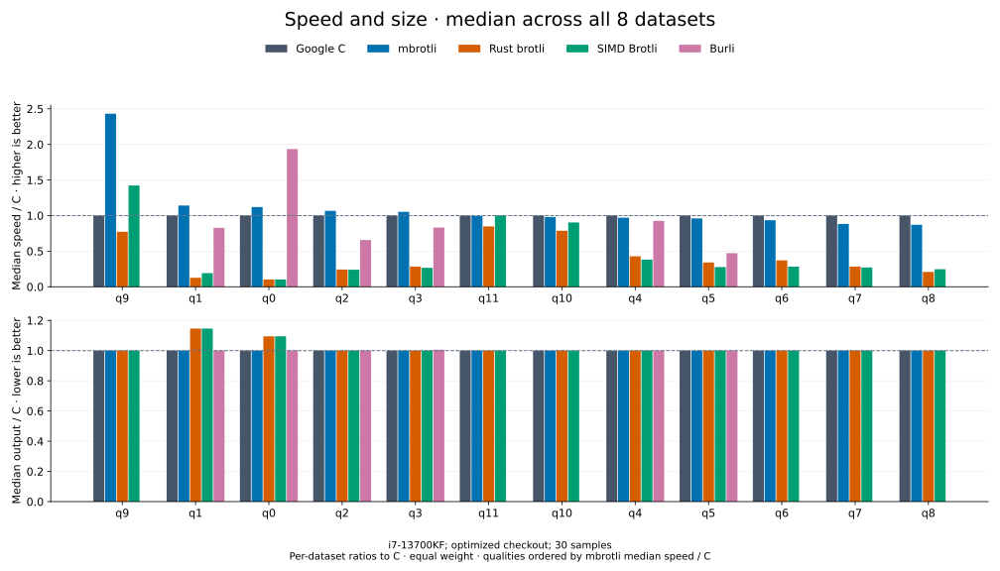

# mbrotli

[](https://crates.io/crates/mbrotli)
[](https://docs.rs/mbrotli)
[](https://github.com/Mnwa/mbrotli/actions/workflows/ci-coverage.yml)
[](https://github.com/Mnwa/mbrotli/actions/workflows/ci-fuzz.yml)
[](https://github.com/Mnwa/mbrotli/actions/workflows/ci.yml)

Brotli compression in safe Rust, with qualities 0–11, reusable encoder storage,
streaming I/O, and caller-scheduled parallel compression. This crate provides
compression only; it does not include a decoder.

## `no_std`

The opt-in `no_std` feature supports compression, incremental sessions, and
prepared dictionaries using `core` and `alloc`:

```toml
mbrotli = { version = "0.2", default-features = false, features = ["no_std"] }
```

Supply a global allocator. I/O adapters, parallel compression, experimental
framing, and profiling instrumentation are disabled. SIMD uses compile-time
target features. Cargo features are additive: leave `std` and `hotpath*` disabled
to avoid standard-library dependencies. Normal default builds are unchanged.

## Benchmark results



Median across all eight datasets, with each dataset weighted equally after
normalizing to Google C Brotli. Higher speed and lower output are better;
1× matches C. Qualities with the strongest mbrotli median speed / C appear first.
Cold serial APIs, window 22, i7-13700KF / WSL2; recorded 2026-09-07.
Burli supports q0–q5. Equal quality does not imply equal output size.

Explore the [median results](docs/benchmarks/qualities/README.md),
[dataset charts](docs/benchmarks/README.md#results-by-quality), and
[measurement method and raw data](docs/benchmarks/README.md#datasets-and-measurement-contract).

## Getting started

Requires Rust 1.89 or later.

```toml
[dependencies]
mbrotli = "0.1"
```

```rust
use mbrotli::{Compressor, EncoderConfig, Quality};

fn main() -> Result<(), Box<dyn std::error::Error>> {
    let config = EncoderConfig::default().with_quality(Quality::Q5);
    let mut encoder = Compressor::new(config)?;
    let input = "brotli ".repeat(1000);
    let compressed = encoder.compress(input.as_bytes())?;
    println!("{} -> {} bytes", input.len(), compressed.len());
    Ok(())
}
```

Set the quality explicitly to control compression effort.
`EncoderConfig::default()` uses quality 11, the most expensive search.

| Quality | Encoding |
| --- | --- |
| 0–1 | Fast fragment encoding with one or two passes |
| 2–5 | Greedy matching, with block splitting and literal contexts at higher qualities |
| 6–9 | Progressively deeper greedy matching |
| 10–11 | Binary-tree matching and dynamic programming |

## Choosing an API

A `Compressor` owns reusable working buffers. Encoding takes `&mut self`;
reuse the same compressor for successive streams.

| Need | API |
| --- | --- |
| Compress into a new vector | `compress` |
| Append to an existing vector | `compress_into` |
| Write into a fixed slice | `compress_to_slice` |
| Push input through `std::io::Write` | `writer` |
| Pull compressed bytes through `std::io::Read` | `reader` |
| Drive incremental input and output directly | `start` → `EncoderSession` |
| Compress with a prepared dictionary | Corresponding `*_with_dictionary*` methods |
| Split one input across workers | `compressor::parallel::ParallelCompressor` |

For repeated operations, reuse both the compressor and the destination:

```rust
use mbrotli::{Compressor, EncoderConfig, Quality};

fn main() -> Result<(), Box<dyn std::error::Error>> {
    let mut encoder = Compressor::new(
        EncoderConfig::default().with_quality(Quality::Q5),
    )?;
    let mut output = Vec::new();
    for input in [b"first payload".as_slice(), b"second payload".as_slice()] {
        output.clear();
        let range = encoder.compress_into(input, &mut output)?;
        assert_eq!(range, 0..output.len());
    }
    Ok(())
}
```

## Streaming

Call `finish` to terminate a writer's stream and recover its sink.
Dropping the writer does not finish it. `flush` makes accepted input decodable
without ending the stream; flush boundaries can affect compressed size.

```rust
use mbrotli::io::FinishError;
use mbrotli::{Compressor, EncoderConfig, InputSize, Quality, StreamConfig};
use std::io::Write;

fn main() -> Result<(), Box<dyn std::error::Error>> {
    let mut encoder = Compressor::new(
        EncoderConfig::default().with_quality(Quality::Q5),
    )?;
    let input = "brotli ".repeat(1000);
    let stream = StreamConfig::from(InputSize::Exact(input.len() as u64));
    let mut writer = encoder.writer(Vec::new(), stream)?;
    for chunk in input.as_bytes().chunks(512) {
        writer.write_all(chunk)?;
    }
    let streamed = writer.finish().map_err(FinishError::into_error)?;
    assert_eq!(streamed, encoder.compress(input.as_bytes())?);
    Ok(())
}
```

All serial APIs emit identical bytes with the same configuration, dictionary,
declared input size, flush boundaries, and continuation offset. To match a
one-shot call, use `InputSize::Exact(input.len() as u64)`, offset zero, and
no explicit flushes. Caller chunk sizes and available SIMD backends do not
change the output.

## Parallel compression

The caller schedules compression tasks; the library does not create a thread
pool. This example uses scoped threads and stages compressed segments in memory:

```rust
use mbrotli::compressor::parallel::{
    BatchConfig, ParallelCompressor, ParallelConfig, TaskCount,
};
use mbrotli::{EncoderConfig, Quality};

fn main() -> Result<(), Box<dyn std::error::Error>> {
    let input = vec![b'a'; 8 << 20];
    let mut encoder = ParallelCompressor::new(
        EncoderConfig::default().with_quality(Quality::Q5),
        ParallelConfig::default(),
    )?;
    let mut batch = encoder.prepare_slice(
        &input,
        BatchConfig::auto(TaskCount::available()?),
    )?;
    let tasks = batch.take_tasks()?;
    std::thread::scope(|scope| {
        for task in tasks {
            scope.spawn(move || task.run());
        }
    });
    let mut output = Vec::new();
    batch.finish_into(&mut output)?;
    println!("{} -> {} bytes", input.len(), output.len());
    Ok(())
}
```

Tasks are capped at the segment count; the default segment size is 4 MiB.
`finish_into` collects task errors and assembles the segments in input order.
See the [parallel compression guide](docs/parallel.md) for file sources,
disk staging, and other executors.

Parallel compression emits one stream from independent segments. Its output is
deterministic across task counts for fixed segment settings, but can differ in
both bytes and size from serial compression.

## Dictionaries and format support

| Feature | Availability |
| --- | --- |
| Standard Brotli (RFC 7932) | Qualities 0–11 |
| Large Window Brotli | Qualities 3–11; declared windows of 10–62 bits, retained history capped at 30 bits |
| Prepared LZ77 prefix dictionaries | Qualities 5–11; immutable and shareable between compressors |
| Serialized dictionaries and custom static dictionary encoding | `experimental` feature; compression at qualities 5–11 |
| Headerless stream continuations | `experimental` feature; qualities 2–11 |
| Shared Brotli framing container writer | `experimental` feature |

Unsupported quality/feature combinations return errors. A decoder needs the
same external dictionaries to decode a stream that references them.
The experimental API may change in a patch release.

```toml
[dependencies]
mbrotli = { version = "0.1", features = ["experimental"] }
```

The encoder is a port of Google's Brotli v1.2.0, pinned in the repository's
`brotli-ffi/vendor/brotli` submodule at `028fb5a`. Tests compare ordinary
output with equivalent C streaming settings and decode it with C. Native C
one-shot shortcuts and arbitrary C chunk schedules can produce different bytes.
Custom static search and framing have separate compatibility checks.
Declared windows above 30 bits lack an independent end-to-end decoder check in
this repository.

## Correctness

Each claim this crate makes about its bytes is checked by a machine against an
oracle it does not own: the pinned C encoder for the bytes, the C decoder for
validity, and the crate's own alternative paths for internal agreement. The
[correctness proof](docs/correctness.md) states every claim, names the oracle
that checks it, and records one complete run of all of them, over both the
standard and the `experimental` flow, with the commands to repeat it.

| Layer | Latest run, 2026-09-07 |
| --- | --- |
| Byte identity | Qualities 0–11 and windows 10–24 match Google Brotli v1.2.0 under equivalent streaming settings, over structural, boundary, vendor and randomised corpora |
| Independent decoding | Standard, Large Window, dictionary, parallel and RFC 9841 streams decode with the C decoder |
| Internal identity | Every entry point, chunk schedule, SIMD backend and reuse pattern emits the same bytes |
| Memory | `#![forbid(unsafe_code)]` outside tests, plus Miri and AddressSanitizer over retained storage and streaming state |
| Coverage | 2259 of 2259 functions executed by the test suite, gated at 100% |
| Fuzzing | 44 AFL++ workers across both feature builds for two hours: 24.3 million executions, no crash, hang or timeout |

The proof also states its limits: a defect shared with Google Brotli v1.2.0
would not be detected, byte identity is claimed only for equivalent C streaming
settings, and fuzzing is evidence for the inputs it executed.

## Documentation

- [User guide](docs/README.md): configuration, buffers, streaming, and errors.
- [Dictionaries and extended formats](docs/dictionaries.md): preparation, limits, and experimental features.
- [Parallel compression](docs/parallel.md): task scheduling, input sources, and staging.
- [Benchmark results](docs/benchmarks/README.md): median comparisons and vertical speed/size charts by quality and dataset.
- [Benchmarks and profiling](docs/benchmarking.md): workloads and reproducible commands.
- [Correctness proof](docs/correctness.md): every claim, the oracle that checks it, and one complete run of all of them.
- [Development](docs/development.md): build, checks, coverage, and fuzzing.
- [Architecture](architecture/README.md): implementation mechanics and diagrams.

Runnable examples:

```sh
cargo run --example compress
cargo run --release --example parallel -- INPUT OUTPUT
cargo doc --no-deps --open
```
