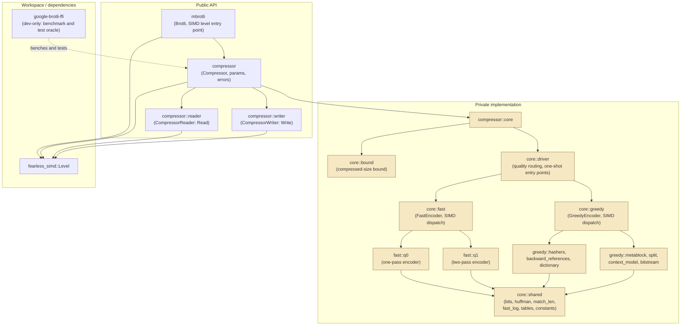

# Architecture

This directory is the always-current description of what `mbrotli` implements
today. Each specification covers one subsystem: its module boundaries, public
API surface, control and data flow, state machines, SIMD dispatch points, and
error propagation, with Mermaid diagrams for the mechanics it describes.

## Index

| Specification | Summary |
| --- | --- |
| [compressor.md](compressor.md) | Compressor subsystem: SIMD level detection and hand-off, parameter and bound types, quality routing, one-shot and streaming compression paths, error model, verification topology, and current implementation gaps. |
| [fast-encoder.md](fast-encoder.md) | Quality 0 and quality 1 encoder core: module map, workspace ownership, fragment lifecycle, the two scan state machines, bitstream layer, SIMD dispatch points, and table-bit specialisation. |
| [greedy-encoder.md](greedy-encoder.md) | Quality 3, 4 and 5 encoder core: parameter resolution and the deterministic hasher plan, ring buffer layout, greedy and lazy command generation, meta-block splitting and context modelling, the static dictionary, and the single SIMD dispatch. |
| [fuzzing.md](fuzzing.md) | AFL fuzzing subsystem: package isolation, the engine-neutral target layer, input model and payload cap, the eleven targets and their oracles, backend deduplication, and the crash-to-regression lifecycle. |

## Module map

`core` and everything below it are private: no `core` type, SIMD type detail,
FFI detail, or low-level error escapes the public API. The public modules own
the ergonomic surface; `core` owns the algorithms.

## Repository layout

| Path | Role |
| --- | --- |
| `src/lib.rs` | Crate root; `Brotli` entry point and SIMD level detection. |
| `src/compressor/` | Public compressor API, parameters, error types. |
| `src/compressor/core/` | Private implementation modules: bound, quality routing. |
| `src/compressor/core/shared/` | Primitives every quality shares: bit writer, Huffman builders, match-length scan, reference logarithms, format constants and entropy tables. |
| `src/compressor/core/fast/` | Quality 0 and quality 1 encoders and their SIMD dispatch. |
| `src/compressor/core/greedy/` | Quality 3, 4 and 5 encoder: ring buffer, match finders, static dictionary, meta-block builder, bitstream writer and its SIMD dispatch. |
| `docs/` | Port documentation: API binding, design, reference differences, benchmark report. |
| `fuzz/afl/` | AFL fuzz targets and their regression corpus, excluded from the workspace. |
| `brotli-ffi/` | Workspace crate binding Google's C Brotli; `vendor/` is upstream source and is not hand-edited. |
| `examples/` | Runnable example mirroring the README, so the documented usage stays compiled. |
| `benches/` | Criterion benchmarks comparing this crate with the C implementation. |
| `tests/` | Integration tests over the public API. |
| `architecture/` | This directory. |
