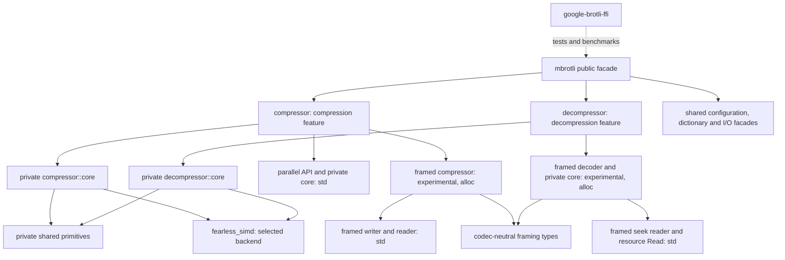

# Architecture

Specifications describe current ownership, APIs, data flow, state transitions,
SIMD dispatch, errors and known gaps. Start with the [user guide](../docs/README.md)
for usage or [development](../docs/development.md) for checks and repository layout.

## Module map

Public modules own ergonomic configuration and high-level errors. Private `core`
modules own algorithms and state machines; implementation errors, SIMD types and
FFI do not appear in public signatures. Each codec compiles independently.

## Common boundaries

| Specification | Scope |
| --- | --- |
| [Codec features](codec-features.md) | Codec gates, shared types and isolated consumer checks. |
| [No standard library](no-std.md) | Alloc-backed APIs, feature precedence and compile-time SIMD. |
| [Shared primitives](shared-primitives.md) | Common data, transforms and private ownership. |

## Compression

| Specification | Scope |
| --- | --- |
| [Compressor](compressor.md) | Public API, sessions, I/O, dispatch and errors. |
| [Encoder workspace](encoder-workspace.md) | Retained storage, reset, accounting and backpressure. |
| [Bit output](bit-output.md) | Initialized destinations, bit operations and overflow. |
| [Serial output identity](universal-encoding.md) | Shared scheduling, empty finalization and C compatibility. |
| [Fast encoder](fast-encoder.md) | Qualities 0–1: fragments, entropy coding and SIMD scans. |
| [Greedy encoder](greedy-encoder.md) | Qualities 2–9: matchers, commands and meta-blocks. |
| [High-quality encoder](hq-encoder.md) | Qualities 10–11: tree search, dynamic programming and clustering. |
| [Parallel compression](parallel-compression.md) | Planning, caller-run tasks, staging and assembly. |

## Decompression

| Specification | Scope |
| --- | --- |
| [Framed seek reader](framed-seek-reader.md) | Footer/directory indexing, lazy metadata, sparse dependency decoding and resource Read. |
| [Framed decoder](framed-decoder.md) | Structured containers, detection, events, dictionaries, validation, budgets and lending reader. |
| [Native decompressor](decompressor.md) | Parsing, sessions, history, dictionaries, budgets and I/O. |
| [Owned decoder output](decoder-owned-output.md) | Stored members, allocation transfer and read-ahead accounting. |
| [Literal and stored-header decoding](decoder-literal-performance.md) | Literal batches and complete stored-member recognition. |
| [Decoder SIMD](decoder-simd.md) | Command-loop dispatch and bounded history copies. |
| [Decoder verification](decompressor-compatibility.md) | C/RFC oracles, feature profiles and test limitations. |

## Extended formats

| Specification | Scope |
| --- | --- |
| [Shared Brotli](shared-brotli.md) | Large Window declarations and prepared prefix dictionaries. |
| [Serialized dictionaries](serialized-dictionary.md) | Experimental wire format, transforms and resource limits. |
| [Custom encoding and continuations](rfc9841-encoding.md) | Static indexes, contexts and headerless stream offsets. |
| [Framed compressor](framing.md) | Reusable owner, shared alloc engine, structured input, sessions, std adapters, metadata and wire compatibility. |

## Development tools

| Specification | Scope |
| --- | --- |
| [Implementation comparison](benchmark-comparison.md) | Isolated Criterion suites, validation and symmetric encoder/decoder reports. |
| [Fuzzing](fuzzing.md) | Target inputs, oracles, campaigns and regression replay. |
| [Continuous integration](ci.md) | Triggers, checks, framed fuzz campaigns, artifacts and coverage gating. |
