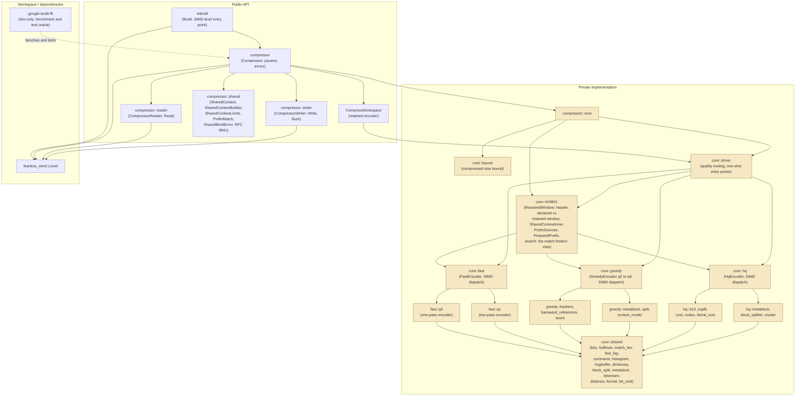

# Architecture

This directory is the always-current description of what `mbrotli` implements
today. Each specification covers one subsystem: its module boundaries, public
API surface, control and data flow, state machines, SIMD dispatch points, and
error propagation, with Mermaid diagrams for the mechanics it describes.

## Index

| Specification | Summary |
| --- | --- |
| [compressor.md](compressor.md) | Compressor subsystem: SIMD level detection and hand-off, parameter and bound types, quality routing, one-shot and streaming compression paths, the flush protocol, workspace reuse, error model, verification topology, and current implementation gaps. |
| [fast-encoder.md](fast-encoder.md) | Quality 0 and quality 1 encoder core: module map, workspace ownership, fragment lifecycle, the two scan state machines, bitstream layer, SIMD dispatch points, and table-bit specialisation. |
| [greedy-encoder.md](greedy-encoder.md) | Quality 2 to 9 encoder core: parameter resolution and the deterministic hasher plan, greedy and lazy command generation, the quick, bucket and forgetful-chain match finders, static-entropy and split meta-block storage, the attached-prefix search, and the single SIMD dispatch. |
| [hq-encoder.md](hq-encoder.md) | Quality 10 and 11 encoder core: the binary-tree match finder, the Zopfli dynamic program and its numerical-determinism contract, the high-quality block splitter and histogram clustering, how an attached prefix reaches the dynamic program, and the layer-by-layer differential harness. |
| [shared-brotli.md](shared-brotli.md) | RFC 9841 subsystem: what of Shared Brotli exists today — Large Window selection, declared window versus retained history, the widened distance alphabet and its per-meta-block retune, the caller-owned shared context with its ownership model, transactional preparation, virtual-concatenation addressing, the C-identical prepared index, how a match finder consults an attached prefix, where a large window and a prefix are refused, and the shared error type — plus the serialized dictionaries and framing that are not written yet. |
| [fuzzing.md](fuzzing.md) | AFL fuzzing subsystem: package isolation, the engine-neutral target layer, input model and payload cap, the nineteen targets and their oracles, backend deduplication, and the crash-to-regression lifecycle. |

## Module map

`core` and everything below it are private: no `core` type, SIMD type detail,
FFI detail, or low-level error escapes the public API. The public modules own
the ergonomic surface; `core` owns the algorithms.

## Repository layout

| Path | Role |
| --- | --- |
| `src/lib.rs` | Crate root; `Brotli` entry point and SIMD level detection. |
| `src/compressor/` | Public compressor API, parameters, error types. |
| `src/compressor/core/` | Private implementation modules: bound, quality routing. |
| `src/compressor/shared/` | Public RFC 9841 surface: the shared-Brotli error type, the caller-owned shared context and its builder, the resource limits it is prepared under, and the prefix-match result. |
| `src/compressor/core/rfc9841/` | Private RFC 9841 primitives: window resolution and stream-header encoding; the shared context's dictionary sources, their virtual-concatenation addressing and match scan; the prepared hash index ported from the reference's compound dictionary; and the search a match finder runs against an attached prefix. |
| `src/compressor/core/shared/` | Everything more than one quality needs: the bit writer, Huffman builders, match-length scan and reference logarithms, plus the shape of a compressed meta-block — commands, histograms, block splits, the distance alphabet, context modes, the ring buffer, the static dictionary and the meta-block writer. |
| `src/compressor/core/fast/` | Quality 0 and quality 1 encoders and their SIMD dispatch. |
| `src/compressor/core/greedy/` | Quality 2 to 9 encoder: match finders, greedy backward-reference search, greedy meta-block builder and its SIMD dispatch. |
| `src/compressor/core/hq/` | Quality 10 and 11 encoder: binary-tree match finder, Zopfli dynamic program, high-quality block splitter and meta-block builder, and its SIMD dispatch. |
| `docs/` | Port documentation: API binding, design, reference differences, benchmark report. |
| `fuzz/afl/` | AFL fuzz targets and their regression corpus, excluded from the workspace. |
| `brotli-ffi/` | Workspace crate binding Google's C Brotli; `vendor/` is upstream source and is not hand-edited, and `shim/` exposes five encoder-internal functions the differential tests compare against. |
| `examples/` | Runnable example mirroring the README, so the documented usage stays compiled. |
| `benches/` | Criterion benchmarks comparing this crate with the C implementation. |
| `tests/` | Integration tests over the public API. |
| `architecture/` | This directory. |
