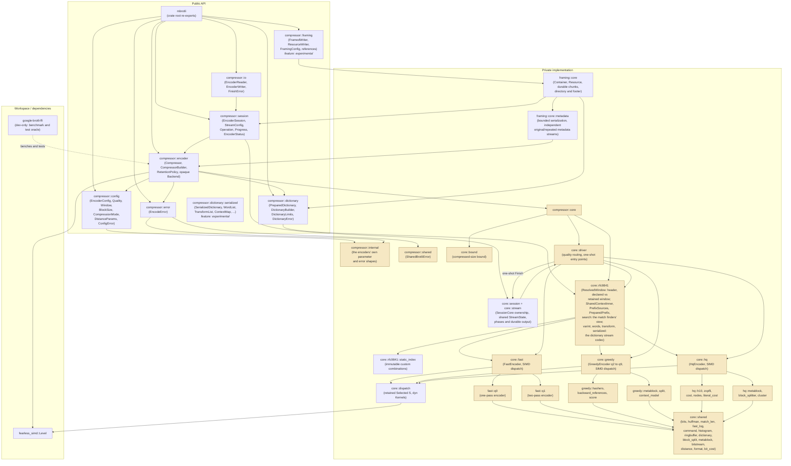

# Architecture

This directory is the always-current description of what `mbrotli` implements
today. Each specification covers one subsystem: its module boundaries, public
API surface, control and data flow, state machines, SIMD dispatch points, and
error propagation, with Mermaid diagrams for the mechanics it describes.

## Index

| Specification | Summary |
| --- | --- |
| [ci.md](ci.md) | Automatic tests, lints and checks; manually dispatched coverage, Miri, sanitizer, fuzz campaigns and benchmarks. |
| [compressor.md](compressor.md) | Compressor subsystem: the five layers of the public API, where each configuration value is validated, how it lowers into the encoders' own parameters, the stateful compressor and its retained workspace, the one-shot paths, the session state machine, the transactional writer and the cursor-based reader, the split error model, SIMD dispatch, verification topology, and current implementation gaps. |
| [encoder-workspace.md](encoder-workspace.md) | Retained allocation ownership, sparse matcher promotion, pinned backend kernels, session completion and bounded writer backpressure, with Track A verification evidence and open gates. |
| [universal-encoding.md](universal-encoding.md) | Universal cross-API byte identity, equivalent stream settings, deliberate native C differences, exact slice capacity and canonical differential oracles. |
| [fast-encoder.md](fast-encoder.md) | Quality 0 and quality 1 encoder core: module map, workspace ownership, fragment lifecycle, the two scan state machines, bitstream layer, SIMD dispatch points, and table-bit specialisation. |
| [greedy-encoder.md](greedy-encoder.md) | Quality 2 to 9 encoder core: parameter resolution and the deterministic hasher plan, greedy and lazy command generation, the quick, bucket and forgetful-chain match finders, static-entropy and split meta-block storage, the attached-prefix search, and the single SIMD dispatch. |
| [hq-encoder.md](hq-encoder.md) | Quality 10 and 11 encoder core: the binary-tree match finder, the Zopfli dynamic program and its numerical-determinism contract, the high-quality block splitter and histogram clustering, how an attached prefix reaches the dynamic program, and the layer-by-layer differential harness. |
| [shared-brotli.md](shared-brotli.md) | RFC 9841 base subsystem: Large Window selection, declared versus retained history, distance retuning, immutable prefix dictionaries, transactional preparation and virtual-concatenation addressing. |
| [serialized-dictionary.md](serialized-dictionary.md) | RFC 9841 serialized shared dictionaries, behind the `experimental` feature: the module split between the private codec and the public description, the wire format field by field, the parse flow and where each limit is checked, transform application and the reference behaviour it keeps, the canonical encoding and the one noncanonical form the RFC allows, the seven resource ceilings, three deliberate differences from the C reference, and the differential harness that checks the rest against it. |
| [rfc9841-encoding.md](rfc9841-encoding.md) | Experimental custom static indexes with peak preparation budgets, greedy/HQ transformed candidates, context combinations, compact long-word commands and checked headerless continuations. |
| [framing.md](framing.md) | Experimental non-seekable container writer: resource lifecycle, chunk types 0–10, compressed and field-selected metadata, dictionary references, transactional delivery, bounded storage, complete directory and fixed-point footer. |
| [fuzzing.md](fuzzing.md) | AFL fuzzing subsystem: package isolation, engine-neutral targets including serialized dictionaries and framing, backend deduplication and regression replay. |

## Module map

`core` and everything below it are private: no `core` type, SIMD type detail,
FFI detail, or low-level error escapes the public API. The public modules own
the ergonomic surface; `core` owns the algorithms.

## Repository layout

| Path | Role |
| --- | --- |
| `src/lib.rs` | Crate root; re-exports the public surface. |
| `src/compressor/config.rs` | Validated configuration: `EncoderConfig` and the values inside it. |
| `src/compressor/encoder.rs` | The stateful `Compressor`, its builder and its retention policy. |
| `src/compressor/session.rs` | Public session wrapper and per-stream values; delegates to private `core::session` and the shared `core::stream` scheduler. |
| `src/compressor/error.rs` | `EncodeError`, and its conversion into `std::io::Error`. |
| `src/compressor/io/` | The `Read` and `Write` adapters over a session. |
| `src/compressor/dictionary/` | Immutable RFC 9841 prefix dictionaries and their builder. |
| `src/compressor/internal.rs` | Private: the parameter and error shapes the `core` tree is written against, which the public configuration lowers into. |
| `src/compressor/shared/` | Private: the low-level RFC 9841 error the encoders raise. |
| `src/compressor/core/` | Private implementation modules: bound, quality routing, the retained workspace. |
| `src/compressor/core/rfc9841/` | Private RFC 9841 primitives: window resolution and stream-header encoding; the shared context's dictionary sources, their virtual-concatenation addressing and match scan; the prepared hash index ported from the reference's compound dictionary; and the search a match finder runs against an attached prefix. |
| `src/compressor/core/shared/` | Everything more than one quality needs: the bit writer, Huffman builders, match-length scan and reference logarithms, plus the shape of a compressed meta-block — commands, histograms, block splits, the distance alphabet, context modes, the ring buffer, the static dictionary and the meta-block writer. |
| `src/compressor/core/fast/` | Quality 0 and quality 1 encoders and their SIMD dispatch. |
| `src/compressor/core/greedy/` | Quality 2 to 9 encoder: match finders, greedy backward-reference search, greedy meta-block builder and its SIMD dispatch. |
| `src/compressor/core/hq/` | Quality 10 and 11 encoder: binary-tree match finder, Zopfli dynamic program, high-quality block splitter and meta-block builder, and its SIMD dispatch. |
| `docs/` | Port documentation: API binding, design, reference differences, benchmark report. |
| `fuzz/afl/` | AFL fuzz targets and their regression corpus, excluded from the workspace. |
| `brotli-ffi/` | Workspace crate binding Google's C Brotli; `vendor/` is upstream source and is not hand-edited, and `shim/` exposes five encoder-internal functions the differential tests compare against. |
| `examples/` | Runnable example mirroring the README, so the documented usage stays compiled. |
| `benches/` | Criterion benchmarks comparing this crate with the C implementation. |
| `tests/` | Integration tests over the public API, including the writer's fault-injection proof. |
| `architecture/` | This directory. |
