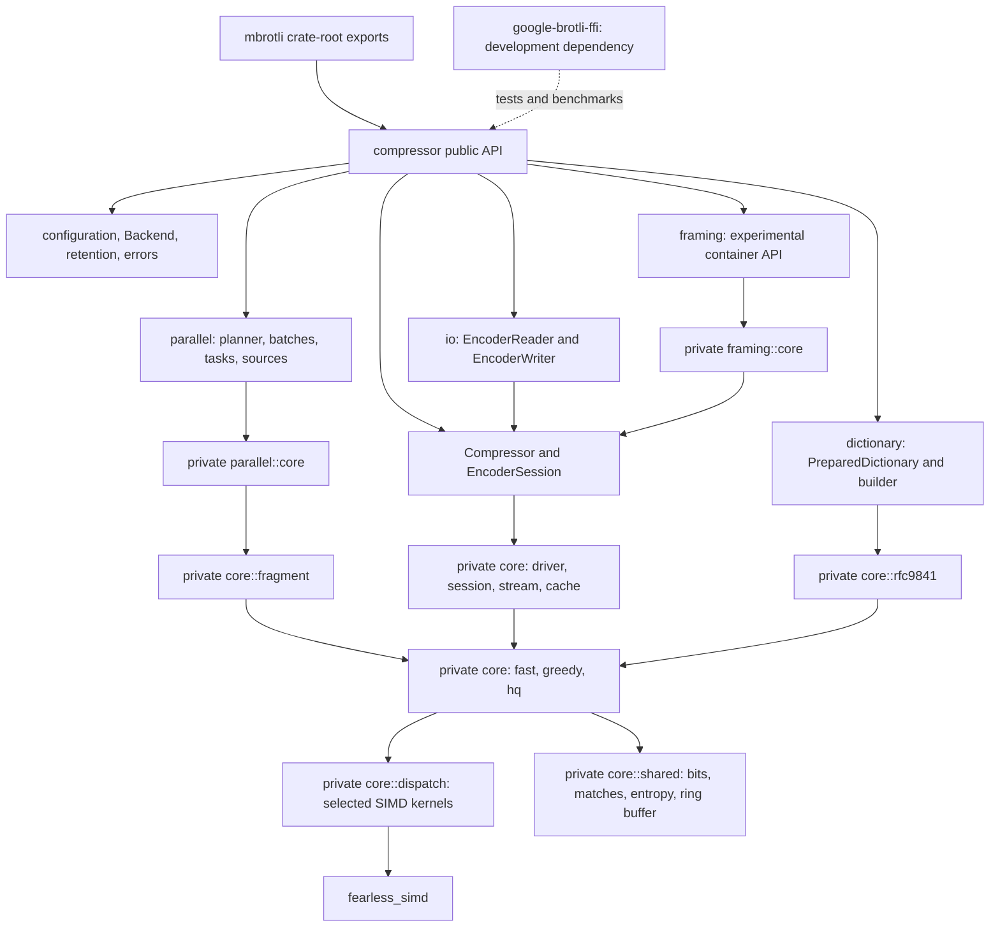

# Architecture

These specifications describe the current implementation: ownership and module
boundaries, public APIs, data flow, state transitions, SIMD dispatch, errors,
and known gaps. For usage examples, start with the [user guide](../docs/README.md).

## Specifications

| Specification | Scope |
| --- | --- |
| [Compressor](compressor.md) | Configuration, serial APIs, sessions, I/O adapters, and errors. |
| [Encoder workspace](encoder-workspace.md) | Retained allocations, incremental ring storage, copy-extension SIMD kernels, reset, and writer backpressure. |
| [Bit output](bit-output.md) | Fixed and growing initialized storage, direct fast appends, bit operations, and overflow propagation. |
| [Serial output identity](universal-encoding.md) | Equivalent stream settings, shared scheduling, allocation-free empty finalization, and C compatibility. |
| [Parallel compression](parallel-compression.md) | Independent segments, caller-run tasks, sources, staging, and assembly. |
| [Fast encoder](fast-encoder.md) | Quality 0–1 fragment encoding, direct appends, entropy codes, and specialized SIMD scans. |
| [Greedy encoder](greedy-encoder.md) | Quality 2–9 matchers, specialized SIMD feature contexts, command generation, and meta-block construction. |
| [High-quality encoder](hq-encoder.md) | Quality 10–11 binary-tree search, specialized SIMD contexts, dynamic programming, and clustering. |
| [Shared Brotli](shared-brotli.md) | Large Window headers, retained history, and prepared prefix dictionaries. |
| [Serialized dictionaries](serialized-dictionary.md) | Experimental parsing, serialization, transforms, and resource limits. |
| [Custom encoding and continuations](rfc9841-encoding.md) | Experimental static indexes, context combinations, and stream offsets. |
| [Framing](framing.md) | Experimental resources, metadata, references, directory, and footer. |
| [Fuzzing](fuzzing.md) | Isolated AFL package, input models, target oracles, and regression replay. |
| [Continuous integration](ci.md) | Automatic checks, public API semver compatibility, AFL tool installation and CPU-specific cache boundaries, and manually dispatched validation workflows. |

## Module map

The public surface uses validated configuration values and high-level errors.
Private `core` modules own algorithms and state machines. Implementation errors,
SIMD types, and FFI details do not appear in the public API. The configuration,
encoder, session, backend, and error source modules are private; their public
items are re-exported through `compressor` and the crate root.

## Source layout

| Path | Contents |
| --- | --- |
| `src/lib.rs` | Crate documentation and public re-exports. |
| `src/compressor/` | Configuration, compressor ownership, sessions, and public errors. |
| `src/compressor/io/` | Reader and writer adapters over sessions. |
| `src/compressor/dictionary/` | Dictionary preparation and experimental serialized descriptions. |
| `src/compressor/parallel/` | Task, batch, source, and staging APIs with private core mechanics. |
| `src/compressor/framing/` | Experimental container API and private wire/state implementation. |
| `src/compressor/core/` | Serial scheduling, retained encoders, fragments, and SIMD dispatch. |
| `src/compressor/core/{fast,greedy,hq}/` | Quality-specific encoding families. |
| `src/compressor/core/shared/` | Shared match, command, entropy, bitstream, and dictionary primitives. |
| `src/compressor/core/rfc9841/` | Window resolution, prefix search, serialized codecs, and custom indexes. |
| `src/compressor/internal.rs`, `src/compressor/shared/` | Private parameter and error shapes. |

See [development](../docs/development.md) for the workspace layout and checks.
