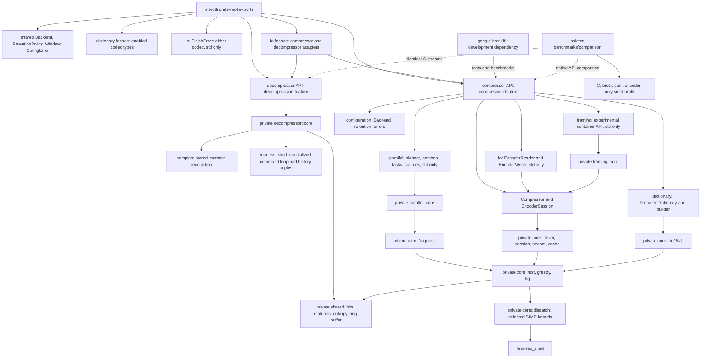

# Architecture

These specifications describe the current implementation: ownership and module
boundaries, public APIs, data flow, state transitions, SIMD dispatch, errors,
and known gaps. For usage examples, start with the [user guide](../docs/README.md).

## Specifications

| Specification | Scope |
| --- | --- |
| [Implementation comparison](benchmark-comparison.md) | Isolated five-encoder and four-decoder Criterion suites, identical decoder inputs, validated exports, dataset medians, ranked bar reports, and current/historical run provenance. |
| [Codec features](codec-features.md) | Independent default-enabled codecs, shared public types, private primitive gates, crate documentation and isolated consumer checks. |
| [No standard library](no-std.md) | Opt-in alloc-backed compression, feature precedence, excluded std APIs, compile-time SIMD, and no_std-only libm dependencies. |
| [Native decompressor](decompressor.md) | Incremental raw decoding, whole-word reservoir, table Huffman, ring history, SIMD copies and command fast path, dictionaries, resource budgets, retained lifecycle, I/O, and executable API contracts. |
| [Owned decoder output](decoder-owned-output.md) | Burli comparison, stored-member recognition, history-to-result transfer, initialized growth, and output-pause read-ahead accounting. |
| [Decoder literal performance](decoder-literal-performance.md) | Three-symbol literal batches, short stored headers, and paired validation without changing benchmark inputs. |
| [Decoder SIMD measurements](decoder-simd.md) | Profile, copy-kernel dispatch, before/after Criterion evidence and validation limits. |
| [Decoder compatibility](decompressor-compatibility.md) | Pinned C/RFC evidence, four build profiles, fuzzing, heavy checks and measured baseline. |
| [Shared primitives](shared-primitives.md) | Private crate-root common data and transform ownership used by both codecs. |
| [Compressor](compressor.md) | Configuration, serial APIs, sessions, I/O adapters, and errors. |
| [Encoder workspace](encoder-workspace.md) | Retained allocations and profiling-aware accounting tests, incremental ring storage, copy-extension SIMD kernels, production versus test backend selection, reset, and writer backpressure. |
| [Bit output](bit-output.md) | Fixed and growing initialized storage, direct fast appends, bit operations, and overflow propagation. |
| [Serial output identity](universal-encoding.md) | Equivalent stream settings, shared scheduling, allocation-free empty finalization, and C compatibility. |
| [Parallel compression](parallel-compression.md) | Independent segments, caller-run tasks, scheduling and source examples, automatic memory staging, complete staging bounds, and assembly. |
| [Fast encoder](fast-encoder.md) | Quality 0–1 fragment encoding, proven tiny-final raw shortcut, entropy codes, and specialized SIMD scans. |
| [Greedy encoder](greedy-encoder.md) | Quality 2–9 matchers, specialized SIMD feature contexts, command generation, and meta-block construction. |
| [High-quality encoder](hq-encoder.md) | Quality 10–11 binary-tree search with a vector short scan, SIMD block assignment with exact ties, the dynamic program and its distance-cache loop, and clustering. |
| [Shared Brotli](shared-brotli.md) | Large Window headers, retained history, and prepared prefix dictionaries. |
| [Serialized dictionaries](serialized-dictionary.md) | Experimental parsing, append serialization, public versus private transform behavior, and resource limits. |
| [Custom encoding and continuations](rfc9841-encoding.md) | Experimental static indexes, context combinations, and stream offsets. |
| [Framing](framing.md) | Experimental resources, metadata, references, directory, footer, and explicit finalization examples. |
| [Fuzzing](fuzzing.md) | Isolated AFL package, stable and experimental target selection, input models, bidirectional C/Rust round-trip oracles, shared encoder seeds, encoder and decoder campaign structure, and regression replay. |
| [Continuous integration](ci.md) | Automatic checks, tag-triggered fuzz/Miri/ASan, API compatibility, feature-isolated AFL replay, cache boundaries, archived findings and function-coverage gating. |

## Module map

The public surface uses validated configuration values and high-level errors.
Private `core` modules own algorithms and state machines. Implementation errors,
SIMD types, and FFI details do not appear in the public API. Encoder configuration, session and error source modules are private. Shared
backend, retention and window modules live privately at the crate root; their
public types retain the existing crate-root and compressor re-exports. Each
codec and its private implementation compile only with its codec feature.

## Source layout

| Path | Contents |
| --- | --- |
| `src/lib.rs`, `src/compressor.md` | Feature-gated crate documentation and public re-exports. |
| `src/backend.rs`, `src/retention.rs`, `src/window.rs`, `src/finish_error.rs` | Common public types behind private source modules. |
| `src/dictionary/` | Shared public dictionary facade and decode-only dictionary API. |
| `src/decompressor/` | Decoder configuration, ownership, sessions, errors and private core. |
| `src/decompressor/io/`, `src/io.rs` | Decoder adapters and shared public I/O facade. |
| `src/compressor/` | Configuration, compressor ownership, sessions, and public errors. |
| `src/compressor/io/` | Reader and writer adapters over sessions. |
| `src/compressor/dictionary/` | Dictionary preparation and experimental serialized descriptions. |
| `src/compressor/parallel/` | Task, batch, source, and staging APIs with private core mechanics. |
| `src/compressor/framing/` | Experimental container API and private wire/state implementation. |
| `src/compressor/core/` | Serial scheduling, retained encoders, fragments, and SIMD dispatch. |
| `src/compressor/core/{fast,greedy,hq}/` | Quality-specific encoding families. |
| `src/shared/` | Shared match, command, entropy, bitstream, and dictionary primitives. |
| `src/compressor/core/rfc9841/` | Window resolution, prefix search, serialized codecs, and custom indexes. |
| `src/compressor/internal.rs`, `src/compressor/shared/` | Private parameter and error shapes. |

See [development](../docs/development.md) for the workspace layout and checks.
