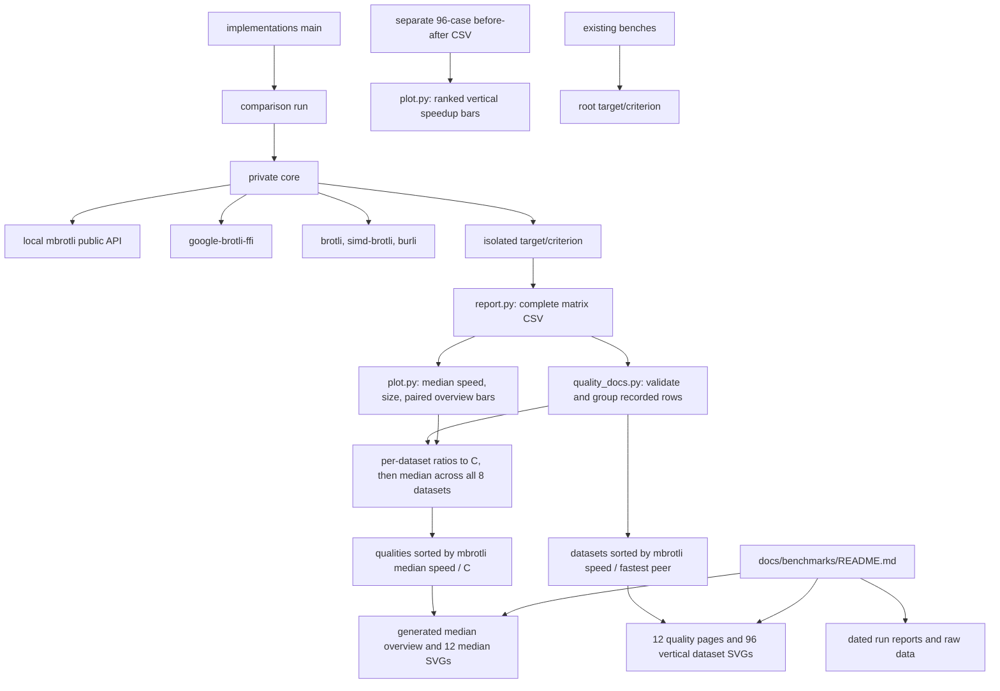

# Implementation comparison

## Boundaries

`benchmarks/comparison/` is an unpublished standalone Cargo workspace. Its lockfile
pins competitors without changing the library's dependency resolution. The
comparison library exposes only `run`; private `core` owns corpus generation,
encoding adapters, validation, sampling, and output. The root package excludes
this directory from publication. Library APIs and dispatch remain unchanged.



## Control and data flow

The driver creates eight deterministic corpora and validates 432 compressed
streams before timing. Four adapters cover q0–q11; Burli covers q0–q5. All use
generic mode, window 22, and a complete input with size hints where configurable.
No custom dictionaries or flushes are introduced. Each encoder selects its own
default SIMD path; the harness adds no CPU feature detection.

```mermaid
sequenceDiagram
    participant Main
    participant Core
    participant Encoder
    participant C as C decoder
    participant Timer as Criterion
    Main->>Core: run
    Core->>Core: construct fixed corpora
    loop every supported case
        Core->>Encoder: cold compress
        Encoder-->>Core: owned stream or error
        Core->>C: decode into bounded buffer
        C-->>Core: bytes and status
        Core->>Core: require original bytes; record length
    end
    Core->>Core: write sizes.csv
    loop selected cases and iterations
        Timer->>Encoder: construct, allocate, encode, dispose
        Encoder-->>Timer: black-box output or captured error
    end
    Timer-->>Main: estimates and summary
```

The C adapter owns an initialized destination sized by C's one-shot bound.
Unsafe calls receive disjoint slices and explicit writable capacities. The
decoder allocates at least one byte for empty-input validation. Unit tests cover
empty/tiny inputs, buffer boundaries, corruption, wrong expected content,
unknown adapters, and unsupported Burli quality. Criterion test mode exercises
the full matrix and driver.

Private typed errors and dependency errors propagate through `Result` to the
executable. Timed encoding errors are captured and returned after that Criterion
case. Preflight failure aborts before timing or replacement of `sizes.csv`.

`report.py` joins a unique named baseline with the size manifest by full case ID.
It checks throughput input lengths and rejects duplicate or incomplete records.
Its 432-row export includes latency confidence bounds, throughput, speed relative
to C, and output sizes. Existing 95%-of-C gates use only the original benchmarks.

`plot.py` uses the same complete-matrix validator and median helpers as
`quality_docs.py`. It writes three standalone SVG figures: speed medians, output
size medians, and a paired overview. For each quality and encoder, speed ratios
are C mean latency / encoder mean latency, and size ratios are encoder bytes /
C bytes for the same dataset. Each median uses all eight per-dataset ratios with
equal weight, including empty input. For eight values the median averages the
fourth and fifth sorted values. These are not medians of Criterion samples, nor
ratios of pooled times or bytes. The summary does not infer confidence bounds.
Qualities are ordered by descending mbrotli median speed / C, with numeric
quality order breaking ties. Burli is absent above q5, never represented as zero.
The filenames `throughput.svg`, `size.svg`, and `tradeoff.svg` are retained for
existing links, but all three now show normalized medians on vertical bars.

The optional matched before/after renderer validates 96 unique cases and shows
before mean / after mean per quality. It ranks corpus panels by median speedup
across qualities, retaining the declared corpus order on ties. This separate
run is never pooled with the five-encoder summary.

`quality_docs.py` reads one complete CSV and its environment record, validates
unique supported quality/dataset/encoder keys, finite positive timing bounds,
consistent input lengths, and window settings, then writes twelve Markdown
pages and a median overview under `docs/benchmarks/qualities/`. Each page starts
with median speed/size bars and a table, then shows all eight dataset charts.
The current pages and index use `docs/benchmarks/library-comparison.csv` and its
environment and run report; earlier comparison and optimization records retain
their original data. Each page links to its own run's measurement limitations.
Datasets are ordered by fastest peer mean latency / mbrotli mean latency,
descending, with declared corpus order breaking ties. The peer excludes mbrotli
so leads above 1× remain distinguishable. Exact tables and measurement setup
use Markdown details blocks. All 432 measurements remain accessible.

Every bar is vertical on a linear axis starting at zero, with consistent encoder
colors and labeled values. Dataset charts show mean latency for empty and tiny
input, throughput for larger inputs, and exact compressed bytes. Timing whiskers
retain recorded confidence bounds; throughput bounds invert latency bounds.
Empty input has no defined throughput or compressed fraction, but its relative
latency and output / C are defined and included in the medians. Rankings do not
claim significance or equal compressed size. Generation does not run encoders
or alter CSVs and environment records. Older report charts use their own CSV.

## Known gaps

- This suite measures cold serial compression. The existing harnesses retain
  streaming, workspace reuse, parallel, and experimental measurements.
- Equal numeric quality is not equal output size across encoders.
- `BrotliCompress` includes 4 KiB I/O adaptation; this compares complete APIs.
- The size manifest describes the latest preflight. Archive it with the named
  baseline; the exporter cannot detect mixed revisions with identical input sizes.
- Fixed encoder order and a shared host can bias timing. Sampling confidence
  intervals do not capture all environmental bias.
