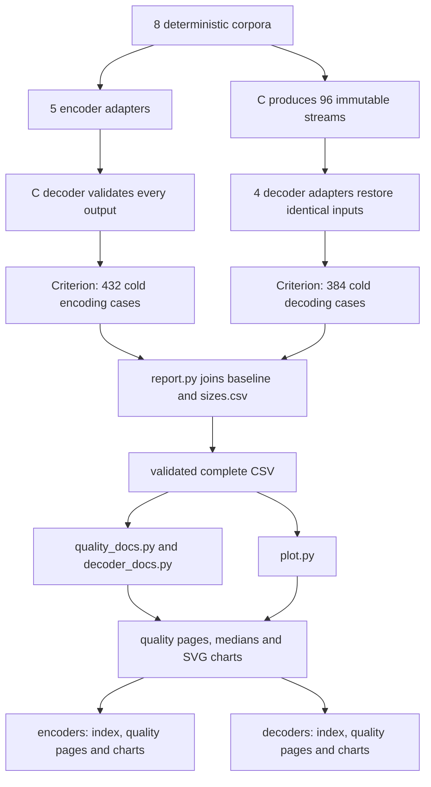

# Implementation comparison

`benchmarks/comparison/` is an unpublished standalone Cargo workspace with pinned
competitors and its own lockfile. The library exposes `run` and `run_decoders`;
private `core` modules own corpora, adapters, validation and timing. Production
codec APIs and dependencies are separate.

## Measurement contract

| Suite | Implementations | Result directory |
| --- | --- | --- |
| `implementations` | C, mbrotli, Rust brotli, SIMD Brotli at q0–q11; Burli at q0–q5 | `target/criterion` |
| `decoders` | C, mbrotli, Rust brotli and Burli on source q0–q11 | `target/criterion-decoders` |

Both use generic mode, window 22 and the same eight corpus definitions. Complete
matrix validation happens before timing, including filtered runs. Unsupported
qualities are omitted. Encoder output must round-trip through C; decoder output
must equal the original bytes. Corpus construction and validation stay outside
timing. Each codec chooses its native backend.

Cold iterations include codec construction, allocation, transformation and disposal.
C decoding receives the known output capacity; Rust Brotli's helpers include
4 KiB I/O adaptation. The encoder comparison includes C one-shot output rewrites
and does not require compressed byte identity across libraries.

The decoder suite retains identical C-produced streams for every adapter.
Throughput counts restored bytes; quality belongs to the source encoder.
SIMD Brotli is omitted from decoding because its API re-exports the Rust
`brotli-decompressor` project. The lockfile can resolve different versions of that
project; their performance is not assumed equal.

## Errors and reporting

Preflight errors stop the run before timing or replacing `sizes.csv`. Private typed
errors identify adapter failures and payload mismatches. Timed errors are captured
and returned after the affected Criterion case. FFI receives disjoint initialized
buffers with checked capacities; empty C output reserves at least one byte.

`report.py` joins a named baseline to the matching size manifest by complete case
ID. It rejects duplicate/incomplete matrices and inconsistent lengths. Exports
include mean latency, 95% confidence bounds, throughput and output sizes.

Generators validate unique supported keys, finite timings and shared dimensions.
They derive speed ratios per dataset, then take the median across all eight
inputs, including empty and tiny inputs. Encoder size ratios use the same rule.
The decoder Burli column takes direct per-dataset Burli/mbrotli time ratios;
it does not divide C-relative medians.

Pages retain every workload and exact value. Overview qualities are ordered by
mbrotli median speed relative to C; dataset charts retain confidence bounds.
Bars start at zero, and throughput bounds invert latency bounds. Empty input has
latency but no meaningful throughput or compressed/input ratio. The optional
paired renderer accepts a separate complete 96-case before/after CSV.

## Published layout

`docs/benchmarks/encoder-comparison.{md,csv}` and
`encoder-comparison-environment.json` hold the encoder report, measurements and
provenance. Decoder files use the corresponding `decoder-comparison` names.
Each codec has its own `encoders/` or `decoders/` directory containing an index,
`q0.md`–`q11.md`, and `charts/overview.svg` alongside detailed charts.

`quality_docs.py` generates encoder quality pages; `plot.py` writes their shared
overview, throughput and size charts. `decoder_docs.py` generates decoder pages
and charts together. Generators compute links relative to their output directory.

## Verification and known gaps

Criterion test mode exercises the full matrix. Python tests check export pairing,
malformed records, medians, generated pages and SVG structure. See
[benchmarking](../docs/benchmarking.md) for commands and
[results](../docs/benchmarks/README.md) for published data.

- Archive `sizes.csv` with its named baseline; later preflight runs replace it.
  Matching lengths alone cannot prove that two artifacts came from the same source.
- Equal quality numbers do not imply equal compressed size or search policy.
- These suites measure cold serial APIs. Root benchmarks separately cover retained
  state, slices, streaming, parallel tasks and experimental formats.
- Fixed implementation order and shared hosts can bias timings; confidence bounds
  do not capture every environmental effect or establish a significant lead.
