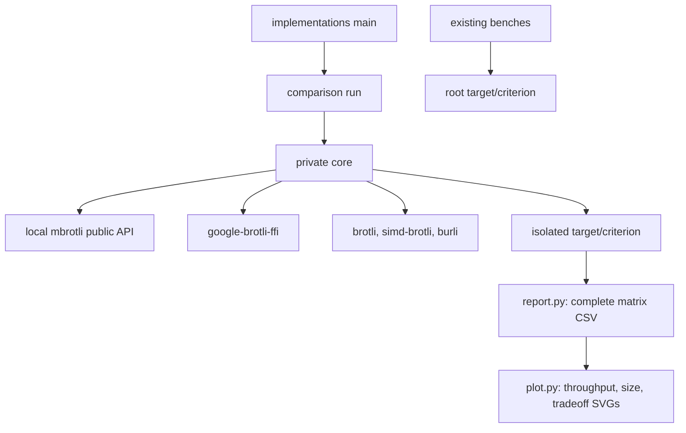

# Implementation comparison

## Boundaries

`benchmarks/comparison/` is an unpublished standalone Cargo workspace. Its lockfile
pins competitors without changing the library's dependency resolution. The
comparison library exposes only `run`; private `core` owns corpus generation,
encoding adapters, validation, sampling, and output. The root package excludes
this directory from publication. Library APIs and dispatch remain unchanged.



## Control and data flow

The driver creates eight deterministic corpora and validates 432 compressed
streams before timing. Four adapters cover q0–q11; Burli covers q0–q5. All use
generic mode, window 22, and a complete input with size hints where configurable.
No custom dictionaries or flushes are introduced. Each encoder selects its own
default SIMD path; the harness adds no CPU feature detection.

```mermaid
sequenceDiagram
    participant Main
    participant Core
    participant Encoder
    participant C as C decoder
    participant Timer as Criterion
    Main->>Core: run
    Core->>Core: construct fixed corpora
    loop every supported case
        Core->>Encoder: cold compress
        Encoder-->>Core: owned stream or error
        Core->>C: decode into bounded buffer
        C-->>Core: bytes and status
        Core->>Core: require original bytes; record length
    end
    Core->>Core: write sizes.csv
    loop selected cases and iterations
        Timer->>Encoder: construct, allocate, encode, dispose
        Encoder-->>Timer: black-box output or captured error
    end
    Timer-->>Main: estimates and summary
```

The C adapter owns an initialized destination sized by C's one-shot bound.
Unsafe calls receive disjoint slices and explicit writable capacities. The
decoder allocates at least one byte for empty-input validation. Unit tests cover
empty/tiny inputs, buffer boundaries, corruption, wrong expected content,
unknown adapters, and unsupported Burli quality. Criterion test mode exercises
the full matrix and driver.

Private typed errors and dependency errors propagate through `Result` to the
executable. Timed encoding errors are captured and returned after that Criterion
case. Preflight failure aborts before timing or replacement of `sizes.csv`.

`report.py` joins a unique named baseline with the size manifest by full case ID.
It checks throughput input lengths and rejects duplicate or incomplete records.
Its 432-row export includes latency confidence bounds, throughput, speed relative
to C, and output sizes. Existing 95%-of-C gates use only the original benchmarks.

`plot.py` reads the exported CSV and uses Matplotlib to write three standalone
SVG figures covering six nontrivial corpora. Throughput bands transform the
reported latency confidence bounds; size curves show actual compressed bytes.
Tradeoff curves relate throughput to compressed fraction and label selected
qualities. No timings are computed from charts or pooled across corpora.

## Known gaps

- This suite measures cold serial compression. The existing harnesses retain
  streaming, workspace reuse, parallel, and experimental measurements.
- Equal numeric quality is not equal output size across encoders.
- `BrotliCompress` includes 4 KiB I/O adaptation; this compares complete APIs.
- The size manifest describes the latest preflight. Archive it with the named
  baseline; the exporter cannot detect mixed revisions with identical input sizes.
- Fixed encoder order and a shared host can bias timing. Sampling confidence
  intervals do not capture all environmental bias.
