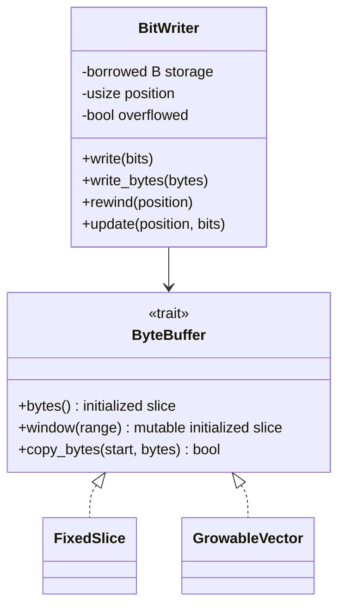
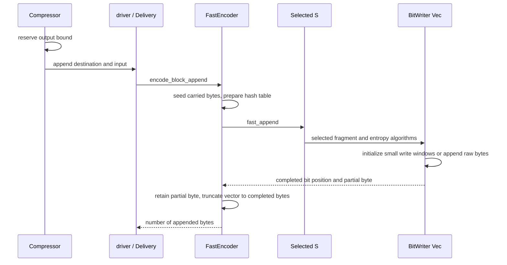

# Bit output and destination storage

`core::shared::bits` owns the private least-significant-bit-first bit writer.
Public vector, slice and streaming APIs retain the same output and error contracts;
no storage trait, bit position or SIMD token appears in those APIs.

## Ownership and dispatch

`BitWriter<'a, B>` borrows initialized storage through the private `ByteBuffer`
trait. Its default type is `[u8]`. Fast one-shot vector output specializes it for
`Vec<u8>`; entropy and command helpers are generic over that storage type. These
are static specializations, with no trait-object calls in the bit-writing loop.

`Compressor` reserves the one-shot vector bound before entering the driver. For
non-flush fast blocks, `Delivery::encode` selects `FastEncoder::encode_block_append`
for append destinations. The encoder seeds its carried bytes after the existing
prefix and checks conversion of that offset into a bit position. The retained
`Kernels::fast_append` entry passes its selected token through `S::vectorize` to
the same q0/q1 algorithms used by the slice path.

Fast slice output still uses the fixed writer when the destination meets its
fragment reservation. Other destinations, flushes, and greedy/HQ output use
retained scratch and the existing delivery logic. Sessions retain undelivered
suffixes; failed one-shot appends roll back to the caller's original length.

## Byte and lifetime invariants

A word write accepts at most 56 bits and touches eight initialized bytes. It
preserves the partial first byte and clears the higher bits and following bytes.
No storage implementation reads uninitialized capacity. Both implementations use
safe Rust borrows and slice operations.

The fixed buffer refuses a range outside its length. The writer sets its overflow
flag and preserves its existing position-advance behavior, allowing the encoder to
report the failure at its normal boundary. `set_byte(usize::MAX, ...)` also sets
that flag without overflowing index arithmetic.

The vector buffer initializes write windows in batches ending at a 256-byte
boundary, capped by existing capacity when that capacity covers the requested
range. Allocation and initialization live in an outlined cold helper, leaving
only the bounds check in each symbol write. This avoids a resize for every symbol.
Raw-byte writes copy any already
initialized portion and use `Vec::extend_from_slice` for the remaining bytes,
avoiding a zero-fill before copying an uncompressed block. Rewinds and header
updates operate on initialized bytes already emitted. After a fragment, padding
is truncated and the encoder retains the unfinished byte for the next fragment.

## Verification and known gaps

Unit tests compare growing and fixed storage across bit/byte boundaries, rewinds,
updates, prefixes, large raw writes and invalid byte indices. Fast-fragment tests
compare both destinations across consecutive blocks and every host backend,
including independent-fragment kernels. Integration tests and AFL compare full
streams with C, and exercise append rollback and exact-sized slice behavior.

Direct growing output currently serves fast one-shot appends. Greedy/HQ output
and I/O adapters retain their existing scratch or fixed-buffer delivery paths.
