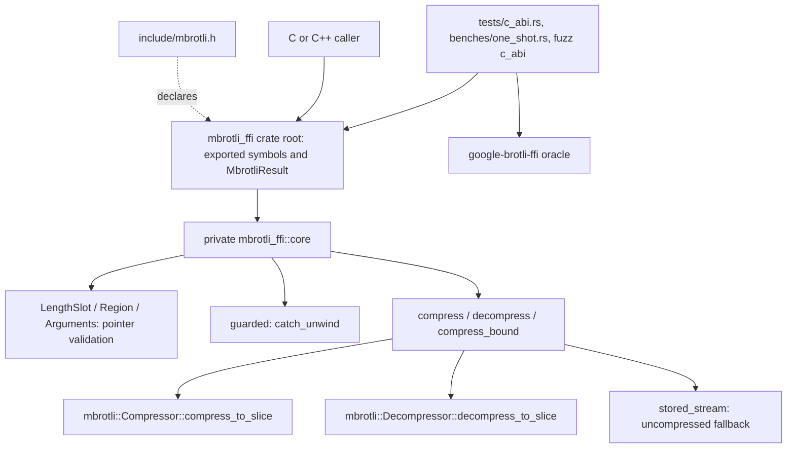
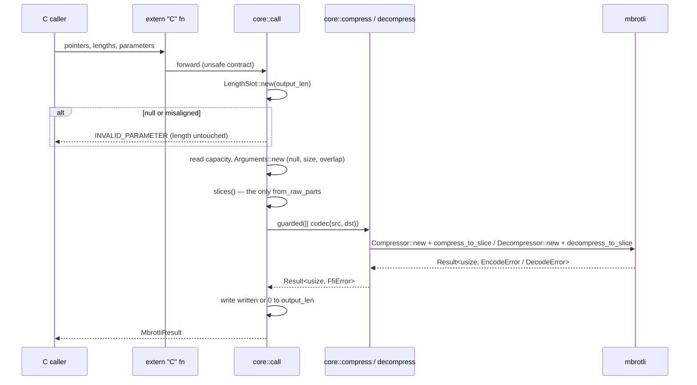
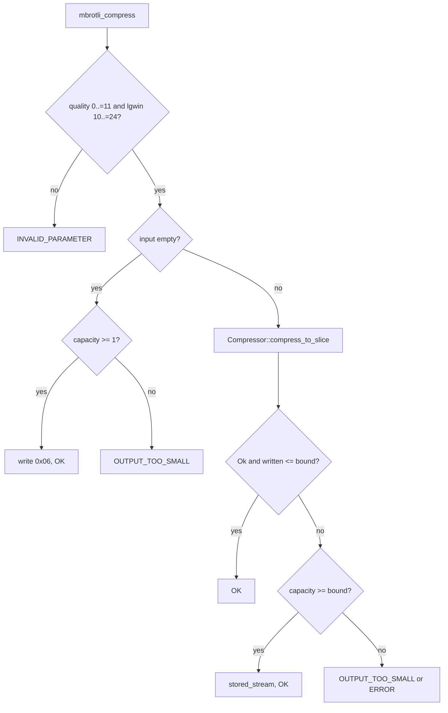

# C ABI (`mbrotli-ffi`)

`mbrotli-ffi` is a separate workspace crate that exports mbrotli's one-shot
codecs to C. It builds `libmbrotli_ffi` as a `cdylib` and a `staticlib` (plus
an `rlib` for its Rust tests) and ships the declarations in
`mbrotli-ffi/include/mbrotli.h`. It depends on `mbrotli` with `std`,
`compression` and `decompression`, and adds no codec logic of its own beyond
reproducing two special cases of Google's one-shot encoder.

## Module and ownership boundaries



The crate root owns only the ABI surface: the `#[repr(C)]` `MbrotliResult`
enum and three `#[unsafe(no_mangle)] extern "C"` functions with their contract
documentation. Everything else is in the private `core` module, which owns the
one `unsafe` pointer-to-slice conversion, the panic guard, parameter
conversion, the private `thiserror` error `FfiError`, and its reduction to a
status code. mbrotli's `src/` stays free of `unsafe`; every `unsafe` block is in
this crate, each with a `// SAFETY:` comment.

## Public API surface

| C | Rust | Behaviour |
| --- | --- | --- |
| `mbrotli_result` | `MbrotliResult` (`#[repr(C)]`, `c_int`-sized) | `MBROTLI_OK = 0`, `MBROTLI_INVALID_PARAMETER = 1`, `MBROTLI_OUTPUT_TOO_SMALL = 2`, `MBROTLI_ERROR = 3` |
| `mbrotli_compress` | `unsafe extern "C" fn` | One complete stream; `quality` `0..=11`, `lgwin` `10..=24` (RFC 7932 windows only) |
| `mbrotli_decompress` | `unsafe extern "C" fn` | Exactly one complete stream; standard and RFC 9841 large windows |
| `mbrotli_compress_bound` | safe `extern "C" fn` | Google's `BrotliEncoderMaxCompressedSize`; `0` on overflow |

`*output_len` is capacity on entry and bytes written on return: the count on
`MBROTLI_OK`, and `0` on every other status except a null or misaligned
`output_len`, which is never written.

`mbrotli_compress` is byte-identical to `BrotliEncoderCompress(quality, lgwin,
BROTLI_MODE_GENERIC, ...)`. That holds because `compress_to_slice` declares
the input length as the size hint, as the C one-shot API does, and because
`core::compress` reproduces the two places where the C one-shot API does not
simply return its streaming encoder's bytes:

- an empty input is the single byte `0x06`, whatever the window;
- a stream longer than the bound, or one that does not fit in an output of at
  least the bound, is replaced by `MakeUncompressedStream`'s stored stream.

## Control and data flow



Each call builds its codec, runs it and drops it, so no state is shared between
calls or threads. SIMD dispatch is mbrotli's: the backend is detected once per
codec construction, which happens once per call here, never per block.

## Compression decision logic



The bound is `input_len + 2 + 4 * (input_len >> 14) + 4` (`2` for empty
input). The stored stream is a 10-bit window header and empty metadata block
(`0x21 0x03`), one uncompressed meta-block per 2^24 bytes with a 3- or 4-byte
header using the fewest length nibbles, and an empty last meta-block (`0x03`).
It never exceeds the bound, so an output of `mbrotli_compress_bound` bytes
always succeeds.

## Error propagation

```mermaid
classDiagram
    class FfiError {
        <<private, thiserror>>
        NullLength
        MisalignedLength
        NullBuffer
        OversizedBuffer
        Overlap
        Quality
        Window
        Config(ConfigError)
        Encode(EncodeError)
        DecodeConfig(DecodeConfigError)
        Decode(DecodeError)
        Panic
    }
    class MbrotliResult {
        <<public, repr C>>
        Ok
        InvalidParameter
        OutputTooSmall
        Error
    }
    FfiError ..> MbrotliResult : From&lt;&FfiError&gt;
```

Argument and parameter failures map to `InvalidParameter`; `EncodeError` or
`DecodeError::OutputTooSmall` to `OutputTooSmall`; everything else, including
corrupt, truncated or trailing compressed input and a caught panic, to
`Error`. Codec errors are kept as `#[from]` sources inside `FfiError`, but only
the status code crosses the ABI.

## Invariants

- **Pointer validation before any dereference.** `output_len` must be
  non-null and aligned before it is read or written. Buffers may be null only
  with a zero length; lengths above `isize::MAX` or ending past the address
  space are refused; input, output and the `output_len` slot must be pairwise
  disjoint, since `&[u8]` and `&mut [u8]` may not alias. Empty buffers become
  empty slices regardless of their pointer.
- **Undetectable misuse remains undefined.** Dangling or too-short buffers,
  and concurrent access by another thread, are the caller's contract.
- **No unwinding into C.** `catch_unwind` wraps each codec call; the closure
  is `AssertUnwindSafe` because the only state it can leave half-updated is
  the output buffer, whose contents are unspecified after any failure.
- **Output contents after failure.** Unspecified, except that
  `MBROTLI_OUTPUT_TOO_SMALL` from `mbrotli_decompress` leaves the decoded
  prefix in the full buffer.
- **Decoding stops at the first failure it meets.** A stream that is corrupt
  or truncated only after the point where the output fills up returns
  `MBROTLI_OUTPUT_TOO_SMALL`; telling it apart from a valid stream would mean
  decoding past the buffer into nowhere. A larger buffer then yields
  `MBROTLI_ERROR`. Google's one-shot decoder reports both cases as its single
  error result.

## Verification

- `mbrotli-ffi/src/core.rs` unit tests: region validation and overlap,
  parameter ranges, panic guard, status mapping and error sources, stored
  headers at every nibble boundary, stored streams up to 2^24 + 1 bytes, the
  fallback and the bound.
- `mbrotli-ffi/tests/c_abi.rs`: byte identity with `BrotliEncoderCompress`
  for qualities 0–11 at windows 10/16/22/24 on text, binary, incompressible,
  one-byte and empty inputs; identical accept/reject at capacities between the
  stream and the bound; bound equality with `BrotliEncoderMaxCompressedSize`;
  round-trips through both decoders; every rejected argument; concurrent calls;
  and that the header's enumerators match `MbrotliResult`.
- `fuzz/afl` target `c_abi` (see [fuzzing](fuzzing.md)).
- `mbrotli-ffi/benches/one_shot.rs`: both one-shot APIs on identical inputs,
  validated for identity and round-trip before timing.

## Known gaps

- Large-window compression (`lgwin` 25–30, which `BrotliEncoderCompress`
  accepts) and compression modes other than generic are not exposed.
- No streaming, dictionary or codec-reuse API: every call constructs its
  codec, which costs about a quarter of a quality-9 compression of a 280 KiB
  input compared with a reused `Compressor`.
- On aarch64, clang contracts the C oracle's floating-point multiply-adds into
  FMA instructions, so Google's qualities 10–11 can differ from mbrotli on
  rare inputs; built with `-ffp-contract=off` the C library agrees. The tests
  and the fuzz target skip that comparison there for the input that triggers
  it.
- There is no `no_std` build: the crate needs `std` for `catch_unwind`, the
  system allocator and runtime SIMD detection.
