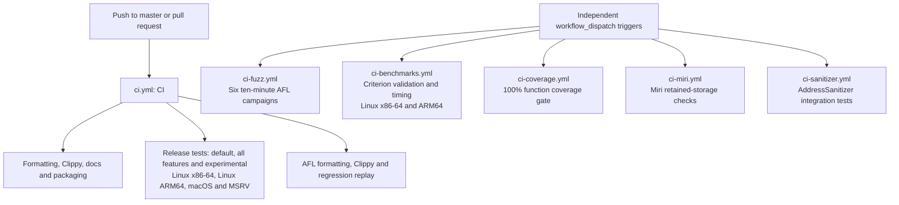

# Continuous integration

The workflows separate routine validation from expensive checks. All check out
the vendored submodules recursively and preserve the same test commands and
runner matrices used before the split.

`CI` runs on pushes to `master` and on pull requests. Its test matrix executes
stable Rust on all three operating-system runners and Rust 1.89 on Linux
x86-64. The separate AFL package keeps its lint checks and committed regression
replay in this automatic workflow.

Each heavy workflow runs only when individually dispatched. Select the desired
workflow in the GitHub Actions tab and use **Run workflow**, or run, for example,
`gh workflow run ci-benchmarks.yml --ref <branch>`. Dispatching one workflow does
not start the others.

| Workflow | Checks |
| --- | --- |
| `ci-benchmarks.yml` — CI Benchmarks | Criterion validation and timing on Linux x86-64 and ARM64. |
| `ci-fuzz.yml` — CI Fuzz | Six bounded AFL campaigns. |
| `ci-coverage.yml` — CI Coverage | Function coverage and HTML report. |
| `ci-miri.yml` — CI Miri | Interpreter checks for retained storage. |
| `ci-sanitizer.yml` — CI AddressSanitizer | AddressSanitizer integration tests. |

Fuzz campaigns fail when they save a crash or
hang; coverage fails below 100% function coverage. Fuzz findings, Criterion
results and the HTML coverage report are uploaded even when their job fails.
There is no scheduled workflow.

## Known gaps

- Heavy checks require an explicit dispatch; ordinary pushes and pull requests
  do not provide coverage, interpreter, sanitizer or fuzz-campaign evidence.
- Bounded fuzz campaigns do not replace longer runs, and benchmark timings on
  shared runners are smoke-check results rather than stable performance evidence.
