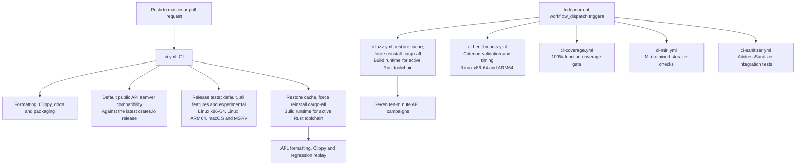

# Continuous integration

Routine validation runs automatically; expensive checks run on manual dispatch.
All workflows check out the vendored submodules recursively.

`CI` runs on pushes to `master` and on pull requests. Its test matrix executes
stable Rust on all three operating-system runners and Rust 1.89 on Linux
x86-64. The separate AFL package keeps its lint checks and committed regression
replay in this automatic workflow.

The `semver` job uses `obi1kenobi/cargo-semver-checks-action@v2` to check only
`mbrotli` against its latest published crates.io release, using stable Rust.
It selects `default-features` to enforce the default public API's compatibility
contract without imposing it on experimental APIs, which may change in patch
releases. The development-only C FFI crate is excluded by selecting `mbrotli`.
Semver violations fail the job when the package version does not include the
required bump. The action installs the checker and manages its baseline cache.

Both AFL jobs force reinstall the pinned runner with
`cargo install cargo-afl --version 0.18.2 --locked --force`. The Cargo cache can
restore the executable without the bundled `cargo-afl-common` AFL++ sources or
the runtime for the active Rust compiler. An ordinary install skips an already
installed version, leaving configuration unable to copy the missing sources.
Forced installation restores the dependencies and rebuilds the executable with
the current runner's source paths.

The jobs then run `cargo afl config --build --force` before testing or building
targets. Explicit configuration rebuilds the runtime; `--force` also permits a
runtime built by a fresh install. Configuration failure stops the job before
regression replay or campaigns.

Each heavy workflow runs only when individually dispatched. Select the desired
workflow in the GitHub Actions tab and use **Run workflow**, or run, for example,
`gh workflow run ci-benchmarks.yml --ref <branch>`. Dispatching one workflow does
not start the others.

| Workflow | Checks |
| --- | --- |
| `ci-benchmarks.yml` — CI Benchmarks | Criterion validation and timing on Linux x86-64 and ARM64. |
| `ci-fuzz.yml` — CI Fuzz | Seven bounded AFL campaigns. |
| `ci-coverage.yml` — CI Coverage | Function coverage and HTML report. |
| `ci-miri.yml` — CI Miri | Interpreter checks for retained storage. |
| `ci-sanitizer.yml` — CI AddressSanitizer | AddressSanitizer integration tests. |

Fuzz campaigns fail when they save a crash or
hang; coverage fails below 100% function coverage. Fuzz findings, Criterion
results and the HTML coverage report are uploaded even when their job fails.
There is no scheduled workflow.

## Known gaps

- Heavy checks require an explicit dispatch; ordinary pushes and pull requests
  do not provide coverage, interpreter, sanitizer or fuzz-campaign evidence.
- Bounded fuzz campaigns do not replace longer runs, and benchmark timings on
  shared runners are smoke-check results rather than stable performance evidence.
