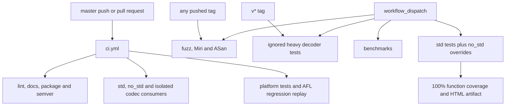

# Continuous integration

Workflow definitions live in [`.github/workflows/`](../.github/workflows/).
All checkouts include vendored submodules. Local commands are in
[development](../docs/development.md).

## Triggers and checks

| Workflow | Trigger | Scope |
| --- | --- | --- |
| `ci.yml` | Push to master, pull request | Formatting, Clippy, docs, packaging, API compatibility, feature checks, tests and AFL replay |
| `ci-coverage.yml` | Manual | Std and no_std function coverage; 100% gate and HTML report |
| `ci-benchmarks.yml` | Manual | Criterion validation and timing on Linux x86-64 and ARM64 |
| `ci-fuzz.yml` | Every tag, manual | Bounded AFL campaigns in stable and experimental profiles |
| `ci-miri.yml` | Every tag, manual | Retained-storage checks and pure Rust decoder goldens |
| `ci-sanitizer.yml` | Every tag, manual | AddressSanitizer integration tests |
| `ci-decompressor-heavy.yml` | `v*` tag, manual | Actual 25–30-bit history and counters beyond 4 GiB in four decoder profiles |

Routine tests cover Linux x86-64, Linux ARM64 and macOS, with an MSRV 1.89 job.
All-features builds activate `no_std`; separate std checks retain I/O, parallel
and framing coverage. Alloc-only jobs also compile `thumbv7em-none-eabi`.
Consumer scripts check available imports and imports that must fail.

The semver job compares the default `mbrotli` API with the latest published
release. Experimental APIs and the development-only C FFI crate are outside
that gate. A violation requires a sufficient package version bump.

## AFL execution and artifacts

AFL jobs cache Cargo downloads/tools but disable target caching: instrumented
builds can use CPU-specific instructions. Each job force-installs the pinned
`cargo-afl` and runs `cargo afl config --build --force` to restore its sources
and runtime for the current compiler.

Campaign runners configure direct core dumps before starting AFL. Target-specific
seed selection uses generated corpora or committed lifecycle, framing and parallel
regressions. Base decoder targets run in both feature profiles; custom targets
require `experimental`.

Saved crashes or hangs fail the job. Findings are archived as tar.gz and uploaded
when present, including after failures; this preserves AFL filenames with colons.
Regression replay does not start a campaign or require host core-dump configuration.

## Coverage and limitations

Coverage cleans workspace profiles first, then accumulates a std workspace run
with explicit experimental, diagnostics and profiling features plus a no_std
unit/API run. Both use test optimization level 1 and `CARGO_INCREMENTAL=1` to keep
coverage code generation consistent. The report enforces 100% function coverage;
HTML rendering and upload run even if tests or the gate fail.

There is no scheduled workflow. Each manual dispatch starts only its selected
workflow. Ordinary branches do not run heavy tools; coverage and benchmarks
always require explicit dispatch. Bounded fuzz campaigns and shared-runner timings
provide limited evidence, not exhaustive verification or stable speed guarantees.
