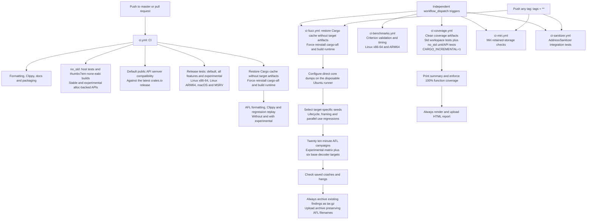
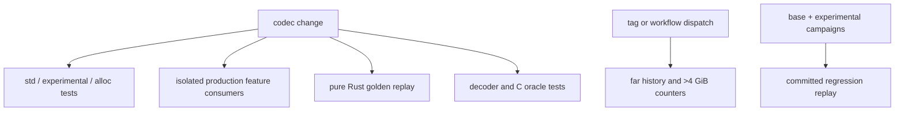

# Continuous integration

The `no-std` CI job compiles stable and experimental alloc-backed APIs for
`thumbv7em-none-eabi` and executes host tests without default features.
All-features checks exercise the `no_std` override; an explicit std feature set
also receives Clippy checks. Coverage uses explicit std features so I/O,
parallel compression, framing, and instrumentation remain covered. A second
all-features unit and `tests/no_std.rs` run accumulates the no_std overrides
into the same report without clearing the std coverage profiles.

Routine validation runs automatically. Fuzz campaigns, Miri and AddressSanitizer
also run on every pushed tag, including names containing `/`; all three retain
manual dispatch. Benchmarks and coverage remain manually dispatched.
All workflows check out the vendored submodules recursively.

`CI` runs on pushes to `master` and on pull requests. Its test matrix executes
stable Rust on all three operating-system runners and Rust 1.89 on Linux
x86-64. The separate AFL package keeps its lint checks and committed regression
replay in this automatic workflow. Both Clippy and AFL replay run without
default features, then with `experimental` enabled. Tag-triggered and manual fuzz
campaigns build the full experimental matrix and repeat the six base decoder
targets without experimental features. `decode_roundtrip` uses the encoder's
`seeds/params` in both profiles, covering generated valid C streams at Q0–Q11.

The `semver` job uses `obi1kenobi/cargo-semver-checks-action@v2` to check only
`mbrotli` against its latest published crates.io release, using stable Rust.
It selects `default-features` to enforce the default public API's compatibility
contract without imposing it on experimental APIs, which may change in patch
releases. The development-only C FFI crate is excluded by selecting `mbrotli`.
Semver violations fail the job when the package version does not include the
required bump. The action installs the checker and manages its baseline cache.

Both AFL jobs disable workspace target caching with `cache-targets: false`.
`cargo-afl` 0.18.2 adds `-C target-cpu=native`, including to build scripts, so
compiled artifacts can require instructions absent from a later hosted runner.
The `v1-afl-no-targets` cache prefix excludes older archives containing these
artifacts; registry and installed-tool caching remain enabled. Every job builds
the fuzz package and its dependencies for its current CPU.

Both AFL jobs force reinstall the pinned runner with
`cargo install cargo-afl --version 0.18.2 --locked --force`. The Cargo cache can
restore the executable without the bundled `cargo-afl-common` AFL++ sources or
the runtime for the active Rust compiler. An ordinary install skips an already
installed version, leaving configuration unable to copy the missing sources.
Forced installation restores the dependencies and rebuilds the executable with
the current runner's source paths.

The jobs then run `cargo afl config --build --force` before testing or building
targets. Explicit configuration rebuilds the runtime; `--force` also permits a
runtime built by a fresh install. Configuration failure stops the job before
regression replay or campaigns.

Before a fuzz campaign, the disposable Ubuntu runner sets
`kernel.core_pattern=core` with `sudo sysctl -w`. Hosted images may pipe dumps to
an external crash handler, which makes AFL abort during startup because delayed
crash notifications can be mistaken for timeouts. Direct core dumps preserve
AFL's crash checking; the workflow does not bypass that check. Regression replay
in `ci.yml` does not start the fuzzer and needs no host configuration.

CI uses the same seed selection as `fuzz/afl/campaign.sh` for its seven
targets. Lifecycle, framing, and parallel campaigns start from their own
`regressions/<target>` directories. Lifecycle inputs describe command sequences;
the parameter-header corpus used by compression targets can instead produce
expensive sequences that exceed AFL's initial seed timeout. Dictionary and
serialized dictionary targets use their respective prepared corpora; differential
and streaming targets use `seeds/params`.

After a campaign, the job still fails on saved crashes or hangs. Regardless of
prior step success, it archives an existing findings directory to
`fuzz/afl/findings.tar.gz` and uploads that file with ZIP compression disabled
because it is already compressed. The tar archive preserves the complete tree,
including queue, crash, and hang filenames containing colons, which
`upload-artifact` refuses as individual files. If setup failed before findings
were created, archiving skips the missing directory and upload reports no file.

Coverage first cleans previous workspace coverage artifacts, then runs the
locked, all-feature workspace tests at test optimization level 1. The test step
explicitly sets `CARGO_INCREMENTAL=1`, overriding the `CARGO_INCREMENTAL=0`
exported by [rust-cache](https://github.com/Swatinem/rust-cache#cache-details).
With incremental compilation disabled, the compiler infers automatic cross-crate
inlining for small functions; enabling it disables that inference (see the
[compiler's implementation](https://doc.rust-lang.org/stable/nightly-rustc/src/rustc_mir_transform/cross_crate_inline.rs.html)).
The non-incremental coverage build has reported called public APIs as uncovered,
including calls through opaque function pointers. The explicit step setting
keeps CI and the documented local command in the same compilation mode without
requiring nightly compiler flags or changing production annotations.

Incremental mode is enabled for code generation; the preceding coverage cleanup
still prevents stale workspace profiles and binaries from contributing to the
report. A separate report step prints a summary and enforces the unchanged 100%
function threshold. HTML rendering and artifact upload run even when tests or
the gate fail.

Each heavy workflow can be individually dispatched. Select the desired
workflow in the GitHub Actions tab and use **Run workflow**, or run, for example,
`gh workflow run ci-benchmarks.yml --ref <branch>`. Dispatching one workflow does
not start the others. Pushing any tag additionally starts fuzz, Miri and
AddressSanitizer; pushing a `v*` tag also starts the decoder heavy suite.

| Workflow | Checks |
| --- | --- |
| `ci-benchmarks.yml` — CI Benchmarks | Criterion validation and timing on Linux x86-64 and ARM64. |
| `ci-fuzz.yml` — CI Fuzz | Eighteen bounded AFL campaigns; every tag or manual dispatch. |
| `ci-coverage.yml` — CI Coverage | Function coverage and HTML report. |
| `ci-miri.yml` — CI Miri | Interpreter checks for retained storage and decoder goldens; every tag or manual dispatch. |
| `ci-sanitizer.yml` — CI AddressSanitizer | AddressSanitizer integration tests; every tag or manual dispatch. |
| `ci-decompressor-heavy.yml` — Decoder heavy verification | Large history and counters in four profiles; `v*` tags or manual dispatch. |

Fuzz campaigns fail when they save a crash or
hang; coverage fails below 100% function coverage. Fuzz findings, Criterion
results and the HTML coverage report are uploaded even when their job fails.
There is no scheduled workflow.

## Known gaps

- Ordinary branch pushes and pull requests do not run the heavy interpreter,
  sanitizer or fuzz campaigns. Tags trigger those checks; coverage and benchmarks
  still require explicit dispatch.
- Bounded fuzz campaigns do not replace longer runs, and benchmark timings on
  shared runners are smoke-check results rather than stable performance evidence.

## Decoder verification

The ordinary std/experimental/alloc matrix runs decoder tests alongside encoder
regressions. The check job runs isolated feature consumers. Miri replays pure
Rust golden fixtures in both feature profiles; ASan includes decoder format,
I/O and serialized dictionary tests. The fuzz workflow selects stable decoder
targets both with and without experimental features and custom targets only
with the feature. `ci-decompressor-heavy.yml` explicitly runs ignored release
checks for actual 25–30-bit history and cumulative output beyond 4 GiB in all
four profiles (bounded output, under 3 GiB history).

The ordinary check job also runs `scripts/check_codec_features.py`: isolated
production consumers cover all codec combinations in std/no_std and experimental
modes, including imports rejected when the owning codec is disabled. Existing
no_std jobs explicitly select both codec features; the heavy decoder workflow
selects only `decompression` so its fixtures exercise encoder-independent builds.
See the [codec feature specification](codec-features.md) for the gate diagram.
