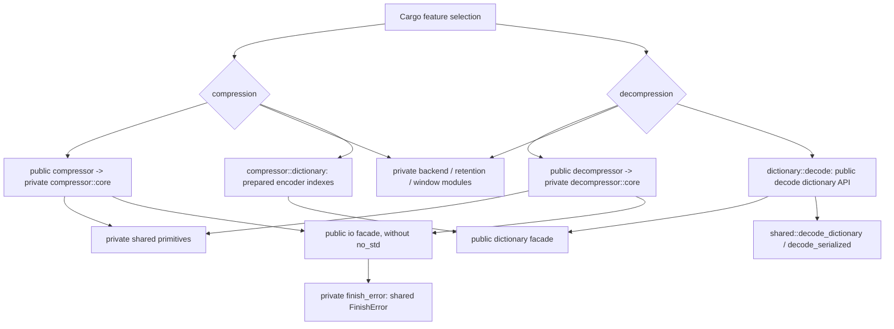
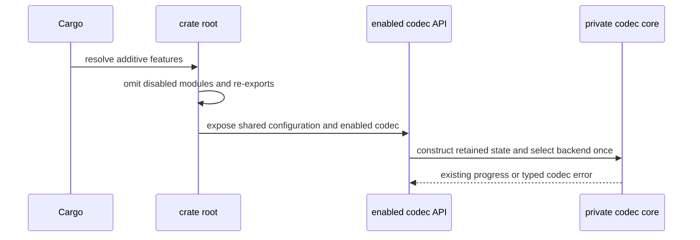
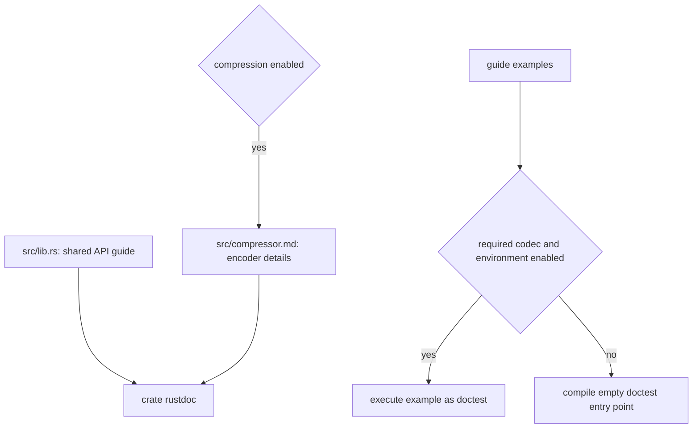
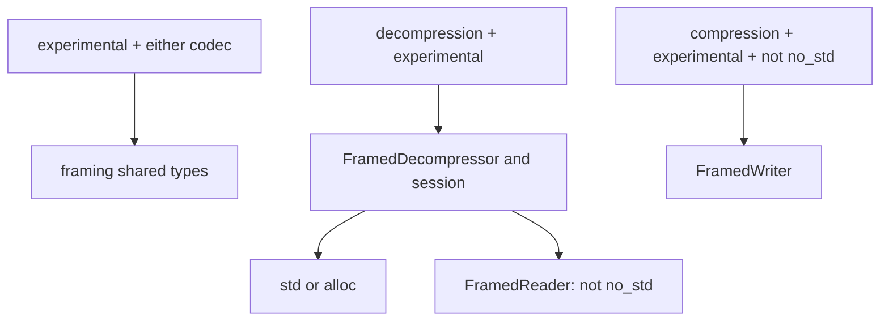

# Codec feature boundaries

The default features are `std`, `compression`, and `decompression`. Codec
selection is independent of the execution environment: a consumer disabling
defaults selects `std` or `no_std` and the codecs it needs. Cargo feature
unification is additive; another dependency can enable a disabled codec.

| Feature | Public surface |
| --- | --- |
| `compression` | `compressor`, encoder configuration/errors/sessions, prepared and experimental serialized dictionaries, encoder I/O, parallel compression and experimental framing |
| `decompression` | `decompressor`, decoder configuration/errors/sessions, decode-only dictionaries and borrowed decoding views, decoder I/O |
| Either codec | `Backend`, `RetentionPolicy`, `Window`, `WindowEncoding`, `ConfigError`, and the `dictionary` facade |
| Either codec without `no_std` | `io` facade and its shared `FinishError` |
| Neither codec | No codec API or private codec primitives |

`no_std` still overrides std-only adapters, parallel encoding, the framing writer, and
profiling. `experimental` and `diagnostics` do not enable a codec. With
compression disabled, `ConfigError` retains only window-validation variants.
`DictionaryRef::Prepared` and its conversion exist only with both codecs;
`DictionaryRef::DecodeOnly` works without compression. Serialized dictionary
parsing for decoding needs `decompression,experimental`, while the public
serialized dictionary builder and encoder indexes need `compression,experimental`.

Common types are defined once and re-exported at their existing crate-root and
compressor paths. `compressor::dictionary` retains its decoder re-exports when
both codecs are enabled. `Window`'s conversion into private encoder parameters
remains inside compressor configuration. The common modules contain no encoder
state or decoder state. Public configuration errors use `thiserror`; codec
errors and their source chains retain their existing behavior.

The shared primitive tree also follows codec gates. Bit output, entropy
construction, match scanning, hash tables, command generation and ring storage
compile only for compression. Decode dictionary storage and parsing compile
only for decompression. Wire tables and dictionary words compile for either
codec; borrowed transforms compile for decoding or experimental encoding.
Built-in decoder transform tables are absent without decompression.

There is no new runtime branch, dispatch point, state transition, allocation or
byte-processing behavior. Existing SIMD selection remains at codec construction,
and streaming state machines and dictionary lifetime rules are unchanged.
`fearless_simd` and `thiserror` are optional production dependencies activated
by either codec; environment features forward to them only when enabled. Tests
explicitly enable dependency std support for host-only oracle builds.

`scripts/check_codec_features.py` checks independent consumers for all codec,
environment and experimental combinations, including imports that must fail.
Examples and benchmarks declare their required codecs; integration tests gate
their own codec and individual cross-codec cases. Decoder tests retain C and
wire fixtures when compression is disabled. The existing dictionary consumer
check explicitly enables both codecs, and CI no_std profiles do likewise.

Known gaps: active codecs still require a selected math provider (`std` or
`no_std`). There is no allocator-free codec or runtime codec switch.

## Crate documentation

`src/lib.rs` owns the shared user guide: API choices, workspace reuse, both I/O
adapter pairs, caller-scheduled parallel encoding, decoder limits, and feature
selection. The overview remains visible with either codec disabled, and states
which features its APIs require. Hidden doctest gates run examples only when the
required codec and environment are enabled; decoder examples use a valid empty
Brotli member so they also execute without compression.
Method and type links resolve through rustdoc to the current build's API pages.
When an API is disabled, its link points to the guide's feature-selection section.

`src/compressor.md` supplements the guide with quality selection, Large Window,
and prepared dictionaries only when `compression` is enabled.

## Experimental framing gates

`framing` exists with `experimental` and either codec. Its neutral types have no
encoder dependency. `decompression,experimental` enables `FramedDecompressor`,
one-shot results and incremental sessions in both std and alloc builds.
`FramedReader` additionally requires the absence of `no_std`. The writer and its
configuration retain their compression/experimental/std gates. Isolated consumer
probes cover the facade and both codec-specific types.

