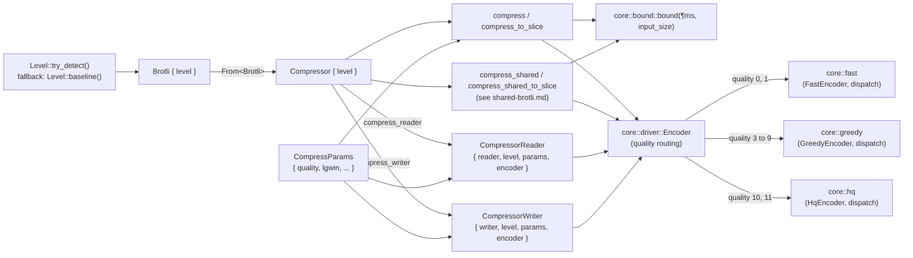
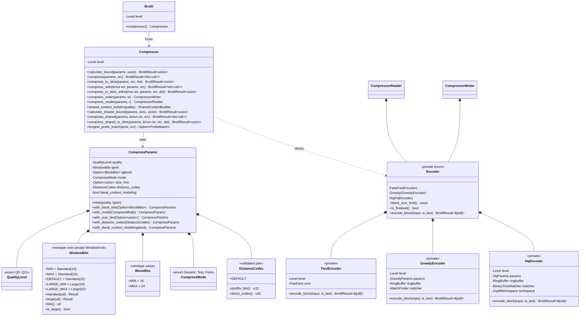
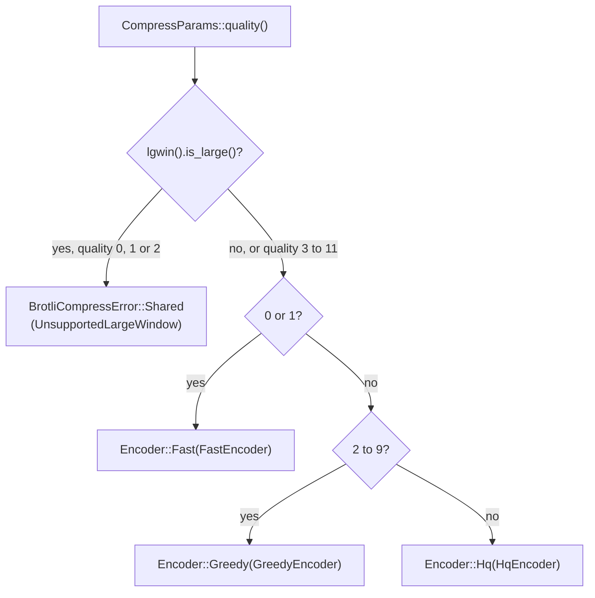
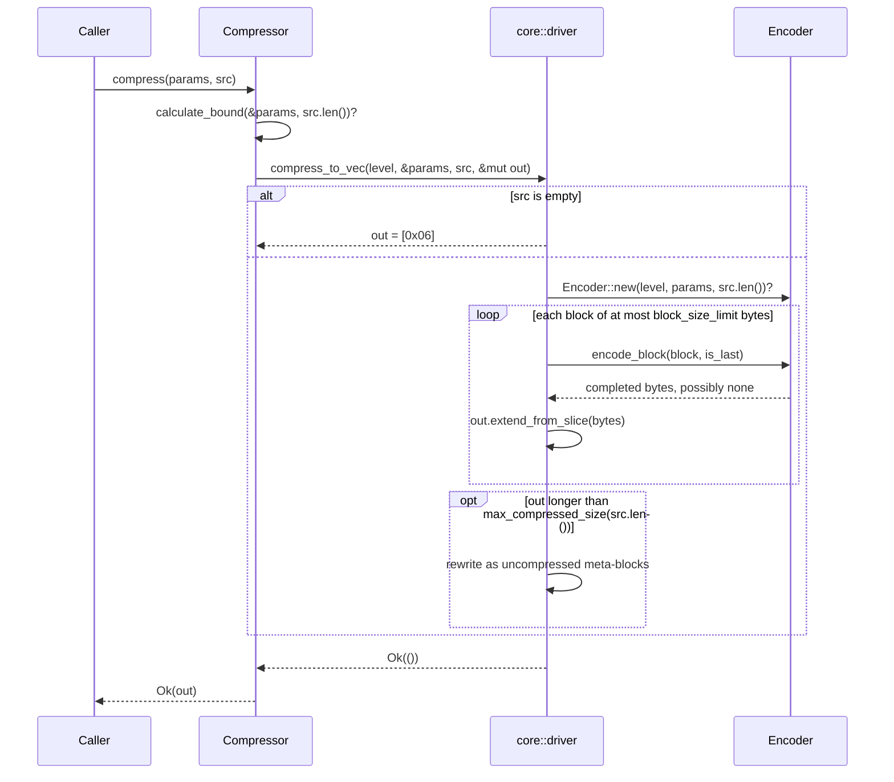
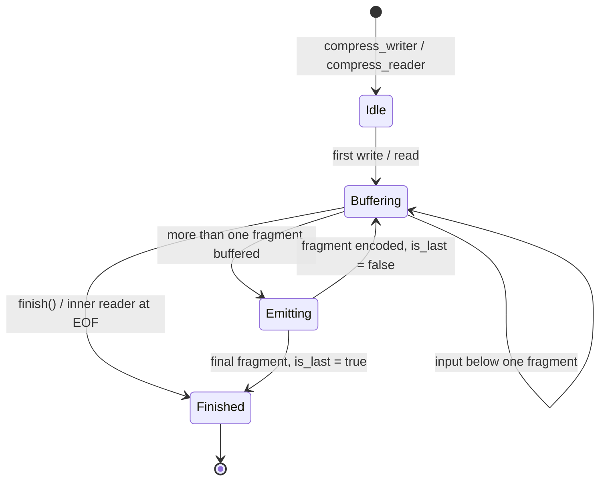
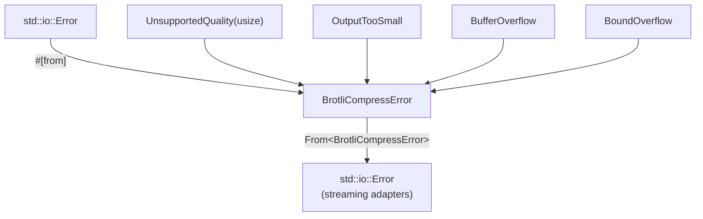
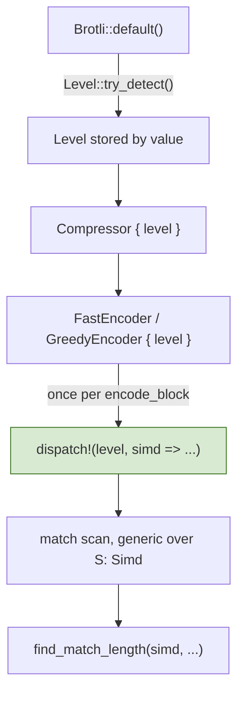
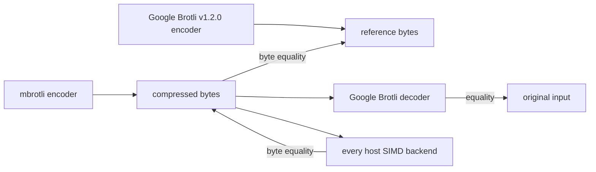

# Compressor Subsystem

Scope: `src/lib.rs`, `src/compressor/`, and the private `src/compressor/core/`
tree, excluding the three encoder cores themselves, which have their own
specifications in [fast-encoder.md](fast-encoder.md),
[greedy-encoder.md](greedy-encoder.md) and [hq-encoder.md](hq-encoder.md).
This document describes the code as it stands; the [Known gaps](#known-gaps) section lists what is not implemented.

## 1. Core mechanics

The subsystem is a three-layer funnel:

1. **Level layer** — `Brotli` resolves the SIMD instruction set once, at
   construction time, and carries it as a `Copy` value.
2. **API layer** — `Compressor` pairs that level with per-call
   `CompressParams` and exposes bound calculation, one-shot to a `Vec`,
   one-shot into a caller slice, and the two streaming adapters — plus a
   workspace-reusing variant of each one-shot entry point, and the RFC 9841
   shared-context entry points that mirror the first three and take a
   caller-owned `SharedContext` as a separate argument. Those are described in
   [shared-brotli.md](shared-brotli.md).
3. **Core layer** — private `compressor::core` modules own the algorithms:
   `core::bound` computes the compressed-size upper bound, `core::driver`
   routes a quality to an encoder and owns what both encoders share,
   `core::shared` holds the primitives they all use, `core::fast` owns the
   quality 0 and 1 encoders, `core::greedy` owns the quality 2 to 9 encoder,
   and `core::hq` owns the quality 10 and 11 encoder. Each encoder performs the
   single runtime SIMD dispatch itself.

SIMD selection is hoisted out of every inner loop: it is decided once in
`Brotli::default()` and then threaded, by value, into whatever implementation
runs. Nothing below the API layer re-detects features.

### 1.1. Ownership and data flow



### 1.2. Type relationships



### 1.3. Parameter validation

Every parameter type makes the invalid state unrepresentable rather than
validating at use:

- `WindowBits` is only constructible through `TryFrom<usize>`, which
  rejects anything outside `10..=24`, or through the `MIN` / `MAX` / `DEFAULT`
  associated constants.
- `BlockBits` is the same shape over `16..=24`, the range the reference
  accepts for an explicitly requested input block size.
- `DistanceCodes` is only constructible through `TryFrom<(u32, u32)>`, which
  enforces all three rules the format imposes on a postfix / direct pair. The
  reference silently falls back to `(0, 0)` for a pair it cannot express; here
  that pair cannot be built, so the fallback is unreachable from outside.
- `QualityLevel` and `CompressMode` are closed enums; `QualityLevel`'s
  `TryFrom<usize>` rejects values above eleven.
- `WindowBits` carries the header a stream uses as well as its size, over a
  private `WindowKind` enum. `WindowBits::standard` validates `10..=24` for the
  RFC 7932 header and `WindowBits::large` validates `10..=62` for the RFC 9841
  one; there is no other way to build a value, so no window can exist that no
  header can express. The two ranges overlap on purpose — a large window is
  asked for by name, never reached by widening a number.

Quality routing happens once, when a `core::driver::Encoder` is built:



Every quality the format defines now routes to an encoder. The large-window
branch runs in `core::driver` before the empty-input shortcut, and again in
`FastEncoder::new` and `GreedyParams::new` for the streaming adapters, which
build their encoder lazily and so never reach the driver's check. See
[shared-brotli.md](shared-brotli.md) §5.

### 1.4. The size hint

`CompressParams::size_hint` is the one parameter whose default differs between
the one-shot and the streaming entry points, and it does so deliberately:
`BrotliEncoderCompress` sets the reference's `BROTLI_PARAM_SIZE_HINT` to the
input length, while `BrotliEncoderCompressStream` leaves it at zero. This crate
reproduces both. Qualities four and five choose their match finder from the
hint, so for those a stream compressed through the adapters can differ from the
same input compressed in one shot unless the caller sets the hint explicitly.
Every other quality ignores it.

## 2. One-shot compression path

`compress` and `compress_to_slice` reproduce the reference one-shot entry
point, including its two special cases.



The block size is the encoder's, not the caller's: `1 << lgwin` for the fast
qualities, `1 << lgblock` for the greedy ones. A greedy `encode_block` may
return nothing, because that encoder buffers input across blocks until a
meta-block is worth emitting.

`compress_to_slice` follows the same flow but writes each completed block into
the caller's buffer, and reports `OutputTooSmall` instead of growing. The fast
path encodes straight into that buffer when it has room for a whole
reservation, which removes a copy of the output.
Because the uncompressed fallback can still shrink the result, a buffer that
was too small for the compressed form is only fatal once the fallback has been
ruled out.

## 3. Streaming paths

Both adapters own a `core::driver::Encoder` created lazily on first use, so a
quality no encoder implements surfaces as an `io::Error` at the first write or
read rather than at construction.



The writer only emits a block once **more** than a whole block is buffered, so
the final call always has data for the terminating meta-block.
`CompressorWriter::finish` writes the final meta-block and returns the inner
writer.

### 3.1. Flushing

`Write::flush` compresses everything buffered and brings the stream to a point
a decoder can read up to, without terminating it. It mirrors the reference's
`BROTLI_OPERATION_FLUSH` in two steps:

1. the buffered input is written out as a meta-block even where the encoder
   would rather keep gathering — `force_flush` in `EncodeData`, and a short
   non-final fragment on the fast path;
2. the stream is realigned to a byte boundary by
   `core::shared::bits::inject_byte_padding`, which emits the six-bit empty
   metadata block `ISLAST = 0, MNIBBLES = 3, reserved = 0, MSKIPBYTES = 0` and
   zero-fills to the next byte — `InjectBytePaddingBlock`.

Nothing is emitted when there was no buffered input *and* the stream was
already aligned, which is what makes a redundant flush free. A flush before any
input still emits the stream header, because the header is what has to be
realigned.

```mermaid
sequenceDiagram
    participant Caller
    participant Writer as CompressorWriter
    participant Enc as core::driver::Encoder
    participant Sink as inner writer

    Caller->>Writer: write(bytes)
    Writer->>Writer: buffer; emit whole blocks
    Caller->>Writer: flush()
    Writer->>Enc: flush_block(pending)
    Enc->>Enc: encode_data(is_last = false, force_flush = true)
    Enc->>Enc: inject_byte_padding(last_bytes, last_bytes_bits)
    Enc-->>Writer: meta-block + padding
    Writer->>Sink: write_all, then flush
    Note over Sink: everything written so far now decodes
    Caller->>Writer: finish()
    Writer->>Enc: encode_block(rest, is_last = true)
    Enc-->>Writer: final meta-block
    Writer->>Sink: write_all, then flush
```

Flushing trades ratio for latency and the trade is steep: it ends a meta-block
early, so the entropy codes are built from less data, and it adds the padding
block. Measured over 256 KiB of text, flushing every kibibyte grew the stream
2.4 times at quality 11 and seventeen times at quality 1. A handful of flushes
is close to free. See [`docs/api_benchmarks.md`](../docs/api_benchmarks.md) §2.

The reader has no flush: it is pulled rather than pushed, so a caller that
wants a decodable prefix simply stops reading.

### 3.2. Reuse across calls

`CompressWorkspace` retains one `core::driver::Encoder` between one-shot calls,
behind `core::driver::EncoderCache`. On each call the cache resets the retained
encoder when the new parameters resolve to the same shape and rebuilds it
otherwise, so reuse can never change a byte:

| Encoder | What "same shape" means |
| --- | --- |
| `Fast` | `FastEncoder::matches` — same quality, fragment limit and stream header |
| `Greedy` | `GreedyParams` compares equal, which covers the matcher, both block sizes and the distance alphabet |
| `Hq` | `HqParams` compares equal |

The reset keeps every allocation and puts back only the state a stream owns.
Two details make it correct rather than merely cheap:

- `MatchFinder::prepare` may clear only the slots a short one-shot input
  reaches, which is sound solely on a table that was never stored into. The
  reset replays that same sweep over the previous stream's own bytes — still in
  the ring buffer at that moment — which clears exactly what that stream could
  have dirtied. Where the previous stream swept the whole table instead, the
  encoder records that the table is dirty and the next `prepare` takes the full
  path.
- The ring buffer is not wiped. A backward reference is bounded by the distance
  to the start of the stream, so the next stream never reads further back than
  it has written; `write` re-establishes the head bytes, the tail mirror and
  the sentinel, and `clear_margin` re-zeroes the margin.

A call that fails part-written drops the retained encoder rather than resetting
it, so no half-written stream can reach the next call.

What it is worth depends on how much the quality allocates, and it is the whole
of the quality 7 to 9 gap: on a 256-byte payload a retained workspace is 16.6
times faster at quality 9 and 1.13 times at quality 1, and the win falls away
once compression dominates the call. See
[`docs/api_benchmarks.md`](../docs/api_benchmarks.md) §1.

The reader keeps one byte more than a block buffered, which is what lets it
tell a full block apart from the last one. That makes its output identical to
the one-shot path for the same parameters, aside from the one-shot special
cases and the size-hint default described in section 1.4.

## 4. Error model



`BrotliCompressError` is `#[non_exhaustive]`. The conversion back into
`std::io::Error` unwraps a nested IO error rather than boxing it twice, so an
IO failure that entered through a streaming adapter comes back out with its
original kind.

Private encoder errors do not exist as a separate type: both encoders' only
failure modes are the ones above, and an internal buffer overflow is reported
through `BufferOverflow`, which no correct input can reach.

## 5. SIMD dispatch contract



Feature detection happens once per process, inside `Level::new()`. The
`dispatch!` macro is expanded exactly once per `encode_block` call — that is,
once per input block — and never per meta-block, command, match or vector.

## 6. Verification topology



| Test target | What it pins |
| --- | --- |
| `tests/differential_c.rs` | Byte identity with the pinned C encoder over structural and boundary corpora, every window size. |
| `tests/vendor_corpus.rs` | The same, over Google Brotli's own test data, including a multi-fragment 12 MiB input. |
| `tests/roundtrip.rs` | Independent decoder round-trip, determinism, and the compressed-size bound. |
| `tests/simd_backends.rs` | Byte identity between the scalar fallback and every SIMD backend the host supports. |
| `tests/streaming.rs` | Chunk-size independence, writer/reader agreement, one-shot equivalence. |
| `tests/randomized.rs` | Seeded property tests mixing literal runs, back-references and noise. |
| `tests/greedy_qualities.rs` | Byte identity for every parameter the greedy qualities react to: window, mode, size hint, block size, distance layout, context modelling. |
| Unit tests in `core::hq` and `core::shared::dictionary` | Layer-by-layer differential tests against four encoder-internal C functions, reached through `brotli-ffi/shim/`; see [hq-encoder.md](hq-encoder.md) §10. |

Qualities ten and eleven are capped at 64 KiB in the sweeps that exist to cover
input shapes, because their search costs about a hundred times what quality
nine's does in a debug build. The multi-fragment and streaming tests run them
unbounded; see [hq-encoder.md](hq-encoder.md) §10.1 for what that gives up.
| `fuzz/afl/` | AFL targets for the same oracles plus parameter rejection, seeded from the vendored Brotli test data; see [fuzzing.md](fuzzing.md). |

## Known gaps

- **No decoder.** Round-trip verification uses Google's C decoder from the
  `google-brotli-ffi` workspace crate.
- **Large window is refused below quality 3.** RFC 9841 Large Window Brotli is
  implemented for qualities 3 to 11, selected by `WindowBits::large`; see
  [shared-brotli.md](shared-brotli.md). Qualities 0, 1 and 2 report
  `SharedBrotliError::UnsupportedLargeWindow` rather than dropping the request,
  because all three may write distances through a code built for the RFC 7932
  alphabet. Retained history stops at 30 bits however wide the header declares,
  so the reference's `H35`, `H55` and `H65` match finders remain unreachable.
- **An attached prefix is refused below quality 5.** The reference compiles its
  compound-dictionary search only for the match finders qualities five and
  above select, and silently ignores the dictionary elsewhere; this crate
  refuses instead. See [shared-brotli.md](shared-brotli.md).
- **No serialized dictionary and no framing container.** The caller-owned
  `SharedContext` and its LZ77 prefix dictionaries are implemented, and the
  encoder consults them; see [shared-brotli.md](shared-brotli.md). The rest of
  RFC 9841 — serialized shared dictionaries with custom word and transform
  lists, and the framing container format — is not. Beyond an attached prefix,
  only Brotli's built-in static dictionary is used.
- **No shared streaming adapters.** `compress_shared` and
  `compress_shared_to_slice` are one-shot; a `SharedCompressorWriter` would
  have to hold the context's exclusive borrow for the life of the adapter,
  which is a separate API decision.
- **No stream offset.** The reference parameter that starts a stream at a
  non-zero position, and poisons the distance cache to match, is not exposed.
- **`Write::flush` does not terminate the stream.** It makes everything written
  so far decodable — see §3.1 — but `CompressorWriter::finish` still has to be
  called, and dropping the adapter discards buffered input and leaves the
  stream unterminated.
- **The workspace is one encoder deep.** `CompressWorkspace` retains exactly
  one encoder, so alternating between two parameter shapes rebuilds on every
  call. It is also not used by the streaming adapters, which build one encoder
  per adapter anyway.
- **No `Send`/`Sync` guarantees are documented** beyond what the fields imply.
