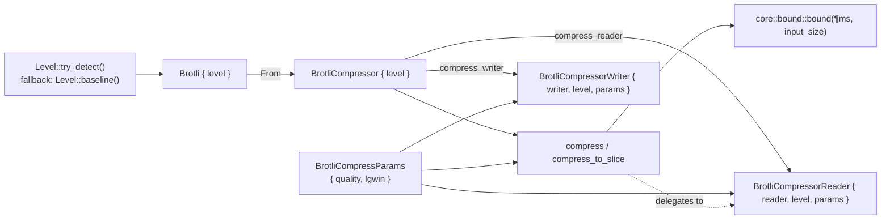
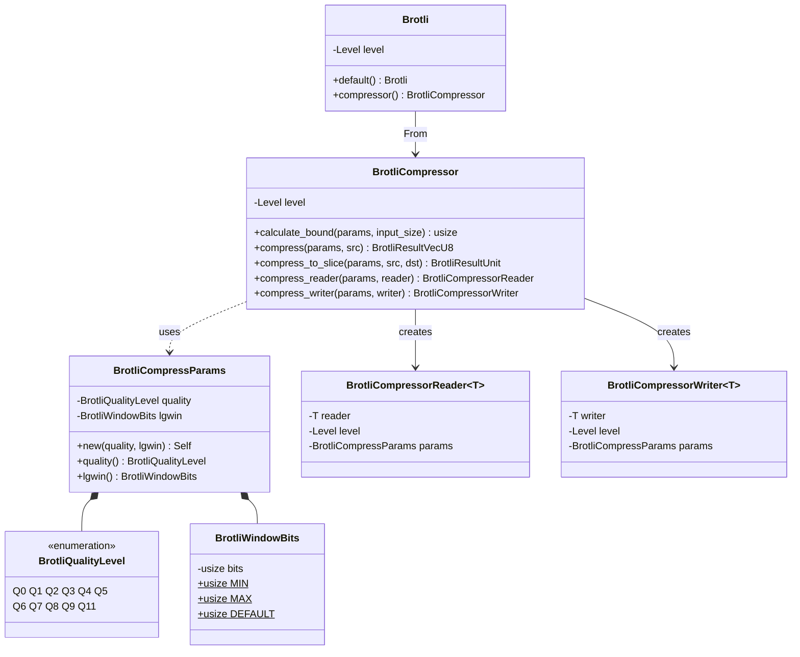
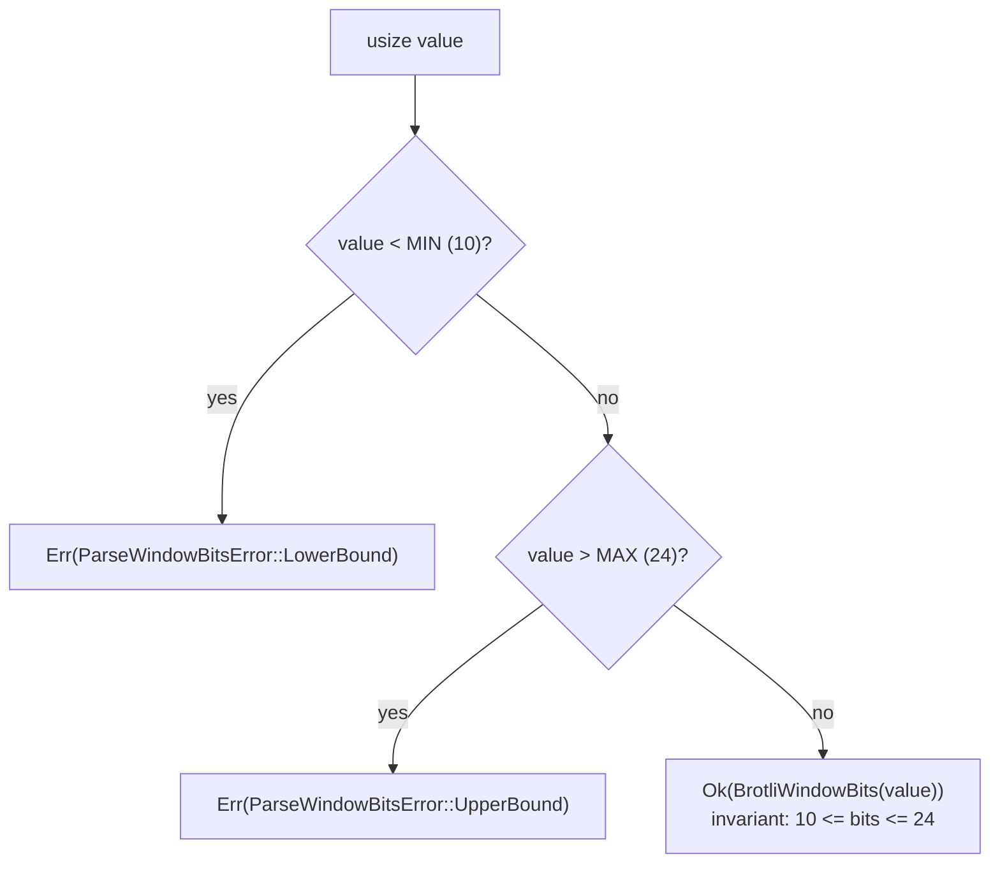
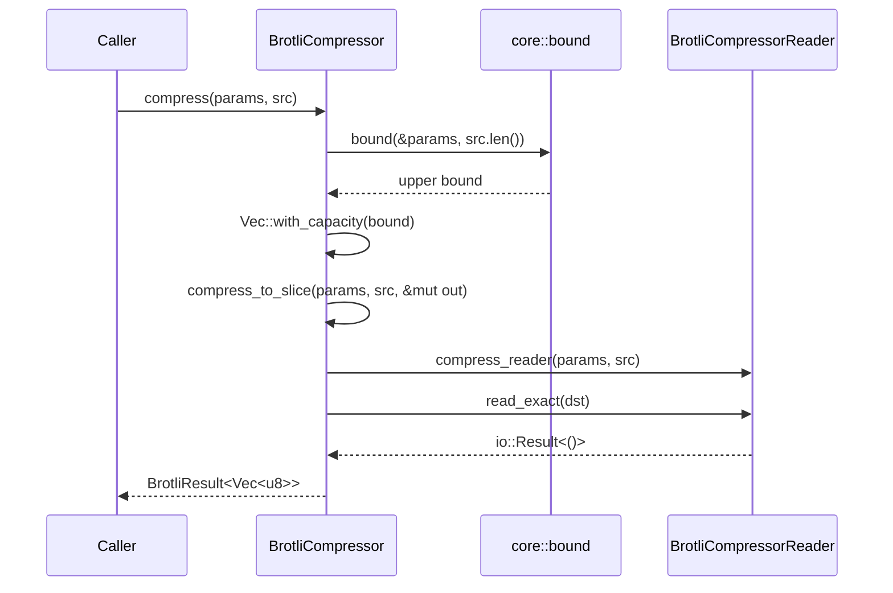
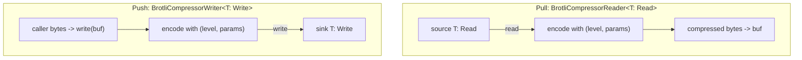
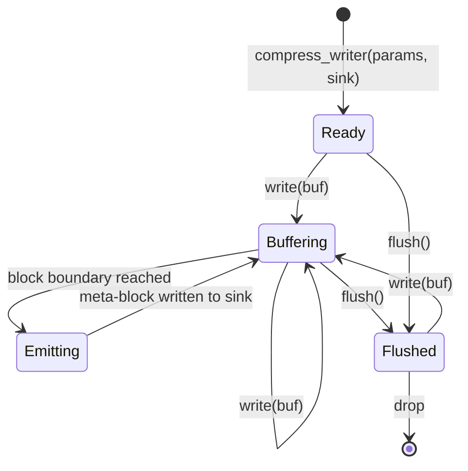
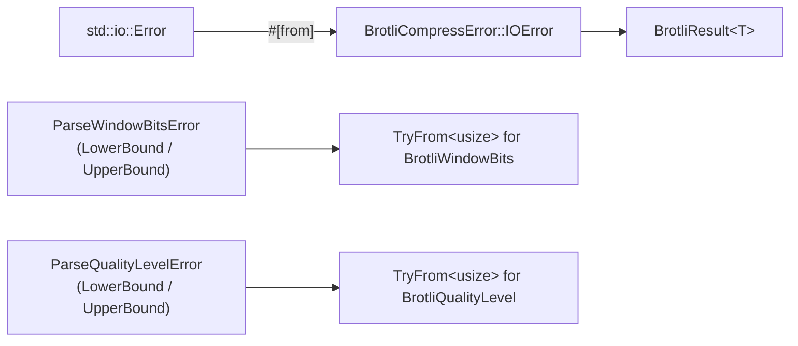
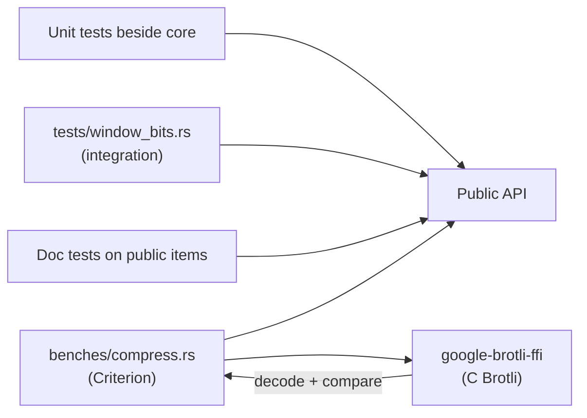

# Compressor Subsystem

Scope: `src/lib.rs`, `src/compressor/`, and the private `src/compressor/core/`
tree. This document describes the code as it stands; the encoder core itself is
not implemented yet, and the [Known gaps](#known-gaps) section lists exactly
which paths are still `todo!()`.

## 1. Core mechanics

The subsystem is a three-layer funnel:

1. **Level layer** — `Brotli` resolves the SIMD instruction set once, at
   construction time, and carries it as a `Copy` value.
2. **API layer** — `BrotliCompressor` pairs that level with per-call
   `BrotliCompressParams` and exposes four entry points: bound calculation,
   one-shot to a `Vec`, one-shot into a caller slice, and the two streaming
   adapters.
3. **Core layer** — private `compressor::core` modules own the algorithms. The
   only member today is `core::bound`, which computes the compressed-size
   upper bound used to size output buffers.

SIMD selection is deliberately hoisted out of every inner loop: it is decided
once in `Brotli::default()` and then threaded, by value, into whatever
implementation runs. Nothing below the API layer re-detects features.

### 1.1. Ownership and data flow

Every configuration type in the chain is `Copy`, so parameters are passed by
value and borrowed inputs (`&[u8]`) are never taken by ownership.

### 1.2. Type relationships

Conversions follow the standard traits rather than inherent constructors:
`From<Level>` for both `Brotli` and `BrotliCompressor`, `From<Brotli>` for
`BrotliCompressor`, `TryFrom<usize>`/`From<..> for usize` for the validated
scalar types, and `Default` for the canonical window size.

### 1.3. Parameter validation

`BrotliWindowBits` is a validated newtype: the format allows only
`10..=24`, and every constructor enforces it, so holding a value of the type is
proof the window size is legal. This is the invariant the encoder core is
allowed to assume.

`BrotliQualityLevel` is a closed enum instead of a validated integer, so no
runtime check is needed on the `BrotliQualityLevel -> usize` direction. The
reverse direction, `TryFrom<usize>`, is declared with
`ParseQualityLevelError` (`LowerBound`, `UpperBound`) but is not implemented
yet.

## 2. One-shot compression path

`compress` sizes an output buffer from the bound and then delegates to
`compress_to_slice`, which drives the reader adapter to fill the destination.
The reader adapter is therefore the single implementation point: the one-shot
API is a thin wrapper over the streaming path, not a second encoder.

## 3. Streaming paths

Both adapters are pull/push wrappers that own the underlying stream together
with the resolved SIMD level and the compression parameters. They implement the
standard `std::io` traits, so they compose with the rest of the ecosystem
without a bespoke streaming API.

Intended lifecycle of the writer adapter, which is the stateful one: input is
accumulated, meta-blocks are emitted as they close, and `flush` drains whatever
is buffered into the sink.

The reader adapter mirrors this in pull direction: it reads from the source
until it can produce output, then copies compressed bytes into the caller's
buffer, returning `Ok(0)` once the stream is finalized.

## 4. Error model

Public fallible APIs return `BrotliResult<T> = Result<T, BrotliCompressError>`.
`BrotliCompressError` is `#[non_exhaustive]` and built with `thiserror`; today
it has one variant, `IOError`, carrying `std::io::Error` through `#[from]` so
the source chain is preserved. `std::io` trait implementations keep their
required `io::Result` signatures, so streaming failures surface as `io::Error`
and are converted at the one-shot boundary.

The parse errors for the validated parameter types are separate, focused enums
and are not folded into the compression error: they are returned by the
conversions that produce the parameters, before any compression starts.

## 5. SIMD dispatch contract

- `Level::try_detect()` runs once in `Brotli::default()`; when detection fails
  the crate falls back to `Level::baseline()`, so there is always a correct
  path.
- The level is stored as a `Copy` field and moved into `BrotliCompressor` and
  then into each adapter. Nothing re-detects per block, per command, or per
  element.
- Dispatch on the level belongs at the top of the `core` layer; the chosen
  vector width is then passed down into the low-level routines. Baseline and
  SIMD paths must produce byte-identical output.
- No `fearless_simd` type appears in the public API surface; `Level` is only
  accepted through `From<Level>` conversions.

## 6. Verification topology

The benchmark feeds identical bytes, quality, window size, and API shape to
both implementations, validates every compressed stream by decoding it with the
C decoder before timing, and reports compressed size alongside throughput. It
currently probes this crate's compressor, detects the unimplemented panic, and
registers only the C benchmarks; the comparison enables itself once the core
lands.

## Known gaps

Unimplemented (`todo!()`) as of this revision:

| Location | Item |
| --- | --- |
| `src/compressor/core/bound.rs` | `bound(&params, input_size)` — compressed-size upper bound. Needs an overflow error rather than a panic. |
| `src/compressor/reader.rs` | `Read::read` for `BrotliCompressorReader` — the encoder pull path, which the one-shot API also depends on. |
| `src/compressor/writer.rs` | `Write::write` and `Write::flush` for `BrotliCompressorWriter` — the encoder push path. |
| `src/compressor/mod.rs` | `TryFrom<usize> for BrotliQualityLevel`. |

Design issues to resolve when the core lands:

- `BrotliCompressor::compress` builds `Vec::with_capacity(bound)` and passes it
  as `&mut [u8]`. Deref coercion yields a slice of length `0`, not `bound`, so
  the call cannot write into the reserved capacity. The one-shot path needs to
  either write through the capacity and set the length, or take a
  length-carrying destination.
- `compress_to_slice` uses `read_exact`, which requires the compressed output
  to be exactly `dst.len()` bytes and reports no written length. A slice-based
  API normally needs to return the number of bytes produced and to fail
  cleanly when the destination is too small.
- `BrotliQualityLevel` has no `Q10` variant, so quality 10 is not expressible;
  `Q11` maps to `11`.
- `BrotliCompressError` has only an `IOError` variant; encoder-level failures
  (overflow in the bound, unsupported parameters) still need typed variants.
