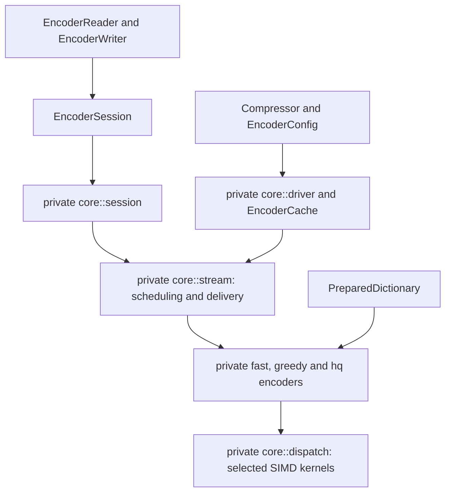
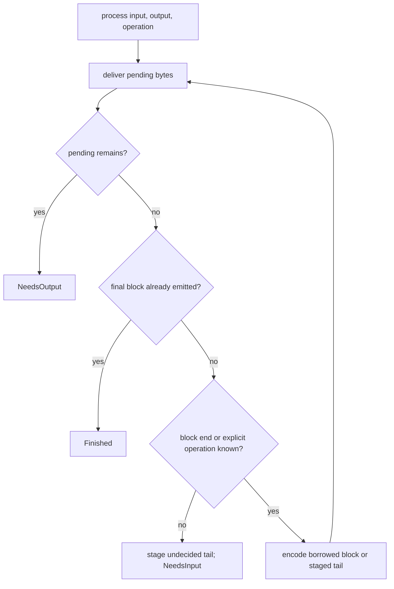

# Compressor

The public `compressor` module owns configuration, reusable codec state,
sessions, dictionaries and synchronous I/O. Private `core` modules own encoding
and state machines. See the [user guide](../docs/README.md) for usage.

## Boundaries and configuration



Validated configuration types enforce quality 0–11, standard windows 10–24,
large declarations 10–62, block bits 16–24 and legal distance parameters.
`Compressor::new` and `reconfigure` validate combinations. Large Window requires
quality 3 or higher; dictionary operations require quality 5 or higher.

`EncoderConfig::lower(size_hint)` builds private `CompressParams`. One-shot
operations declare the complete input length. Sessions and adapters use
`StreamConfig`: unknown size gives hint zero, while `InputSize::Exact` supplies
the declared length. The hint can change the quality 4/5 matcher selection.
Nonzero offsets require `experimental` and quality 2 or higher.

## Ownership and reuse

`Compressor` owns one `EncoderCache`, staging and pending-output storage. The
cache resets a compatible encoder and rebuilds it when its resolved shape changes:

| Family | Compatibility key |
| --- | --- |
| Fast | Quality, fragment limit and stream header |
| Greedy | Resolved parameters and match-finder variant; the size hint is retargeted |
| HQ | Resolved `HqParams` |

Reset clears logical stream state; retained bytes cannot authorize references
before the new stream's start. An encoding failure discards partial encoder state.
[Encoder workspace](encoder-workspace.md) specifies storage, accounting and reset.

`RetentionPolicy` runs after operations and session drop. `Aggressive` keeps
storage, `CurrentConfig` releases incompatible storage on reconfiguration,
`Bounded` releases it above its accounting ceiling, and `ReleaseAll` releases it
on completion. `trim` applies a policy immediately. Accounting includes owned
allocations and excludes caller output, shared dictionaries and allocator overhead.

```mermaid
stateDiagram-v2
    [*] --> Idle
    Idle --> Active: start
    Active --> Idle: drop session; retain completed or discard partial state
    Active --> Abandoned: forget session
    Abandoned --> Abandoned: operations return AbandonedSession
    Abandoned --> Idle: recover
```



Sessions borrow the compressor exclusively. `fork_empty` copies settings without
workspace; concurrent independent streams need separate compressors.

## One-shot and incremental flow

`compress` creates a Vec; `compress_into` appends and returns its new range.
Failure restores the destination's original length and prefix.
`compress_to_slice` reports `OutputTooSmall` instead of changing the encoding;
exact final length suffices, and failure may leave a partial prefix.
`max_compressed_size` supplies a conservative configuration-independent bound.

All serial paths use `core::stream::StreamState`. Complete input blocks are
borrowed directly when their end is known; only an undecided tail is staged.
A block is non-final only when something is known to follow it. Empty one-shot
input uses a validated allocation-free finalization path; see
[serial output identity](universal-encoding.md).



`Progress` reports exactly consumed input and produced output. Final output can
require multiple calls; `is_finished()` stays false until it has been delivered.
Completed sessions consume no further input. Failed sessions return `InvalidState`.
No-progress calls report `NeedsInput`, `NeedsOutput` or `Finished`.

`Process` accepts input without closing the stream. `Flush` emits accepted input
and byte padding, preserving the dictionary; an already aligned empty flush emits
nothing. `Finish` emits the last block. Frequent flushes can increase output size.
Equivalent configuration, dictionary, declared size, flush boundaries and offset
preserve bytes across APIs, chunk sizes, reuse and backends.

## I/O and finalization

`EncoderWriter` owns its sink and a cursor-addressed outbox bounded to 128 KiB.
Only `head..end` holds pending bytes. It drains before accepting new input, then
pumps the session into bounded spare space. Large writes may accept a prefix.

```mermaid
sequenceDiagram
    participant Caller
    participant Writer
    participant Session
    participant Sink
    Caller->>Writer: write(input)
    Writer->>Sink: drain pending output
    alt drain fails
        Writer-->>Caller: error; no input accepted
    else drain succeeds
        Writer->>Session: process input into bounded outbox
        Session-->>Writer: consumed and produced counts
        Writer->>Sink: attempt delivery
        Writer-->>Caller: accepted count; delivery error deferred if necessary
    end
    Caller->>Writer: try_finish
    loop until final output delivered
        Writer->>Session: Finish
        Writer->>Sink: drain
    end
    Writer->>Sink: flush
```

Short writes advance the cursor; `Interrupted` retries, `Ok(0)` becomes
`WriteZero`, and other errors preserve the exact unwritten suffix. A write never
both accepts caller input and returns an error. `try_finish` resumes after sink
errors; consuming `finish` returns the writer inside `FinishError` on failure.
Dropping an adapter performs no I/O or finalization.

`EncoderReader` owns its source and a cursor-addressed input buffer, writing
compressed bytes directly into the caller's slice. Empty reads have no side
effects; interrupted source reads retry. EOF switches to `Finish`. `into_parts`
returns the source and unaccepted read-ahead bytes.

## Dispatch and errors

Backend selection occurs when the compressor is built. The cache selects
`Selected<S>` kernels when creating an encoder; dispatch at block boundaries
passes the concrete SIMD token into inner loops. Feature detection and virtual
calls stay outside hot loops. `no_std` uses the compile-time backend.

`ConfigError`, `DictionaryError`, `EncodeError` and `SizeOverflow` separate
configuration, preparation, execution and size arithmetic failures. Public error
enums are non-exhaustive. Private core errors map into contextual high-level
variants; I/O conversion retains the original error as a source. SIMD types,
FFI and private implementation errors do not appear in public signatures.

## Verification and known gaps

Cross-API, C differential, lifecycle, retention, backend and I/O fault tests cover
these contracts; see [validation](../docs/correctness.md) and
[development checks](../docs/development.md).

- Only one encoder workspace is retained; alternating incompatible configurations
  can rebuild it on every operation.
- Encoder history is capped at 30 bits even for wider declarations.
- Serialized dictionaries, continuations and framing require `experimental`.
- C byte identity uses equivalent streaming settings; native C one-shot shortcuts
  are a different byte oracle.

[Parallel compression](parallel-compression.md) owns separate planning, staging
and assembly over private independent fragments. [Native decompression](decompressor.md)
is an independently selectable subsystem.
