# Compressor Subsystem

Scope: `src/lib.rs`, `src/compressor/`, and the private `src/compressor/core/`
tree, excluding the three encoder cores themselves, which have their own
specifications in [fast-encoder.md](fast-encoder.md),
[greedy-encoder.md](greedy-encoder.md) and [hq-encoder.md](hq-encoder.md).
This document describes the code as it stands; the [Known gaps](#known-gaps)
section lists what is not implemented.

## 1. Core mechanics

Five layers, each owning one idea:

1. **Configuration** — `EncoderConfig` and the validated values inside it. What
   holds for every stream, and nothing else. No input length, no offset, no
   dictionary, no buffer.
2. **The compressor** — `Compressor` owns a resolved SIMD level, a validated
   configuration, and every buffer the encoders need. Encoding takes `&mut self`.
3. **The dictionary** — `PreparedDictionary` is immutable RFC 9841 knowledge many
   compressors can borrow at once. It is not owned by a compressor.
4. **The session** — `EncoderSession` is the one incremental state machine. The
   `io` adapters are built on it; the one-shot entry points share its encoders
   and its parameter resolution.
5. **The core** — private `compressor::core` modules own the algorithms and the
   bitstream. Nothing from them escapes.

The public types are a redesign; the `core` tree is not. It is still written
against the encoders' own `CompressParams`, `QualityLevel`, `WindowBits` and
`BrotliCompressError`, which now live in the private `compressor::internal`
module. The public configuration *lowers* into those on the way down. Keeping
the two apart is what let the surface change without moving a byte of the
bitstream.

### 1.1. Module map

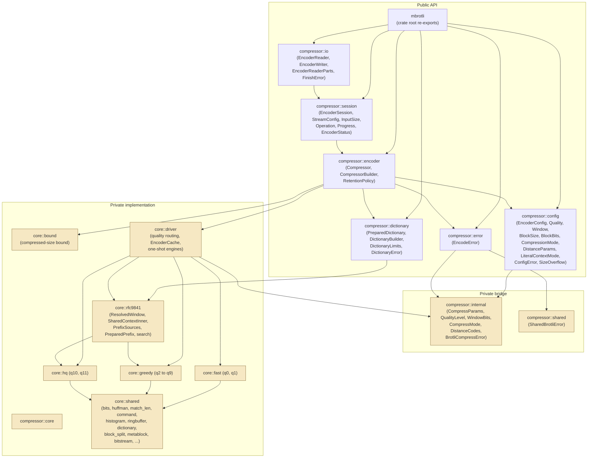

### 1.2. Type relationships

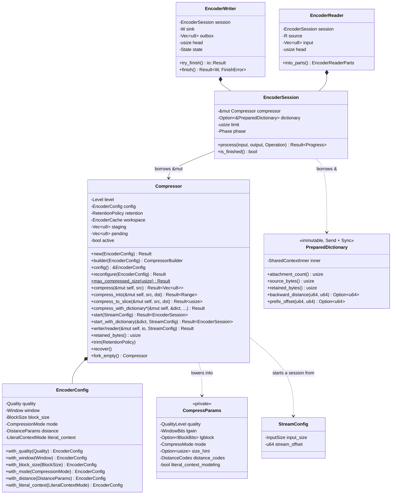

### 1.3. Where a value is validated

Each configuration value is a type that cannot hold what the format cannot
express, so the validation happens once, where the value is built. What one
value cannot know — whether it agrees with the others — is checked by
`Compressor::new` and `reconfigure`, which are the only places that see the whole
configuration.

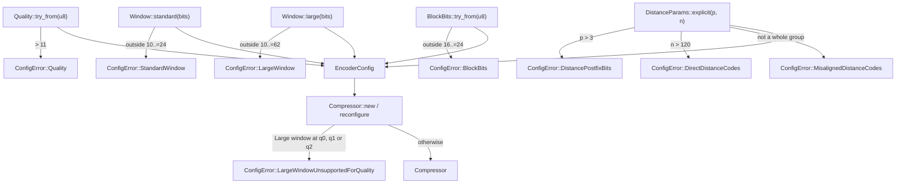

The reference silently drops a Large Window below quality three, because those
qualities may write distances through a code built for the RFC 7932 alphabet.
This crate refuses it instead, and refuses it before any input has been touched:
a stream that quietly stopped being a Large Window stream is invisible until a
decoder disagrees.

### 1.4. Lowering, and the size hint

`EncoderConfig::lower(size_hint)` produces the private `CompressParams` the
encoders take. The size hint is not part of the configuration — it is what one
*operation* knows about how much input is coming — so it arrives as an argument:

| Entry point | What it declares |
| --- | --- |
| `compress`, `compress_into`, `compress_to_slice` | `Some(src.len())`, which is what `BrotliEncoderCompress` sets `BROTLI_PARAM_SIZE_HINT` to |
| `start`, `writer`, `reader` | `Some(stream.input_size().hint())`, which is `0` for `InputSize::Unknown` — what `BrotliEncoderCompressStream` leaves it at |

Qualities four and five choose their match finder from the hint, so declaring
`InputSize::Exact(n)` is what makes a streamed stream reproduce the same input's
one-shot bytes.

## 2. The compressor and its workspace

`Compressor` owns a `core::driver::EncoderCache`: one retained encoder plus the
SIMD level it was built for. On each operation the cache resets the retained
encoder when the new parameters resolve to the same shape and rebuilds it
otherwise, so reuse can never change a byte:

| Encoder | What "same shape" means |
| --- | --- |
| `Fast` | `FastEncoder::matches` — same quality, fragment limit and stream header |
| `Greedy` | `GreedyParams` compares equal, which covers the matcher, both block sizes and the distance alphabet |
| `Hq` | `HqParams` compares equal |

Two details make the reset correct rather than merely cheap, and both predate
this redesign: `MatchFinder::prepare`'s partial sweep is replayed over the
previous stream's own bytes before the window is dropped, and the ring buffer is
not wiped because a backward reference is bounded by the distance to the start of
the stream. See [greedy-encoder.md](greedy-encoder.md).

A call that fails part-written drops the retained encoder rather than resetting
it, so no half-written stream can reach the next call.

### 2.1. Retention

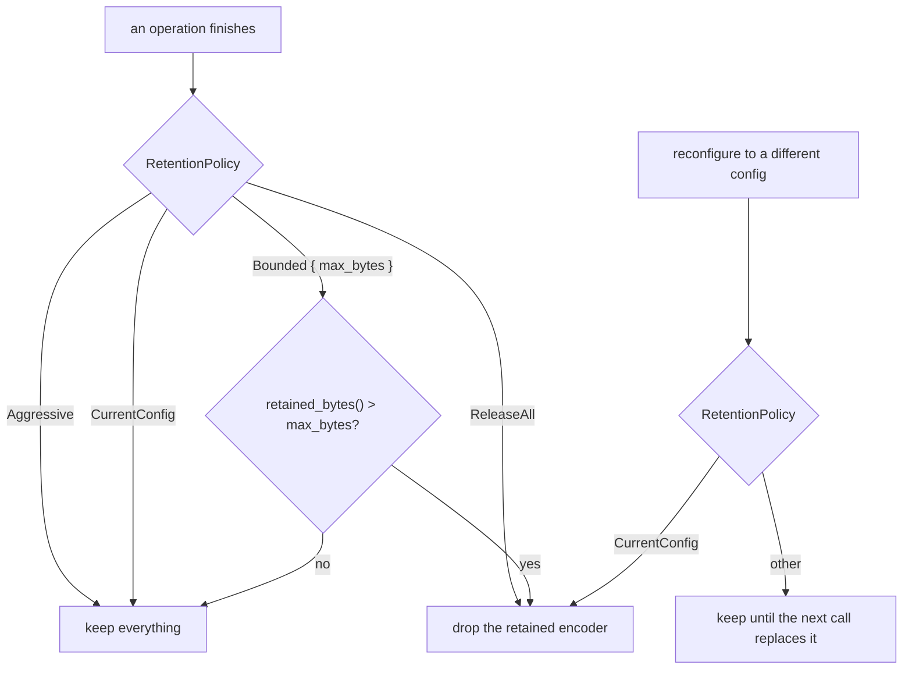

`retained_bytes` sums the staging buffers and the retained encoder's own
buffers — window, match finder, command and output storage — which each encoder
family reports for itself. `trim(policy)` applies a policy once without changing
the compressor's own.

### 2.2. Abandoned sessions

A session borrows the compressor exclusively, so nothing else can touch it while
one lives, and `Drop` cleans up. `std::mem::forget` can skip that `Drop`, which
is the one way a compressor can be left holding state no operation has cleaned
up. The compressor keeps an `active` flag for exactly that case.

```mermaid
stateDiagram-v2
    [*] --> Idle
    Idle --> Active: start() sets active = true
    Active --> Idle: session dropped, active = false
    Active --> Abandoned: mem::forget(session)
    Abandoned --> Abandoned: any operation returns AbandonedSession
    Abandoned --> Idle: recover()
```

A session that finished leaves its encoder retained, so the next stream of the
same shape reuses every allocation. One abandoned part-way drops the retained
encoder instead.

## 3. One-shot paths

`compress_into` is the primary entry point; `compress` is it with a fresh `Vec`.
Both reproduce the reference one-shot entry point, including its two special
cases.

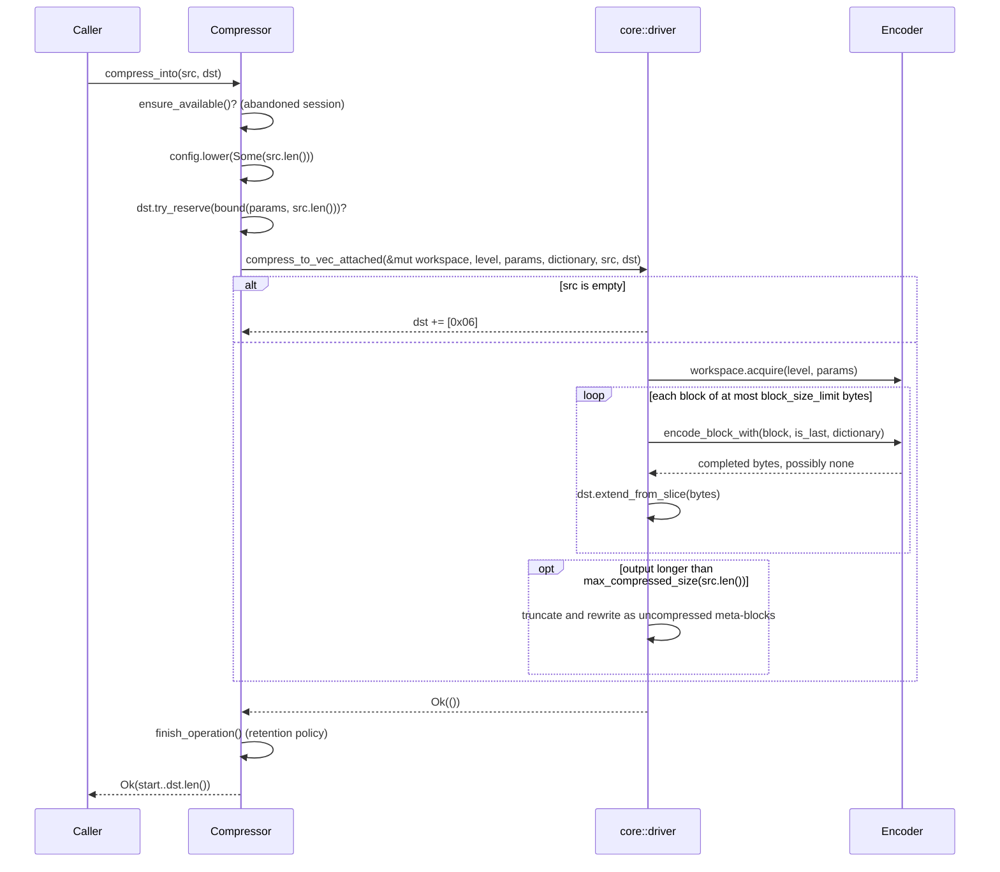

On failure `dst` is truncated back to the length it had, so whatever the caller
already had in it survives byte for byte.

`compress_to_slice` follows the same flow but writes each completed block into
the caller's buffer and reports `OutputTooSmall` instead of growing. Because the
uncompressed fallback can still shrink the result, a buffer that was too small
for the compressed form is only fatal once the fallback has been ruled out.

`Compressor::max_compressed_size` is an associated function, so it needs no
compressor. It is therefore the bound for the *loosest* configuration — a
ten-bit window at a quality that cuts its input at the window, which pays the
per-meta-block reservation most often — and a buffer sized by it fits whatever
the compressor is set to. The tighter, configuration-specific bound is what
`compress_into` reserves internally.

## 4. The session

`EncoderSession::process(input, output, operation)` is the whole streaming API.
It takes what it can, writes what it can, and reports exactly how much of each it
moved.

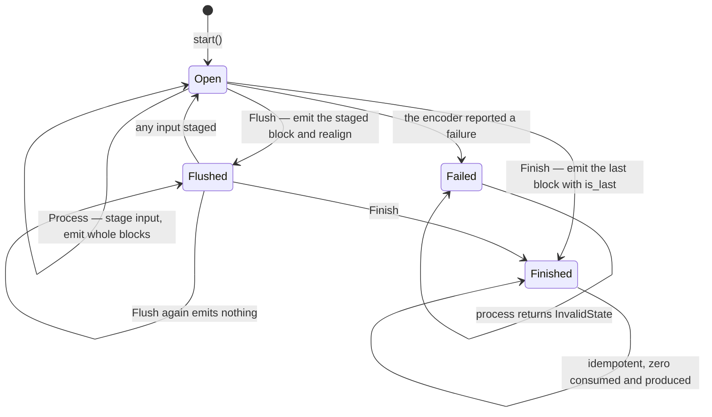

The loop inside one `process` call is:

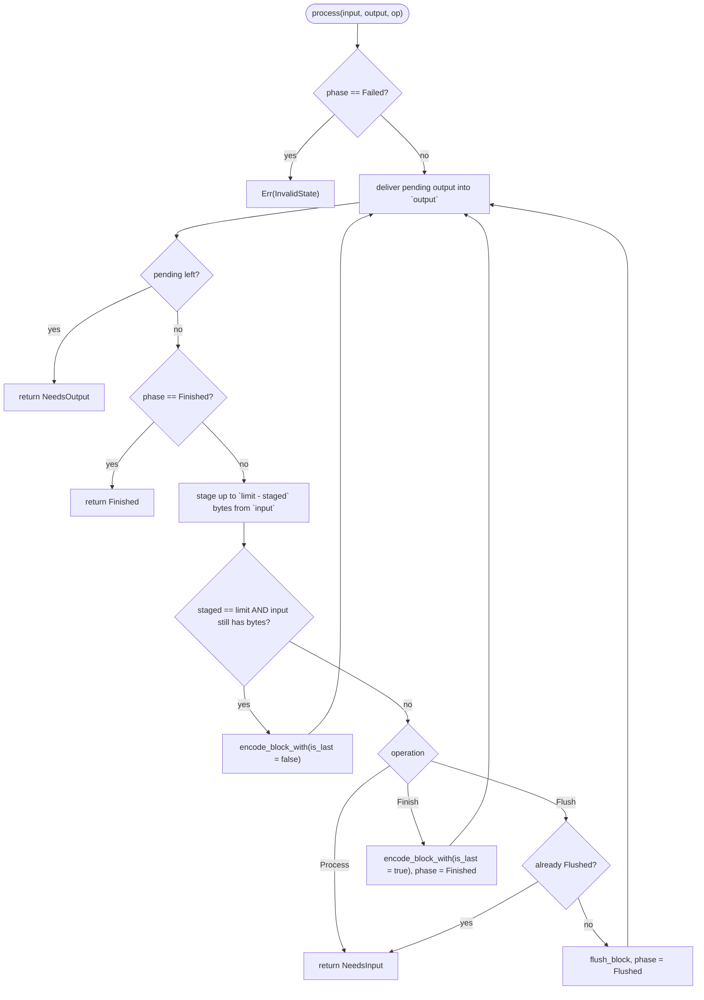

Two properties fall out of that shape:

- **A whole block is only encoded once something is known to follow it.** The
  session stages up to `limit` bytes and emits a non-final block only when the
  caller still has bytes in the same call. That is what keeps the last block of a
  stream the one carrying `is_last`, and therefore what makes a streamed stream
  reproduce the one-shot bytes for an input that is a whole number of blocks.
- **A call that moved nothing always says why.** Zero consumed and zero produced
  is only ever returned alongside `NeedsInput`, `NeedsOutput` or `Finished`, so
  no caller can spin.

Encoded bytes are copied straight into the caller's slice, and only what does not
fit is held in the compressor's `pending` buffer. A streaming path therefore pays
one copy — the one the borrow of the encoder's scratch forces — rather than two.

### 4.1. One-shot and streaming are not the same bytes

The reference's one-shot entry point applies two shortcuts its streaming entry
point does not: an empty input becomes a single byte, and a stream that grew is
rewritten as uncompressed meta-blocks. This crate reproduces both encoders
faithfully, so `compress` applies those shortcuts and a session does not. For
every other input, a session fed `InputSize::Exact` with no explicit flush
produces exactly the one-shot bytes — which `tests/streaming.rs` asserts across
every corpus and quality.

Byte identity with the pinned reference outranks internal uniformity here; see
§4 of the implementation specification's authority order.

### 4.2. Flushing

`Operation::Flush` mirrors `BROTLI_OPERATION_FLUSH` in two steps: the buffered
input is written out as a meta-block even where the encoder would rather keep
gathering, and the stream is realigned to a byte boundary by
`core::shared::bits::inject_byte_padding`. Nothing is emitted when there was no
buffered input *and* the stream was already aligned, which is what makes a
redundant flush free. A flush carries the attached dictionary, so the bytes after
one are still compressed against it.

Flushing trades ratio for latency and the trade is steep. Measured over 256 KiB
of text, flushing every kibibyte grew the stream 2.4 times at quality 11 and
seventeen times at quality 1.

## 5. The transactional writer

The old writer advanced encoder state before `write_all` had delivered the
resulting block, so a partial sink write followed by an error left no durable
cursor for the unwritten suffix. `EncoderWriter` keeps compressed bytes in a
cursor-addressed buffer until the sink has actually taken them.

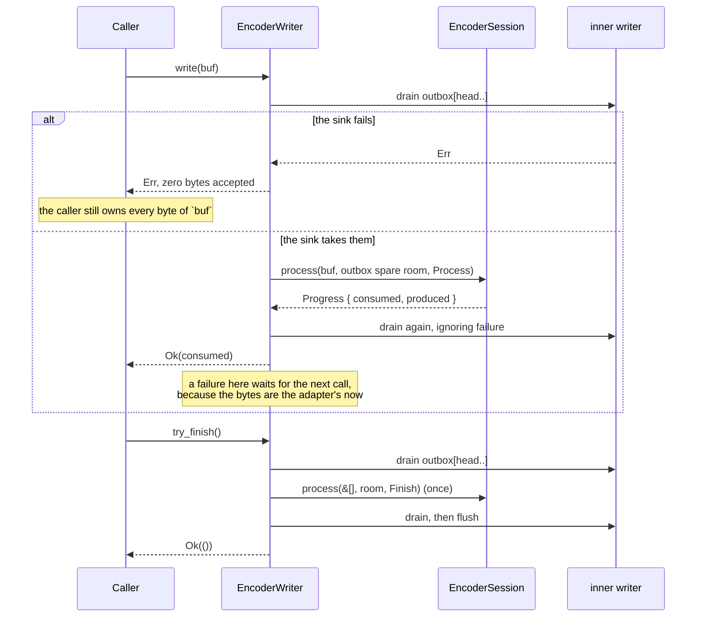

The acceptance rule is the point: **a `write` never both consumes caller input
and returns an error**. Draining comes first, so a failing sink is reported with
nothing accepted and the caller may retry the very same bytes. Once bytes have
been accepted they are the adapter's responsibility, and a sink failure caused by
encoding them surfaces on a later call.

`drain` handles every shape a sink can misbehave in: a short write advances the
cursor, `Interrupted` retries, `WouldBlock` and any other error return with the
exact unwritten suffix preserved, and `Ok(0)` on a non-empty buffer becomes
`WriteZero`.

`try_finish` is retryable: the session's `Finish` is idempotent once finished, so
a sink failure part-way leaves the remaining bytes buffered and the next call
resumes at exactly the byte the sink stopped at. A second terminator is never
written. `finish` hands the adapter back inside `FinishError` rather than
destroying it, so a recoverable failure does not strand the stream.

`Drop` performs no I/O, cannot fail and reports nothing. Dropping an unfinished
writer abandons the stream and returns the compressor to a clean reusable state.

## 6. The reader

`EncoderReader` pulls source bytes into a buffer addressed by a `[head..len]`
cursor — nothing is ever moved to the front — and hands the session a slice of
what it has. Compressed bytes are written straight into the caller's slice, so
there is no intermediate queue at all.

- `read(&mut [])` returns zero without reading the source or initialising
  anything.
- Source `Interrupted` is retried inside `fill`.
- A source error propagates without duplicating anything already encoded.
- End of source switches the operation from `Process` to `Finish`, exactly once.
- `into_parts` returns the source together with the bytes it had read but the
  encoder had not yet accepted, so abandoning the adapter loses no input.

## 7. Error model

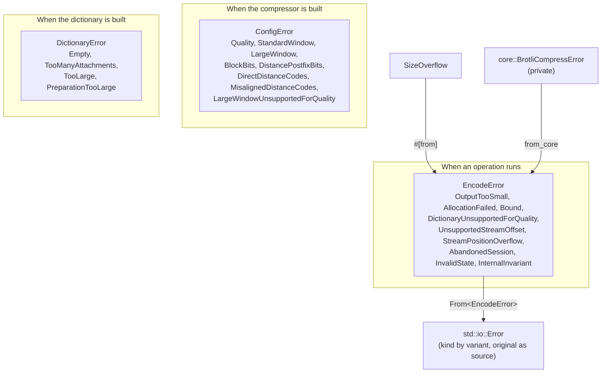

Every public error enum is `#[non_exhaustive]`. The split is by *domain*, not by
layer: a configuration that could never work is refused before an operation
exists, a dictionary that could never be built is refused before a stream exists,
and what is left needs an operation in flight to happen at all.

`EncodeError::InternalInvariant` covers the low-level failures a validated
configuration cannot reach — an unimplemented quality, a refused large window, a
scratch buffer overflow. No valid caller input produces one.

## 8. SIMD dispatch contract

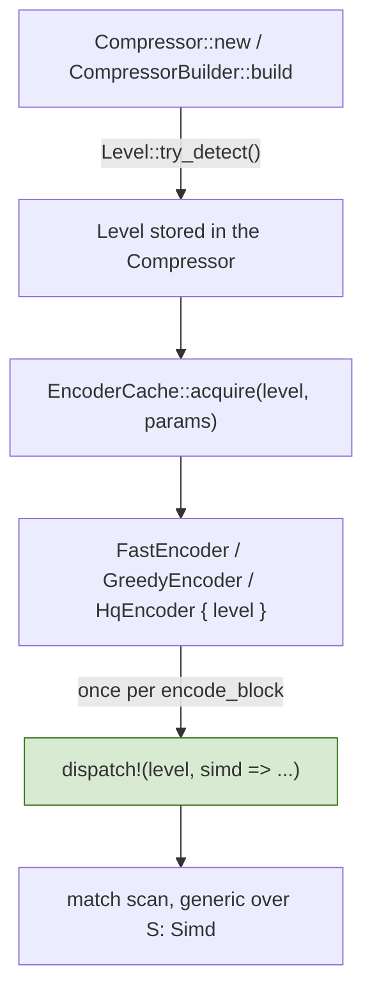

Feature detection happens once per compressor rather than once per process, and
the resolved level is carried by value from there. The `dispatch!` macro is
expanded once per `encode_block` — that is, once per input block — and never per
meta-block, command, match or vector. `CompressorBuilder::with_level` pins a
backend instead of detecting one, which is how the tests exercise a backend the
host would not have chosen; every backend produces identical bytes.

## 9. Verification topology

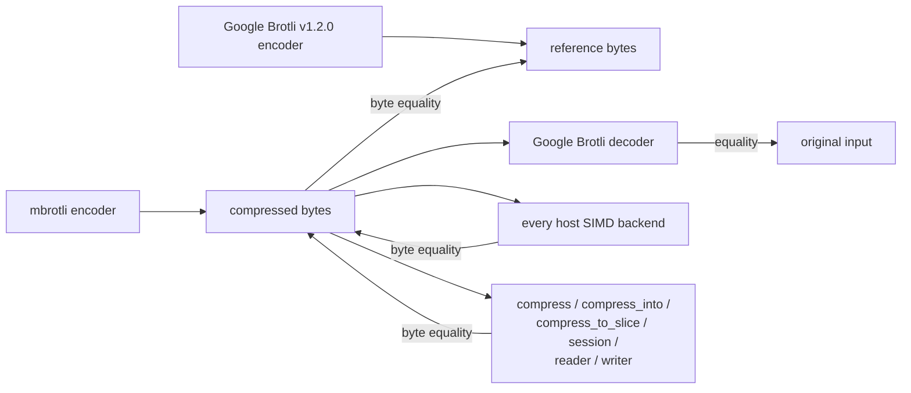

| Test target | What it pins |
| --- | --- |
| `tests/differential_c.rs` | Byte identity with the pinned C encoder over structural and boundary corpora, every window size, plus reuse and reconfiguration across calls. |
| `tests/greedy_qualities.rs` | Byte identity for every parameter qualities two to nine react to: window, mode, declared size, block size, distance layout, context modelling. Compared through a session, and additionally one-shot where the declared size is the true one. |
| `tests/vendor_corpus.rs` | The same, over Google Brotli's own test data, including a multi-fragment 12 MiB input. |
| `tests/roundtrip.rs` | Independent decoder round-trip, determinism between warm and cold compressors, and the compressed-size bound. |
| `tests/simd_backends.rs` | Byte identity between the scalar fallback and every SIMD backend the host supports. |
| `tests/streaming.rs` | Chunk-size independence, agreement between writer, reader and session, one-shot equivalence when the size is declared, the zero-progress rule, and reader read-ahead recovery. |
| `tests/flush.rs` | Flush semantics against the reference driven with `BROTLI_OPERATION_FLUSH`. |
| `tests/writer_faults.rs` | The transactional proof: a scripted sink failing at **every** byte position of a q0, q1, q5, q9 and q11 stream, short writes of one to sixty-four bytes, `Interrupted`, `WouldBlock`, `Ok(0)`, a failing inner flush, a failing finish handing the writer back, and an abandoned writer. Every schedule has to yield exactly one copy of the one-shot stream. |
| `tests/reuse.rs` | The stateful lifecycle: reuse, appending, deliberate failure, trim, reconfiguration, abandoned and leaked sessions, every retention policy, `fork_empty`. |
| `tests/dictionary.rs` | Byte identity with the reference's compound dictionary, decoder round-trip with the dictionary attached, refusal below quality five, entry-point agreement, attachment order, concurrent sharing. |
| `tests/large_window.rs` | Every RFC 9841 header, the refusal at qualities zero to two, and streams above the C decoder's limit. |
| `tests/public_api.rs` | The public surface from outside the crate: conversions, accessors, errors, `Send`/`Sync`. |
| `tests/randomized.rs` | Seeded property tests mixing literal runs, back-references and noise. |
| Unit tests in `core::*` | Layer-by-layer differential tests against encoder-internal C functions; see [hq-encoder.md](hq-encoder.md) §10. |
| `fuzz/afl/` | Twenty AFL targets for the same oracles plus parameter rejection, dictionary preparation and the compressor lifecycle; see [fuzzing.md](fuzzing.md). |

## Known gaps

- **No decoder.** Round-trip verification uses Google's C decoder from the
  `google-brotli-ffi` workspace crate.
- **Stream offsets require experimental quality 2 or above.** See
  [rfc9841-encoding.md](rfc9841-encoding.md) for headerless continuation,
  restart flushing and checked logical-position mechanics.
- **Large window is refused below quality 3.** Qualities 0, 1 and 2 may write
  distances through a code built for the RFC 7932 alphabet, so
  `Compressor::new` refuses the combination. Retained history stops at 30 bits
  however wide the header declares, so the reference's `H35`, `H55` and `H65`
  match finders remain unreachable.
- **A dictionary is refused below quality 5.** The reference compiles its
  compound-dictionary search only for the match finders qualities five and above
  select, and silently ignores the dictionary elsewhere; this crate refuses.
- **Serialized dictionaries and framing are experimental.** See
  [rfc9841-encoding.md](rfc9841-encoding.md) and [framing.md](framing.md).
- **One retained encoder.** The workspace holds exactly one, so alternating
  between two configurations rebuilds on every call. `RetentionPolicy` bounds and
  releases it but does not yet keep one slot per encoder family.
- **Dispatch is per block, not per session.** The single top-level dispatch the
  implementation specification asks for (§8) would need the SIMD token threaded
  through the session's lifetime; today each `encode_block` dispatches once.
- **Allocation on a cold call is unchanged.** Making reuse the default removes
  the per-call cost for repeated work, but a first call at qualities 7 to 9 still
  builds the full matcher before it looks at the input. The lazy and
  generation-stamped representations that would fix that are not implemented.
