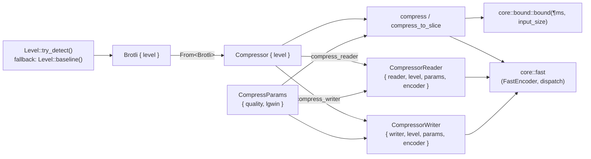
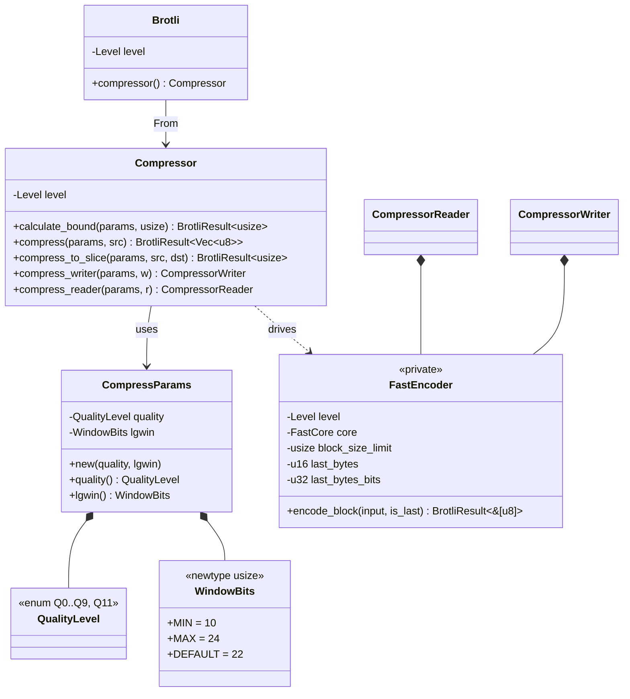
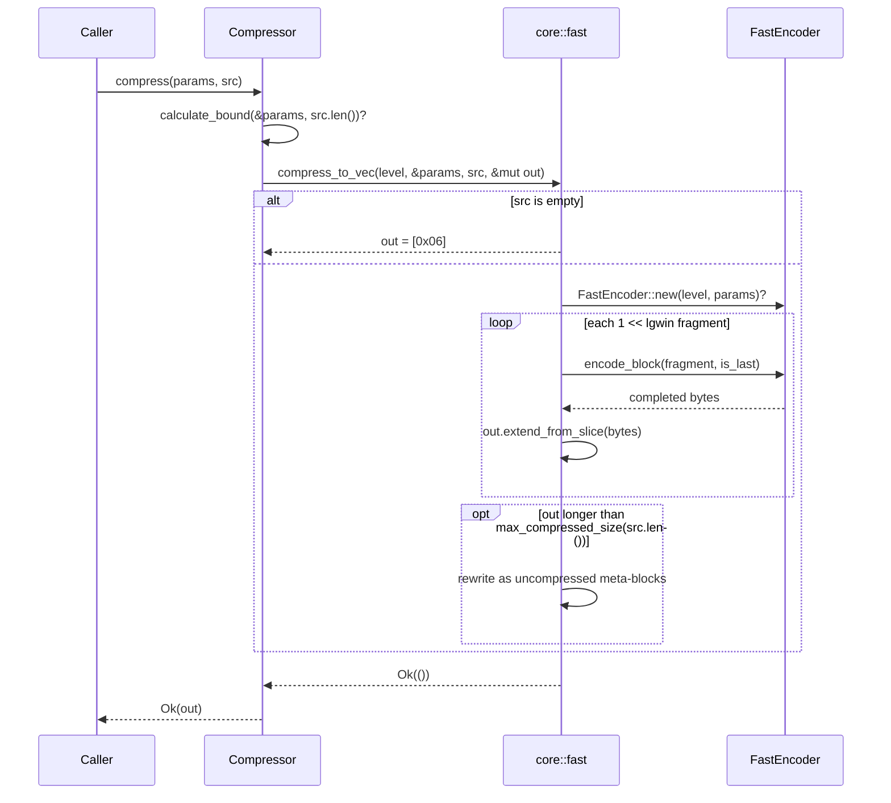
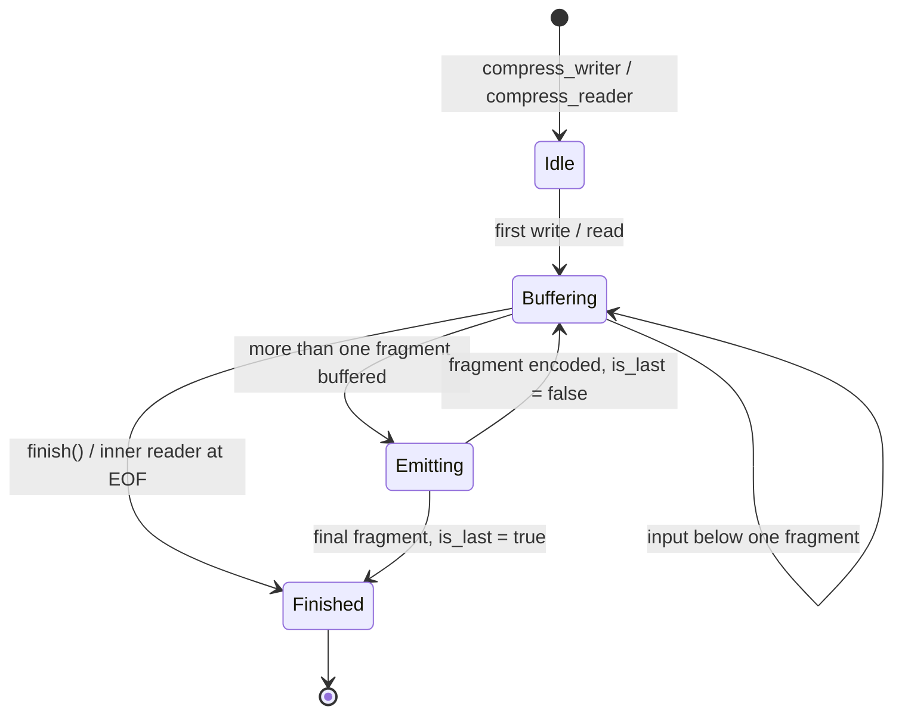
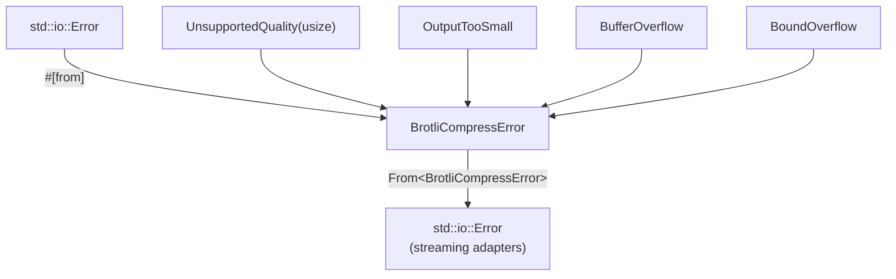
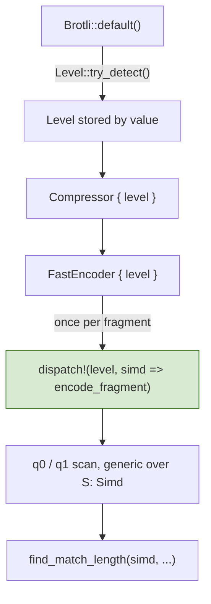
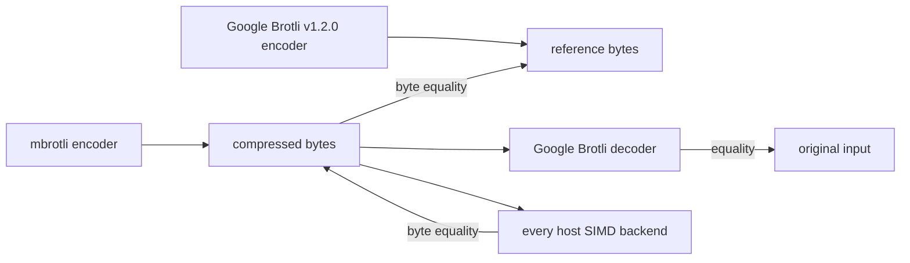

# Compressor Subsystem

Scope: `src/lib.rs`, `src/compressor/`, and the private `src/compressor/core/`
tree, excluding the fast encoder core itself, which has its own specification
in [fast-encoder.md](fast-encoder.md). This document describes the code as it
stands; the [Known gaps](#known-gaps) section lists what is not implemented.

## 1. Core mechanics

The subsystem is a three-layer funnel:

1. **Level layer** — `Brotli` resolves the SIMD instruction set once, at
   construction time, and carries it as a `Copy` value.
2. **API layer** — `Compressor` pairs that level with per-call
   `CompressParams` and exposes four entry points: bound calculation,
   one-shot to a `Vec`, one-shot into a caller slice, and the two streaming
   adapters.
3. **Core layer** — private `compressor::core` modules own the algorithms:
   `core::bound` computes the compressed-size upper bound, and `core::fast`
   owns the quality 0 and quality 1 encoders plus the single runtime SIMD
   dispatch.

SIMD selection is hoisted out of every inner loop: it is decided once in
`Brotli::default()` and then threaded, by value, into whatever implementation
runs. Nothing below the API layer re-detects features.

### 1.1. Ownership and data flow

### 1.2. Type relationships

### 1.3. Parameter validation

Both parameter types make the invalid state unrepresentable rather than
validating at use:

- `WindowBits` is only constructible through `TryFrom<usize>`, which
  rejects anything outside `10..=24`, or through the `MIN` / `MAX` / `DEFAULT`
  associated constants.
- `QualityLevel` is a closed enum. `TryFrom<usize>` rejects values above
  eleven and reports quality 10, which the enum does not model, as
  `ParseQualityLevelError::Unrepresentable`.

Quality routing happens once, when a `FastEncoder` is built: qualities 0 and 1
enter the fast path and everything else is refused with
`BrotliCompressError::UnsupportedQuality`.

## 2. One-shot compression path

`compress` and `compress_to_slice` reproduce the reference one-shot entry
point, including its two special cases.

`compress_to_slice` follows the same flow but copies each completed fragment
into the caller's buffer, and reports `OutputTooSmall` instead of growing.
Because the uncompressed fallback can still shrink the result, a buffer that
was too small for the compressed form is only fatal once the fallback has been
ruled out.

## 3. Streaming paths

Both adapters own a `FastEncoder` created lazily on first use, so a quality the
encoder does not implement surfaces as an `io::Error` at the first write or
read rather than at construction.

The writer only emits a fragment once **more** than a whole fragment is
buffered, so the final call always has data for the terminating meta-block.
`Write::flush` flushes the inner writer without terminating the stream, because
a fragment boundary need not fall on a byte boundary;
`CompressorWriter::finish` writes the final meta-block and returns the
inner writer.

The reader keeps one byte more than a fragment buffered, which is what lets it
tell a full fragment apart from the last one. That makes its output identical
to the one-shot path for the same window size, aside from the one-shot special
cases.

## 4. Error model

`BrotliCompressError` is `#[non_exhaustive]`. The conversion back into
`std::io::Error` unwraps a nested IO error rather than boxing it twice, so an
IO failure that entered through a streaming adapter comes back out with its
original kind.

Private encoder errors do not exist as a separate type: the fast encoder's only
failure modes are the ones above, and its internal buffer overflow is reported
through `BufferOverflow`, which no correct input can reach.

## 5. SIMD dispatch contract

Feature detection happens once per process, inside `Level::new()`. The
`dispatch!` macro is expanded exactly once per fragment — that is, once per
`1 << lgwin` bytes — and never per meta-block, command, match or vector.

## 6. Verification topology

| Test target | What it pins |
| --- | --- |
| `tests/differential_c.rs` | Byte identity with the pinned C encoder over structural and boundary corpora, every window size. |
| `tests/vendor_corpus.rs` | The same, over Google Brotli's own test data, including a multi-fragment 12 MiB input. |
| `tests/roundtrip.rs` | Independent decoder round-trip, determinism, and the compressed-size bound. |
| `tests/simd_backends.rs` | Byte identity between the scalar fallback and every SIMD backend the host supports. |
| `tests/streaming.rs` | Chunk-size independence, writer/reader agreement, one-shot equivalence. |
| `tests/randomized.rs` | Seeded property tests mixing literal runs, back-references and noise. |
| `fuzz/afl/` | AFL targets for the same oracles, seeded from the vendored Brotli test data. |

## Known gaps

- **Qualities 2 through 11 are not implemented.** `compress` returns
  `BrotliCompressError::UnsupportedQuality` for them. `QualityLevel` has
  no `Q10` variant, and `TryFrom<usize>` reports 10 as unrepresentable.
- **No decoder.** Round-trip verification uses Google's C decoder from the
  `google-brotli-ffi` workspace crate.
- **No large-window support.** The fast path never sets the large-window bit,
  matching the reference, so `lgwin` above 24 is not representable.
- **`Write::flush` does not terminate the stream.** Callers must use
  `CompressorWriter::finish`; dropping the adapter discards buffered
  input.
- **No `Send`/`Sync` guarantees are documented** beyond what the fields imply.
