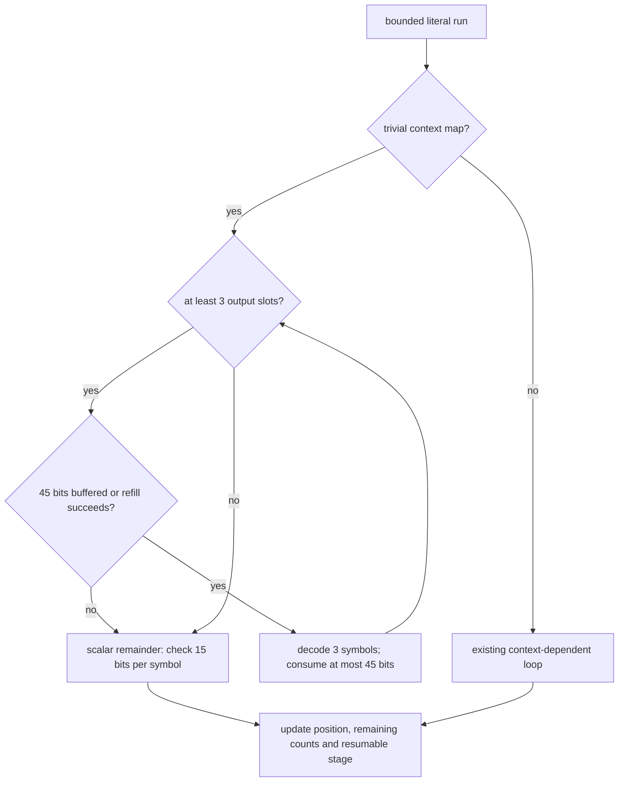
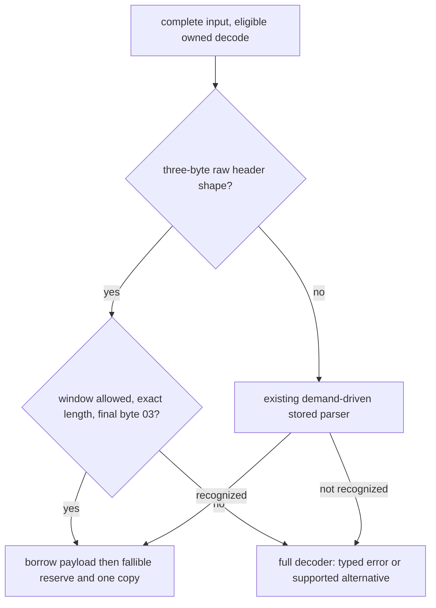

# Decoder literal and stored-header optimization

The public decoder API and benchmark inputs remain unchanged. The current
[eight-input comparison](../docs/benchmarks/decoder-comparison.md) reports
0.967× median speed relative to Burli, versus 0.980× in a preceding separate
run. The paired local improvements below do not establish an overall Burli win.

## Boundaries and data flow

The public decoder API is unchanged. `decompressor::core::stream` owns the
incremental state machine and its backend-specialized command loop;
`decompressor::core::stored` recognizes complete stored members. Only the
literal loop and the stored recognition were optimized in this follow-up.
Production has no new dependency or unsafe code; vendored code is unchanged.

## Diagnosis and transformation

A targeted `mapsdatazrh/q0` measurement took 826 µs and was about 8% slower
than Burli. The 10,000-byte stored random fixture took about 170 ns, where setup and
header parsing dominate. These are measurements before this follow-up's code
changes, after the earlier owned-output optimization.

The hotpath timing/allocation profile of the vendored `mapsdatazrh.compressed`
stream puts 99.90 ms in `stream::fast` out of 106.43 ms in the example's main
function, about 94% inclusive time. The fast loop allocated no bytes. Sampled CPU
stacks were unavailable in the sandbox; timing and allocation instrumentation
worked. This profile uses the vendored compressed stream and a warm slice loop,
not the separate q0 cold benchmark. It identifies the loop; the q0 benchmark
and paired trials test the proposed change's effect.

The final re-profile recorded 95.00 ms in `stream::fast` out of 100.62 ms in
`stream::run` (94.4% inclusive), with the same 626,596 retained bytes and 1.3 MB
of total profiled allocations. The fast loop again allocated nothing. Profiler
startup/background work increased main's elapsed time, so its total is not used
as a before/after speed comparison. Paired uninstrumented measurements decide
performance. Optimized AVX2 assembly confirms one comparison against 44 before
three symbol decodes and three byte stores; stored recognition emits the
expected mask, window, length and final-byte checks inline in `decompress`.

In the context-free literal branch, the old loop checked the reservoir before
each symbol. The new loop decodes three symbols per check. A Huffman symbol
consumes at most 15 bits, so 45 buffered bits suffice. Whole-word refill leaves
at least 57 bits; it reads only a checked eight-byte slice inside the input
budget. The batch is bounded by the pending literal count, literal block count,
output space and ring end. It cannot cross a block switch or wrap. Contextual
literals continue using their existing loop.

The scalar remainder also runs when input cannot refill a batch but still has
one or two decodable symbols. Input/output pauses, consumed/produced counts,
resource failures and public error propagation keep their existing semantics.
SIMD dispatch remains outside the command loop; batching adds no feature
selection and uses safe ordinary Rust because the entropy dependency is serial.

Stored recognition now checks a common fixed header directly: four bits of
standard window declaration (18–24), non-final flag, four length nibbles and raw
flag occupy exactly 24 bits. The shape mask is `0x800071 == 0x800001`, with a
nonzero window code in bits 1–3. The payload length is bits 7–22 plus one. The
window must satisfy the configured limit, total length must equal payload plus
four bytes, and the last byte must be exactly `0x03` (final empty block with zero
padding). Checked slicing borrows the payload. Other header shapes retain the
existing general parser. Rejected recognition returns to the full driver,
which produces the public typed error. Numeric limits and abandoned-session
ordering are still guarded by the public owned-decode entry point.

Neither transformation adds heap allocations or changes workspace retention.
The existing owned-output transfer tradeoffs are documented in
[owned decoder output](decoder-owned-output.md). Every backend uses the same
observable rules; fallback and available x86 SIMD levels are exercised by the
existing differential tests.

## Paired measurements

The [78-case paired CSV](../docs/benchmarks/decoder-literal-paired.csv) records
33 cold, 33 warm slice and 12 streaming cases at q0/q5/q11. It retains all 11
root corpora for cold/warm checks, including synthetic inputs, with the existing
four streaming corpora. The baseline is a byte-for-byte snapshot of `src/`
before this follow-up. Both implementations are linked into one executable and
consume identical C-generated bytes. There are 40 ABBA samples per case with
roughly 3 ms per block, pinned to logical CPU 2. The median paired speedup is
`before_ns / after_ns`; a percentile bootstrap resamples complete ratios 5,000
times with seed 20260910. All 78 lower 95% bounds exceed 0.95; the minimum is
0.95266. This is an exploratory regression screen, not a family-wise significance
claim over all workloads or a tail-latency guarantee.

| Cold workload | Median speedup | 95% interval |
| --- | ---: | ---: |
| mapsdatazrh/q0 | 1.071× | 1.066–1.085× |
| mapsdatazrh/q5 | 1.042× | 1.036–1.052× |
| random_org_10k.bin/q0 | 1.058× | 1.053–1.071× |
| random_org_10k.bin/q5 | 1.061× | 1.054–1.065× |

The literal-only exploratory sweep gave roughly 10% on maps/q0 and 5% on q5.
The paired table above evaluates the final combined candidate and is the
accepted before/after evidence. The full four-decoder sweep has a different
purpose and its means must not be paired with historical samples.

## Reproduction and remaining scope

The [current comparison report](../docs/benchmarks/decoder-comparison.md) and
[environment record](../docs/benchmarks/decoder-comparison-environment.json)
contain the complete eight-input sweep, direct Burli ratios, hashes and validation results.
Local experiments, before-source snapshot, paired driver, raw samples, profiles
and check logs live under `target/decoder-vendor/`; Criterion archives remain
under the comparison package's ignored target directory.

The host is an Intel Core i7-13700KF under WSL2, Rust 1.98.1, normal release
settings, system allocator and runtime backend selection. There is no native
CPU flag. Compilation, tests and profiles do not run during the timed sweeps.
Host scheduling, clocks and thermals are not controlled. Cold native APIs retain
C's known-output-capacity advantage and Rust brotli's I/O adapter costs.

Known gaps: the 10 KB stored fixture still has higher setup costs than Burli;
local improvements do not mean winning every file. Other architectures,
new stream producers, dictionaries and tail latency need separate measurements.

## Validation record

- Root formatting and strict all-target/all-feature Clippy passed, as did all
  930 workspace tests and doctests (two previously ignored heavy tests remain).
- The complete instrumented std workspace run passed 931 tests; the no_std
  library/consumer run passed 648 tests. Current executed test objects report
  2,615/2,615 repository Rust functions covered. Both changed core files have
  100% function coverage. An old reused target contained obsolete source
  mappings; the final report selects all 35 executables listed in these two
  successful runs and their 36 current profile files. LLVM emits 11 mismatched
  profile-data warnings when combining the configurations; the reported totals
  and per-file results are retained locally for inspection.
- The isolated comparison package passed fmt, strict Clippy and its unit tests.
  Instrumented preflight and report validation passed for the measured run.
- AFL stable and experimental fmt/Clippy/regression checks passed. Two 30-second
  smoke runs with cargo-afl 0.18.2 / AFL++ 4.40c saved no crashes or hangs:
  `decompress` 32,226 executions, `decode_streaming` 14,764; both 99.90% stability.
  These are bounded smoke checks, not exhaustive fuzzing.

The final uninstrumented paired runs and the complete eight-input four-decoder sweep
follow these checks, with no concurrent builds, tests or profiling. Their
source/binary hashes, raw measurements and validation counts are linked from
the current run report.
