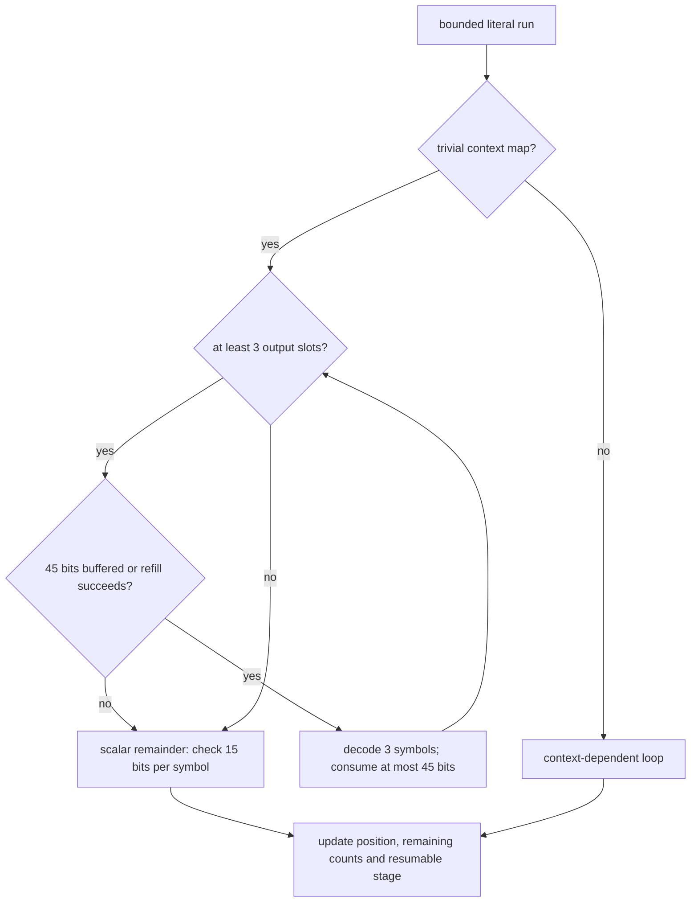
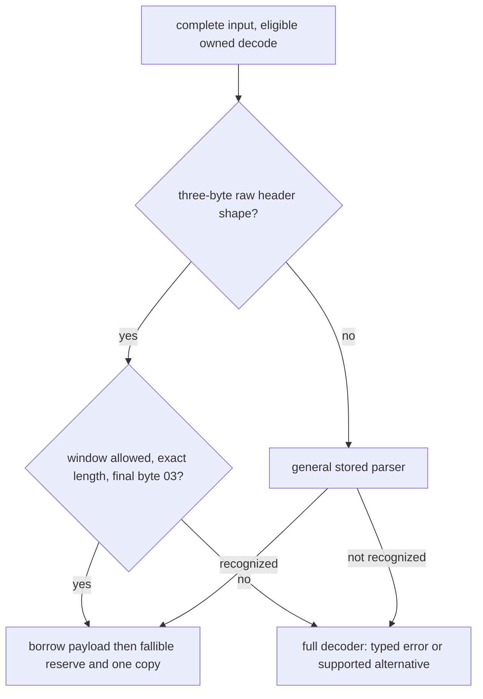

# Decoder literals and stored headers

Private `decompressor::core::stream` owns literal decoding inside the
backend-specialized command loop. `core::stored` recognizes complete stored
members for eligible owned-output calls. No additional public API is exposed.

## Literal batches

The context-free literal loop decodes three symbols per reservoir check.
A Huffman symbol consumes at most 15 bits, so 45 buffered bits suffice. Whole-word refill leaves
at least 57 bits; it reads only a checked eight-byte slice inside the input
budget. The batch is bounded by the pending literal count, literal block count,
output space and ring end. It cannot cross a block switch or wrap. Contextual
literals continue using a context-dependent loop.

The scalar remainder also runs when input cannot refill a batch but still has
one or two decodable symbols. Input/output pauses, consumed/produced counts,
resource failures and public error propagation follow the shared decoder contract.
SIMD dispatch remains outside the command loop; batching adds no feature
selection and uses safe ordinary Rust because the entropy dependency is serial.

## Stored headers

Stored recognition checks a common fixed header directly: four bits of
standard window declaration (18–24), non-final flag, four length nibbles and raw
flag occupy exactly 24 bits. The shape check is `(header & 0x800071) == 0x800001`, with a
nonzero window code in bits 1–3. The payload length is bits 7–22 plus one. The
window must satisfy the configured limit, total length must equal payload plus
four bytes, and the last byte must be exactly `0x03` (final empty block with zero
padding). Checked slicing borrows the payload. Other header shapes retain the
general parser. Rejected recognition returns to the full driver,
which produces the public typed error. Numeric limits and abandoned-session
ordering are guarded by the public owned-decode entry point.

## Invariants and known gaps

Batching adds no allocation or feature detection. Literal decoding is serial
entropy work; the selected backend is passed into the surrounding command loop.
Tests compare output, progress and failures against the baseline and available
host backends, including truncated headers and short output buffers.

Contextual literals use their own loop, and stored shapes outside the recognizer
use the full decoder. See [owned output](decoder-owned-output.md) for eligibility
and retention, and [decoder mechanics](decompressor.md) for errors and lifecycle.
