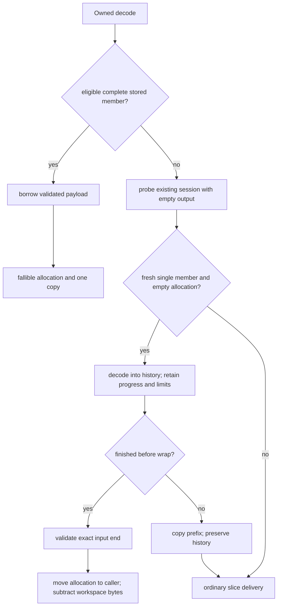
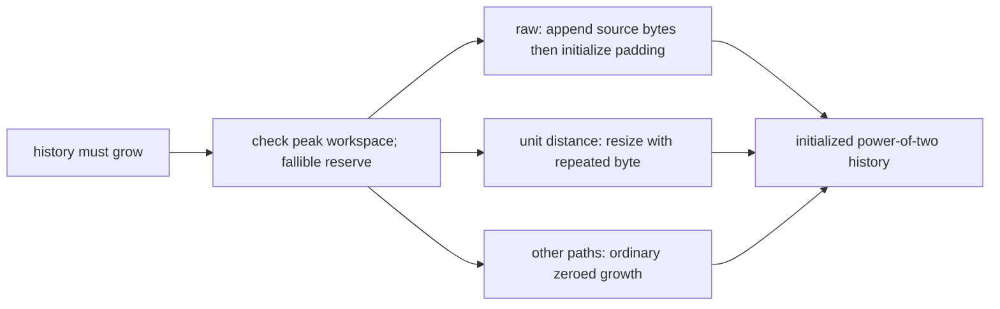
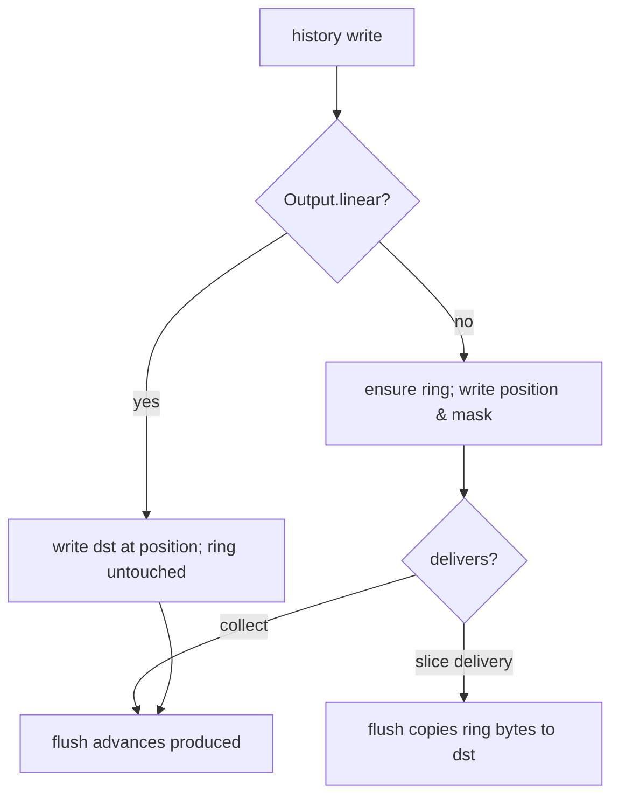

# Owned decoder output

The owned Vec path can recognize stored members directly or transfer its history
allocation to the caller. The one-shot slice path decodes its first member with
the caller's slice as history. The same decoder state machine enforces decoded bytes,
trailing-data policy, window limits, dictionaries and resource budgets.

## Ownership, control and data flow

Private `core::stored` first recognizes the exact three-byte header consisting
of a four-bit standard window, a non-final raw block and a 16-bit length. It
checks the declared window, exact payload length and final byte `0x03`. Other
shapes use the existing demand-driven window/meta-block parsers to recognize
an empty member or one raw block followed by a final empty block.
It verifies window policy, all padding, exact payload bounds and the absence of
a tail, then returns a borrowed slice. Unsupported or malformed shapes return
`None` and enter the normal driver, which owns public error reporting.
`decompress` uses this path only for single-member operations without numeric
limits and without an abandoned session. It reserves fallibly, copies once,
and applies retention policy. No full state machine or history is necessary.

Otherwise the Vec driver probes with empty output. A zero-capacity destination,
fresh workspace, single-member mode and absent dictionary permit collection.
The private session passes `Output::collect = Some(window_size)` to the same
state machine. Ready/fast-end still enforce output policies. Emit and flush
advance progress but do not copy ring bytes to an external slice. Collection
stops before history wraps. Successful complete input transfers the ring's
allocation, truncates its logical length to produced bytes and subtracts its
capacity from live workspace accounting. If the member is larger than its
window, the collected prefix is copied once into the destination, history is
retained and ordinary streaming delivery resumes. Appends, preallocated Vecs,
retained workspaces, dictionaries and concatenation use ordinary delivery.



Before the first wrap, raw growth reserves a power-of-two allocation, copies
into existing initialized slots and appends the remaining raw bytes, then
zeroes only unused padding. A growing unit-distance copy in the resumable copy
stage fills newly allocated slots with their final byte. Both reserve under
workspace accounting before modifying history/position. Wrapped and other
copies retain the existing baseline/SIMD kernels. All slices remain initialized, all output bytes are actually materialized and
SIMD dispatch stays outside the command and copy loops.



## Linear slice history

`decompress_to_slice` and `decompress_with_dictionary_to_slice` end their
session with one call, so no later call needs the history of a paused member.
They call the private `finish_linear`, which passes `Delivery::Linear` to the
operation. The operation turns it into `Output::linear` only for a call that
starts the operation (`total_in == 0 && total_out == 0`), so the first member
begins at `dst[0]` and every history position equals its slice index. The
member boundary clears the flag; later members in concatenated mode use the
ring as before.

With `linear` set the caller's slice is the member's history. The ring is
neither written nor grown. `emit`, raw copies and the byte-exact literal run
write only the slice. Context bytes, prefix-crossing history and every copy read
it. Delivery (`flush_ring`) advances `produced` without copying, as in
collection. The command loop and the resumable copy and prefix stages take the
slice out of `Output` (`core::mem::take`) for their bulk work and put it back
on every exit. The loop's `leave!` does this on pauses and errors.

Bulk work sees the slice only up to `history_end`: the smaller of the call's
fast end and `position + remaining` of the current meta-block. The 16- and
32-byte copy kernels may write up to fifteen bytes past a copy, and the bound
keeps those bytes inside output this meta-block writes. On success or
`OutputTooSmall` the slice matches ring delivery byte for byte, including an
untouched suffix. After other errors, bytes past the delivered prefix may hold
partial output of the failing meta-block. The method has always documented
that written bytes are not rolled back.

`history_mask` indexes both buffers: a power-of-two length gives `len - 1`
(the ring wraps; a power-of-two slice is never indexed at or past its length,
so the mask is the identity), any other length gives `u64::MAX`. The copy
kernels, `previous_bytes` and the command loop share it, so the SIMD and
baseline copies are the same code in both modes.

```mermaid
sequenceDiagram
    participant API as decompress_to_slice
    participant Op as OperationState
    participant Stream as Stream::run
    participant Fast as fast / Copy / Prefix
    API->>Op: finish_linear(src, dst)
    Op->>Op: linear = fresh operation
    Op->>Stream: Output { bytes: dst, linear }
    Stream->>Fast: take dst, bound to history_end
    Fast->>Fast: decode and copy inside dst
    Fast-->>Stream: restore dst; produced += delivered
    Stream-->>Op: Stop::Member
    Op->>Op: linear = false for later members
    Op-->>API: progress
```



## Read-ahead accounting

At output pauses and member boundaries, `Bits::unread` returns speculative whole
bytes accepted by the current call so the caller can reoffer the exact suffix.
At input pauses, incomplete fields retain accepted bits. Bytes accepted by an
earlier call are never subtracted from the current call's consumed count.

```mermaid
stateDiagram-v2
    Decode --> InputPause: field incomplete
    InputPause --> Decode: retain bits; accept next chunk
    Decode --> OutputPause: destination or collection window full
    OutputPause --> Decode: unread current-call whole bytes; reoffer suffix
    Decode --> MemberEnd: validate padding and unread tail
    MemberEnd --> Decode: reset for next member
```



Public error conversion and lifecycle rules remain in
[the decoder API and state machine](decompressor.md). Boundary tests exercise
stored recognition, transfer, history wrap, concatenation, limits and read-ahead.

## Known gaps

- Recognition covers empty members and one raw block plus terminator; metadata
  and mixed/multiple data blocks use the full driver.
- Collection requires a fresh workspace and destination; transfer gives the
  caller a power-of-two allocation and leaves no history window for reuse.
- Appended and reused Vec output initializes newly exposed destination slices.
- Linear slice history covers only the first member of a one-call slice
  operation; sessions and later concatenated members deliver from the ring.
- Small compressed streams still build entropy tables and session state.
