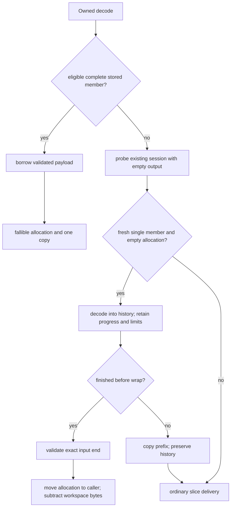
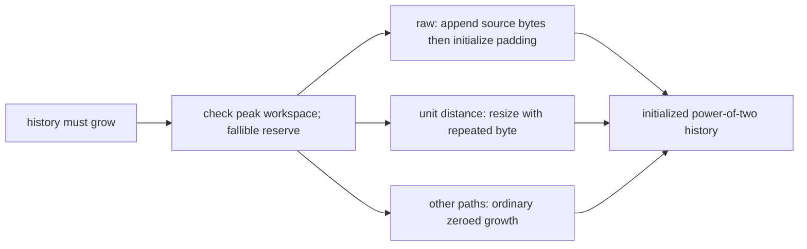

# Owned decoder output and Burli comparison

For the subsequent complete four-decoder q0–q11 refresh and current charts, see
the [decoder benchmark report](../docs/benchmarks/decoder-comparison.md).
The focused experiments below retain their original measurements and scope.

## Decision and contract

The optimization targets complete Brotli decompression into a newly allocated
Vec. It removes duplicate initialization and delivery of output bytes while
keeping the existing command decoder and streaming state machine. The public
API, decoded bytes, strict trailing-data checks, window validation, resource
limits, dictionaries, and backend selection remain intact. Retained bytes can
fall because an allocation becomes caller-owned instead of decoder-owned.

The comparison uses the pinned Burli 0.3.1, its burli-decode 0.3.1 and
burli-core 0.3.0 dependencies, and this repository's Google C wrapper. The
production library gains no codec dependency. All contestants receive exactly
the same C-produced compressed bytes, generic mode and window 22. Decoder
quality is the quality of the source encoder, not a decoder setting. Throughput
counts restored payload bytes; compressed sizes and payload validation remain
part of the evidence.

## Diagnosis

**Measured:** the initial release Criterion comparison reproduced Burli's large
lead on empty/stored streams and long repeated-byte output. It did not show a
Burli lead on ordinary text: mbrotli already decoded Alice/q5 in about 274 µs
versus Burli's roughly 376 µs in the earlier published comparison. Dataset
medians that give empty, raw, repeated and text cases equal weight can obscure
this difference.

**Measured:** release hotpath instrumentation of 101 Alice decodes recorded
34.13 ms in `stream::fast` inside 35.80 ms in `stream::run` (95.3%, derived from
inclusive timings); table filling took 0.463 ms. The command loop allocated no
bytes. Timing/allocation instrumentation worked; sampled CPU stacks were
unavailable in the sandbox. These instrumented totals are diagnostic, not
speedup estimates.

**Inspected in pinned source:** Burli decodes into its output Vec and uses that
Vec as backward-reference history. It reserves output for a meta-block and
initializes produced bytes directly, including unit-distance fills. Its flat
Huffman tables and trusted/unrolled literal paths are additional implementation
differences, but they do not explain a raw block or a million-byte fill. Copying
those entropy designs was not justified by the observed workloads.

The old mbrotli owned path allocated and zeroed its destination as well as its
ring, wrote decoded bytes into the ring, and copied them to the destination.
For a 1 MiB fill this included two large zero-fills, the actual fill and final
copy. **Hypothesis tested independently:** transferring the ring should remove
one allocation, its initialization and delivery; growing with final bytes
should then remove the remaining redundant initialization. Intermediate
Criterion runs reduced repeated-1m/q5 from about 60 µs to 26 µs with transfer,
and then to about 14 µs with initialized growth. Those intermediate timings
are local exploratory measurements; final comparisons are recorded below.

## Ownership, control and data flow

Private `core::stored` first recognizes the exact three-byte header consisting
of a four-bit standard window, a non-final raw block and a 16-bit length. It
checks the declared window, exact payload length and final byte `0x03`. Other
shapes use the existing demand-driven window/meta-block parsers to recognize
an empty member or one raw block followed by a final empty block.
It verifies window policy, all padding, exact payload bounds and the absence of
a tail, then returns a borrowed slice. Unsupported or malformed shapes return
`None` and enter the normal driver, which owns public error reporting.
`decompress` uses this path only for single-member operations without numeric
limits and without an abandoned session. It reserves fallibly, copies once,
and applies retention policy. No full state machine or history is necessary.

Otherwise the Vec driver probes with empty output. A zero-capacity destination,
fresh workspace, single-member mode and absent dictionary permit collection.
The private session passes `Output::collect = Some(window_size)` to the same
state machine. Ready/fast-end still enforce output policies. Emit and flush
advance progress but do not copy ring bytes to an external slice. Collection
stops before history wraps. Successful complete input transfers the ring's
allocation, truncates its logical length to produced bytes and subtracts its
capacity from live workspace accounting. If the member is larger than its
window, the collected prefix is copied once into the destination, history is
retained and ordinary streaming delivery resumes. Appends, preallocated Vecs,
retained workspaces, dictionaries and concatenation use ordinary delivery.



Before the first wrap, raw growth reserves a power-of-two allocation, copies
into existing initialized slots and appends the remaining raw bytes, then
zeroes only unused padding. A growing unit-distance copy in the resumable copy
stage fills newly allocated slots with their final byte. Both reserve under
workspace accounting before modifying history/position. Wrapped and other
copies retain the existing baseline/SIMD kernels. No unsafe code was added;
all slices remain initialized, all output bytes are actually materialized and
SIMD dispatch stays outside the command and copy loops.



## Read-ahead regression

The new concatenated-member test also fails on the original source snapshot:
`Bits::unread` subtracted whole buffered bytes from a later call that had accepted
none. A long pending copy can finish that call's member while the reservoir
still contains next-member bytes accepted before an output pause. Return
speculative whole bytes at output pauses as well as member boundaries, so the
caller reoffers the exact suffix. At an input pause, incomplete fields still
retain their accepted bytes. `unread` only returns bytes accepted by the current
call; older partial-field bytes remain buffered, including a full reservoir.

```mermaid
stateDiagram-v2
    Decode --> InputPause: field incomplete
    InputPause --> Decode: retain bits; accept next chunk
    Decode --> OutputPause: destination or collection window full
    OutputPause --> Decode: unread current-call whole bytes; reoffer suffix
    Decode --> MemberEnd: padding validated
    MemberEnd --> NextMember: unread tail; reset member state
```



## Reproduction and measurement boundary

Baseline source: `1260f292b8031b4974c3ade3b36ab398611c963f`. Candidate: this
change. Local artifacts are under `target/burli-decoder/`; generated reports
and AFL findings are not checked in. The original and transferred/growing
experimental snapshots/logs are retained separately. Build directories created
after the disk repair contain `recovered` in their names; earlier interrupted
or damaged build artifacts are not accepted as completion evidence.

Target: Intel Core i7-13700KF, x86_64-unknown-linux-gnu, Linux
6.18.33.2-microsoft-standard-WSL2, Rust 1.98.1 (48a229cea), LLVM 22.1.8,
fearless_simd 0.7.0. Cargo release optimization, system allocator, no
`target-cpu=native`. Runtime AVX2 selection; fallback/SSE2/SSE4.2/AVX2 are
exercised on this host. Other architectures need native measurements.

The maintained comparison benchmark includes decoder construction, allocations,
decode, black-box consumption and destruction. Corpus generation, C compression
and full output validation happen before timing. The local companion harness
links the unchanged baseline and candidate into one executable and alternates
ABBA samples on the same compressed bytes; warm and streaming runs share the
same initialized destination. They measure different API lifetimes from the
cold comparison and are reported separately.

```sh
cargo bench --manifest-path benchmarks/comparison/Cargo.toml --bench decoders --locked -- \
  'decoders/cold/.*/q(0|5|11)/(mbrotli|burli|c-brotli)$' \
  --warm-up-time 0.3 --measurement-time 0.7 --sample-size 15
cargo build --release --offline --manifest-path target/burli-decoder/paired-package/Cargo.toml
taskset -c 2 target/burli-decoder/paired-recovered/release/decoder-paired-check
taskset -c 2 target/burli-decoder/paired-recovered/release/decoder-paired-check streaming
```

## Paired measurements and resources

The [52-case paired CSV](../docs/benchmarks/decoder-owned-output-paired.csv)
contains all per-case medians and 95% percentile bootstrap intervals: 22 cold,
22 warm slice, and eight streaming cases at q5/q11. Each case has 40 ABBA
samples, roughly 3 ms per block, pinned to CPU 2. The estimator is the median
paired `before / after` time ratio; the interval uses 5,000 resamples and seed
20260910. Background verification still ran on this shared WSL host. These
intervals describe paired local samples, not cross-machine variability.

All 52 lower speed bounds exceed the review floor of 0.95 (minimum 0.957).
Warm slice medians span 0.989–1.041×; streaming medians span 1.006–1.038×.
Cold root-suite inputs show 1.42–1.48× on generated 1 MiB text, 3.51× on
256 KiB incompressible data, and 1.60–1.68× on vendor quickfox repetitions.
The root-suite generated corpora differ from the eight comparison-suite corpora;
results are not pooled across those identities.

The [allocation probe CSV](../docs/benchmarks/decoder-owned-output-memory.csv)
measures allocator calls and peak *requested live heap bytes*, including decoder
and result, excluding the prebuilt input. It does not measure peak RSS or the
allocator's internal transient realloc implementation. After decoding, live
bytes equal reported workspace bytes plus output capacity; after dropping both,
the counter returns to its starting value.

| q5 corpus | Allocations before → after | Peak live bytes before → after | Retained workspace after | Result capacity after |
| --- | ---: | ---: | ---: | ---: |
| Tiny compressed text | 13 → 12 | 12,348 → 12,092 | 12,028 | 64 |
| Alice | 20 → 19 | 442,665 → 290,576 | 28,432 | 262,144 |
| Random 1 MiB | 2 → 1 | 2,097,152 → 1,048,576 | 0 | 1,048,576 |
| Repeated 1 MiB | 12 → 11 | 2,107,132 → 1,058,556 | 9,980 | 1,048,576 |

Alice illustrates the ownership tradeoff: the returned Vec retains the ring's
power-of-two capacity instead of an exact 152,089-byte destination. Total live
allocation still falls because that same ring is no longer retained separately.
Disassembly of the recovered release comparison binary is retained locally in
`candidate.asm`; stored recognition is inlined into `decompress`, with shared
header-parser calls, and delivery uses the ordinary allocation/copy routines.

## Final comparison and checks

The final cold comparison measures q0, q5 and q11 on all eight datasets against
Burli and C. The benchmark validates all 96 q0–q11 streams with all four
decoders before the selected cases are timed. A preliminary all-quality timing
sweep was stopped to focus the final comparison on these representative source
qualities; partial results are retained locally and excluded from the final CSV.
**Measured:** the [72-case CSV](../docs/benchmarks/decoder-owned-output.csv) records
means, 95% mean intervals, throughput and compressed sizes. The
[environment record](../docs/benchmarks/decoder-owned-output-environment.json)
pins source/corpus/binary hashes and commands. The q5 table below uses µs:

| Corpus | Initial mbrotli | Final mbrotli | Burli | C |
| --- | ---: | ---: | ---: | ---: |
| empty | 0.09035 | 0.07765 | 0.01485 | 0.1739 |
| tiny-text | 1.29 | 1.287 | 0.7714 | 0.8419 |
| alice29 | 273.1 | 283.5 | 393.7 | 299.3 |
| text-1m | 359.4 | 333.6 | 436.8 | 722.8 |
| binary-64k | 11.85 | 9.845 | 10.76 | 39.23 |
| random-64k | 3.89 | 1.16 | 1.021 | 2.929 |
| random-1m | 91.1 | 20.14 | 19.85 | 67.34 |
| repeated-1m | 60.47 | 13.17 | 12.7 | 1064 |

Initial means are the exploratory unpinned before phase; final means are the
pinned candidate/Burli/C phase. They are not paired confidence intervals. For
example, Alice/q5 shows 273 → 283 µs across those separate phases, while the
same-process ABBA comparison gives a 1.021× improvement (95% 1.013–1.024×).
Use the paired dataset for regression assessment, not isolated phase differences.

**Derived from recorded means:** the large raw q5 case improves 4.52× and the
long repeated-byte case 4.59× over the initial measurement. They are within
1.5% and 3.7%, respectively, of Burli in the final phase. Alice/q5 is 1.39×
faster than Burli. At q11, raw 1 MiB is 19.27 versus 18.91 µs; repeated 1 MiB
is 13.78 versus 12.67 µs. Parity is not universal: q0 repeated output remains
54.25 versus 44.32 µs, random 64 KiB is about 14–19% slower, empty members
about 5× slower and tiny compressed q5 text about 1.7× slower. These remaining
gaps are explicit; no across-dataset average is used to hide them.

**Keep:** the changes remove the confirmed memory bottleneck, substantially
close the large raw/repeated gap, reduce live allocation, and pass the paired
0.95 regression floor in every measured mode/corpus. Further small-stream
setup and fast-path repeated-growth work remain separate optimization targets.

- Recovered all-feature workspace tests: 929 tests/doc tests passed; two existing
  heavy tests remain ignored. Assertions and overflow checks stay enabled with
  `CARGO_PROFILE_TEST_OPT_LEVEL=1`.
- Root formatting and all-feature/all-target Clippy with `-D warnings` pass.
- Decoder ownership/window/chunk/error tests exercise fallback and every available
  x86 backend; all changed decoder functions have 100% function coverage in the
  recovered LLVM report. The changed AFL `decompress` body also has a separate
  LLVM report from `cargo afl test` (29 recorded executions); it is not inferred
  merely from passing regression replay. The complete std instrumented workspace and no_std coverage suites passed;
  the combined workspace report records **2,615 / 2,615 functions (100%)** and
  passes `--fail-under-functions 100` (96.48% regions, 97.00% lines).
- AFL package formatting, both Clippy feature profiles and both `cargo afl test`
  regression suites pass. AFL++ 4.40c / cargo-afl 0.18.2 ran two 30-second
  smoke campaigns: `decompress` 33,782 executions and `decode_streaming` 16,797,
  both 99.90% stability, zero saved crashes and zero saved hangs. These campaigns
  are bounded smoke checks, not exhaustive fuzzing.

```sh
# Workspace checks use fresh target directories after disk repair.
cargo fmt --all -- --check
cargo clippy --workspace --all-targets --all-features --locked -- -D warnings
CARGO_PROFILE_TEST_OPT_LEVEL=1 cargo test --workspace --all-features --locked
CARGO_PROFILE_TEST_OPT_LEVEL=1 CARGO_INCREMENTAL=1 cargo llvm-cov --workspace \
  --features experimental,diagnostics,hotpath-cpu,hotpath-alloc --locked --no-report
CARGO_PROFILE_TEST_OPT_LEVEL=1 CARGO_INCREMENTAL=1 cargo llvm-cov --workspace \
  --all-features --locked --lib --test no_std --no-report
cargo llvm-cov report --workspace --summary-only --fail-under-functions 100

# From fuzz/afl, using the recovered release binaries:
AFL_SKIP_CPUFREQ=1 AFL_NO_AFFINITY=1 AFL_I_DONT_CARE_ABOUT_MISSING_CRASHES=1 \
  cargo afl fuzz -i regressions/decompress -o ../../target/burli-decoder/afl-decompress \
  -V 30 -t 1000 -c - -- ../../target/burli-decoder/afl-recovered/release/decompress
# The streaming campaign substitutes decode_streaming and its own output folder.
```

## Known gaps

- Small compressed members still pay entropy-table and session setup costs.
- Stored recognition covers an empty member or one raw block plus terminator;
  metadata and mixed/multiple data blocks use the normal parser/driver.
- Appended/reused Vec output still initializes newly exposed destination slices.
- Collection transfers a power-of-two allocation and retains no history window
  for reuse. It is therefore limited to a fresh workspace and destination.
- The growing repeated-byte optimization covers the resumable copy stage;
  the command fast path retains its established growth/copy behavior.
- Compile-only `thumbv7em-none-eabi` no_std/decompression checking passes; this
  is not Arm execution or performance evidence.
- Shared-host timing is not a production latency guarantee, and bounded fuzzing
  is not proof that malformed-input bugs are absent.
