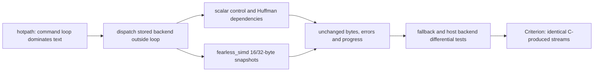

# Decoder SIMD measurements

## Decision and contract

Keep the backend-specialized command loop and safe 16/32-byte history snapshots.
The measured operation is complete Brotli decompression into an initialized,
caller-owned slice, or a session with 64 KiB input/output chunks. Output bytes,
consumed input, errors, chunking, memory limits, and public API remain unchanged.
The detailed ownership, state transitions, errors and copy invariants are in
[native decompressor](decompressor.md).

The inputs are the existing eleven deterministic/vendor benchmark corpora,
compressed by the pinned C encoder at qualities 5 and 11, window 22. Setup,
compression, payload validation, buffer allocation, and backend selection are
outside timing. The Rust decoder retains workspace. C is measured on identical
bytes and chunk sizes but creates/destroys decoder state per operation. Thus
C figures compare these public API shapes, not equal-lifetime decoder kernels.

## Diagnosis and mechanics

Instrumented release `hotpath` timings of 101 decodes of the vendored
`alice29.txt.compressed` put 40.95 ms in `stream::fast` within 42.98 ms in
`stream::run` (95.3%, **derived** from inclusive timings). Huffman table fill
accounts for 0.592 ms (1.4%); overlapping copies for 0.072 ms (0.17%).
On `quickfox_repeated.compressed`, overlapping copies account for 0.244 ms
within 0.876 ms (27.8%). These are shares of decoder time, not of profiler
startup or whole-process time. Nested timing shares must not be added.

Copying and bit-reservoir operations, rather than context-map initialization,
are the promising work inside the command loop. Huffman symbols and LZ77
expansion depend on previous symbols/bytes, so they are not independent SIMD
lanes. A trial replacing prefix-doubling `copy_within` with disjoint
`copy_from_slice` gave no consistent improvement and was reverted. Long
periodic expansion retains the original fill/byte/doubling algorithm.

The accepted implementation passes the constructor-validated backend to the
private stream state machine. It dispatches before entering a command loop or
a bulk copy stage; generic copy helpers take the concrete `Simd` token. Headers,
raw blocks, and other resumable stages share their scalar implementation.
The scalar oracle is the bytewise ring model plus snapshot-copy tests; the
library's fallback backend is explicitly exercised in internal tests.



No allocations or unsafe code were added. Copies load the complete source
before storing, accept unaligned initialized slices, and check both windows.
The caller copies the exact length if a full vector does not fit. Writes beyond
the logical copy remain confined to at most fifteen unreachable ring bytes.
The full SIMD safety argument and wrap handling are documented in the native
decoder specification.

## Environment and reproduction

Measured on 2026-09-10, Intel Core i7-13700KF exposed as 24 logical CPUs by
WSL2, Linux 6.18.33.2-microsoft-standard-WSL2, x86_64-unknown-linux-gnu.
Rust 1.98.1 (48a229cea), LLVM 22.1.8, `fearless_simd` 0.7.0.
Default Cargo release optimization, no `target-cpu=native`, no global target
feature flags, system allocator. Default runtime backend is AVX2; SSE2 and
SSE4.2 are available; AVX-512 and NEON are not executable on this host.

Baseline: `d56df43d721a8b3344687ea335064e38dd073451`. Candidate: this change.
The benchmark corpus generators and vendored input bytes were unchanged.
Sizes and SHA-256 identities, Criterion samples, logs, and disassembly are local
artifacts under `target/decoder-simd/` and `target/criterion/`.

```sh
cargo build --release --example profile_decompressor --features hotpath-cpu,hotpath-alloc --locked
target/release/examples/profile_decompressor brotli-ffi/vendor/brotli/tests/testdata/alice29.txt.compressed
target/release/examples/profile_decompressor brotli-ffi/vendor/brotli/tests/testdata/quickfox_repeated.compressed

# Run on baseline, then on candidate (replace --save-baseline with --baseline).
cargo bench --bench decompress --locked -- \
  'decompress/(presized|streaming)/q(5|11)/(mbrotli|mbrotli-session|c-brotli)/' \
  --warm-up-time 0.5 --measurement-time 1 --sample-size 15 --save-baseline before

# Independently measure each available backend on the final implementation.
cargo bench --bench decompress --locked -- \
  'decompress/presized/q(5|11)/mbrotli-(sse2|sse4.2|avx2)/' \
  --warm-up-time 0.5 --measurement-time 1 --sample-size 15
objdump -Cd target/decoder-simd/candidate-bench > target/decoder-simd/candidate.asm
```

The AVX2 command specialization contains 128/256-bit `vmovups` loads/stores
for history snapshots and BMI2 `shrx`/`shlx` for the reservoir. The original
16-byte integer copy already benefited from compiler vectorization. Therefore
the full measured improvement belongs to copy and command specialization
together; it is not evidence that explicit vectors alone account for it.
CPU sampling through hotpath/samply failed in this sandbox. Timing and
allocation instrumentation worked; hardware-counter and sampled-stack evidence
is unavailable. Instrumented timings are diagnostic, not speedup estimates.

## Measurements

The initial Criterion sweep and process-level ABBA repeats found material
scheduler/frequency noise on this shared host. To resolve it, a local companion
harness links an unchanged decoder snapshot from the baseline commit alongside
the candidate, both with only `std,decompression`, and alternates them on the
same compressed source **and the same destination slice**. Distinct output
allocations had produced a repeatable approximately 5% discrepancy on the
10 KiB raw file; that discrepancy disappears with a shared destination, so it
is not evidence of a decoder regression under identical buffer conditions.
The raw results from those preliminary trials are retained, not pooled into the
final estimate.

Each case gets two runs of 40 ABBA samples, pinned to logical CPU 2. Each block
is calibrated to about 3 ms (8–100,000 operations). Timing includes the public
slice operation and retained workspace reuse, with validated output before and
after sampling; compression, validation, calibration and output allocation are
excluded. The 95% interval below is a percentile bootstrap of the median paired
speed ratio, stratified by run (5,000 resamples, seed 20260910). It describes
these samples, not cross-machine or tail-latency uncertainty. There was other
local test activity; tight pairing reduces its influence but does not turn WSL
into an isolated benchmark machine.

Times below are medians in microseconds. Speed is the median paired
`before / after` ratio, so it need not exactly equal the ratio of the displayed
rounded time medians. A 0.95 speed floor is used here as a review criterion,
not as a pre-existing project policy or absolute latency budget. Every case's
lower interval bound exceeds that floor. Long runs and raw blocks show parity;
text and structured binary show roughly 3–10% higher throughput.

| Quality | Corpus | Payload / compressed bytes | Before µs | After µs | Speed | 95% interval |
| --- | --- | ---: | ---: | ---: | ---: | --- |
| 5 | text-1KiB | 1,024 / 146 | 1.471 | 1.428 | 1.032× | 1.030–1.034 |
| 5 | text-1MiB | 1,048,576 / 8,254 | 94.809 | 88.347 | 1.072× | 1.068–1.076 |
| 5 | binary-256KiB | 262,144 / 94,650 | 492.273 | 454.533 | 1.082× | 1.079–1.087 |
| 5 | compressible-256KiB | 262,144 / 19 | 7.624 | 7.645 | 1.001× | 0.997–1.003 |
| 5 | incompressible-256KiB | 262,144 / 262,149 | 7.446 | 7.461 | 0.998× | 0.997–1.000 |
| 5 | vendor-alice29.txt | 152,089 / 52,809 | 299.488 | 273.775 | 1.092× | 1.088–1.101 |
| 5 | vendor-lcet10.txt | 426,754 / 133,991 | 727.269 | 663.009 | 1.101× | 1.096–1.103 |
| 5 | vendor-plrabn12.txt | 481,861 / 186,038 | 1011.578 | 920.452 | 1.097× | 1.093–1.102 |
| 5 | vendor-mapsdatazrh | 285,886 / 167,912 | 677.639 | 654.659 | 1.036× | 1.031–1.039 |
| 5 | vendor-random_org_10k.bin | 10,000 / 10,004 | 0.140 | 0.140 | 1.001× | 0.999–1.003 |
| 5 | vendor-quickfox_repeated | 176,128 / 51 | 5.540 | 5.534 | 1.002× | 0.997–1.004 |
| 11 | text-1KiB | 1,024 / 124 | 1.733 | 1.681 | 1.026× | 1.023–1.032 |
| 11 | text-1MiB | 1,048,576 / 8,038 | 115.046 | 107.793 | 1.068× | 1.063–1.072 |
| 11 | binary-256KiB | 262,144 / 66,420 | 717.999 | 675.714 | 1.063× | 1.057–1.066 |
| 11 | compressible-256KiB | 262,144 / 20 | 7.665 | 7.653 | 1.001× | 0.997–1.005 |
| 11 | incompressible-256KiB | 262,144 / 262,149 | 7.459 | 7.462 | 1.000× | 0.998–1.004 |
| 11 | vendor-alice29.txt | 152,089 / 46,487 | 347.101 | 322.406 | 1.071× | 1.065–1.075 |
| 11 | vendor-lcet10.txt | 426,754 / 113,416 | 839.251 | 780.173 | 1.076× | 1.069–1.082 |
| 11 | vendor-plrabn12.txt | 481,861 / 163,267 | 1089.030 | 1006.833 | 1.081× | 1.079–1.084 |
| 11 | vendor-mapsdatazrh | 285,886 / 159,339 | 1014.823 | 948.121 | 1.071× | 1.069–1.074 |
| 11 | vendor-random_org_10k.bin | 10,000 / 10,004 | 0.140 | 0.140 | 1.002× | 1.000–1.004 |
| 11 | vendor-quickfox_repeated | 176,128 / 57 | 6.210 | 6.219 | 1.000× | 0.998–1.002 |

The local companion harness and its extracted baseline source are preserved in
`target/decoder-simd/paired-package/`; its two source snapshots retain the exact
slice-only and streaming implementations used. The public benchmark remains
`benches/decompress.rs`. Companion reproduction on this checkout:

```sh
cargo build --release --offline --manifest-path target/decoder-simd/paired-package/Cargo.toml
taskset -c 2 target/decoder-simd/paired-package/target/release/decoder-paired-check
taskset -c 2 target/decoder-simd/paired-package/target/release/decoder-paired-check streaming
python3 target/decoder-simd/summarize-shared.py
```

### Streaming

The same shared-buffer ABBA harness measures complete sessions with 64 KiB
input/output chunks on four large text/binary corpora. Both implementations
validate consumed input and produced output. The two 40-sample runs use the
same estimator and bootstrap as the slice measurements.

| Quality | Corpus | Before µs | After µs | Speed | 95% interval |
| --- | --- | ---: | ---: | ---: | --- |
| 5 | text-1MiB | 98.080 | 92.059 | 1.065× | 1.062–1.068 |
| 5 | binary-256KiB | 492.964 | 457.986 | 1.080× | 1.074–1.082 |
| 5 | vendor-alice29.txt | 299.071 | 274.717 | 1.090× | 1.085–1.096 |
| 5 | vendor-lcet10.txt | 728.660 | 667.002 | 1.093× | 1.089–1.096 |
| 11 | text-1MiB | 117.545 | 109.751 | 1.071× | 1.067–1.075 |
| 11 | binary-256KiB | 726.701 | 673.641 | 1.073× | 1.072–1.079 |
| 11 | vendor-alice29.txt | 346.662 | 322.131 | 1.076× | 1.072–1.081 |
| 11 | vendor-lcet10.txt | 840.166 | 783.417 | 1.073× | 1.071–1.075 |


### Reference and backend matrix

The maintained Criterion benchmark also compares C and each supported backend.
These are mean times from a separate q5 run (0.3 s warmup, 0.8 s measurement,
15 samples), not paired estimates from the table above. Rust is warm, C creates
and destroys state. In particular, a higher backend is not a per-input speed
guarantee: quickfox remains a prefix-doubling workload, and its short-operation
backend times are close enough to require paired trials before making a claim.

| Corpus | C µs | SSE2 µs | SSE4.2 µs | AVX2 µs |
| --- | ---: | ---: | ---: | ---: |
| binary-256KiB | 588.342 | 498.524 | 500.671 | 456.006 |
| vendor-alice29.txt | 283.763 | 296.680 | 296.264 | 270.870 |
| vendor-quickfox_repeated | 73.143 | 5.577 | 5.731 | 5.913 |


## Resources and validation

The profile retains exactly 317,012 workspace bytes for Alice and 283,940 for
quickfox, before and after. The instrumented hot loop and copy kernels report
zero allocation bytes. This checks retained capacity and kernel allocations;
peak RSS is not an acceptance measurement. The full Criterion executable text
section grows from 4,193,871 to 4,319,347 bytes (+125,476 bytes, **measured**,
before adding separate backend benchmark registrations). This includes linked
monomorphizations; it is not a measurement of a minimal decoder-only binary.

- `cargo fmt --all` and `cargo fmt --all -- --check`: passed.
- `cargo clippy --workspace --all-targets --all-features --locked -- -D warnings`: passed.
- `CARGO_PROFILE_TEST_OPT_LEVEL=1 cargo test --workspace --all-features --locked`:
  passed, 921 tests/doc tests, two pre-existing ignored heavy tests. The initial
  unoptimized run was stopped during unrelated compressor randomized tests;
  the complete optimized test run retains assertions and overflow checks.
- Exhaustive vector window/snapshot tests and randomized ring copies exercise
  scalar fallback, SSE2, SSE4.2 and AVX2. Vendored Alice and quickfox streams
  additionally exercise these backends with destination capacities 1, 15, 16,
  17, 31, 32, 33, 127 and 65,536. All pass.
- Separate `mbrotli-<backend>` Criterion registrations were exercised with
  `--test`; each backend validates the original payload before timing.
- `cargo check --lib --no-default-features --features no_std,decompression
  --target thumbv7em-none-eabi --locked`: passed (compile-only fallback target).
- AFL package formatting, both Clippy feature profiles, and both `cargo afl test`
  regression suites passed. AFL++ 4.40c / cargo-afl 0.18.2 release targets
  `decompress` and `decode_streaming` each ran for 30 seconds: 26,963 and 16,079
  executions, respectively; no saved crashes or hangs, stability 99.89%/99.90%.
  These are bounded smoke campaigns, not exhaustive fuzzing.
- Combined `cargo llvm-cov` report: **5,380 / 5,380 functions, 100%**;
  `--fail-under-functions 100` passed. Statement/region and line coverage are
  separate metrics (97.03% regions, 97.57% lines). Every changed decoder source
  file has 100% function coverage. The std profiling run exercised unit tests,
  decoder integration tests, and much of the compressor suite; it was stopped
  during unrelated, lengthy compressor round-trip tests after the changed
  functions were covered. The complete no_std unit/API run was then merged.
  This is a combined coverage report, not a claim that the entire additional
  std+hotpath stress suite completed. The required all-feature workspace test
  suite completed separately as stated above.

```sh
CARGO_PROFILE_TEST_OPT_LEVEL=1 CARGO_INCREMENTAL=1 \
  cargo llvm-cov --workspace --features experimental,diagnostics,hotpath-cpu,hotpath-alloc \
  --locked --no-report
CARGO_PROFILE_TEST_OPT_LEVEL=1 CARGO_INCREMENTAL=1 \
  cargo llvm-cov --workspace --all-features --locked --lib --test no_std --no-report
cargo llvm-cov report --workspace --json --output-path target/decoder-simd/coverage.json
cargo llvm-cov report --workspace --summary-only --fail-under-functions 100
```

```sh
# From fuzz/afl, build once then run each target with its committed regressions.
cargo afl build --release --no-default-features --bin decompress --bin decode_streaming
AFL_SKIP_CPUFREQ=1 AFL_NO_AFFINITY=1 AFL_I_DONT_CARE_ABOUT_MISSING_CRASHES=1 \
  cargo afl fuzz -i regressions/decompress -o ../../target/decoder-simd/afl-decompress \
  -V 30 -t 1000 -c - -- target/release/decompress
# For the second target, replace both instances of decompress with decode_streaming.
```


## Known gaps

- Results are local shared-host measurements, not a production latency budget
  or a guarantee for other CPUs. Any case outside uncertainty needs individual
  review; averages do not justify a regressed case.
- The new SIMD kernels were executed on x86_64 fallback/SSE2/SSE4.2/AVX2 only.
  Arm/NEON, Wasm and AVX-512 execution remain unvalidated.
- Long periodic copies still use prefix doubling and are not an improvement
  claim. Context-map transforms and Huffman construction remain scalar because
  the measured text profile does not justify their extra dispatch/complexity.
- Short AFL campaigns and passing fixtures do not establish absence of bugs.
