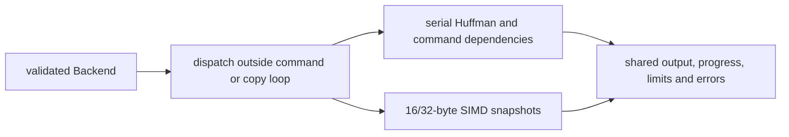

# Decoder SIMD dispatch

The constructor validates and stores a backend. Private `decompressor::core`
dispatches before command loops and bulk copy stages, passing a concrete
`fearless_simd::Simd` token into generic helpers. Headers, raw blocks and
resumable parsing stages share scalar control flow.

Copies load the complete source before storing and accept unaligned initialized
slices. Both source and destination windows are checked; a short boundary uses
an exact-length copy. Speculative writes remain within at most fifteen
unreachable ring bytes. Long overlapping expansions use fill, byte copying or
prefix doubling. Feature checks and virtual calls do not occur per byte or command.

[Native decompressor](decompressor.md) specifies wrap, overlap, dictionary and
error invariants. [Owned output](decoder-owned-output.md) specifies history growth
and transfer; those ownership rules are shared across backends.

## Verification and known gaps

Unit tests use a bytewise ring oracle and snapshot-copy cases. Differential tests
explicitly exercise fallback and every backend available on the host, checking
payload, consumed input, errors, limits and streaming progress.

Run the root `decompress` Criterion benchmark for retained slices, streaming and
backend comparisons; the separate [library comparison](../docs/benchmarking.md)
measures cold owned APIs. Profile with `hotpath` before changing these kernels.

Huffman construction and context-map transforms remain scalar. Backend tests
cannot validate instruction sets absent from their execution host; compilation
alone does not establish runtime correctness or speed.
