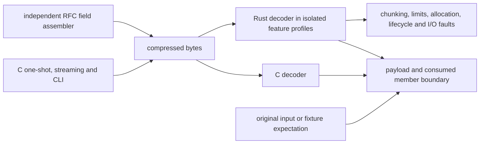

# Native decoder verification

The decoder is checked against the pinned Google C decoder and independent
wire fixtures. [Decoder mechanics](decompressor.md) describe the implementation;
[validation](../docs/correctness.md) describes the library-wide contracts.

## Oracle and data flow

`google-brotli-ffi` is a development dependency. C encoding in
`tests/decode_support/c_encoder.rs` produces input independently of the Rust
encoder. `tests/decode_support/wire.rs` writes explicit RFC fields. Experimental
oracle builds enable `BROTLI_EXPERIMENTAL`; extended decoding enables C's Large
Window option. Both decoders receive the same ordered dictionary attachments.



The [fixture manifest](../tests/fixtures/decompress/manifest.json) records producer,
flags, dictionary recipes, schedules, lengths and hashes for saved fixtures.
Vendored compressed fixtures with unknown original flags establish format
compatibility, not a specific producer parameter combination.

## Coverage by boundary

| Boundary | Checks |
| --- | --- |
| Parameters | Source qualities 0–11, modes, windows, block sizes, size hints and all legal distance-parameter pairs |
| Wire format | Raw/compressed/metadata/final blocks, Huffman repeats, context maps, padding and built-in transforms |
| Scheduling | PROCESS/FLUSH/FINISH, C TakeOutput, continuations, every split of small fixtures and short output buffers |
| Dictionaries | Ordered RAW attachments, prepared/decode-only views; serialized/custom transforms and contexts with `experimental` |
| Completion | Truncation, tails, concatenated members, aggregate budgets and reader read-ahead |
| Resources | Allocation failures, exact input/output/workspace limits, retention, recovery and I/O retry |
| Large inputs | Ignored release tests for real 25–30-bit distances and cumulative output beyond 4 GiB |
| Platforms | Fallback and host SIMD execution; isolated codec imports and alloc-only compile checks |

These checks run in separate std and no_std profiles, each with and without
`experimental`. I/O tests require std APIs. `--all-features` activates `no_std`
and does not replace the std profile. Feature isolation scripts also verify that
unsupported imports fail to compile.

## Running checks

Use [development](../docs/development.md) for workspace, coverage and AFL commands.
The isolated decoder gates and an alloc-only target check are:

```sh
python3 scripts/check_decoder_features.py
cargo check --lib --no-default-features --features no_std,decompression --target thumbv7em-none-eabi --locked
```

Run ignored heavy tests separately; they regenerate large output through bounded
buffers and can require nearly 3 GiB of combined history:

```sh
cargo test --release --locked --no-default-features --features std,decompression --test decompress_heavy -- --ignored --nocapture --test-threads=1
```

Repeat with `std,decompression,experimental`, `no_std,decompression`, and
`no_std,decompression,experimental`. [CI](ci.md) runs this matrix on `v*` tags
and manual dispatch. Miri, AddressSanitizer and the decoder AFL targets provide
additional checks; committed regressions replay through the same target bodies.

## Known gaps and oracle limits

- C verifies windows only through 30 bits. Windows 31–62 use independent headers
  and a full-width distance model, without allocating those physical windows.
- Rust supports prefix-to-history copies that the pinned C decoder rejects when
  a copy exceeds the complete prefix. Independent fixtures check this extension.
- The RAW continuation producer uses nonzero caller output buffers: a TakeOutput-only
  schedule can leave C's restart bytes pending and fail its own round trip.
  Ordinary TakeOutput cases are tested separately.
- A bare-metal compile check is not a 32-bit or Arm runtime test. Backend
  correctness needs execution on a host supporting that backend.
- The raw decoder does not decode Shared Brotli framing containers.
- Passing bounded tests and fuzz campaigns does not prove absence of bugs.
