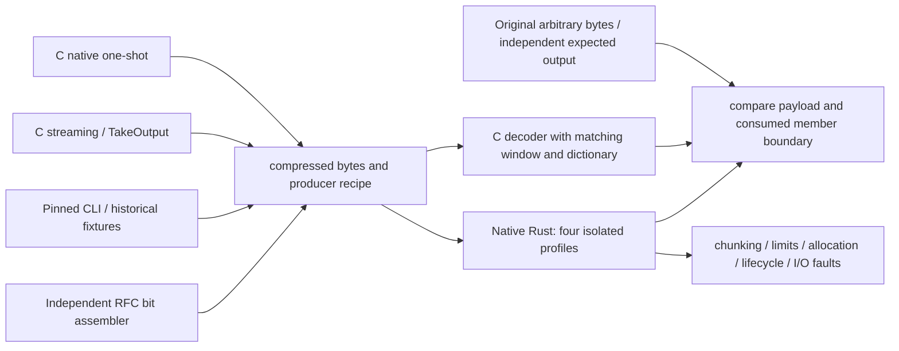

# Native decoder verification

This report records the implementation and local verification of
[the external v3 specification](../specifications/mbrotli-decompressor-llm-spec-v3.md).
Mechanics, ownership, public APIs and invariants are described in
[decompressor.md](decompressor.md) and [shared-primitives.md](shared-primitives.md).
The decoder is native scalar Rust. SERIALIZED/custom dictionary extensions require
`experimental`; RAW dictionaries, large windows and complete base continuations do not.

## Revision, environment and oracle

- Base: `65030612836485b9bd1a08e2ba08d3c96a3e832d`; changes are in the working tree.
- Google Brotli: **1.2.0**, pinned vendor SHA
  `028fb5a23661f123017c060daa546b55cf4bde29`. Vendor sources were not edited.
- Local run: 2026-09-09, Apple M5 Pro, `aarch64-apple-darwin`, Rust
  `1.98.1 (48a229cea 2026-09-01)`, LLVM 22.1.8. x86_64 macOS tests ran under Rosetta.
- Test oracle uses `google-brotli-ffi` as a dev dependency, its existing
  `cc::Build` recipe, default profile optimization/debug settings, `warnings(false)`.
  Experimental jobs additionally define `BROTLI_EXPERIMENTAL`; base jobs do not.
  Release measurements use optimized Rust and C builds. The independent CLI uses
  CMake Release with `BROTLI_DISABLE_TESTS=ON` and no experimental definition.
- Extended C decoding explicitly enables `BROTLI_DECODER_PARAM_LARGE_WINDOW`.
  The oracle receives the same ordered dictionary attachments as Rust.



`tests/decode_support/c_encoder.rs` is an owned test-only C producer; it does not
call the Rust encoder. Native one-shot tests call `BrotliEncoderCompress` directly.
`tests/decode_support/wire.rs` writes independent RFC fields. C parameter
acceptance is asserted, but normalized parameters alone are not wire evidence.
Private unit tests independently encode block switches, complex length repeats
16/17, context-map RLE/MTF and distance arithmetic. Wire tests explicitly select
all 121 built-in transform references; heavy tests require distant history bytes.

Saved fixture provenance is in
[`tests/fixtures/decompress/manifest.json`](../tests/fixtures/decompress/manifest.json):
producer, C flags, feature requirements, schedules, dictionary recipes, lengths
and SHA-256 hashes. The four saved fixtures are standard/large C continuations,
official CLI output and ParallelCompressor output. Each is base-format and runs
in all four profiles, including alloc-only decoding of parallel output.
Historical vendor fixtures retain their original bytes. Their original encoder
flags are unknown; they establish historical format compatibility, not a
particular requested parameter combination.

## Four-profile compatibility matrix

Columns refer to **separate** invocations, not Cargo feature unification:
`std`, `std,experimental`, `no_std`, and `no_std,experimental`, all with
`--no-default-features` where appropriate. `P` means the listed tests passed;
`N/A` means the API is absent in that profile. It is not an experimental pass.

Each profile runs **720 native one-shot cases** (12 qualities × 15 windows × four
corpora) and **1,296 streaming parameter cases** (12 qualities × three modes ×
15 standard plus 21 extended windows), in addition to corpus, dictionary and
schedule tests. These are generated cases, not claims of distinct compressed
representations. All four saved fixtures run in each profile. The experimental
serialized integration suite runs 32 tests with std and 30 with alloc; the two
additional std tests concern encoder-only paths.

| Source requirement | std | std + experimental | alloc | alloc + experimental | Evidence |
| --- | --- | --- | --- | --- | --- |
| C-01 native one-shot | P | P | P | P | `decompress`: quality/window/corpus Cartesian loop and slice equality |
| C-02 streaming | P | P | P | P | `decompress_c`: checked C streaming producer |
| C-03 TakeOutput | P | P | P | P | Parameter matrix, metadata and saved continuation producer; caveat below |
| C-04 qualities 0–11 | P | P | P | P | Native and streaming matrices |
| C-05 three modes | P | P | P | P | All modes in streaming matrix |
| C-06 standard windows 10–24 | P | P | P | P | Matrices, independent headers, history tests |
| C-07 extended windows 10–30 | P | P | P | P | Matrix and real 25–30-bit history heavy tests |
| C-08 LGBLOCK | P | P | P | P | Auto and 16–24, independently drained flush/metadata schedules |
| C-09 literal contexts | P | P | P | P | Context toggle, C corpus, independent map tests |
| C-10 postfix/direct distances | P | P | P | P | All 64 legal parameter pairs, full wire-layout mathematical model |
| C-11 size hints | P | P | P | P | Zero, one and deliberately inaccurate 999999 |
| C-12 operation schedules | P | P | P | P | PROCESS, repeated FLUSH, FINISH with/without input |
| C-13 metadata | P | P | P | P | Empty/repeated/interleaved metadata; zero payload budget |
| C-14 RAW dictionaries | P | P | P | P | Both dictionary views, ordered 15 slots, empty slots, static fallback |
| C-15 serialized/custom | N/A | P | N/A | P | Parser/attachment rules, words, all transform operations, combinations/contexts |
| C-16 complete continuations | P | P | P | P | 0/1/2-byte restarts, multiple parts, standard/large, RAW; custom in experimental |
| C-17 official CLI | P | P | P | P | Pinned CLI golden and original payload |
| C-18 historical streams | P | P | P | P | Vendored compressed regression corpus |

| Verification requirement | std | std + experimental | alloc | alloc + experimental | Evidence |
| --- | --- | --- | --- | --- | --- |
| G-01 parameters | P | P | P | P | Matrices and explicit secondary parameter loops |
| G-02 actual wire features | P | P | P | P | Private field-encoded tests, explicit dictionary references, heavy distances, coverage |
| G-03 native special cases | P | P | P | P | Empty, short, noise and small windows via native one-shot |
| G-04 schedules | P | P | P | P | Repeated empty flush, metadata, TakeOutput and caller buffers |
| G-05 arbitrary byte corpora | P | P | P | P | 0–64 lengths, boundary sizes, alphabets 1/2/3/256, NUL/UTF-8/noise/history |
| G-06 format boundaries | P | P | P | P | Independent headers, raw/compressed/metadata/final, 24-bit blocks in heavy suite |
| G-07 built-in dictionary | P | P | P | P | 121 explicit static references and shared transform tests |
| G-08 dictionary variants | P | P | P | P | RAW tests everywhere; custom/long transforms and both views in experimental |
| G-09 attachment recipes | P | P | P | P | Ordered/empty RAW slots; serialized replacement/conflict rules in experimental |
| G-10 continuations | P | P | P | P | C restarts with RAW/custom, parallel golden in alloc, join splits |
| G-11 real large history | P | P | P | P | Actual distance `(1 << WBITS) - 16`, every WBITS 25–30 |
| G-12 wider than C | P | P | P | P | Independent 31–62 headers and full-width mathematical distance model |
| G-13 more than 4 GiB | P | P | P | P | 4,311,744,513 regenerated bytes, 1 KiB window, C comparison and rolling hash |
| G-14 chunking | P | P | P | P | Every split of three small C goldens and independent wire fixture; all listed capacities with empty calls; AFL multi-splits |
| G-15 truncation/tails | P | P | P | P | Every small-fixture truncation, Process vs Finish, sentinel/member tails, reader read-ahead |
| G-16 members | P | P | P | P | Mixed standard/large/empty members, terminal truncation and aggregate limits |
| G-17 limits/allocation | P | P | P | P | Instrumented live/peak allocator, each allocation failure, exact boundaries and reuse |
| G-18 I/O faults | P | P | N/A | N/A | Every-byte source/sink faults; retry, deferred error and failing-call output retention |
| G-19 lifecycle | P | P | P | P | Forget/drop/recover/trim/reconfigure/fork, shared immutable dictionary across workers |
| G-20 platforms/features | P* | P* | P* | P* | Scalar and available host backends, AArch64, x86_64, isolated gates, bare-metal checks |

`*` No 32-bit execution environment was available. Both alloc profiles compile
for `thumbv7em-none-eabi`; this is not a 32-bit runtime test. Backend tests compare
the same scalar decoder today; they do not claim decoder SIMD acceleration.

C verifies windows through **30 bits**. The 31–62-bit RFC tests and mathematical
model are separate evidence and do not allocate an enormous physical window.
There is no production 30-bit cap. The independent prefix-to-history fixture
implements [RFC 9841 §3.2](https://www.rfc-editor.org/rfc/rfc9841.html#section-3.2).
Pinned C rejects this particular extension in `InitializeCompoundDictionaryCopy`
when `address + length` exceeds the complete prefix. Its refusal is explicitly
asserted and documented; the original expected Rust payload is unchanged.

A C producer caveat was found while extending G-10: with the RAW continuation
recipe in `c_continuations_keep_ordered_raw_dictionary_attachments`, using only
zero caller capacity plus `TakeOutput` can leave C's continuation flint pending
and produce a C-decoded payload different from the input. This is not a valid
oracle fixture. The same input, offsets and FLUSH/FINISH operations with three-byte
caller output buffers pass both decoders. Ordinary TakeOutput cases remain in
the matrix. No vendor workaround or decoder format restriction was introduced.

## Commands and results

The four full workspace test profiles passed, including existing encoder tests.
The final debug `--all-features` invocation passed 875 tests and doctests.
Additional decoder boundary/golden/custom tests were rerun after extending their
coverage. The final selected integration suites pass 41 tests in std,
74 in std/experimental, 32 in alloc and 63 in alloc/experimental. Root formatting, all-features Clippy and a separate std/experimental
Clippy pass use `-D warnings`. All-features activates `no_std`, so it is not a
substitute for the std run.

```sh
cargo fmt --all
cargo fmt --all -- --check
cargo clippy --workspace --all-targets --all-features --locked -- -D warnings
cargo clippy --workspace --all-targets --features experimental --locked -- -D warnings
cargo test --workspace --all-features --locked
cargo test --release --workspace --locked
cargo test --release --workspace --features experimental --locked
cargo test --release --workspace --no-default-features --features compression,decompression,no_std --locked
cargo test --release --workspace --no-default-features --features compression,decompression,no_std,experimental --locked
python3 scripts/check_decoder_features.py
cargo check --lib --no-default-features --features compression,decompression,no_std --target thumbv7em-none-eabi --locked
cargo check --lib --no-default-features --features compression,decompression,no_std,experimental --target thumbv7em-none-eabi --locked
cargo package --allow-dirty --offline
```

The isolated consumer performs eight positive/negative checks: RAW and prepared
views compile in every profile; SERIALIZED/custom public items fail in each base
profile and compile in each experimental profile. Production normal/build graphs
contain no C decoder or third-party decoder; alloc-only consumers do not enable
std through dictionary loading.

Coverage uses the repository's existing optimized-test recipe and a clean target:

```sh
CARGO_TARGET_DIR=target/decompressor-coverage-clean CARGO_PROFILE_TEST_OPT_LEVEL=1 CARGO_INCREMENTAL=1 cargo llvm-cov --workspace --features experimental,diagnostics,hotpath-cpu,hotpath-alloc --locked --no-report
CARGO_TARGET_DIR=target/decompressor-coverage-clean CARGO_PROFILE_TEST_OPT_LEVEL=1 CARGO_INCREMENTAL=1 cargo llvm-cov --workspace --all-features --locked --lib --test no_std --no-report
CARGO_TARGET_DIR=target/decompressor-coverage-clean cargo llvm-cov report --workspace --fail-under-functions 100
```

The inspected merged report covers **2,485/2,485 functions (100%)**, with 95.97%
region and 96.44% line coverage. Every new decoder/common-dictionary file and
changed production function is covered. Coverage is execution evidence, not a
proof of every malformed input or branch combination. Reports are local artifacts.

Pure-Rust golden replay passed Miri in base and experimental configurations;
experimental replay includes the parallel golden (318 seconds for two tests).
AddressSanitizer passed the selected decoder, C interoperability, I/O and custom
integration suites. x86_64 macOS decoder integration tests also passed. CI jobs
were updated for fuzzing, feature consumers, pure-Rust Miri, sanitizers and the
four-profile heavy suite. Fuzz, Miri and AddressSanitizer run on every pushed tag
as well as manual dispatch; no remote Actions execution is claimed.

Heavy tests were actually run for all four feature profiles:

```sh
cargo test --release --no-default-features --features std --test decompress_heavy -- --ignored --nocapture --test-threads=1
# Repeat with std,experimental; no_std; no_std,experimental.
```

The long-stream result is `decoded=4311744513`, `compressed=3296`, rolling hash
`29bfec3e6201b7a7`. Real distant references range from 33,554,416 to 1,073,741,808.
The largest member regenerates 1,073,741,824 bytes. Both decoders use bounded
output buffers; peak combined history is below 3 GiB. These tests are excluded
from ordinary smoke tests but are executable, locally completed release checks.

## AFL and regressions

The isolated package passes formatting, Clippy and corpus replay both without
features and with experimental support:

```sh
cd fuzz/afl
cargo fmt --all -- --check
cargo clippy --all-targets --no-default-features -- -D warnings
cargo clippy --all-targets --no-default-features --features experimental -- -D warnings
cargo afl test --no-default-features
cargo afl test --no-default-features --features experimental
cargo afl build --release --bins --no-default-features
# From the repository root:
AFL_FUZZER_LOOPCOUNT=1 ./scripts/fuzz_decoder.sh base 60 fork
# Rebuild bins with --features experimental before this campaign:
AFL_FUZZER_LOOPCOUNT=1 ./scripts/fuzz_decoder.sh experimental 60 fork
```

The C differential oracle distinguishes success, invalid input, needs input,
resource refusal, rejected attachments and unsupported windows. Arbitrary-input
runs cap output at 64 KiB and workspace at 8 MiB. Seeds and their provenance are
under `fuzz/afl/regressions/`; generated findings remain under `target/`.

| Target | Base executions / 60 s | Experimental executions / 60 s |
| --- | ---: | ---: |
| decompress | 20,629 | 21,091 |
| decode_streaming | 14,272 | 13,716 |
| decode_dictionary | 103,594 | 111,697 |
| decode_lifecycle | 89,479 | 110,543 |
| decode_io_limits | 100,525 | 94,180 |
| decode_serialized | N/A | 117,960 |

Every listed fork-mode campaign reported 100% stability, zero saved crashes and
zero saved hangs. Earlier persistent-mode experimental dictionary campaigns each
saved one timeout (62 and 52 bytes). Neither reproduced: isolated replay took
2–6 ms, 1,000 separate process replays completed, and the committed regression
executes 30,000 alternating same-process calls successfully. The two inputs are
retained as `timeout-replay.bin` and `timeout-replay-2.bin`; original findings and
statistics were not deleted. The exact source of the persistent-run timeouts is
unresolved. Fork-mode and replay evidence do not prove the original events were
harmless, and no claim of exhaustive fuzz correctness is made.

Deterministic regressions also cover preserving writer output after a codec error,
resetting a partially parsed Huffman description, input-counter overflow before
byte acceptance, and zero-output/zero-bit custom dictionary loops.

## Measured baseline and memory

```sh
cargo bench --bench decompress --locked -- --warm-up-time 0.2 --measurement-time 0.5 --sample-size 10
cargo run --release --example profile_decompressor --features hotpath-cpu,hotpath-alloc
cargo test --test decompress_memory --features experimental -- --nocapture
```

The benchmark validates output before timing identical C q5/w22 inputs. Shapes
include cold Vec, warm reused Vec, caller slice, 31-byte input/127-byte output
sessions, reader/writer, and attached dictionaries. Setup and validation are outside
timing. Warm Rust retains workspace; C creates/destroys its decoder for each call.
The short local measurements ran on a shared machine and include outliers; no
optimization speedup or regression conclusion is inferred from comparisons
between these runs.

The table below is a later optimized-decoder measurement (i7-13700KF, WSL2,
Criterion, warm-up 0.3 s, measurement 1 s, sample size 10) after the whole-word
reservoir, two-level table Huffman, ring history and command fast path landed.
It ran on a shared machine and includes outliers; it is evidence, not a
statistical certification.

| Corpus | Payload / compressed bytes | Warm Rust slice | C slice create/destroy |
| --- | ---: | ---: | ---: |
| Tiny | 15 / 19 | 46.7 ns | 163.5 ns |
| Text | 66,560 / 67 | 4.355 µs | 29.363 µs |
| Binary | 65,536 / 247 | 5.787 µs | 29.571 µs |
| Noise | 65,536 / 65,540 | 1.945 µs | 2.079 µs |
| Repeated | 65,536 / 13 | 2.498 µs | 66.463 µs |
| Large | 1,060,000 / 100 | 41.19 µs | 440.49 µs |

Warm reused Rust matches or beats the C create/destroy shape on every corpus
here: incompressible noise is at parity (bulk raw-block copy), and highly
compressible and mixed corpora are several times faster because a whole
overlapping copy regenerates as a bulk ring `copy_ring` rather than byte by byte.
These figures compare a warm decoder that retains its workspace with a C decoder
created and destroyed each call, so they are not a like-for-like kernel
comparison; no decoder SIMD kernel exists.

These synthetic corpora are copy-, run- or metadata-dominated. High-entropy
text compressed at high quality is instead literal- and Huffman-bound, and there
the safe decoder trails C: the vendored Canterbury/Calgary files
(`alice29.txt`, `lcet10.txt`, `plrabn12.txt`) decode at roughly 0.6x of C, while
the whole vendored `.compressed` test corpus averages about 0.97x. The remaining
per-symbol gap is the cost of `forbid(unsafe_code)`: every table lookup, context
map read and ring store is bounds-checked, where the C reference uses unchecked
pointer arithmetic and a register-resident bit window. Closing it further would
require either relaxing the unsafe prohibition on the hot lookups or a decoder
SIMD kernel. Dictionary Vec decoding measures
0.921 µs Rust versus 1.444 µs C, including per-call destination allocation and C
dictionary attachment; the prefix reference regenerates as a bulk run.
Compression ratios are identical within every comparison because both decode the
same bytes.

For metadata-only input, throughput is **encoded** bytes: 65,541 bytes take
45.3 ns in Rust and 183.1 ns in C. Rust now skips a metadata region in bulk
rather than one byte at a time. Empty-output framing is measured separately as
well. These figures must not be described as regenerated-output throughput.

The instrumented allocator test decodes a repeated-text payload and asserts that
the decoder's reported retained bytes equal the observed live allocator delta,
that peak live bytes stay within the configured budget, and that the next
equal-shape slice operation makes **zero** new allocations. The ring, context
maps and flat Huffman groups are the retained workspace; caller output and
dictionary storage are excluded. Budget checks include the old allocation plus
the requested replacement during growth, and injected failures preserve Vec
rollback and subsequent decoder reuse.

`Stream::run` remains the single hot function; the correct byte-exact scalar
stages back the fast path and are exercised directly by chunked and limited
tests. Remaining byte-wise work is the prefix-crossing history path and short
static-dictionary words, neither of which dominates the primary corpora.

The existing encoder custom-dictionary Criterion group also completed after
sharing transform application:

```sh
cargo bench --bench track_b --features experimental --locked -- 'track-b/custom' --warm-up-time 0.2 --measurement-time 0.5 --sample-size 10
```

It validates C byte identity before timing. The 4,248-byte payload remains
43 compressed bytes at q5/q9 and 45 at q11. Current Rust/C timings were
9.223/8.501 µs (q5), 6.538/9.805 µs (q9), and 190.72/154.87 µs (q11).
No before/after encoder performance claim is made from this shared-host sample.

## Limits of this verification

- No 32-bit runtime was available; both bare-metal library compile checks passed.
- C cannot verify windows 31–62 or the RFC prefix-to-history extension described
  above. Those have independent fixture/model evidence.
- The two non-reproducing persistent AFL timeouts remain recorded with an unknown
  cause. Completed bounded campaigns are not a universal absence-of-bugs proof.
- No full framing decoder was added; it is outside the raw decoder specification.
- Decoder backends currently share scalar execution; no SIMD kernel exists. The
  optimized scalar path matches or beats the measured C create/destroy shape on
  the corpora above, but these are warm-versus-cold comparisons on a shared host,
  not a certified kernel-for-kernel result.
