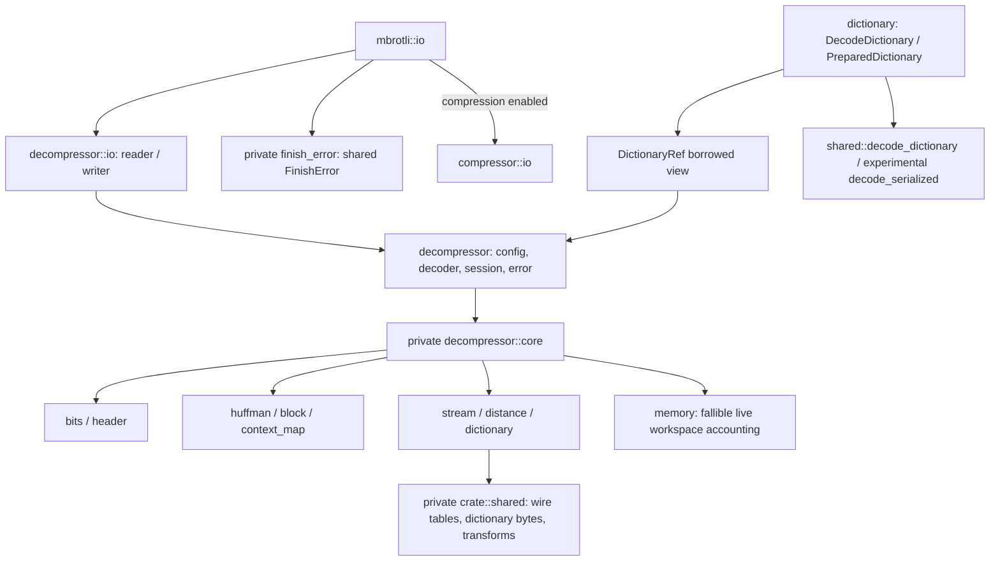
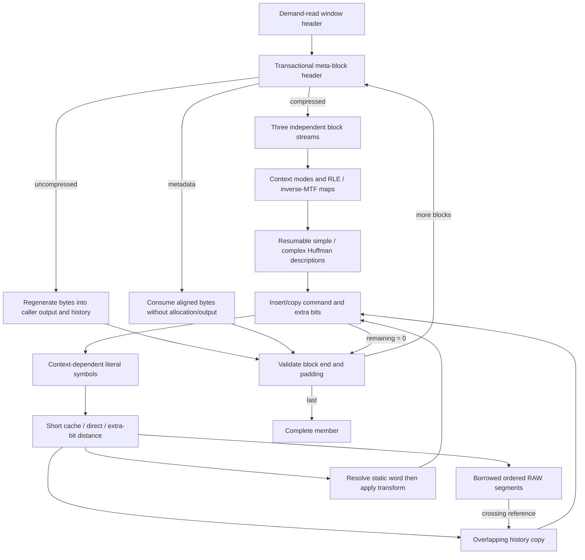
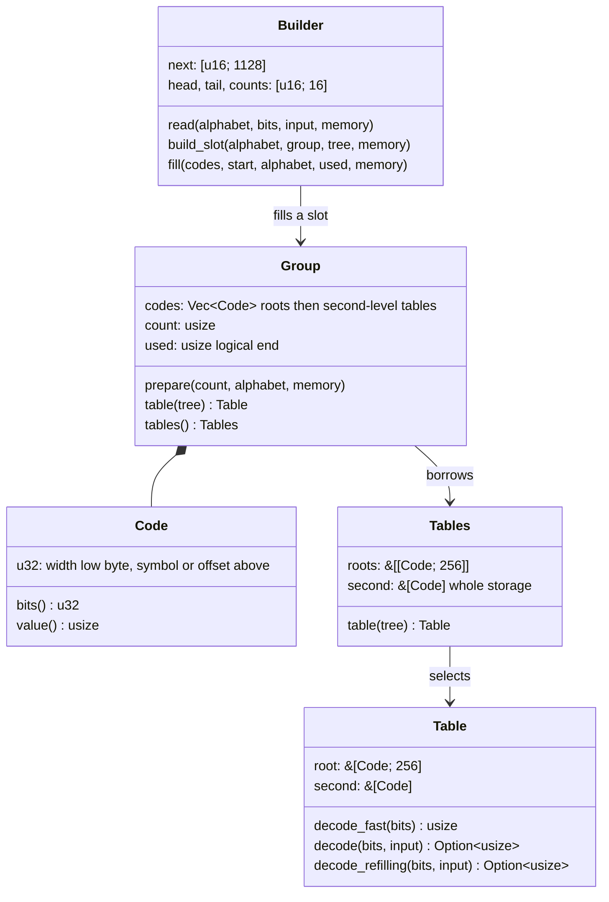
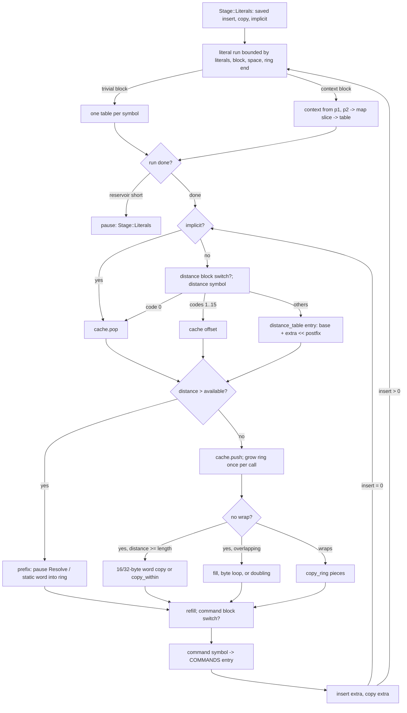
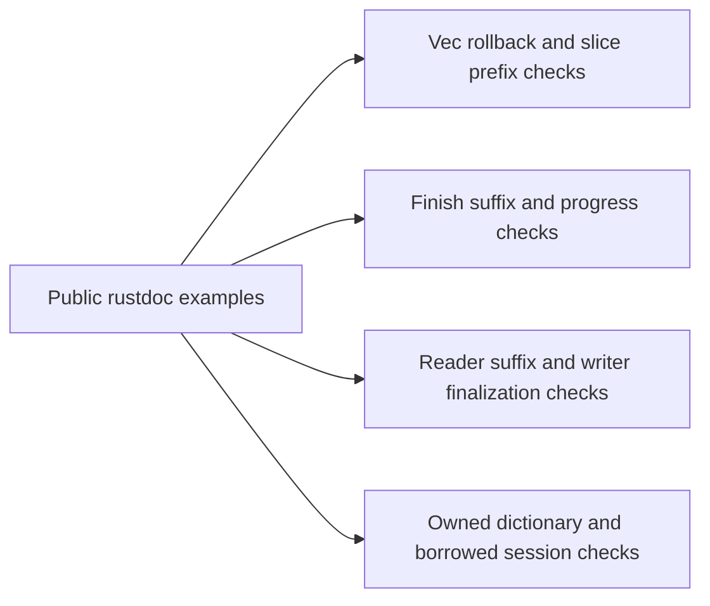

# Native decompressor

The `decompression` feature enables the public `decompressor` module, which owns configuration, reusable decoder ownership,
operation sessions, typed errors, and synchronous adapters. Its private `core`
owns wire parsing and regeneration. Production decoding uses safe Rust and
`alloc`, without a C or third-party decoder dependency. `no_std` disables I/O
adapters and profiling. Serialized/custom dictionaries require `experimental`;
RAW prefixes, built-in words/transforms, large windows, and ordinary context maps
need only `decompression`. Shared window, backend and retention types remain
available without the encoder. Prepared dictionary views additionally require
`compression`; see [codec features](codec-features.md).



## Public ownership and APIs

`Decompressor::new` and `builder` create an allocation-free workspace. A validated
`Backend` is selected once at construction; currently every backend uses the
same scalar decoder. There are no inner-loop feature checks or decoder SIMD
kernels. `fork_empty` copies policy/backend into an independent empty workspace.
`config`, `retention`, `retained_bytes`, `trim`, `recover`, and `reconfigure`
manage reuse without exposing core storage.

`DecoderConfig` combines `WindowLimit`, `MemberMode`, and `DecodeLimits`.
Default is `Single`, extended windows up to 62 bits, and no numeric budgets.
`DecodeStreamConfig` optionally specifies `OutputSize::Exact(u64)`, which is a
validation contract, never an allocation hint. Limits count accepted compressed
bytes, regenerated output, and live decoder-owned requested heap bytes. Input
and output totals span all concatenated members. Caller destinations, immutable
borrowed dictionaries, and fixed adapter buffers are excluded from workspace.

A bounded policy example:

```rust
use mbrotli::{DecodeLimits, DecoderConfig, Decompressor, WindowLimit};
let config = DecoderConfig::default()
    .with_window_limit(WindowLimit::standard(24)?)
    .with_limits(DecodeLimits::default()
        .with_max_input_bytes(Some(1 << 20))
        .with_max_output_bytes(Some(8 << 20))
        .with_max_workspace_bytes(Some(32 << 20)));
let mut decoder = Decompressor::new(config)?;
# Ok::<(), Box<dyn std::error::Error>>(())
```

`decompress` returns a Vec, `decompress_into` appends and returns its range, and
`decompress_to_slice` fills the caller's initialized slice. The Vec shapes first
run the session with no destination at all, which parses up to the first byte
of output, then reserve what the meta-block declares (`declared_remaining`, at
least a small geometric step, at most 16 MiB) so a stream usually gets one
reservation rather than a chain of copies; the unused tail is trimmed. Any Vec append is
rolled back on failure; a slice preserves the written prefix and untouched
suffix. `Single` one-shot calls reject tails. Dictionary variants accept
`impl Into<DictionaryRef<'dict>>` before the compressed source. Sessions borrow
the decoder and dictionary independently, without copying/rebuilding indexes.

## Session lifecycle and exact progress

```mermaid
stateDiagram-v2
    Idle --> Active: start / start_with_dictionary
    Active --> Active: Process / NeedsInput / NeedsOutput
    Active --> Finishing: first Finish latches total_in + input.len
    Finishing --> Finishing: Finish with exact unconsumed suffix
    Active --> Complete: validated Single member
    Finishing --> Complete: validated member and final input boundary
    Active --> Failed: format / resource error
    Finishing --> Failed: error / truncation / changed final-input contract
    Active --> Abandoned: mem::forget
    Finishing --> Abandoned: mem::forget
    Complete --> Abandoned: mem::forget
    Failed --> Abandoned: mem::forget
    Active --> Idle: Drop
    Finishing --> Idle: Drop
    Complete --> Idle: Drop
    Failed --> Idle: Drop
    Abandoned --> Idle: recover / successful reconfigure
```

`DecodeProgress` and `DecodeFailure` both report exact per-call consumed/produced
prefix lengths. Counters include failing-call progress. A failed session remains
terminal; a completed session returns zero progress and `Finished` again. Single
sessions stop exactly at the member boundary. Concatenated sessions reset window,
history, distances, contexts and entropy state between members, but keep aggregate
counters and policy; a boundary is `NeedsInput` until final EOF confirms success.
At least one member is required.

A session stores the dictionary borrow itself. The reusable workspace never
stores that reference, so forgetting a session cannot leave a dereferenceable
stale pointer. The owner active flag survives `trim`; only explicit recovery or
successful reconfiguration clears abandonment. Drop clears operation state and
applies the configured retention policy without I/O. Aggressive retains capacity;
CurrentConfig additionally releases it on configuration changes; Bounded releases
all workspace above its threshold; ReleaseAll releases on each operation drop.

## Parsing and regeneration



`Bits` uses a demand-driven 64-bit reservoir. The slow path accepts one byte at
a time and never accepts a byte beyond the field that needs it, so limits and
per-call progress stay byte-exact; it reads fields up to 56 bits and splits a
62-bit distance extra field across two reads. Small headers are parsed
transactionally; partial peeks retain bits, and a validated field commits by
dropping exactly its width. Padding must be zero.

The hot path uses a whole-word `refill`, which loads a full little-endian word
while at least eight acceptable bytes remain before the input limit, and a
matching `unread`, which returns every whole speculatively buffered byte. The
`Input` computes its acceptable prefix (`fast_end`) once at construction, and the
command loop refills through `refill_from` over that prefix with the cursor in a
local, so the hot loop keeps it in a register. The reservoir persists in the
stream across calls, so an input or output pause keeps its buffered bytes; only a
member boundary, where the session resets the workspace, unreads them so a
following member reads them again. Every description reader (`Builder`,
`ContextMap`, `Block`) decodes symbols through `decode_refilling`, which takes a
whole word when the input allows and otherwise falls back to byte-exact loading.

Huffman codes are two-level lookup tables. A 256-entry root is indexed by the
next eight stream bits; a code longer than eight bits selects a second-level
table through a root entry that carries the combined width and the absolute
offset of that table in the group's storage. An entry is one padding-free
`u32` (width in the low byte, symbol or offset above), so storage zero-fills
as a plain memory set. Complete codes fill every entry, so `decode_fast` needs
no per-symbol validity check, and a single-symbol code fills the root with
zero-width entries and consumes no bits. A `Group` keeps every code of one
kind for a meta-block in one vector: the roots first, one per code, then the
second-level tables appended as codes are built, so only tables that exist are
written. The vector's length is a high-water mark that only grows (zeroed only
when it grows) and `used` is the logical end, so a warm meta-block writes no
fill at all; `prepare` restarts the logical end without touching storage.
`Tables` borrows the whole group once so a loop that selects a code per symbol
pays one bounds check on the root. A single-slot group is an owned `Huffman`.
The resumable `Builder` reads a simple or complex description into an intrusive
linked list per code length, which is already canonical order, so building a
table walks only the symbols with a code rather than the alphabet: `fill`
counts canonical codes upward, turns each into its table key with a byte
bit-reversal table, and replicates it across the root or the current
second-level table, having grown the vector once to the alphabet's bound
(`second_bound`) when needed. `build` or `build_slot` fills an owned table or a
group slot; `reset` abandons a partial description.



The stream keeps a power-of-two history ring. `run` first attempts a fast path
that decodes whole commands while a whole-word refill and output room allow: it
reads the command, literal run and distance from the reservoir and writes
literals and copies straight into the ring. `Stage::Literals` re-enters the
same loop mid-command whenever a whole-word refill is possible, so a run that
paused on output resumes in bulk and only its byte-exact remainder decodes one
symbol at a time. Every hot quantity lives in a local
for the duration of the loop and is written back only when the loop pauses:
the bit reservoir, the input cursor, position, remaining length, the four-slot
recent-distance cache and the command fields the resumable stages read. Ring
bytes are delivered to the caller when a write reaches the ring end, when the
loop pauses and when an error returns, and the output space still free is
tracked as a running count that includes pending ring bytes, so no per-command
delivery is needed. State that depends only on a block type (the literal
context lookup, the block's 64-entry context map slice, whether that slice is
trivial, its single tree when it is, and the command, distance and distance
context map tables) is refreshed at block switches rather than per command.



The command symbol indexes a 1024-slot `COMMANDS` table (the 704-symbol
alphabet padded to a power of two, so a mask replaces a bounds check) that
carries both length bases and extra-bit widths, the implicit-distance flag, the
copy code for resumption and the distance context. Distances above the short
codes resolve through a per-meta-block `distance_table` filled from the distance
parameters, and reused when the layout repeats, so one lookup yields the extra
width and the base distance. The recent-distance cache is a ring with a push
index, like the reference's `dist_rb`: an implicit distance or explicit code 0
pops the most recent slot and the copy pushes it back, so every command ends
with one slot write and no branch; a command that pauses before its copy, or a
prefix or static-dictionary reference, pushes the popped value back first. The
fast path returns to the byte-exact stages at every point where input or output
can run short, and those stages produce identical results and errors for any
chunking. Raw blocks, copies and prefix runs regenerate in bulk ring pieces
rather than one byte at a time; metadata is skipped in bulk. A copy near the end
of a small, highly expanding input still bulk-copies because `Stage::Copy`
copies a whole run.

Regenerated bytes update caller output and the ring together; the two most recent
output bytes for literal context are read back from the ring. Raw blocks update
the same ring as compressed blocks. The ring grows on actual output: the fast
path grows it once per call to cover what the call can still produce (bounded
by the meta-block's remaining length and the caller's output room), otherwise it
doubles up to the window size, so declaring a large window does not allocate it
eagerly, and a full ring wraps rather than growing. Distances and cumulative
positions use `u64`; a meta-block header validates `position + MLEN` once so the
hot path adds without checks, while the byte-exact stages use checked
operations and `u128` for large-window wire distances. The theoretical large
alphabet is `16 + NDIRECT + (124 << NPOSTFIX)` even for small large-window
headers. Every reachable distance symbol must have a maximum represented
distance no larger than `(1 << 63) - 4`, which also keeps every table entry a
decoded symbol can select within `u64`.

Prefix addresses traverse attachments in order, including empty slots. A copy
crossing the prefix end continues through the history present at command start.
If its distance exceeds retained window length, reusable `prefix_history` scratch
preserves original history before emitted prefix bytes overwrite it; overlapping
copies repeat the original virtual prefix/history sequence. This follows
[RFC 9841 §3.2](https://www.rfc-editor.org/rfc/rfc9841.html#section-3.2); C 1.2.0
rejects references crossing the prefix end, so this path has independent fixture
and unit-test evidence. Static addresses are
resolved before emitting, and transformed byte count reduces the meta-block's
remaining output. Zero-output references with distance <= 120 are invalid, avoiding
zero-bit command loops. Dictionary references do not enter the history distance
cache; normal/prefix references follow short-code cache update rules.

## Allocation and dictionary boundaries

`Memory::resize` checks arithmetic and workspace policy before `try_reserve_exact`,
growing a non-empty buffer to at least twice its capacity so a workspace that
fills in steps reallocates a logarithmic number of times; `Memory::reserve` is
the capacity-only half. Growth conservatively includes both old and replacement
buffers, since an allocator may implement realloc as allocate/copy/free.
Reported retained bytes count current owned capacities. The history ring,
context maps, Huffman groups, the distance symbol table and rare
prefix-crossing scratch reuse capacity across operations; Huffman group storage
and the distance table never shrink, so a smaller meta-block does not
reinitialize them. There is no allocation per output byte or transform. Header-only and metadata-only
streams need no heap workspace.

`DecodeDictionary` copies RAW payloads without encoder search structures. Source
budget counts all supplied attachment bytes; owned budget includes peak storage
while replacing serialized descriptions. RAW is never magic-sniffed. Empty RAW
attachments consume one of 15 slots; an empty embedded serialized prefix does not.
Experimental `Description` owns source bytes and compact offsets/layouts, applies
C attachment replacement rules, validates list/transform/context indexes, and
resolves combinations through the borrowed view. The old custom mapping remains
live until a successful replacement; prefix-only descriptions reset it to built-in.
Prepared dictionaries resolve through their existing immutable static index and
prefix representation. Common transform application lives in `shared::dictionary`.

## Executable API contracts

Rustdoc examples beside the public decoder APIs exercise complete Vec/slice
decoding, append rollback, unchanged slice tails, output backpressure with a
two-byte buffer, exact-size validation, concatenated members, session recovery,
retention and independent workspaces. The session example advances by per-call
counts and reoffers precisely the remaining suffix under `Finish`; it also
checks aggregate counters and the accepted window header.

Reader examples recover protocol suffixes by chaining `unread_input` before the
returned source. Writer examples explicitly finalize and distinguish codec
completion from delivery and sink flushing. Decode-only dictionary examples run
without compression; the encoder/decoder prefix round-trip example is gated by
`compression`. They document that dictionary identity is a caller contract.



## I/O and error propagation

```mermaid
sequenceDiagram
    participant Caller
    participant Writer as DecoderWriter
    participant Session
    participant Sink
    Caller->>Writer: write(compressed)
    Writer->>Sink: drain pending outbox
    Writer->>Session: process(input, outbox, Process)
    Session-->>Writer: progress or failure with counts
    Writer->>Sink: write output, track exact cursor
    Writer-->>Caller: Ok(consumed) if input accepted; defer error
    Caller->>Writer: try_finish / retry
    Writer->>Session: Finish(empty), once and without new input
    Writer->>Sink: drain suffix, flush
    Writer-->>Caller: success or recoverable sink failure
```

Reader owns an 8 KiB compressed-input buffer and writes directly into caller output.
Empty reads do nothing. Interrupted retries; WouldBlock preserves state; physical
EOF declares Finish. An error after produced bytes is deferred to the next
nonempty read. Codec errors remain terminal; no false EOF follows them. Single
mode preserves read-ahead; `into_parts` returns source, unread suffix and verified
finished state.

Writer owns an 8 KiB output outbox with cursors. An operation accepting input
returns `Ok(n)` even if a codec or sink error follows; that error is deferred.
Produced bytes survive errors until delivered. Delivery of a failed codec's
outbox can retry without re-entering the codec. Interrupted retries, short writes
advance only their prefix, and write-zero is an error. Flush does not declare
EOF. Once finalization begins, new input is refused; only sink delivery/flush
can retry. `finish` uses the original `io::FinishError<Self>` type and retains the
adapter on failure. Drop performs no I/O.

`thiserror` public non-exhaustive errors categorize wire violations and resource,
size, policy, tail and lifecycle failures. Core returns these high-level categories
without exposing private implementation errors. `DecodeFailure` preserves the
source chain; conversion to `std::io::Error` retains the concrete codec error.

## Known gaps

The decoder uses scalar regeneration with two-level table Huffman lookup, a
whole-word bit reservoir, and bulk ring copies; every selected backend runs the
same scalar code and there is no decoder SIMD kernel. The vectorized parts are
what LLVM lowers from fixed-size word copies (`copy16`/`copy32` become 16-byte
loads and stores), `fill` and `copy_within` (`memset`/`memcpy`) and the
trivial-context detection reduction; Huffman symbol decoding is a serial
dependency chain and gains nothing from explicit SIMD. The prefix-crossing
history path and short static-dictionary words still emit byte by byte, which
does not affect the primary corpora. A first decode on a fresh workspace pays
about a dozen separate allocations (ring, three Huffman groups, block and
context-map codes, context maps, the distance table) and the one-time zero fill
of their storage, which dominates decoding of payloads of a kilobyte and below
in the cold shape; the per-meta-block tables are not yet folded into one arena.
The `Vec` destinations must zero-fill what they reserve, where an exact-size
caller buffer need not be touched twice. Compatibility evidence and remaining acceptance gaps
are tracked separately in
[decompressor compatibility](decompressor-compatibility.md). There is no container
parser, authentication, seek, or async runtime in this raw decoder.
