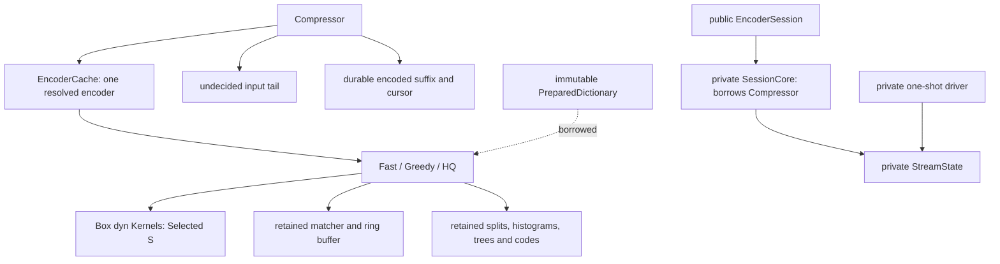
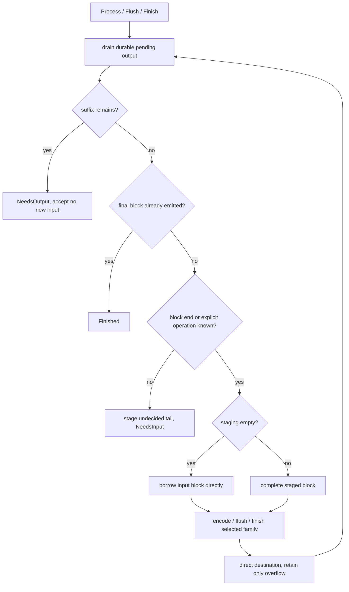
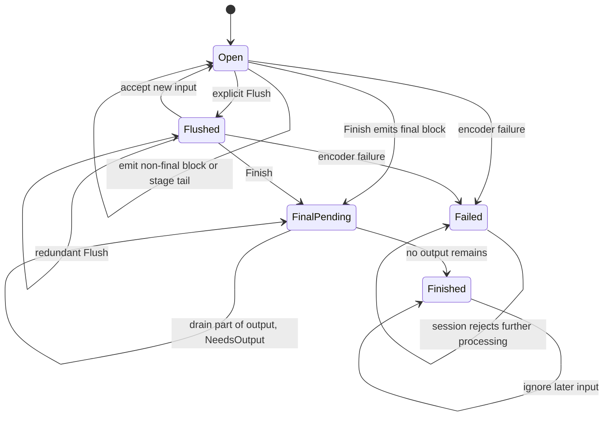
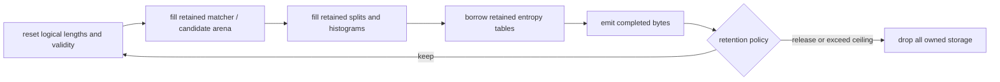
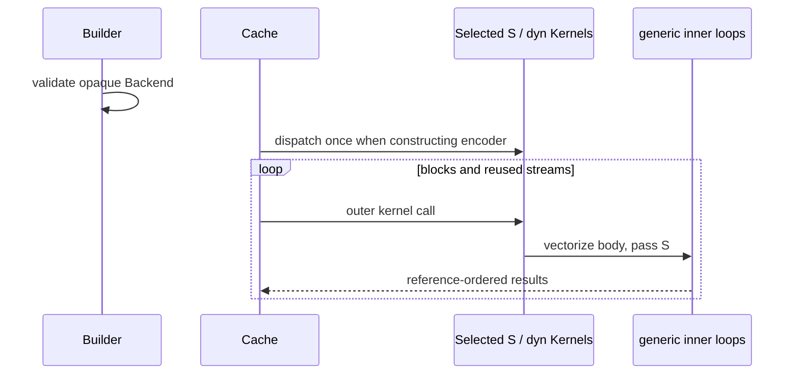

# Encoder workspace and Track A gap closure

This describes the implementation and local evidence on 2026-09-05. It does not
declare either externally authored track complete. Decompression is out of scope.
The working-tree baseline is `d6f8229`; the pinned C revision is `028fb5a`.

## Ownership and public boundary

`Compressor` owns one retained encoder, input staging and pending output. Public
configuration remains small and copyable. `Backend` is an opaque, host-validated
value: `Default` detects the host, `SCALAR` selects the independent baseline, and
`available()` enumerates distinct runnable backends. `with_backend` replaces the
old public SIMD-library argument; no SIMD or implementation type is exposed.



`retained_bytes` sums every owned heap allocation, including boxed state and
capacity rather than length for vectors. It excludes stack fields, caller output,
shared dictionaries and allocator bookkeeping. The allocator-instrumented
`compressor_memory` tests compare this sum with live requested heap bytes at all
qualities. This is allocation accounting, not a process-RSS estimate.

The configured retention policy applies after one-shot completion and when a
session drops, including through readers/writers. A finished session can retain
its resettable encoder; abandonment invalidates it first. `Bounded` releases the
workspace when its full accounting exceeds the ceiling. Session staging and
pending buffers obey the same policy. A forgotten session still requires
explicit `recover`; the exclusive borrow alone cannot detect `mem::forget`.

## One scheduler, borrowed complete blocks

`core::stream::StreamState` owns the phase, resolved block limit and continuation
restart flag. `core::session::SessionCore` owns the compressor/dictionary borrows,
checks logical positions, and translates private encoder errors into `EncodeError`.
One-shot vector and slice entry points call the same scheduler with `Finish`.



One-shot calls need no staging or pending allocation: all input and its finality
are known, and the output is an append destination or a non-resumable slice. Fast
encoders write directly to slices with enough fragment reservation; otherwise
completed bytes come from retained encoder scratch. Slice overflow returns a
private output-capacity error; sessions retain the suffix and report `NeedsOutput`.



`FinalPending` and `Finished` share the internal final phase; pending-buffer
emptiness distinguishes them. Public `is_finished()` is true only in the latter.
For experimental continuations, the logical position is checked before input
acceptance and advanced by consumed bytes. The two-byte restart uses the same
scheduler's flush action. Finished sessions ignore even input that would overflow
the logical-position limit.

The one-shot driver now omits C's outer empty-input and uncompressed-fallback
shortcuts, following the universal API identity decision in
[universal-encoding.md](universal-encoding.md). All output destinations receive
the same stream, or an output-capacity error. Vector appends roll back on failure.
Slice contents may be partially written on failure, as documented.

## Reusable entropy and search storage

Fast arena resets clear fixed tables in place while retaining command, literal
and tree vectors. Ring-buffer initialization resizes its existing allocation.
The shared meta-block writer retains tree/context-map scratch and all depth/bit
tables; block encoders borrow those tables. Move-to-front uses bounded stack
scratch. Greedy splitters accept their previous split and histogram storage.
HQ retains split/cluster/literal-cost storage and the full meta-block shape.

HQ prefix candidates occupy retained workspace. They merge backwards into the
existing match arena, without `split_off` or a temporary merge vector. Earlier
arena entries remain unchanged; the ordering remains ascending match length,
then smaller distance, with tree matches first on exact ties. Boundary tests pin
the tie rule using distinguishable dictionary length codes.



## Cold matcher allocation and SIMD

Bucket matchers retain counters and encoded offsets. q7–q9 allocate four starter
positions on first touch and promote a bucket once to its full reference depth
when a fifth slot is needed. Promotion copies the four valid positions in place
and keeps the old starter region allocated. The high offset bit marks sparse
storage; low bits encode base plus one. Counters determine validity, not stale
payload bytes. Reset preserves allocations and clears validity; it never demotes
a promoted bucket. Worst-case abandoned starters add four positions per bucket.
Forgetful-chain matchers materialize banks on first touch rather than allocating
every bank's slots up front. Their heads/counters likewise govern validity.

q5/q6 use parallel byte tags. A 16-byte `fearless_simd` comparison produces a
candidate mask; inactive circular slots are masked out and surviving slots are
visited newest first. The scalar backend deliberately scans without filtering as
an independent oracle. q7–q9 do not use tags: measured q9 tag overhead outweighed
the filtering benefit, so that experiment was removed.

Selection dispatch runs when an encoder is created. Its `Box<dyn Kernels>` stores
the selected proof token; current tokens are zero-sized. Each outer kernel call
enters the selected feature-enabled body and passes the token to generic inner
loops. There is no per-candidate feature detection or virtual call. Cache reuse
checks the backend discriminant and resolved parameter shape before reset.



## Bounded writer backpressure

The writer retains an initialized 128 KiB outbox; only `head..end` is live.
It does not clear/reinitialize the whole allocation for every sink write.
`write` drains previously owned bytes before accepting new input, pumps a bounded
session output, and returns the amount accepted. A sink error after acceptance
is deferred until the next drain, so callers do not replay input already owned.
`Flush` and `Finish` loop over bounded pulls. Finishing forbids new writes even
while final bytes await delivery. Fault-injection tests cover every output byte
position, short writes, `Interrupted`, `WouldBlock`, zero writes and retryable
flush/finalization failures.

## Local evidence and commands

The historical measurements below precede the universal-identity decision and
its change of C benchmark API. They are not before/after evidence for that change.
Measurements used Apple M5 Pro/AArch64, optimized builds, lgwin 22 and the same
bytes as pinned C. They are exploratory: host frequency and background load were
not pinned. They do **not** satisfy the cross-platform release gates.

| Case | Before | After | C comparison |
| --- | --- | --- | --- |
| Cold q9, 16 bytes | 132.48 µs eager setup | 5.78 µs sparse setup | 3.62 µs; 20 compressed bytes for both |
| Cold q9, 1 MiB benchmark text | 5.07 ms full lazy payloads | 2.57 ms sparse promotion | 1.73 ms; byte-identical output |
| Cold q5, same text | 2.29 ms before promotion experiment | 2.38 ms (q5 layout unchanged) | 1.45 ms; byte-identical output |

A separate scheduler before/after run used the same benchmark binary settings,
10 samples, one-second warmup and two-second measurement. Text output remained
7,542 bytes at q9 and 10,001 bytes at q1. Central time estimates were:

| API / 1 MiB text | Separate scheduler | Shared scheduler | C after |
| --- | --- | --- | --- |
| Cold q9 | 2.451 ms | 2.442 ms | 1.627 ms |
| q1 streaming writer | 184.4 µs | 174.7 µs | 204.5 µs |
| q1 streaming reader | 220.7 µs | 216.3 µs | 204.5 µs |
| q1 session | 174.2 µs | 173.6 µs | 204.5 µs |

The q9 C/Rust ratio is still only 0.666; the q1 reader ratio is 0.945. The C
streaming measurement uses the normalized chunk contract described in
[compressor.md](compressor.md), with staging charged to C. Background load was
not controlled, so these short runs establish neither universal speedups nor
release acceptance. Both benchmark executables reported a 4,538,368-byte
Mach-O `__TEXT` segment; this is not a library-only code-size measurement.

The original allocation profile attributed 13.38 ms of 44.88 ms to bucket
construction and about 3.8 GB of cumulative allocations to 100 cold q9 calls.
The later function-level CPU profile put backward-reference search at 66.8% of
118.6 ms, and acquisition/construction at about 0.14%. The optional sampled
profiler was unavailable; these are `hotpath` instrumented function timings.

Representative commands (reports remain uncommitted under `target/`):

```sh
cargo run --release --features hotpath-alloc --example profile_compressor -- brotli-ffi/vendor/brotli/tests/testdata/alice29.txt
cargo rustc --release --lib --locked -- --emit=asm
cargo bench --bench compress --locked -- 'cold/q(5|9)/(c-brotli|mbrotli)/text-1MiB|tiny/q9/(c-brotli|mbrotli)/16$' --sample-size 10 --warm-up-time 1 --measurement-time 2
CARGO_PROFILE_TEST_OPT_LEVEL=1 cargo test --workspace --all-features --locked
CARGO_PROFILE_TEST_OPT_LEVEL=1 CARGO_TARGET_DIR=target/track-a-coverage cargo llvm-cov --workspace --all-features --locked --json --output-path target/track-a-coverage-unified.json
cargo +nightly miri test --lib compressor::core::shared::ringbuffer::tests
```

The optimized test profile keeps debug assertions and overflow checks enabled.
The post-unification library report `target/track-a-coverage-complete.json`
reaches all 1,944 reported functions (100%).
The complete workspace run passed 959 tests including doctests. A separate
instrumented Criterion `--test` run reaches all 70 source functions/closures in
`benches/compress.rs` after grouping repeated build instances by source location.
The profiling example's `main` is also covered by a default-feature instrumented
run; its all-feature profiling macro does not retain that function's coverage map.
Use `CARGO_PROFILE_TEST_OPT_LEVEL=1` for Criterion coverage, since `llvm-cov
--bench` uses the test profile, not the bench profile.
The full suite includes C differential, scalar/host-SIMD, lifecycle, streaming,
dictionary, framing, allocator tests and doctests. Focused Miri runs also cover
prefix merging and sparse bucket promotion; ASan covers reuse, adapters,
dictionary and backend equivalence. ASan instruments Rust, not the C oracle.

Bounded AFL campaigns cover lifecycle, streaming, C differential and dictionary
parsing. After scheduler unification, two fresh 60-second runs completed 146,196
streaming cases and 161,157 output-capacity cases, each with 99.98% stability,
zero crashes and zero saved hangs. The serialized-dictionary campaign saved one 16-byte timeout and no
crashes. Isolated replay terminates normally; the input is a truncated transform
list and is retained as a deterministic parser unit regression. It is not being
reported as a confirmed hang or silently counted as a clean timeout-free run.

## Known gaps and acceptance gates

- The contract decision is resolved in favor of universal Rust API identity.
  Native C API differences are documented and tested, not hidden behind input
  exclusions or output-size-based differential exceptions.
- q5/q9 measurements still miss the required C throughput ratios. A complete
  per-quality, per-API cold/warm/ratio/RSS matrix on AVX2 and NEON remains open.
  Local NEON tests and CI configuration are not evidence of an executed AVX2 run.
- Wide-window streams above the C decoder's limit still lack an independent
  decoder oracle for their original headers; header-adjusted checks are narrower
  evidence, not full independent conformance validation.
- One cache slot means alternating incompatible configurations rebuilds state.
  The configured retention policies do not imply per-family multi-slot caching.
- CI now includes coverage, Miri, ASan and both benchmark architectures, but no
  remote execution or stable-hardware performance acceptance is claimed here.
- Comparable process peak-RSS before/after measurements remain unavailable.
  Zero warmed allocations and exact retained requested-byte accounting are
  independently tested; neither substitutes for the RSS gate.
