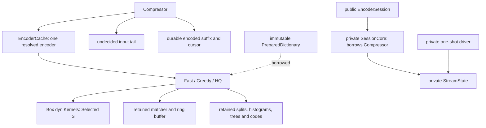
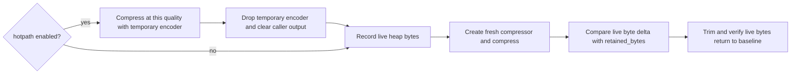
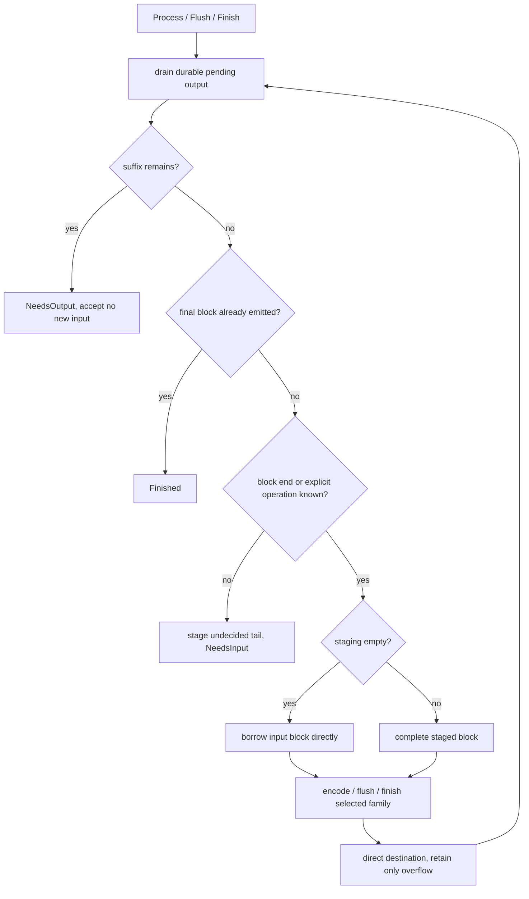
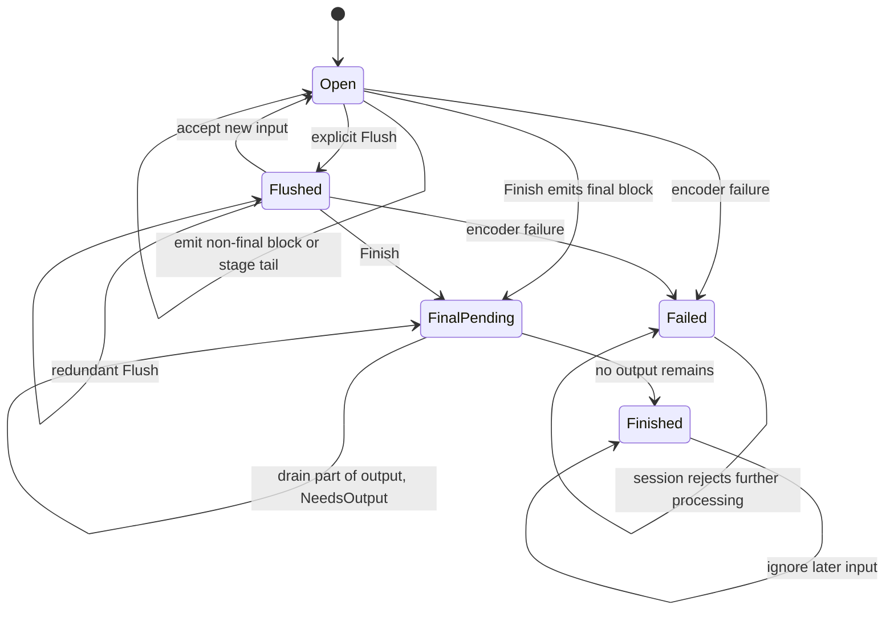
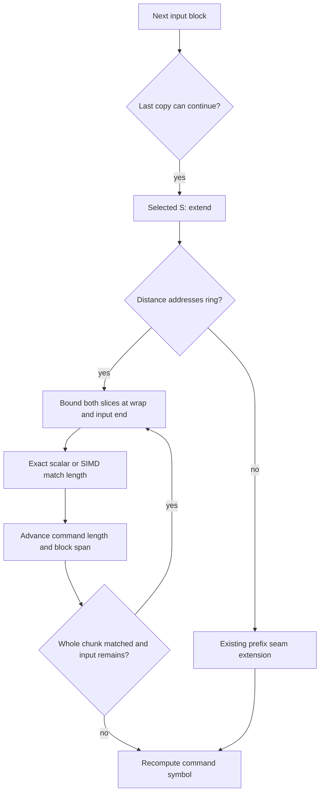
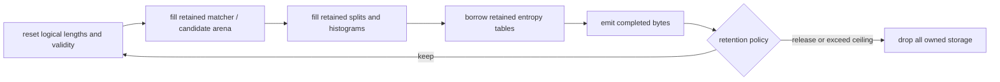
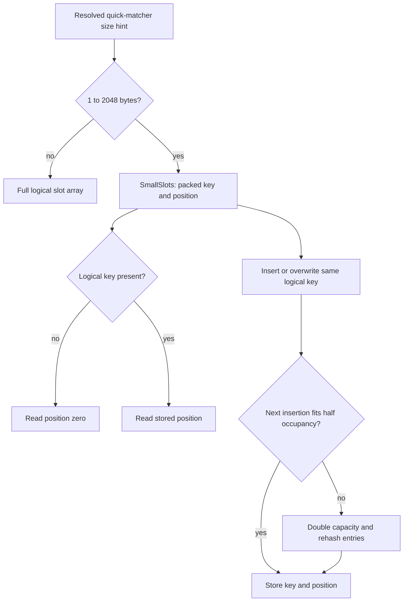
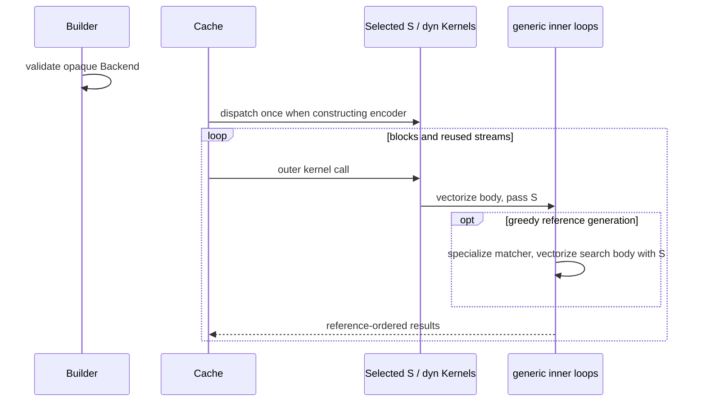

# Encoder workspace

Retained encoder storage, shared stream scheduling, SIMD dispatch, and writer
backpressure live behind the public compressor API.

## Ownership and public boundary

`Compressor` owns one retained encoder, input staging and pending output. Public
configuration remains small and copyable. `Backend` is an opaque, host-validated
value: `Default` detects the host, `SCALAR` selects the independent baseline, and
`available()` enumerates distinct runnable backends. `with_backend` selects one
through the builder; no SIMD or implementation type is exposed.

`retained_bytes` sums every owned heap allocation, including boxed state and
capacity rather than length for vectors. It excludes stack fields, caller output,
shared dictionaries and allocator bookkeeping. The allocator-instrumented
`compressor_memory` tests compare this sum with live requested heap bytes at all
qualities. With `hotpath` enabled, each quality first runs through a temporary
compressor to initialize profiling storage outside the measured interval. That
compressor is dropped before measuring a fresh compressor, so cold workspace
allocations and their release remain covered. This is allocation accounting,
not a process-RSS estimate.

The configured retention policy applies after one-shot completion and when a
session drops, including through readers/writers. A finished session can retain
its resettable encoder; abandonment invalidates it first. `Bounded` releases the
workspace when its full accounting exceeds the ceiling. Session staging and
pending buffers obey the same policy. A forgotten session still requires
explicit `recover`; the exclusive borrow alone cannot detect `mem::forget`.

## One scheduler, borrowed complete blocks

`core::stream::StreamState` owns the phase, resolved block limit and continuation
restart flag. `core::session::SessionCore` owns the compressor/dictionary borrows,
checks logical positions, and translates private encoder errors into `EncodeError`.
One-shot vector and slice entry points call the same scheduler with `Finish`.

One-shot calls need no staging or pending allocation: all input and its finality
are known, and the output is an append destination or a non-resumable slice. Fast
encoders write directly to slices with enough fragment reservation and into
append destinations through a statically specialized growing bit writer. Other
output paths use retained encoder scratch. [Bit output](bit-output.md) describes
the storage and partial-byte invariants. Slice overflow returns a
private output-capacity error; sessions retain the suffix and report `NeedsOutput`.

`FinalPending` and `Finished` share the internal final phase; pending-buffer
emptiness distinguishes them. Public `is_finished()` is true only in the latter.
For experimental continuations, the logical position is checked before input
acceptance and advanced by consumed bytes. The two-byte restart uses the same
scheduler's flush action. Finished sessions ignore even input that would overflow
the logical-position limit.

The one-shot driver shares the streaming finish path described in
[universal-encoding.md](universal-encoding.md). All output destinations receive
the same stream, or an output-capacity error. Vector appends roll back on failure.
Slice contents may be partially written on failure, as documented.

## Extending copies across input blocks

Greedy and HQ encoders pass a borrowed `CommandExtension` to their retained
`Kernels::extend` entry. Its feature-enabled closure calls the shared exact
match-length scan. Each scan is bounded by both physical wrap points and the
remaining input; a fully matching chunk advances the command and repeats after
wrapping either index. The dictionary-prefix branch retains its existing seam
handling. No public API or error variant changes.

## Reusable entropy and search storage

Fast arena resets clear fixed tables in place while retaining command, literal
and tree vectors. Before its first wrap, the ring buffer allocates only the
written prefix plus seven lookahead bytes. Its logical size and mask remain fixed.
Before reaching the last two window bytes or reading into the tail, it allocates
the complete layout and replays deferred tail copies. A short first write retains
the reference's omitted tail range and sentinel. Reset retains capacity and
restores the prefix-growth state; subsequent writes restore head and margin bytes.
The shared meta-block writer starts with empty vectors and no context-map arena.
It materializes scratch only when an entropy code needs it, then retains it. A q2
block using static command/distance codes allocates only literal depths/bits and
a tree bounded by its literal count. Full and trivial codes prepare their larger
tables; the context-map arena is initialized on first use. Block encoders borrow
the retained tables. Move-to-front uses bounded stack
scratch. Greedy splitters accept their previous split and histogram storage.
HQ retains split/cluster/literal-cost storage and the full meta-block shape.

HQ prefix candidates occupy retained workspace. They merge backwards into the
existing match arena, without `split_off` or a temporary merge vector. Earlier
arena entries remain unchanged; the ordering remains ascending match length,
then smaller distance, with tree matches first on exact ties. Boundary tests pin
the tie rule using distinguishable dictionary length codes.

## Cold matcher allocation and SIMD

Quick H2/H3/H4 matchers use `SmallSlots` when the resolved size hint is between
1 and 2048 bytes. It stores packed logical hash keys and positions in one open
addressed vector; a missing key reads as position zero, exactly like a fresh full
table. Keys are bounded by the quick matcher's logical bucket range, so the
all-ones packed value is an unambiguous empty marker even for a `u32::MAX`
position. Linear probing and growth never change the logical slot or candidate order.
The vector starts at 32 entries on first insertion, doubles before exceeding half
occupancy, and retains capacity across clearing. A small hint may underestimate
the stream: growth preserves correctness. Other hints use the full quick table.
The matcher variant is selected before scanning, so large-input scans have no
compact-map branch inside their loops.

Bucket matchers pick one of three layouts per stream; see the
[greedy encoder](greedy-encoder.md#23-storage-layouts-runs-and-sweeps) for the
selection rule. A compact key map or a table of generation-stamped entries
activates blocks on demand: deep q7–q9 blocks start with four slots and are
promoted once, in place, to the reference depth when a fifth is stored, with
the starter left allocated. The dense layout, taken only when the matcher was
built for a size hint of at least the shape's dense limit (an eighth of the
table for tagged q5/q6 shapes, half of it for deep q7–q9 shapes, so that a
256 KiB input takes the dense table on every shape), preallocates every block at
`key << block_bits`, zeroed once per matcher, and clears only its `u16`
counters per stream. Counters, or the generation stamp, govern validity; a
block's stale bytes are never read. Preparation reports `Sweep::SelfCleaning`,
so a reset neither replays a sweep nor marks the table dirty, and a warmed
compressor allocates nothing whichever layout its next stream selects.
The quick matchers' `SmallSlots` map is sized for the input at preparation,
even on a fresh encoder, so it never rehashes during the stream.

Forgetful-chain matchers materialize banks on first touch rather than allocating
every bank's slots up front. Their heads/counters likewise govern validity.

q5/q6 use parallel byte tags. One `fearless_simd` comparison covers the complete
16- or 32-position bucket; slots fill downwards, so rotating the mask by the
newest slot and splitting it at that slot yields the newest-to-oldest order as
two ascending scans. Unfilled slots are masked off. The scalar backend, and any
four-slot starter block, deliberately scan without filtering as an independent
oracle. q7–q9 use untagged bucket scans. Per input block the search loop works
through a `MatchRun` view that holds the tables as slices bound once, the way
the reference keeps `restrict` pointers, so a store never forces the loop to
reload the table it is about to read.

Selection dispatch runs when an encoder is created. Its `Box<dyn Kernels>` stores
the selected proof token; current tokens are zero-sized. Each outer kernel call
enters the selected feature-enabled body and passes the token to generic inner
loops. There is no per-candidate feature detection or virtual call. Cache reuse
checks the backend discriminant and resolved parameter shape before reset.

After matcher specialization, greedy reference generation enters `S::vectorize`
around its search body, keeping tag and match-length operations in the selected
feature context. This static entry stays outside the loop and uses the existing
token. An out-of-line baseline compilation would require a feature-enabled helper
call per SIMD operation even though the correct token had already been selected.

## Bounded writer backpressure

The writer retains an initialized 128 KiB outbox; only `head..end` is live.
It does not clear/reinitialize the whole allocation for every sink write.
`write` drains previously owned bytes before accepting new input, pumps a bounded
session output, and returns the amount accepted. A sink error after acceptance
is deferred until the next drain, so callers do not replay input already owned.
`Flush` and `Finish` loop over bounded pulls. Finishing forbids new writes even
while final bytes await delivery. Fault-injection tests cover every output byte
position, short writes, `Interrupted`, `WouldBlock`, zero writes and retryable
flush/finalization failures.

## Verification

Allocator-instrumented tests check retained requested-byte accounting and warmed
allocation behavior. Lifecycle and streaming tests cover workspace reuse,
retention, abandonment, recovery and writer backpressure. Private tests cover
sparse promotion, prefix merge ordering and baseline/host-SIMD equivalence.

See [development checks](../docs/development.md) and
[benchmarking](../docs/benchmarking.md) for commands.

## Known gaps

- The cache has one slot; alternating incompatible resolved settings rebuilds it.
- Retained-byte accounting excludes allocator overhead and is not process RSS.
- Host-backend tests only exercise instruction sets available on the test host.
