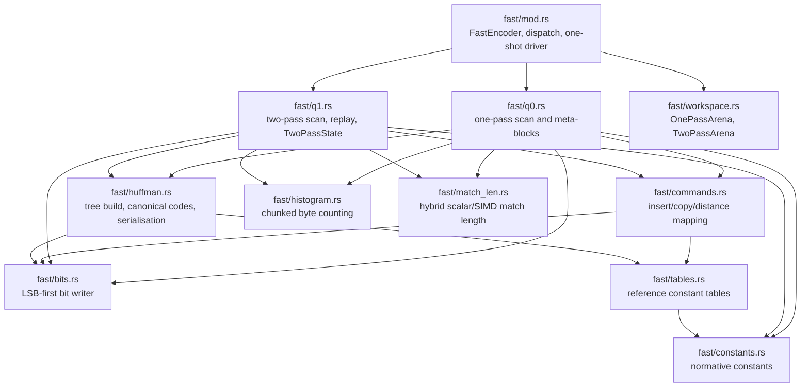
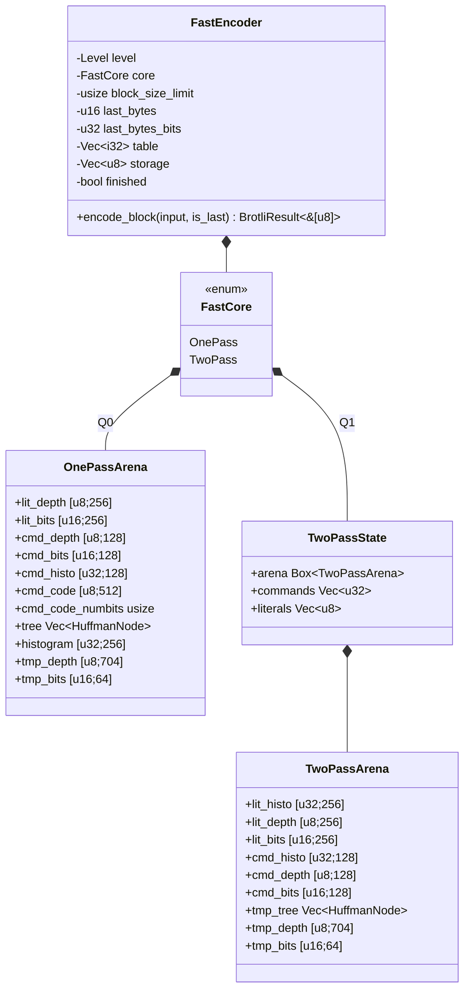
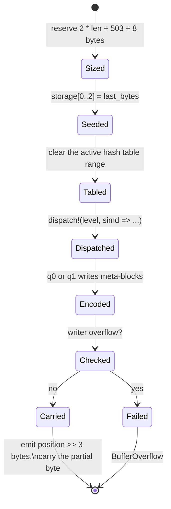
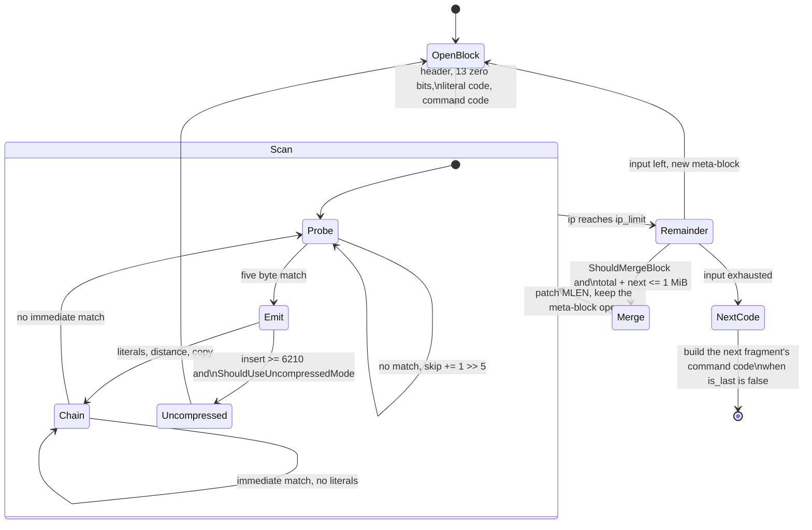
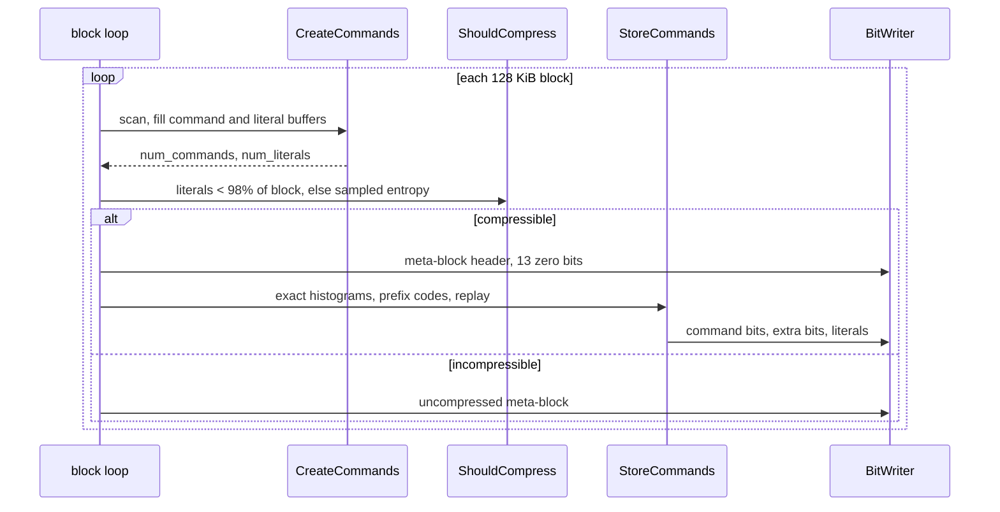
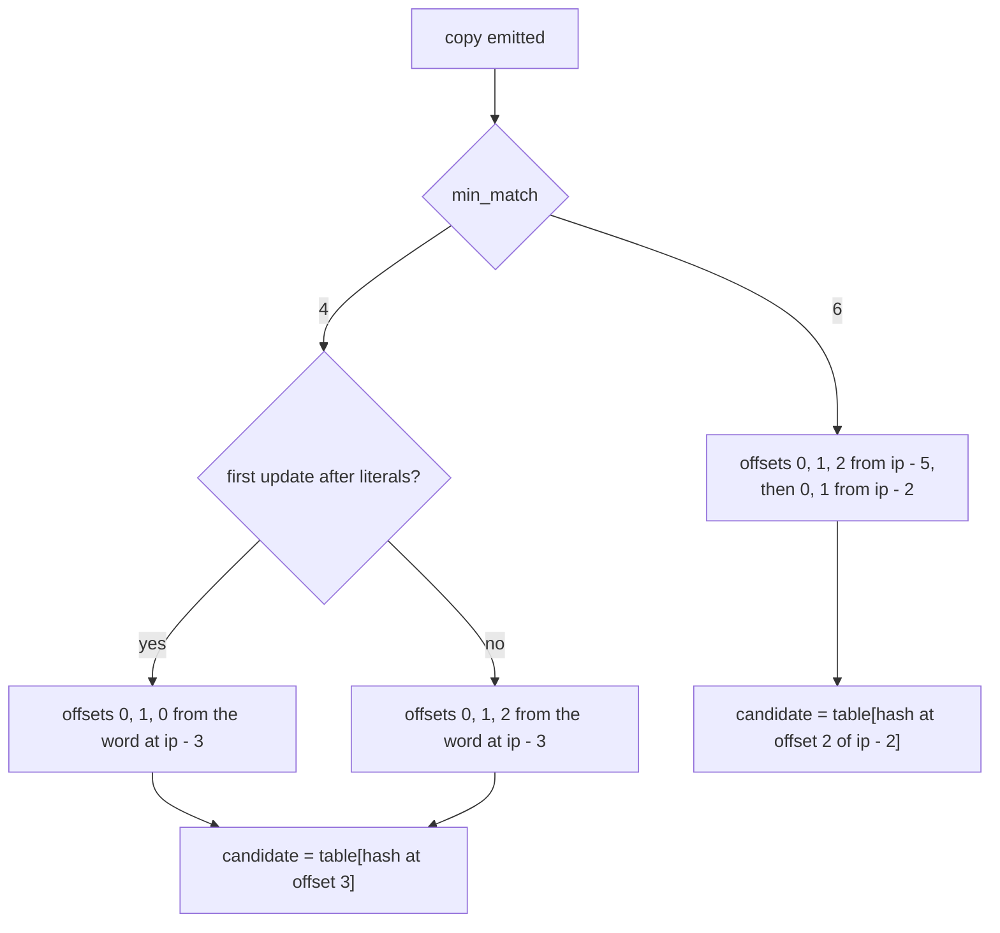
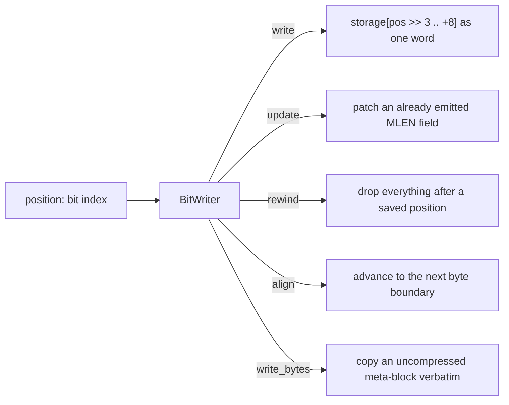
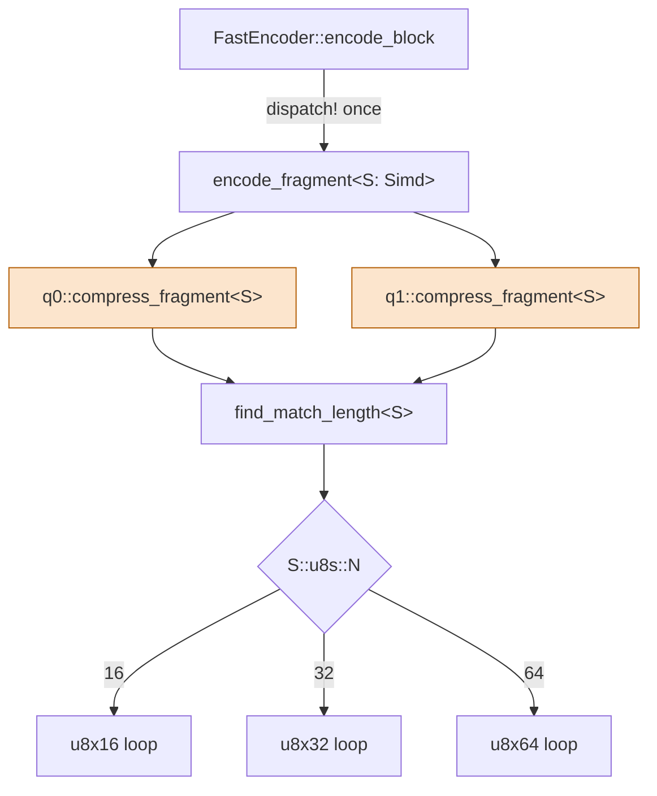
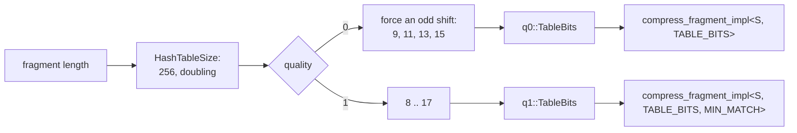

# Fast Encoder Core (quality 0 and quality 1)

Scope: `src/compressor/core/fast/`. This is the implementation of the two fast
Brotli qualities: a one-pass encoder (quality 0) and a two-pass encoder
(quality 1), both ported from Google Brotli v1.2.0, commit `028fb5a`, and both
byte-identical to it.

Everything here is private. No type, error or SIMD detail from this tree
appears in the public API; [compressor.md](compressor.md) describes the surface
that wraps it.

## 1. Module map

## 2. Ownership and reuse

`FastEncoder` owns every buffer the encoder needs and reuses them across
fragments, so after construction no allocation happens inside a match scan or a
command replay.

The hash table and the scratch output buffer grow but never shrink. Only the
active table range is cleared between fragments; unused capacity is left
untouched. A buffer that has to grow is replaced by a freshly zeroed
allocation rather than resized in place, because the allocator hands out zero
pages while a resize would memset a region the encoder immediately overwrites.

## 3. Fragment lifecycle

Every call to `encode_block` handles one fragment of at most `1 << lgwin`
bytes, mirroring `BrotliEncoderCompressStreamFast`.

The trailing partial byte is never emitted: it is kept in `last_bytes` and
re-seeded into the next fragment's scratch buffer, exactly as the reference
carries `s->last_bytes_`.

## 4. Quality 0: one pass

Observable decisions preserved verbatim from the reference:

- the repeat candidate (`ip - last_distance`) is tested **before** the hash
  table candidate;
- the hash table is written at the same points and in the same order;
- post-copy hash updates cover `ip - 3`, `ip - 2`, `ip - 1` and `ip`, taken
  from a single word load;
- `ShouldMergeBlock` uses stride 43 and the current literal depths;
- the final size guard rewrites the whole fragment verbatim when the compressed
  form exceeds `31 + 8 * len` bits.

## 5. Quality 1: two passes

The first pass stores each command as a packed `u32`: the low eight bits are
the fast command code (`0..128`) and the high bits carry the extra value. The
second pass builds exact literal and command histograms from those buffers,
seeds command codes 1, 2, 64 and 84, and replays the buffer.

### 5.1. Post-copy hash updates

The pinned reference contains an asymmetry that changes the command stream:
with `min_match == 4`, the first post-match update path hashes offsets
`0, 1, 0` where the chained path hashes `0, 1, 2`.

`update_hashes_after_copy` takes a `FIRST_UPDATE` const parameter that
reproduces it. A targeted unit test pins the difference so the quirk cannot be
"fixed" by accident.

## 6. Bitstream layer

`write` materialises a whole 64-bit word, which is what clears the bits above
the new position — the same trick the reference uses — so the buffer keeps
eight bytes of headroom past the largest position the encoder reaches. Writes
past the end of the buffer set an overflow flag instead of panicking, and the
encoder turns that into `BufferOverflow`.

Meta-block layout for a compressed fast-path block:

| Field | Width | Source |
| --- | --- | --- |
| `ISLAST` | 1 | always 0 for a data block |
| `MNIBBLES - 4` | 2 | 4, 5 or 6 nibbles by length |
| `MLEN - 1` | 16, 20 or 24 | block length |
| `ISUNCOMPRESSED` | 1 | 0 for a compressed block |
| block splits / contexts | 13 | always zero on the fast path |
| literal prefix code | variable | `build_and_store_huffman_tree_fast` |
| command prefix code | variable | full 704 symbol alphabet |
| distance prefix code | variable | 64 symbols |
| commands, extras, literals | variable | the scan |

## 7. SIMD dispatch points

Only the exact match-length scan is vectorised. Hash lookups, candidate
selection, skip logic, command encoding, the bit writer and the Huffman builder
all stay scalar, in reference order. The lane count is resolved into a const
parameter at monomorphisation time so the vector loop can split its windows
with `as_chunks` and load them with `load_array_ref`, which leaves neither a
bounds check nor a length assertion in the loop.

`find_match_length` is a four-stage pipeline: a 16-byte scalar word prefix,
then native vectors, then whole words, then single bytes. The staging only
changes how a length is discovered, never which length it is, so every backend
emits identical bytes.

## 8. Table-bit specialisation

The table width and, for quality 1, the minimum match length are const
parameters, so the shift and the match predicate are compile-time constants
inside the hot loop. Re-slicing the table to `1 << TABLE_BITS` at the top of
the implementation lets the bounds check on every hash lookup fold away,
because the hash is a `64 - TABLE_BITS` shift.

## 9. Data-processing loops

Bulk loops are written as chunked iterators rather than indexed loops, which
removes their bounds checks without any unsafe code:

| Loop | Shape |
| --- | --- |
| `match_len_words` | `as_chunks::<8>` over both windows, zipped |
| `match_len_vectors_*` | `as_chunks::<LANES>` plus `load_array_ref` |
| `match_len_bytes` | `zip` + `take_while` over the tails |
| `histogram::accumulate` | `as_chunks::<4>` into four independent counters, scalar tail |
| `emit_literals` (q0) | `as_chunks::<2>`, two codes per bit-writer call |
| `pack_literals` (q1) | greedy accumulation up to the writer's 56 bit limit |

## Known gaps

- **No static dictionary matching**, no block splitting and no context
  modelling: out of scope for both fast qualities, as in the reference.
- **`ShouldMergeBlock` and `ShouldCompress` use floating point.** They
  reproduce the reference's `double` arithmetic, including its
  single-precision `log2` table, because the decisions are observable in the
  output.
- **The command prefix code carries stale depths for symbols with a zero
  count.** `create_huffman_tree` writes depths only for symbols that appear,
  exactly as the reference does; the seed histogram guarantees every symbol
  that can be emitted has a non-zero count.
- **Throughput has not reached the reference on every corpus.** See
  `docs/q0_q1_benchmarks.md` for measured ratios and the buckets that are still
  behind.
