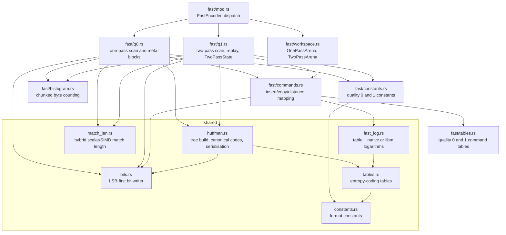
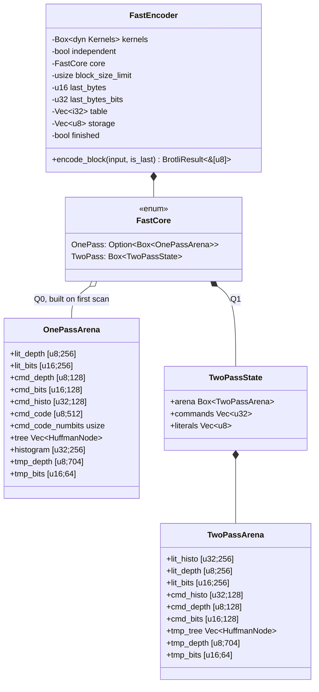
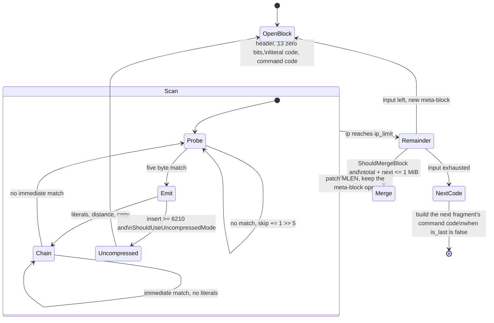
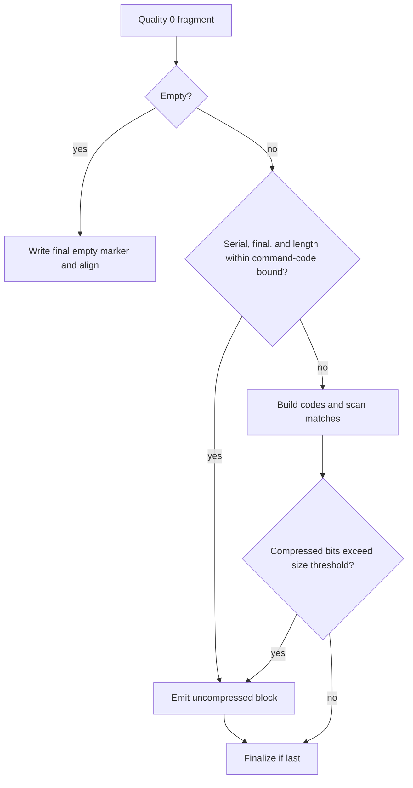
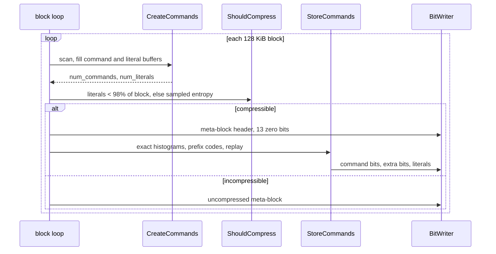
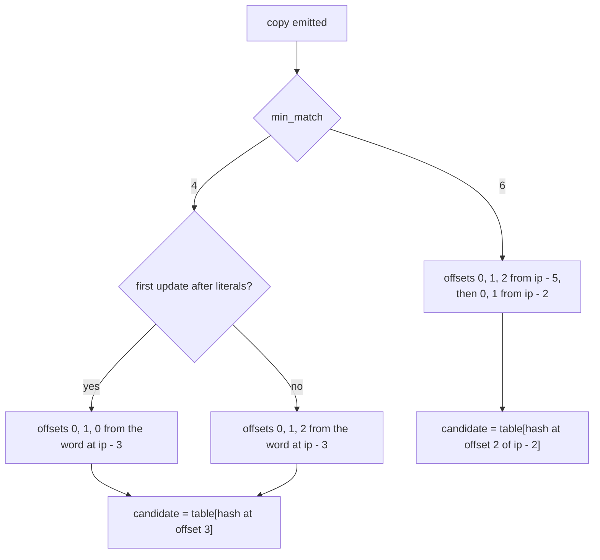
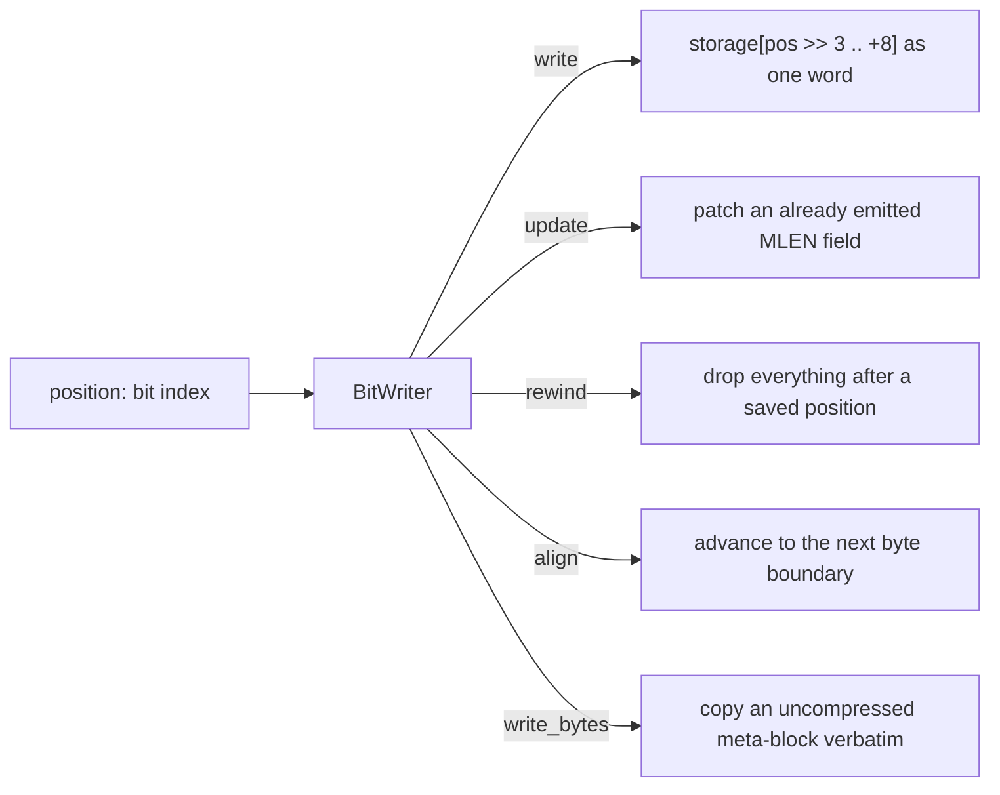
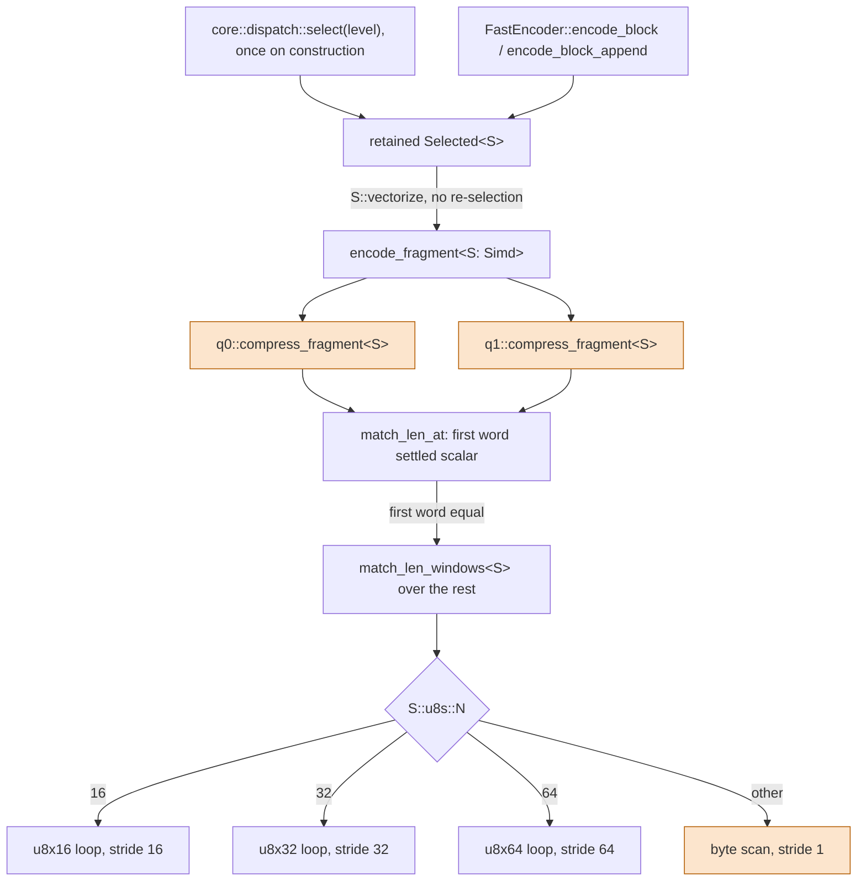
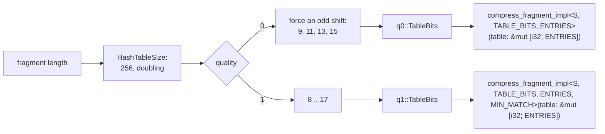

# Fast Encoder Core (quality 0 and quality 1)

Scope: `src/compressor/core/fast/`, and the parts of
`src/shared/` it uses. This is the implementation of the two fast
Brotli qualities: a one-pass encoder (quality 0) and a two-pass encoder
(quality 1), both ported from Google Brotli v1.2.0, commit `028fb5a`, and both
byte-identical to it.

Everything here is private. No type, error or SIMD detail from this tree
appears in the public API; [compressor.md](compressor.md) describes the surface
that wraps it.

## 1. Module map



The bit writer, the Huffman builders, the match-length scan, the reference
logarithms and the entropy-coding tables live in `shared`
rather than in this tree, because the greedy encoder needs exactly the same
implementations; see [greedy-encoder.md](greedy-encoder.md).

## 2. Ownership and reuse

`FastEncoder` retains its hash table, entropy workspace and scratch across
fragments. One-shot append output uses the caller's reserved vector through a
statically specialized bit writer; slice and I/O output retain their existing
fixed-buffer paths. [Bit output](bit-output.md) specifies initialization,
reservation, overflow and partial-byte handling.

The quality 0 arena is not built by the constructor. `FastCore::OnePass`
holds an `Option<Box<OnePassArena>>` that the first fragment needing a match
scan fills in; a stream whose only fragment is stored verbatim (§5) never
allocates it, never clears a hash table, and never touches the Huffman node
pool. The encoder also records whether its kernels are the fragment-only ones
of an independent worker (`independent`), because that decides whether the
verbatim shortcut applies.



The hash table and the scratch output buffer grow but never shrink. Only the
active table range is cleared between fragments; unused capacity is left
untouched. A buffer that has to grow is replaced by a freshly zeroed
allocation. The Huffman node pools (`tree`, `tmp_tree`) start empty and are
sized by each build to the symbols it actually uses, see
[encoder-workspace.md](encoder-workspace.md).

## 3. Fragment lifecycle

Every call to `encode_block` handles one fragment of at most `1 << lgwin`
bytes, mirroring `BrotliEncoderCompressStreamFast`.

```mermaid
stateDiagram-v2
    [*] --> Sized: reserve 2 * len + 503 + 8 bytes
    Sized --> Seeded: storage[0..2] = last_bytes
    Seeded --> Verbatim: FastCore::stores_verbatim (final q0 fragment within the bound)
    Verbatim --> Encoded: raw meta-block and closing bits, no table, no arena
    Seeded --> Tabled: clear the active hash table range
    Tabled --> Dispatched: retained kernel, S::vectorize
    Dispatched --> Encoded: q0 or q1 writes meta-blocks
    Encoded --> Checked: writer overflow?
    Checked --> Failed: yes
    Checked --> Carried: no
    Carried --> [*]: emit position >> 3 bytes,\ncarry the partial byte
    Failed --> [*]: BufferOverflow
```

The trailing partial byte is never emitted: it is kept in `last_bytes` and
re-seeded into the next fragment's scratch or append destination, exactly as the reference
carries `s->last_bytes_`.

## 4. Quality 0: one pass



The scan follows this order:

- the repeat candidate (`ip - last_distance`) is tested **before** the hash
  table candidate; the reference subtracts without a sign test and rejects a
  candidate at or past `ip` after comparing, and as both tests are pure the
  port tests `repeated < ip` first, which reads nothing for the initial
  distance of minus one;
- the word at the next position is loaded once: it is hashed for the table
  lookup and kept as the word the candidates are compared against when the
  scan reaches that position (`words_match` on two loaded words), so the
  table store between the two candidate tests never forces a reload;
- the hash table is written at the same points and in the same order;
- post-copy hash updates cover `ip - 3`, `ip - 2`, `ip - 1` and `ip`, taken
  from a single word load;
- `ShouldMergeBlock` uses stride 43 and the current literal depths;
- the final size guard rewrites the whole fragment verbatim when the compressed
  form exceeds `31 + 8 * len` bits.

For a serial **final** fragment, `q0::stores_verbatim` checks
`len <= cmd_code_numbits / 8` (an empty final fragment always qualifies: it is
just the closing block). The compressed form needs at least 19 header bits,
13 block/context bits, and the retained command code, already exceeding the
rewrite threshold at that length. `q0::store_final_verbatim` therefore emits
the same uncompressed block and the closing bits immediately, without building
literal codes or scanning matches. The initial command code has 448 bits,
giving a 56-byte bound; a trained command code supplies its own bound.
Non-final fragments still train the successor's code, and independent parallel
fragments retain their separate command tree.

The decision is taken twice, from the same predicate: `FastCore::stores_verbatim`
answers it before `prepare_table`, so no hash table is cleared, and again in
`encode_fragment` before the arena is created, so a fresh encoder whose only
fragment qualifies allocates nothing beyond the output. Without an arena the
predicate uses the initial 448-bit bound, which is exactly what a fresh arena
would carry. `compress_fragment` itself still applies the predicate, so the
per-fragment kernels behave identically when they are called directly.



## 5. Quality 1: two passes



The first pass stores each command as a packed `u32`: the low eight bits are
the fast command code (`0..128`) and the high bits carry the extra value. The
second pass builds exact literal and command histograms from those buffers,
seeds command codes 1, 2, 64 and 84, and replays the buffer.

### 5.1. Post-copy hash updates

The pinned reference contains an asymmetry that changes the command stream:
with `min_match == 4`, the first post-match update path hashes offsets
`0, 1, 0` where the chained path hashes `0, 1, 2`.



`update_hashes_after_copy` takes a `FIRST_UPDATE` const parameter that
reproduces it. A targeted unit test pins the difference so the quirk cannot be
"fixed" by accident.

## 6. Bitstream layer



`write` materialises a whole 64-bit word, which is what clears the bits above
the new position — the same trick the reference uses — so the buffer keeps
eight bytes of headroom past the largest position the encoder reaches. Writes
past the end of the buffer set an overflow flag instead of panicking, and the
encoder turns that into `BufferOverflow`.

Meta-block layout for a compressed fast-path block:

| Field | Width | Source |
| --- | --- | --- |
| `ISLAST` | 1 | always 0 for a data block |
| `MNIBBLES - 4` | 2 | 4, 5 or 6 nibbles by length |
| `MLEN - 1` | 16, 20 or 24 | block length |
| `ISUNCOMPRESSED` | 1 | 0 for a compressed block |
| block splits / contexts | 13 | always zero on the fast path |
| literal prefix code | variable | `build_and_store_huffman_tree_fast` |
| command prefix code | variable | full 704 symbol alphabet |
| distance prefix code | variable | 64 symbols |
| commands, extras, literals | variable | the scan |

## 7. SIMD dispatch points



The specialized q0 `compress_fragment_impl` and q1 `create_commands` bodies each
enter `S::vectorize` through an always-inlined closure. This keeps the native
comparison loop inside a feature-enabled function even when LLVM keeps the
large scan separate from the outer dispatcher. It introduces no feature detection
inside the scan and retains independent table-width specializations.

Only the exact match-length scan is vectorised. Hash lookups, candidate
selection, skip logic, command encoding, the bit writer and the Huffman builder
all stay scalar, in reference order. The lane count is resolved into a const
parameter at monomorphisation time so the vector loop can split its windows
with `as_chunks` and load them with `load_array_ref`, which leaves neither a
bounds check nor a length assertion in the loop.

`find_match_length` is a four-stage pipeline: a 16-byte scalar word prefix,
then native vectors, then whole words, then single bytes. The staging only
changes how a length is discovered, never which length it is, so every backend
emits identical bytes.

`match_len_at`, the entry point the q0, q1 and greedy scans call, settles the
first word before any window is cut: it bounds the candidate window once,
loads eight bytes from each side, and answers a difference inside them with a
trailing-zero count — the reference's whole scan for the short matches that
dominate. Only a match running through the whole word pays for the slicing of
the staged pipeline, which then continues from byte eight.

### 7.1. The stride invariant

Each stage decides "did every step match?" by comparing what the scan reported
against the window rounded down to a whole number of steps, and returns early
when the scan stopped short. That test is only exact when the size it rounds by
is the step the scan really takes, so `native_vector_stride` reports the stride
rather than the lane count: every width without a vector loop degrades to the
byte scan, whose stride is one. Rounding by a lane count the scan does not use
would round the window up past what the scan can report and truncate a match
that ran to the limit. No backend `fearless_simd` ships reaches that arm —
NEON, SSE2 and the fallback all have `u8s::N == 16` — so it is an invariant kept
honest rather than a live path.

### 7.2. Vector entry

The scalar prefix checks the first 16 bytes. Longer matching runs reach the
vector stage, followed by a scalar tail at the first mismatch or input limit.

## 8. Table-bit specialisation



The table width and, for quality 1, the minimum match length are const
parameters, so the shift and the match predicate are compile-time constants
inside the hot loop. The table itself is handed to the specialised body as an
array reference `&mut [i32; 1 << TABLE_BITS]` (`first_chunk_mut` on the
prepared slice), so every hash index — a `64 - TABLE_BITS` shift — is provably
inside it and no lookup carries a bounds check. The array type preserves this
bound inside the backend-specific `vectorize` function.

Inside q1's `create_commands` the pass-one command and literal vectors are
moved into locals for the duration of the scan and moved back at its end:
behind the caller's references their headers live in memory the compiler
cannot tell apart from the table, so every push would reload the length and
capacity after each table store.

## 9. Data-processing loops

Bulk loops are written as chunked iterators rather than indexed loops, which
removes their bounds checks without any unsafe code:

| Loop | Shape |
| --- | --- |
| `match_len_words` | `as_chunks::<8>` over both windows, zipped |
| `match_len_vectors_*` | `as_chunks::<LANES>` plus `load_array_ref` |
| `match_len_bytes` | `zip` + `take_while` over the tails |
| `histogram::accumulate` | `as_chunks::<4>` into four independent counters, scalar tail |
| `emit_literals` (q0) | `as_chunks::<4>` above an eight literal run, then `as_chunks::<2>`, then singles |
| `pack_literals` (q1) | greedy accumulation up to the writer's 56 bit limit |

### 9.1. Literal packing width

The tree builder caps a literal depth at fourteen bits, so four codes are at
most 56 bits and always fit one `BitWriter::write`; two fit with room to spare.
Quality 0 emits literals between matches. Runs of at least eight literals use
quadruples, followed by pairs and singles; shorter runs start with pairs.
Quality 1 replays a meta-block's literals and accumulates codes until the next
would exceed the writer's 56-bit limit.

## Flushing

`FastEncoder::flush_block` is the fast path's `BROTLI_OPERATION_FLUSH`. These
qualities already close a meta-block on every call, so the flush is only the
empty metadata block that pushes the stream back onto a byte boundary — and,
when there is buffered input, a short non-final fragment ahead of it. An empty
input skips the fragment entirely, exactly as the reference does when a flush
arrives with nothing buffered, and nothing at all is emitted when the stream
was already aligned. See [compressor flushing](compressor.md#one-shot-and-incremental-flow).

Quality 1 emits a code description per meta-block. Frequent flushes create
smaller blocks and can substantially increase compressed size.

## Known gaps

- **No attached prefix.** These qualities carry no compound-dictionary search
  in the reference either, so a `PreparedDictionary` is refused rather
  than ignored.
- **No static dictionary matching**, no block splitting and no context
  modelling: out of scope for both fast qualities, as in the reference.
- **Every word load in the scan is bounds-checked.** The reference reads
  eight bytes at the hash position, the repeat candidate and the table
  candidate unchecked; the port proves each load with a compare, and the
  compiler cannot fold them against the loop's `ip_limit`, which holds
  `ip + 16` inside the input by construction. Carrying the loaded word
  between iterations removes one of the four; the scan on binary input still
  executes about a third more instructions per position than the C build and
  measures 85% of it, against 96–99% on incompressible input.
- **`ShouldMergeBlock` and `ShouldCompress` use floating point.** They
  reproduce the reference's `double` arithmetic, including its
  single-precision `log2` table, because the decisions are observable in the
  output.
- **The command prefix code carries stale depths for symbols with a zero
  count.** `create_huffman_tree` writes depths only for symbols that appear,
  exactly as the reference does; the seed histogram guarantees every symbol
  that can be emitted has a non-zero count.
## Independent parallel fragments

`begin_fragment` removes the standalone header and `fragment_aligned` checks
the flush boundary. The preselected `Selected<S, INDEPENDENT>` policy specializes
q0/q1 command generation: independent fragments emit full distances, including
the remainder after an insert command's two-byte copy. q0 seeds the otherwise
unused short-copy symbols; q1 preserves the explicit copy-two symbol during
Huffman alphabet expansion. Serial specializations retain their original trees
and cache coding. See [parallel compression](parallel-compression.md) for prefix
ownership, aligned assembly, and the minimized regressions.
