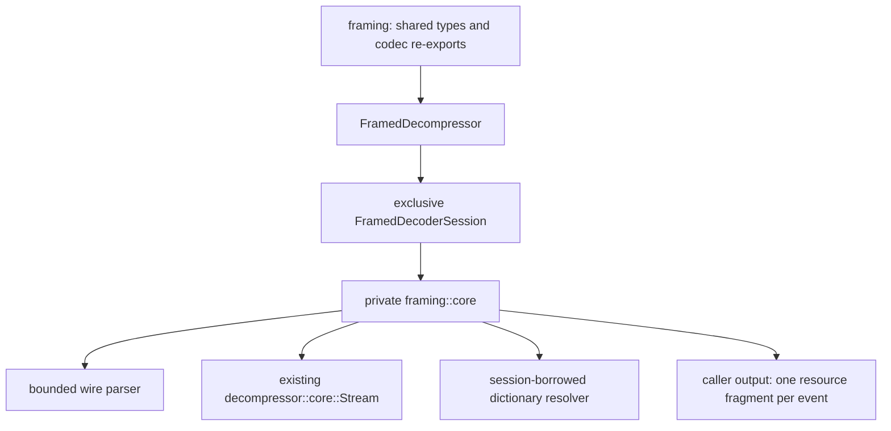
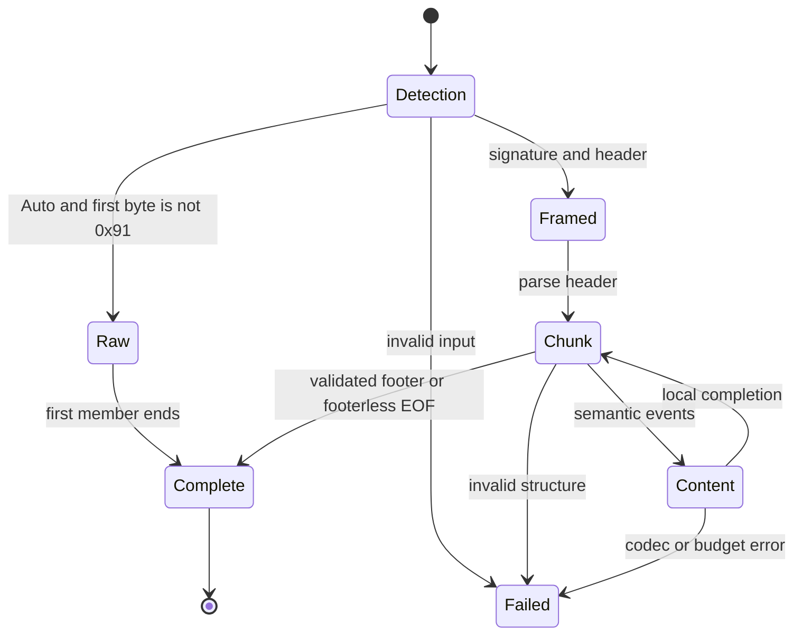
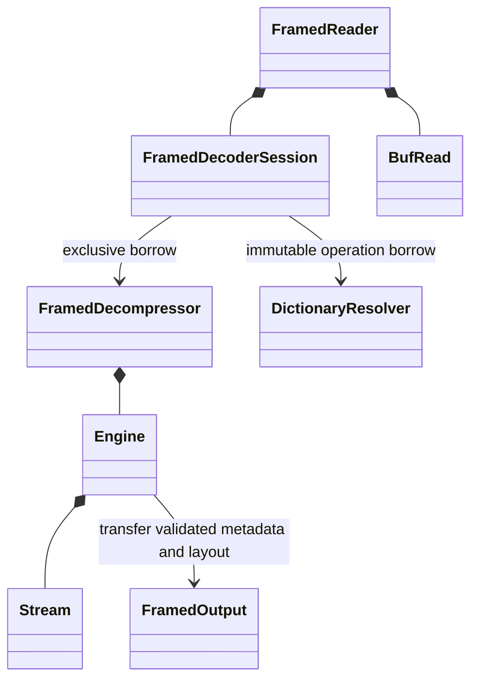

# Framed decoder

Implementation work follows `specifications/mbrotli-framed-decoder-llm-spec.md`.
The shared wire facade is `framing`; the public decoder facade is
`decompressor::framing`, with private parsing and state in its `core`.

## Wire validation traceability

| RFC 9841 section | Parser / validator | Positive tests | Negative tests |
| --- | --- | --- | --- |
| 4 | `core::wire::number` | nonminimal varints | ninth continuation byte |
| 8.1 | detection | split signature, both profiles | version, dictionary input |
| 8.2 | `core::wire::header`, codec driver | codecs, continuation | short header, invalid codec |
| 8.3 | `core::wire::metadata` | ordered custom fields | reserved fields, truncation |
| 8.4.1 | padding phase | zero-length, terminal padding | nonzero padding |
| 8.4.2 | metadata/order | resource metadata | orphan metadata |
| 8.4.3–8.4.6 | resource/order | full and partial resources | partial order, flags |
| 8.4.7–8.4.8 | metadata/order | footer/global metadata | invalid reserved fields |
| 8.4.9 | repeats | selected fields and dependencies | mismatched copies |
| 8.4.10 | directory | exact original header bytes | offset/header mismatch |
| 8.4.11 | footer | unspecified and specified sizes | size/directory mismatch |
| 8.4.12 | order | padding-transparent order | interrupted partial resource |

The behavior groups above are exercised by the independent integration fixtures
and private wire tests. Execution evidence and its scope are recorded below.





Bit 2 follows RFC 9841 §8.1: set means a mandatory footer. This is the
product specification's resolution of the contradictory final paragraphs of
§8.4.12, not a claim of official errata. The full profile permits zero resources
and metadata-only objects. Nonminimal varints are accepted within the nine-byte,
63-bit grammar.

## Known gaps

No async runtime, extraction, authentication, automatic dictionary fetching,
seek/random access, or concatenated top-level objects are provided.
Only the current host can execute its available SIMD levels; other architectures
need native execution evidence. Runtime checks and measurements are recorded below.

## Public ownership and lifecycle

`FramedDecompressor` owns configuration, the selected `Backend`, retention policy,
raw `Stream` workspace and framing bookkeeping. `start` and
`start_with_dictionaries` create an exclusive `FramedDecoderSession`. Only the
session borrows a resolver through `DictionaryResolverRef`. Dictionary-taking
entry points accept `impl Into<DictionaryResolverRef<'dict>>`; borrowed concrete
resolvers convert without allocation. The wrapper privately erases the resolver
type for attachment-boundary dispatch. Raw decoder state receives short-lived dictionary
views during `run`; neither workspace stores dereferenceable external pointers.
`mem::forget(session)` leaves the owner's active flag set. `trim` preserves that
flag; `recover` and successful `reconfigure` clear it. Drop clears logical records
and dictionary attachments, retaining reusable outer buffer capacities and raw
workspace according to retention. Nested header and metadata allocations are
transferred to output or released. `fork_empty` copies policies without storage.



One-shot methods use the same event driver as incremental decoding. `decompress`
collects directly into one Vec per resource. `decompress_into` appends only payload
and returns absolute ranges, rolling back the original length on every error.
`decompress_to_slice` returns slice-relative ranges and preserves its written
prefix on failure. Its failure aggregates accepted/delivered counts but attributes
only the last written fragment to its resource. Returned structures borrow neither
source, resolver, owner nor destination. Resource checksums are recorded, never
verified. Names remain unnormalized data.

Every process call produces at most one event. A successful payload write always
returns `ResourceData` borrowing exactly the written output prefix. Headers,
metadata, directory entries and footer are separate events. Event borrows prevent
further mutable session access. `ResourceDataEnd` is local payload completion;
late directory/footer checks can still reject the object.

```mermaid
sequenceDiagram
    participant Caller
    participant Session
    participant Engine
    participant Raw as raw Stream
    Caller->>Session: process(input, output, operation)
    Session->>Engine: validate final boundary; advance one event
    Engine->>Engine: bounded header and ordering validation
    Engine->>Raw: content slice bounded by chunk end; selected backend
    Raw-->>Engine: accepted bytes, produced bytes, stop reason
    Engine->>Engine: aggregate limits; content-size validation; cache policy
    Engine-->>Session: owned event descriptor and exact counts
    Session-->>Caller: borrowed header, metadata or output view
```

The first `Finish` fixes the absolute final-input boundary. Subsequent calls must
use `Finish` and the exact remaining suffix length; bytes themselves remain the
caller's responsibility. Failed sessions reject all further calls with zero new
progress. Completed calls return zero-progress `Finished` repeatedly. Raw and full
framing stop at their first complete object and leave a transport suffix. Strict
one-shot calls reject that suffix. Footerless framing needs EOF after its one
resource and accepts terminal padding before EOF.

## Content, references and validation

`core::wire` accepts bounded nine-byte varints without imposing minimal encoding.
The incremental header buffer holds only the current header; exact original bytes
move into `ChunkInfo`. Padding consumes zero bytes without storing their content.
Directory parsing stages one entry and compares its offset and original header
bytes with every content record in order. Footer reversed varints are bounded by
18 bytes and checked against actual object size and directory offset.

Brotli state is independent of logical resource state. `KeepDecoder` resumes an
unfinished preceding compressed stream, including metadata-to-resource and
repeat-to-repeat transitions. Padding is transparent. A fresh codec or an
uncompressed content chunk cannot discard an unfinished compressed stream; a
completed stream cannot be continued. This is the implementation's explicit
interpretation of the preceding-stream language in RFC 9841 §8.2. Declared sizes
are checked against actual per-chunk regeneration, not the raw session's whole
member exact-size guard. Standard Brotli rejects Large Window headers even when
the configured ceiling otherwise permits them; Shared Brotli and raw Auto obey
the user's window ceiling.

Metadata retains original decoded bytes and a field index. Reserved codes are
validated by scope; uppercase bytes and duplicate custom codes remain ordered.
Repeated records are paired with originals in original order, preserve explicit
origin/scope, and validate selected fields with their full multiplicity. A fixed
678-code table prevents repeated custom codes from multiplying the final
consistency checks. Repeated series may retain their own decoder and reference an
earlier repeated chunk, but cannot depend on earlier non-repeated content.

Internal resource payload uses one contiguous cache with chunk/resource spans;
metadata references borrow the original metadata serialization. A resource target
must start at a full/first data chunk and be complete. A chunk target must have
finished local decoding. External references resolve only through the supplied
resolver, in wire order, once when preparing the attachment set. Prefix content
is never sniffed as serialized content. Preparation uses `DecodeDictionary`,
including effective prefix slot limits and serialized dictionary validation.

## Memory and dispatch

Numeric ceilings distinguish `None` and zero. Input counts accepted wire bytes
once. Output counts all delivered resource payload, including hidden resources.
Decoded bytes include resources and metadata; repeated metadata counts again.
Per-resource limits reset only at resource starts. Other counters span the whole
object, including codec resets and repeated series.

Framing storage includes headers, metadata bytes/field indexes, resource records,
directory validation records and temporary output bookkeeping. Dictionary storage
includes retained resource bytes and prepared dictionary allocations. The outer
workspace ceiling includes both categories and raw codec workspace. Reservations
account for old plus replacement capacity during reallocations. Output payload
belongs to the caller, but result structure and metadata are budgeted before
transfer. The reader's fixed 8 KiB output array is inline, not heap storage.
`Retain` can exhaust the dictionary ceiling before the first internal reference;
`Reject` avoids caching resource payload and reports a policy error on references.
Strict validation requires O(number of chunks) records; memory is not constant.

Raw workspace receives the remaining outer ceiling before a content call through
`Stream::set_framed_workspace_limit`. Existing raw session behavior and symbol
loops are unchanged. The backend is selected once at owner construction and
passed through the existing raw dispatch boundary.

## Reader and errors

`FramedReader<R: BufRead>` drains pending semantic events and codec output before
asking the source for more bytes. `fill_buf`/`consume` preserve unaccepted protocol
tails. Interrupted retries, WouldBlock preserves state, and only physical EOF
starts Finish. The lending reader returns `None` only after successful completion;
it never implements an iterator over self-borrowed events. A codec failure's
written prefix remains available through `partial_output`. Drop and `into_inner`
perform no I/O.

`thiserror` errors retain codec/dictionary sources with detection context. The
128-byte by-value failure intentionally carries progress without allocating on
an allocation-failure path; method-local Clippy expectations document this
contract instead of boxing the failure. Location offsets describe detection,
not a purported exact corrupt bit.

## Verification artifacts

`tests/framed_decoder.rs` covers independent wire fixtures and writer round trips,
all input split positions for small fixtures, small/zero outputs, continuation,
repeated metadata, references, limits, rollback and reader faults.
`tests/decompress_memory.rs` injects every allocation failure through a framed
append and observes retained/peak storage through the allocator. Private wire
unit tests cover varint and header boundaries; a private backend test explicitly
includes scalar fallback and every available host backend.

`fuzz/afl` contains experimental `framed_decode` (arbitrary incremental bytes) and
`framed_roundtrip` (writer-generated resources) targets and `.bin` regression
seeds. `benches/framed_decompress.rs` measures Auto, stored/compressed framing,
small resources, metadata, and dictionaries with both retention policies, plus
31-byte input / 4 KiB output incremental workloads.
`benches/framed_raw_regression.rs` provides fixed raw/C workloads for comparison
with an isolated baseline checkout. Execution results are recorded separately
below; source presence alone is not execution evidence.

## Local validation record (2026-09-11)

Target: Apple M5 Pro, `aarch64-apple-darwin`, Rust 1.98.1 / LLVM 22.1.8.
MSRV checks also use Rust 1.89.0. Local logs and generated coverage/benchmark
artifacts live under `target/` and are not committed.

| Check | Command / scope | Result |
| --- | --- | --- |
| Formatting | `cargo fmt --all`; `cargo fmt --all -- --check` | pass |
| Workspace lint | `cargo clippy --workspace --all-targets --all-features --locked -- -D warnings` | pass |
| Workspace tests | `cargo test --workspace --all-features --locked` | pass; final `CARGO_PROFILE_TEST_OPT_LEVEL=1` run passes 1,034 tests |
| std workspace | `CARGO_PROFILE_TEST_OPT_LEVEL=1 cargo test --workspace --no-default-features --features std,compression,decompression,experimental --locked` | 1,246 tests pass |
| Framed integration | `cargo test --features experimental --test framed_decoder --locked` | 28 pass |
| Decoder documentation | `cargo test --doc --no-default-features --features std,decompression,experimental --locked` and alloc-only counterpart | pass; runnable examples on every new inherent public method |
| Consumer feature gates | `python3 scripts/check_codec_features.py` | all profiles pass, including old encoder import paths |
| MSRV | `cargo +1.89.0 check --lib --no-default-features --features std,decompression,experimental --locked` and `no_std,decompression,experimental` | both pass |
| Allocation failure / ceilings | `cargo test --features experimental --test decompress_memory --locked` through the coverage run | every injected framed append failure preserves prefix; allocator peaks remain bounded |
| Function coverage | `cargo llvm-cov --features experimental --lib --test framed_decoder --test decompress_memory --locked --json --output-path target/framed-coverage.json` | 172/172 functions in the eight framed implementation files; changed raw workspace setter also covered |
| Miri | `cargo +nightly miri test --lib --no-default-features --features std,decompression,experimental decompressor::framing::core::wire::tests` | 3 pass; separate metadata-to-resource continuation test also passes |
| ASan | `RUSTFLAGS=-Zsanitizer=address RUSTDOCFLAGS=-Zsanitizer=address cargo +nightly test --release --target aarch64-apple-darwin --features experimental --test framed_decoder` | 28 pass |
| AFL package | fmt, Clippy `-D warnings`, and `cargo afl test`, each with `--no-default-features` and with/without `--features experimental` | both configurations pass; each regression run has 7 registry/oracle tests |

Miri's nightly toolchain reports existing manifest and unused development-crate
warnings; these are distinct from the successful stable Clippy checks. Coverage
percentages above describe the changed subsystem, not a claim that a targeted
run covers every existing encoder function. Host backend tests explicitly include
the scalar oracle and every supported host backend; no x86 execution is claimed.

Raw allocation comparison uses the unchanged
`retained_storage_matches_allocator_and_warm_calls_allocate_nothing` test in
`tests/decompress_memory.rs`, run with `cargo test --release --test
decompress_memory retained_storage_matches_allocator_and_warm_calls_allocate_nothing
-- --nocapture` at baseline `c09ba92` and in this checkout. For the identical
132,000-byte text / 69-byte compressed input, both report 8 cold allocations,
270,436 bytes peak and retained storage, and zero allocations on the warm call.

CPU and allocation profiles use `cargo run --release --example
profile_framed_decoder --features experimental,hotpath-cpu` and the
`hotpath-alloc` counterpart. The fixture has 256 resources, 65,536 payload bytes,
79,007 wire bytes, and 86,032 retained bytes after each owned result is dropped.
Across 128 operations, the CPU profile attributes 114.25 ms / 67.60% of instrumented
wall time to `framing_bytes` (787,971 calls). These are nested profile timings,
not uninstrumented throughput. The allocation profile reports roughly 2.2 GB of
cumulative requested allocation traffic, predominantly `drive`; this is turnover,
not simultaneous live memory. The optional localhost metrics server is blocked by
the sandbox; command-line profiling reports were produced successfully.

The measured metadata-heavy costs are repeated live-capacity scans and exact
single-entry descriptor growth. They remain explicit performance limitations:
capacity accounting can perform quadratic work as chunk counts grow. The current
implementation prioritizes strict peak accounting and fallible allocation; it
makes no constant-memory or framing-speed improvement claim. These costs are
separate from the unchanged raw Brotli loops.

Final AFL smoke campaigns (30 seconds each) used `cargo afl fuzz -i
regressions/TARGET -o /tmp/mbrotli-framed-TARGET-final-20260911 -V 30 -c - --
target/release/TARGET` from `fuzz/afl`; the parser also used
`-x dictionaries/framed.dict`. `framed_decode` completed 758,211 executions with
99.96% stability; `framed_roundtrip` completed 13,130 with 99.97% stability. Both
saved zero crashes and zero hangs. The committed seeds include all chunk types,
signature fragments, internal/external references, malformed metadata and
mutated directory/footer entries. These short campaigns are smoke evidence,
not exhaustive fuzzing.

## Criterion evidence

Build commands: `cargo bench --bench framed_raw_regression --no-run` and
`cargo bench --bench framed_decompress --features experimental --no-run`.
The raw baseline is an isolated `git archive` of `c09ba92` with the identical
new raw benchmark source added. No baseline source or vendor algorithms were
modified. Both raw builds use default features. Raw trials invoke each built
benchmark with `--bench --sample-size 30 --warm-up-time 0.5 --measurement-time 1`,
in baseline/current/current/baseline order. Framed trials use
`--bench --sample-size 20 --warm-up-time 0.3 --measurement-time 0.8`.
Benchmarks run after builds, fuzz campaigns and required test workloads stop.

Raw inputs are fixed in `benches/framed_raw_regression.rs`: repeated ASCII text,
65,536 xorshift bytes with seed 1, and a 34-byte small message, all at Q5 and the
default window. These table ranges span the two Criterion point estimates; they
are not confidence intervals. Throughput is derived from payload bytes / time.

| Raw input | Payload / wire bytes | Baseline µs | Current µs | Baseline MiB/s | Current MiB/s |
| --- | ---: | ---: | ---: | ---: | ---: |
| text | 59,392 / 64 | 1.7868–1.8437 | 1.7636–1.7755 | 30721.2–31699.5 | 31901.2–32116.5 |
| binary | 65,536 / 65,540 | 1.0647–1.3443 | 1.0739–1.0840 | 46492.6–58702.0 | 57656.8–58199.1 |
| small | 34 / 34 | 0.6182–0.6193 | 0.6176–0.6440 | 52.4–52.4 | 50.3–52.5 |

The repeated raw trials show inter-run variation (especially the binary baseline
and second small-input current trial), rather than a consistent slowdown across
trials. A longer small-input confirmation (`--bench small/rust --sample-size 50
--warm-up-time 1 --measurement-time 5`) measured baseline 634.71 ns / 51.09 MiB/s
and current 616.34 ns / 52.61 MiB/s, so the earlier small-input slowdown did not
repeat. No framing check was added to the raw symbol loops. The C oracle validates
identical raw payloads before timing; its decoder is created per iteration, while
Rust reuses its owner, so these are explicitly different lifetime costs. Container
throughput is not presented as a C-framing comparison: the C crate has no framing
decoder.

Framed input is the fixed 64,512-byte repeated text in
`benches/framed_decompress.rs`; `many-small` has 256 resources and `metadata-heavy`
adds two fields per resource. Dictionary input is 32 copies of a 1,216-byte
external prefix. All payloads are validated before timing. Owned-output cases
include result allocation and destruction; incremental cases include session and
event processing with 31-byte input offers and a preallocated 4 KiB output buffer.
The raw presized case excludes output allocation. Point estimates follow:

| Mode | Payload / wire bytes | Time µs | MiB/s |
| --- | ---: | ---: | ---: |
| raw-presized | 64,512 / 60 | 2.171 | 28336.1 |
| c-raw-presized | 64,512 / 60 | 22.880 | 2689.0 |
| auto-Retain | 64,512 / 60 | 5.079 | 12112.8 |
| stored-Retain | 64,512 / 64,542 | 4.749 | 12955.3 |
| stream-stored-Retain | 64,512 / 64,542 | 110.800 | 555.3 |
| compressed-Retain | 64,512 / 88 | 6.807 | 9038.7 |
| stream-compressed-Retain | 64,512 / 88 | 5.448 | 11293.7 |
| many-small-Retain | 64,512 / 68,048 | 174.460 | 352.7 |
| stream-many-small-Retain | 64,512 / 68,048 | 266.560 | 230.8 |
| metadata-heavy-Retain | 64,512 / 77,981 | 1022.300 | 60.2 |
| stream-metadata-heavy-Retain | 64,512 / 77,981 | 1078.300 | 57.1 |
| dictionary-heavy-Retain | 38,912 / 3,180 | 84.224 | 440.6 |
| auto-Reject | 64,512 / 60 | 5.101 | 12062.2 |
| stored-Reject | 64,512 / 64,542 | 3.645 | 16877.5 |
| stream-stored-Reject | 64,512 / 64,542 | 101.650 | 605.2 |
| compressed-Reject | 64,512 / 88 | 5.950 | 10340.6 |
| stream-compressed-Reject | 64,512 / 88 | 4.311 | 14271.9 |
| many-small-Reject | 64,512 / 68,048 | 171.960 | 357.8 |
| stream-many-small-Reject | 64,512 / 68,048 | 259.450 | 237.1 |
| metadata-heavy-Reject | 64,512 / 77,981 | 1013.700 | 60.7 |
| stream-metadata-heavy-Reject | 64,512 / 77,981 | 1058.900 | 58.1 |
| dictionary-heavy-Reject | 38,912 / 3,180 | 83.652 | 443.6 |
