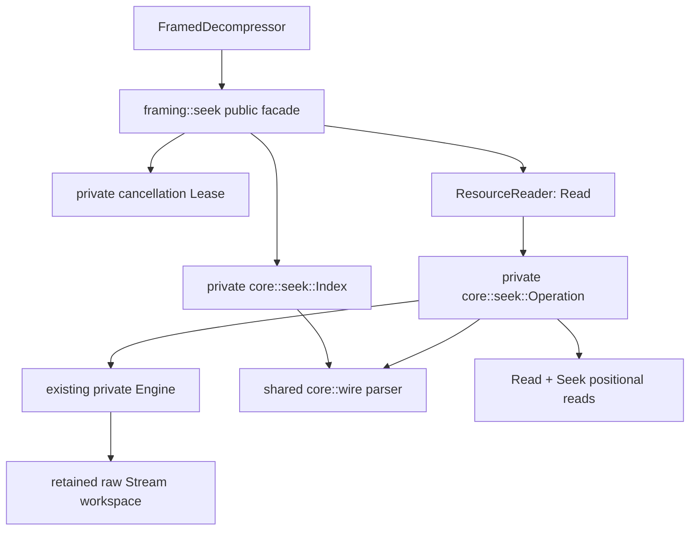
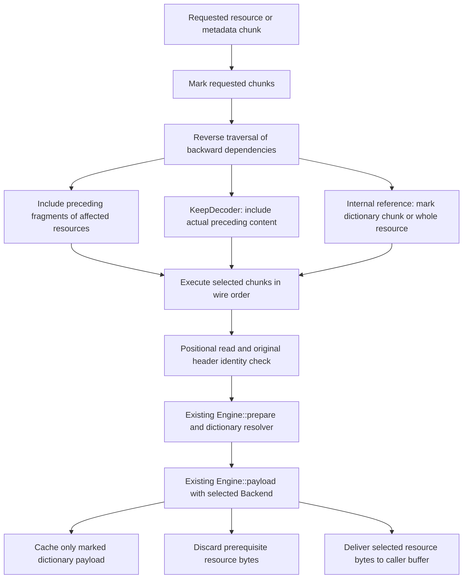

# Framed seek reader

The experimental, std-only `framing` facade exports `FramedSeekReader`,
`ResourceReader`, `ResourceInfo` and `FramedSeekError`. Version 0.4.0 adds the
`FramedDecompressor::framed_seek_reader` and
`framed_seek_reader_with_dictionaries` factories. The sequential event API is
unchanged. Logical identity is `ResourceIndex`; metadata `id` is not a key.
Every public seek method has a runnable rustdoc example, using wire fixtures that
also work with only std, decompression and experimental features enabled.

## Ownership and modules



The parent owns its source, directory-derived chunk/resource tables and lazy
metadata cache. A lease borrows the reusable owner exclusively. A child borrows
the source, index and owner; its operation owns the dependency bitmap, fixed
8 KiB input buffer and logical execution state. No public API exposes the plan,
raw codec, SIMD types or private errors. Dropping an operation cancels owner state
and applies `RetentionPolicy`. Dropping the parent also cancels, including after a
forgotten child. Neither drop nor `into_inner` performs I/O. The parent lease keeps the owner's
active flag set between child operations. Forgetting the parent requires the
existing `FramedDecompressor::recover` before starting another owner session;
forgetting only a child can be recovered by the next parent operation. The physical cursor
is unspecified. Source byte zero is the container signature; embedded slices need
a source adapter. Mutating source contents invalidates the index and metadata
cache assumptions.

## Opening and index validation

```mermaid
sequenceDiagram
    participant Caller
    participant Index
    participant Source
    Caller->>Index: framed_seek_reader(source)
    Index->>Source: seek end; read signature
    Index->>Source: bounded reversed footer numbers and header
    Index->>Index: validate size, profile and directory offset
    Index->>Source: read directory header and entries
    Index->>Index: parse copied headers; validate ordered disjoint extents
    Index->>Source: read padding headers in gaps; skip their bodies
    Index->>Index: assemble logical resources and metadata associations
    Index->>Index: check partial order, repeat identity and backward references
    Index-->>Caller: structural index, no decompression
```

Only full containers with a nonzero, in-bounds directory pointer are accepted.
Missing directories use `CentralDirectoryRequired`; malformed directory structure
uses the existing typed `InvalidDirectory` error. Header parsing uses the same
bounded varints and field grammar as the sequential decoder, preserving exact
nonminimal header bytes. The footer's two reversed varints are individually
bounded to nine bytes. Declared object size, when nonzero, must equal source length.
Copied chunk extents must be ordered, disjoint and end before the directory.
Partial chains, before/after metadata, repeated-series pointer/count/kinds and
internal backward references are checked from the index. Resources expose hidden
flags, checksums and the sum of declared/literal sizes, with no payload allocation.

Opening is not full validation. Gaps between indexed content chunks can contain
padding; opening reads only their bounded headers, checks that they describe
padding extents and counts every padding chunk under `max_chunks`. Their bodies
are skipped. An omitted content chunk in such a gap is rejected. Access checks each used original
header byte against its exact copy before reading payload. A mismatch becomes
`DirectoryMismatch`. Unused payload, metadata and padding bodies remain unvalidated.
Full validation remains the sequential decoder's responsibility. Checksums are
recorded without authentication, matching the existing decoder.

## Dependency execution



Every dependency edge points to an earlier indexed chunk, so one reverse pass
computes closure without recursion. Whole-resource dictionary references must
address the first data fragment and end before the referencing chunk. Prefix
chunk references include only that chunk's bytes as dictionary content, while
preceding partial fragments are decoded to enforce resource-size contracts.
Dependency dictionaries are materialized before use and retained for the current
operation. Unrelated resources are never decoded. `Reject` rejects internal
references; `Retain` permits selective materialization instead of retaining all
previous payload. The default policy therefore streams a large independent target
without allocating its complete decoded bytes as a potential dictionary.

The existing codec preparation and payload driver enforce dictionary attachment
order, serialized dictionary rules, standard/large window ceilings, decoded chunk
sizes and budgets. External IDs use the existing `DictionaryResolverRef` contract
and typed missing/preparation errors. Codec state survives selected `KeepDecoder`
edges across resources and metadata. A skipped interval cannot supply codec state.
At local completion, a compressed stream must be unfinished exactly when the next
indexed content chunk uses `KeepDecoder`. Padding is transparent. The selected
owner backend is passed to the existing raw driver; seek adds no SIMD dispatch.

Metadata uses original chunks, even when repeats exist, preserving all original
fields when repeats contain only a subset. Loading is lazy and cached by original
chunk identity. Metadata needed for codec state or a dictionary is decoded and
validated inside the operation. Repeated payload consistency is left to full
sequential validation because the seek path uses originals.

```mermaid
stateDiagram-v2
    [*] --> Planned: resource(index)
    Planned --> Header: first Read
    Header --> Payload: original header verified; prepare codec
    Payload --> Payload: deliver target or discard/cache prerequisite bytes
    Payload --> Header: local chunk complete; next selected chunk
    Payload --> EOF: selected path complete and local sizes validated
    Header --> Failed: source/header/dictionary error
    Payload --> Failed: source/codec/size/limit error
    Planned --> Cancelled: Drop
    Payload --> Cancelled: early Drop
    Failed --> Cancelled: Drop
    EOF --> Cancelled: Drop
    Cancelled --> [*]: no I/O; parent reusable
```



Each independent access resets aggregate input, output, decoded, resource and
metadata counters. Output/decoded limits also account for prerequisite resources
that are internally discarded. The opening input budget counts the main header,
indexed directory and footer wire extents plus padding headers; access input counts used original
headers and payload. The chunk limit includes indexed content records, directory,
footer and every padding chunk. The resource count limit
bounds the complete index. Framing/workspace budgets include persistent index and
cached metadata, operation bitmap, temporary header copies, engine records and raw
workspace. Dictionary limits cover retained dependency bytes and prepared storage.
Reservations account for old and replacement capacities before growth. Decoder
workspace is reused subject to retention; per-operation cached dependency bytes
and semantic identities are cleared on cancellation.

`Read` failures store a `FramedSeekError` inside `io::Error`. Its `Io` variant
preserves the original I/O error; `Decode` preserves existing codec/dictionary
source chains. Invalid resource indices remain distinct from codec failures.
After an error a child rejects subsequent nonempty reads. Dropping it allows a
fresh operation. An empty caller buffer always returns zero without work.

## Verification and known gaps

`tests/framed_seek.rs` covers independent wire fixtures, header tampering, lazy
metadata, repeated subsets, continuation, actual/transitive dictionary bytes,
limits, arbitrary ordering, abandonment, source faults and no-I/O destruction.
Private core tests explicitly execute the scalar backend and all host backends.
`framed_decode` AFL checks indexed reads and metadata against valid sequential
results, including reverse access and early drop; `framed_roundtrip` reaches the
same oracle on writer-generated containers. `framed_decompress` Criterion adds
opening and reverse streaming access cases alongside sequential and C raw controls.
C Brotli has no RFC 9841 container reader; its raw control is not an equivalent
indexed-container benchmark.

No decoded `Seek`, resource ranges, lookup by metadata value, async I/O, fallback
index scan, public access plan or automatic dictionary fetching is implemented.
Global metadata has no convenience accessor. Repeated metadata is not used as an
optimized source. The operation bitmap is linear in directory entries; dictionary
storage is released semantically per operation rather than cached across accesses.
EOF of one resource does not authenticate its checksum or validate untouched
container portions. Other architectures require native backend execution.

## Local execution evidence (2026-09-12)

On `aarch64-apple-darwin`, Rust 1.98.1 / LLVM 22.1.8, the focused integration
suite passes 18 tests and the private test exercises scalar plus all host backends.
`cargo llvm-cov --features experimental --locked --test framed_seek --json
--output-path target/seek-coverage-final.json` reports 100% function coverage for
both new implementation files (36 core functions and 23 facade functions).
The JSON report is a local, uncommitted artifact.

Criterion smoke command:

```sh
cargo bench --bench framed_decompress --features experimental --locked -- \
  'seek-corpus' --sample-size 10 --warm-up-time 0.1 --measurement-time 0.2
```

All rows decode the identical enclosed raw bitstream and validate against the
original bytes before timing. Indexed includes opening and `Read` through EOF;
sequential uses `decompress_to_slice`; C decodes the raw member, with no container
parsing. Destinations and fixtures are allocated before timing. Times below are
sample medians in microseconds, not a claim of equivalent container throughput.
This short validation run shared the host with checks; use longer isolated runs
for performance decisions. There is no pre-change indexed implementation.

| Corpus | Payload bytes | Raw / framed bytes | Indexed µs | Sequential µs | C raw µs |
| --- | ---: | ---: | ---: | ---: | ---: |
| Small text | 26 | 22 / 46 | 1.50 | 1.35 | 0.51 |
| Repeated text | 64,512 | 60 / 88 | 3.66 | 3.46 | 24.50 |
| Binary byte cycle | 65,536 | 217 / 249 | 4.84 | 4.42 | 26.69 |
| Seeded xorshift bytes | 65,536 | 65,540 / 65,576 | 4.83 | 2.24 | 2.02 |
| Large zero payload | 1,048,576 | 209 / 489 | 33.65 | 33.39 | 445.04 |

The same benchmark also measures directory-only opening and reverse streaming
access across stored, compressed, many-small and metadata-heavy containers.
AFL 0.18.2 / AFL++ 4.40c smoke runs use the existing `framed_decode` and
`framed_roundtrip` targets with `-V 60 -t 2000 -c -`, committed regression corpora,
`AFL_SKIP_CPUFREQ=1`, `AFL_NO_AFFINITY=1`, and
`AFL_I_DONT_CARE_ABOUT_MISSING_CRASHES=1`. Findings remain under `/tmp`, not in the
repository. An initial decode campaign recorded one timeout during concurrent
checks; its 114-byte input completed successfully on three direct replays
(0.68 seconds cold, about 3 milliseconds warm), with no reproducible failure.

After the final lifecycle, budget and padding checks, fresh 60-second campaigns
completed with zero saved crashes and zero saved hangs: `framed_decode` executed
493,966 inputs at 99.97% stability; `framed_roundtrip` executed 36,193 inputs at
99.98% stability. Final findings are in
`/tmp/mbrotli-seek-{decode,roundtrip}-final-20260912/smoke/`.
