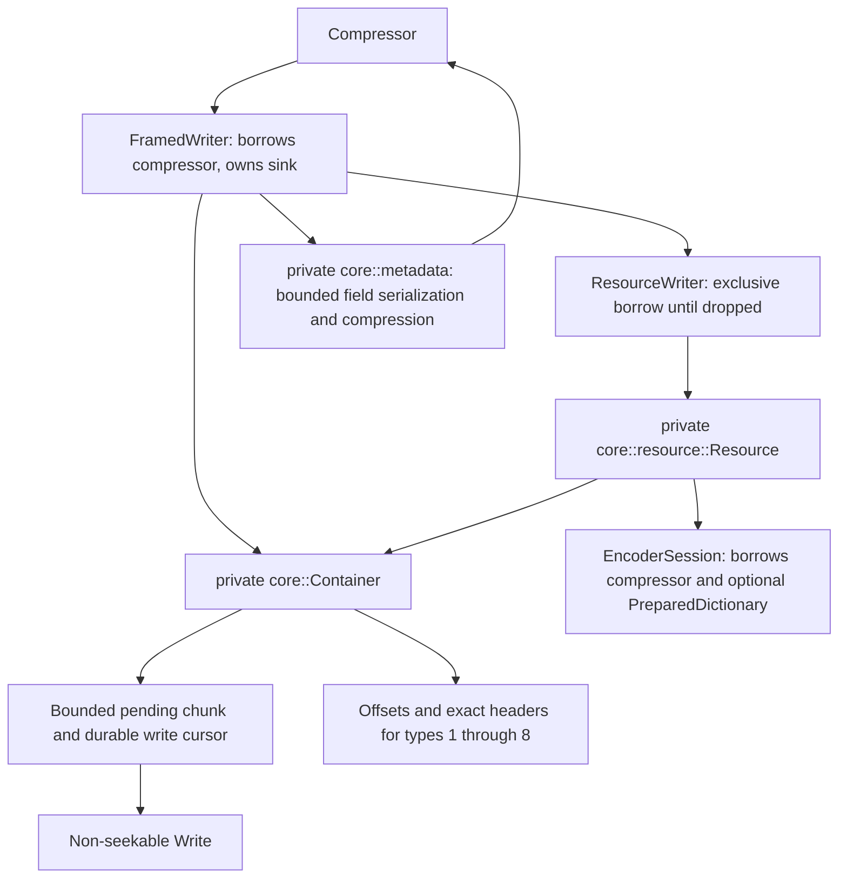
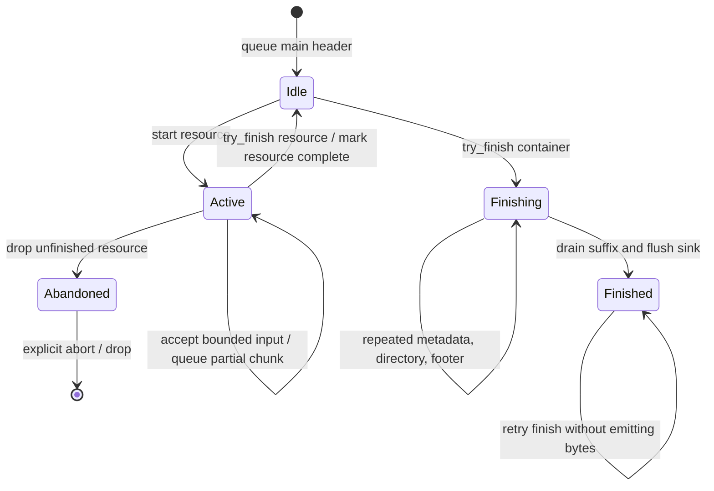

# Shared Brotli framing writer

`compressor::framing` is an `experimental`, separate container API. Raw
compression never gains a container header implicitly. Its public adapters own
ergonomic configuration and borrows; private `framing::core` owns ordering,
wire sizes, output cursors and resource compression.



## Public surface and ownership

`Compressor::framed_writer` queues the five-byte main header without I/O.
`resource`, `resource_with_dictionary` and `uncompressed_resource` return a
borrowing `ResourceWriter: Write`. Finish it explicitly with `try_finish`, then
drop its borrow before starting another resource. `metadata` and `padding`
queue chunks. `flush` drains them. Container `try_finish` is retryable; consuming
`finish` returns the sink or a boxed `FramingFinishError` retaining the entire
writer. `into_inner` aborts without I/O and intentionally discards pending data.
No destructor writes or implicitly finishes a resource.

`metadata_with_options` accepts independent `MetadataEncoding` values for the
original chunk and its repeated copy: uncompressed, Brotli, or Shared Brotli
with a borrowed prepared dictionary and explicit references. `metadata` remains
the uncompressed convenience call. `repeat_metadata_fields` selects field codes
globally before the first metadata chunk; this guarantees that a selected field
is repeated everywhere it occurs. An empty selection still emits one empty
repeat per original resource/footer metadata chunk.

`ResourceOptions` carries visibility and an optional caller-provided 256-bit
checksum. `DictionaryReference` distinguishes prefix/serialized external IDs,
earlier complete resources, and earlier individual prefix chunks. IDs use the
RFC HighwayHash checksum type, but keys and calculation belong to the caller.
There is no hashing, identifier resolution, filesystem access, registry or
network access in this layer. The caller must supply references matching the
bytes and order in the borrowed `PreparedDictionary`.

Internal pointers must name previously emitted content chunks; complete-resource
pointers must name type 2 or 3. Serialized references are limited to one and
prefix references to fifteen. Resource starts require stream offset zero.
Large Window resources without dictionaries use Shared Brotli with zero
references; ordinary Brotli uses codec 2.

## Wire representation

The main header is `91 0a 42 52 FLAGS`. Bit 2 is **set** for the full container
profile with a footer, and clear for the single-resource profile. This follows
RFC 9841's main-header and final-footer descriptions despite the inverted
sentence in section 8.4.12. The writer does not auto-detect or silently switch
interpretations. The independent wire fixture tests assert both profiles.

Every chunk uses a canonical 63-bit varint length followed by type-specific
header and content. Content chunk headers, including the length varint, are
retained verbatim for the central directory.

| Type | Emission |
| --- | --- |
| 0 | Explicit zero-filled padding |
| 1 | Resource metadata before the resource |
| 2 | Single-chunk resource |
| 3 / 4 / 5 | First / middle / last partial resource |
| 6 | Footer metadata after a resource |
| 7 | Global metadata |
| 8 | Complete or field-selected copies of resource/footer metadata in original order, with independent compression |
| 9 | Central directory: repeated-metadata offset and all type 1–8 content headers, including repeated metadata |
| 10 | Final footer: reversed varints for total file size and directory offset |

Metadata defaults to uncompressed. Uppercase field codes are application data;
resource-only `id` must be UTF-8 and `mt` exactly eight bytes. Duplicate reserved
fields and misplaced metadata are rejected. Padding does not break metadata
adjacency. Repeated metadata requires a central directory. The single-resource
profile forbids the directory, repetition and all metadata, and requires exactly
one resource.

```mermaid
sequenceDiagram
    participant Caller
    participant Container
    participant Metadata as core::metadata
    participant Compressor
    Caller->>Container: metadata_with_options(fields, encodings)
    Container->>Container: validate order, fields, references and peak staging budget
    Container->>Metadata: serialize original and globally selected repeated fields
    Metadata->>Compressor: bounded one-shot compression where requested
    Compressor-->>Metadata: independent streams
    Metadata-->>Container: original and repeat headers/payloads
    Container->>Container: queue original; retain encoded repeat with its full capacity
    Caller->>Container: try_finish
    Container->>Container: queue each repeat once and record its header
    Container->>Container: emit directory over original AND repeat records
```

Repeated chunks are pre-encoded while queuing their originals, so dictionaries
are borrowed only for that call. Shared repeated metadata accepts external IDs
only: it cannot accidentally depend on resource chunks unavailable to a reader
of the terminal metadata series. Original metadata may use earlier internal
resources or chunks. Each compressed metadata chunk starts a new decoder;
Large Window without an attached dictionary uses Shared Brotli with zero
references. Resource partial chunks continue to use keep-decoder semantics.

## Streaming and transactional emission



One resource buffers at most `chunk_bytes` input. On the next write after it is
full, or on explicit flush, the session flushes that chunk. The first compressed
chunk uses Brotli (2) or Shared Brotli (3); following chunks use keep-decoder (1).
All partial chunks belong to the same session. The final chunk finishes that
session and carries any checksum for the whole resource. Uncompressed resources
use codec 0 throughout. A resource that fits one chunk uses type 2, including
empty resources.

Sink writes advance a durable cursor only for bytes the sink accepted.
`Interrupted` is retried, zero becomes `WriteZero`, and other errors retain the
suffix. Writes accepting resource input return that accepted count before a
later sink failure can occur. Encoding happens only after pending bytes drain.
A non-I/O error after advancing the encoder poisons that resource; it cannot
re-encode accepted input. Resource completion and directory/footer cursors
advance when bytes are queued, not when the sink drains, preventing duplicate
chunks on a retry. The compressor's ordinary abandoned-session recovery handles
the next raw stream after a framing abort.

The footer solves its self-inclusive file size by fixed-point iteration with
checked addition and a 63-bit ceiling. Directory pointers count accepted queued
bytes, so no seek or sink position query is needed.

## Limits and errors

Defaults are 64 KiB input per chunk, 1 MiB aggregate metadata, 8 MiB framing
storage, 10,000 resources and 1,000,000 chunks (generated terminal chunks count).
Chunk sizes must be 1..=16 MiB and fit the conservative staging budget. Checks
precede chunk/metadata allocations and account for retained header records,
record-vector capacity, repeated field selection, encoded repeat capacities and
temporary compression buffers (using the compressor's output bound). Resource data
is streamed, while the bounded directory grows with chunk count. These limits
do not include the sink's storage, compressor workspace or separately prepared
dictionaries; their owners control those budgets.

`FramingError` is non-exhaustive and keeps typed `EncodeError` / `io::Error`
sources. I/O conversion preserves the sink's original `ErrorKind`. Invalid
ordering and resource-limit failures are distinct from wire arithmetic overflow.
After a non-retryable resource failure, abort the container rather than emit a
misleading successful footer.

## Verification and known gaps

`tests/framing.rs` independently parses wire fixtures for all eleven chunk
types, all reference forms, directories and reversed footer fields. Compressed
resource bytes decode with C. Fault injection covers short writes, interruption,
zero and `WouldBlock` at 400 offsets each, including compressed originals and
repeats, retryable finalization and abandoned
resources. AFL generates resource/metadata sequences and compares output across
caller write schedules; its committed corpus is replayed by `cargo afl test`.

The pinned C library has no RFC 9841 container implementation. Whole-container
verification is therefore structural RFC fixture testing, not a C framing
oracle. Metadata streams and selected repeats are independently decoded with C;
directory tests require every type 1–8 header. Metadata emits independent streams,
not cross-chunk keep-decoder streams, and pre-encoded repeated metadata does not
use internal repeat-to-repeat dictionaries. No decompressor or automatic
dictionary checksum policy is implemented.
