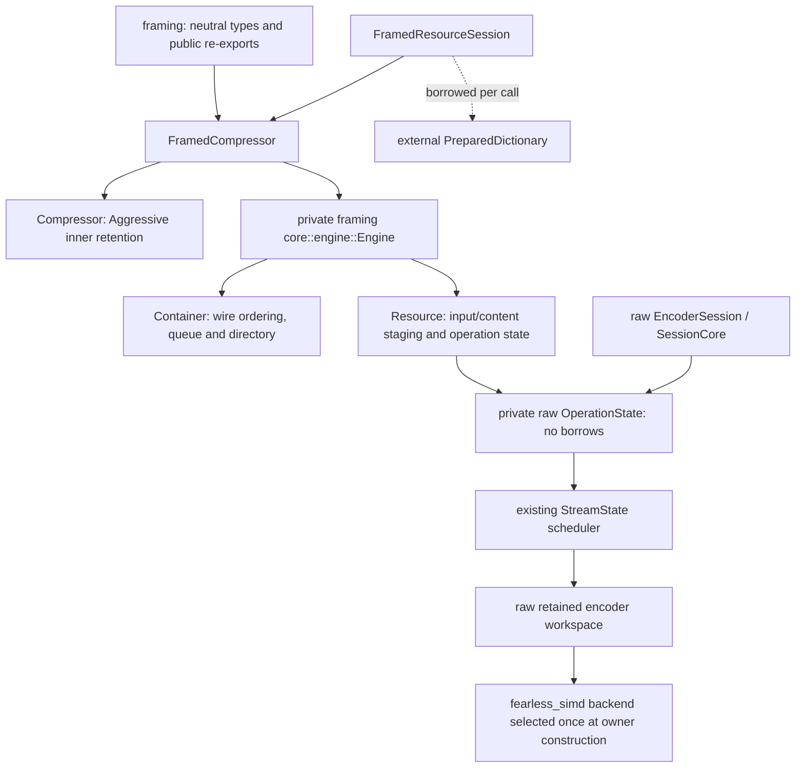
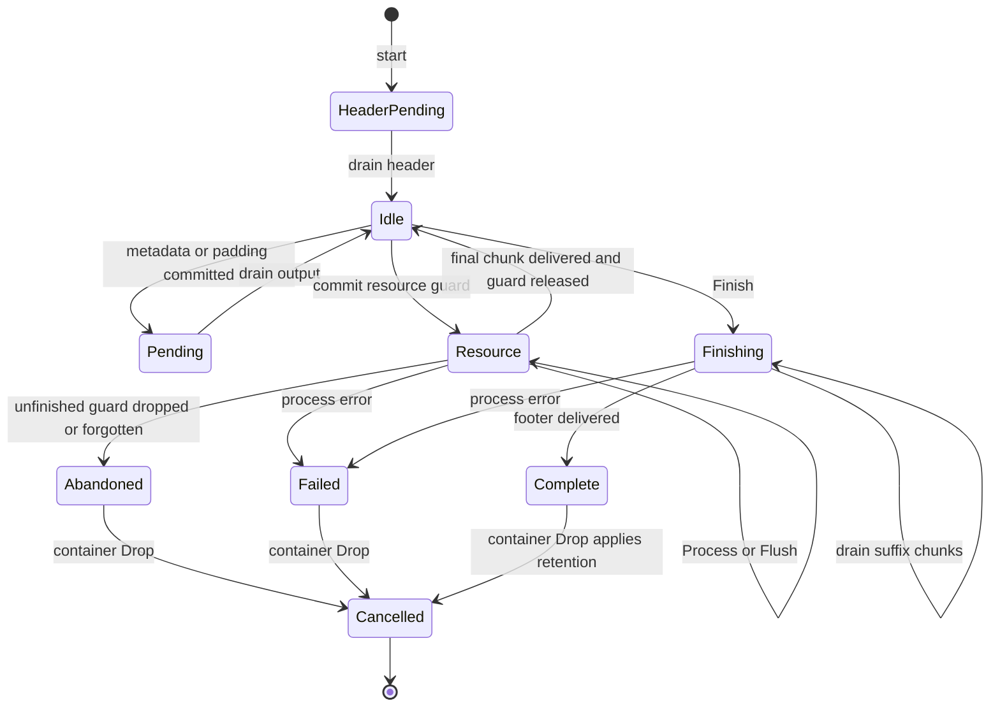
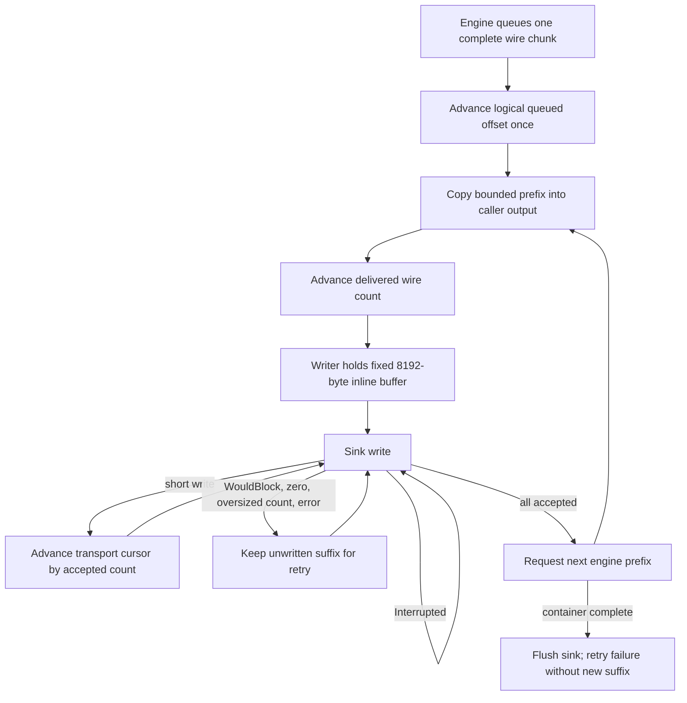

# Framed compressor

`compression,experimental` exposes a reusable `FramedCompressor`, configuration,
borrowed structured input, one-shot operations and native sessions with std or
alloc. `no_std` excludes only `FramedWriter`, `ResourceWriter`,
`FramedEncoderReader` and transport errors. Decoder types and raw `Compressor`
remain independent. The shared `framing` facade re-exports the encoder types;
owner/configuration/error/progress/session types also have crate-root exports.

## Ownership and dispatch



The owner stores no sink, input slices or dictionary references. The raw operation
state was separated from `SessionCore`'s compressor/dictionary borrows; both raw
and framed paths invoke its common `process` driver and `StreamState`. Native
resource guards retain external dictionary borrows, while the lazy input driver
looks up its borrowed description on each call. Forgetting either guard cannot
leave dereferenceable external references in owner storage. No self-reference,
unsafe lifetime extension, dictionary clone or second raw scheduler is used.

Public modules contain configuration, API guards and std adapters. Private `core`
contains command admission, logical state, bounded resource staging, metadata,
wire serialization and the borrowed-input cursor. `core` does not import I/O.

## Public input and API

`FramedEncodeConfig` combines `EncoderConfig` and the existing public-field
`FramingConfig`; builder selects backend and outer retention. Defaults remain
full container plus directory, no repeats, 65,536 bytes per chunk, 1 MiB metadata,
8 MiB framing storage, 10,000 resources and 1,000,000 chunks. Profiles and chunk
size (1..=16 MiB with conservative staging allowance) are validated before use.

`FramedInput` borrows an ordered slice of `FramedItem`: complete resources,
metadata or padding. `FramedResource` carries payload, visibility/checksum,
`StreamConfig`, and `ResourceEncoding::{Uncompressed,Brotli,Shared}`. Slice
conversion chooses Exact length; explicit Unknown is preserved. Metadata and
hidden resources remain in input order. References are absolute offsets from the
new container's start, independent of any destination prefix.

`compress`, append/rollback `compress_into`, `compress_to_slice` and
`framed_reader` use one lazy `core::driver::Driver`. It stores item/offset cursors
and advances the same engine as native guards. No destination stages the entire
container. Append restores length and prefix on every error. Slice failure keeps
the written prefix and untouched tail, reporting cumulative progress. Reader
returns already produced bytes before a deferred terminal error; nonempty reads
return EOF only after full suffix delivery. Its `into_inner` returns the original
input description and cancels.

```mermaid
sequenceDiagram
    participant Caller
    participant API as Session / borrowed-input driver
    participant Engine
    participant Raw as Shared raw operation
    participant Out as Caller slice / std transport
    Caller->>API: start(stream aggregate)
    API->>Engine: queue main header; set active owner
    Caller->>API: process(output, Process)
    Engine->>Out: deliver header prefix
    Caller->>API: resource(options, stream, dictionary)
    API->>Engine: validate and commit resource
    Caller->>API: process(input, output, Finish)
    Engine->>Raw: Flush complete nonfinal chunks; Finish final chunk
    Raw-->>Engine: compressed bounded chunk
    Engine->>Out: framing header and content prefixes
    Caller->>API: container Finish
    Engine->>Out: repeats, directory, footer
```

Container `process` consumes zero payload. Its NeedsInput admits the next command;
NeedsOutput requires draining. Structural methods reject OutputPending before
commit and retain no borrowed metadata/reference lists. Container Exact counts
accepted payload across all resources, including hidden ones, excluding metadata
and padding. It is independent of the raw per-resource size hint; new resources
require zero stream offset. Exceeding a size contract is rejected before accepting
the offered bytes, and underflow prevents successful Finish.

## State, cancellation and retry



A full input chunk stays staged until another byte, Flush or Finish determines
whether it is partial. Exact first-chunk fills followed by Finish remain type 2.
Flush/Finish record absolute input boundaries; retries must keep the operation and
remaining suffix length. Repeated empty Flush emits nothing. Resource Finished
means its final chunk was delivered; only then does the completed-resource count
advance. Container Finished includes delivery of all suffix bytes.

Process errors are terminal, with exact per-call accepted/produced counts and
location. Correctable structural errors before commit do not poison the engine.
Locations distinguish resource index/input offset, structured item index, and
container-relative delivered wire offset. Limits include category and maximum;
allocation/overflow/size-contract/raw-codec errors remain distinct and typed.
`FramingError` aliases `FramedEncodeError`; owning `FramingFinishError` retains a
whole std writer for retry. Transport conversion preserves original ErrorKind.



`ResourceWriter::write` returns accepted payload before reporting a later codec
failure; pending wire bytes and a deferred error survive. Sink failures retain
transport cursors. Structural writer methods drain previous output before issuing
a command. Resource flush drives raw Flush then transport flush; container flush
only drains and flushes transport. No destructor writes. `finish` preserves the
complete writer on error; `into_inner` cancels. `get_mut` is for sink repair:
inserting/removing wire bytes would invalidate offsets.

Normal container Drop releases the owner for reuse. Forgotten container guards
leave abandoned protection; trim does not clear it. Recover releases raw and
framing storage, preserving policy/backend. Reconfigure validates first, so a bad
configuration preserves both old policy and abandoned protection. A successful
reconfigure cancels and applies the new policy. Raw retention remains Aggressive
within a container; outer ReleaseAll/Bounded applies at the container boundary.

## Wire serialization

The main header is `91 0a 42 52 FLAGS`; bit 2 is set for the full profile and clear
for footerless single-resource framing, preserving the repository's established
interpretation. Varints are minimal and bounded to 63 bits. All content offsets
are relative to the container, independent of transport writes.

| Type | Emission |
| --- | --- |
| 0 | Zero-filled explicit padding; metadata adjacency is preserved |
| 1 | Resource metadata preceding its resource |
| 2 | Single complete resource, including empty payload |
| 3 / 4 / 5 | First / middle / last chunks of one continuing resource |
| 6 | Footer metadata following its resource |
| 7 | Global metadata |
| 8 | Repeated resource/footer metadata, preserving order and selected fields |
| 9 | Repeated-metadata offset and exact type 1–8 content headers/offsets |
| 10 | Reversed file-size/directory varints; size includes the footer itself |

Codec 0 is verbatim, codec 2 starts ordinary Brotli, codec 3 starts Shared Brotli,
and codec 1 retains decoder state across compressed partial chunks. Large Window
without a dictionary uses Shared Brotli with zero references. Compressed partials
share one raw operation. Metadata compression starts independent streams;
original and repeated copies can have different encodings. None selects all
repeated fields; an empty selection still emits each required empty repeated
chunk. Reserved metadata codes, UTF-8 `id`, eight-byte `mt`, field multiplicity,
ordering, profile restrictions and reference limits remain validated.

Reference serialization permits at most one serialized and fifteen prefix
attachments. Internal pointers must address earlier recorded content, with whole
resources starting at type 2/3. Resource commands can only follow complete earlier
resources. Shared repeated metadata permits external references only.

## Memory and verification

Framing allocations use fallible reservations and checked/budgeted sizes. Storage
comprises bounded input/content buffers, pending output/cursor, exact directory
records, encoded repeats and field selection. Directory/repeats scale with the
number and content of commands; there is no O(1) promise for a whole container.
Raw encoder workspace, external dictionaries and caller destinations are separate
from the framing budget. Owner retention sums raw and framing owned capacities.
The fixed inline writer transport buffer has no heap allocation.

Legacy fixtures in `testdata/framing-legacy` were captured at `910653f` before
serializer changes. `tests/framing.rs` compares them before independent wire
parsing and retains sink fault injection. `tests/framed_encoder.rs` compares
native/one-shot/slice/reader/writer schedules, lifecycle, dictionaries and metadata.
`tests/framed_encoder_memory.rs` measures retained/peak requested heap and
injects framing allocation failures. `framed_encode` adds AFL schedules, tiny
output and invalid command/reference coverage. `benches/framed_compress.rs`
measures owner reuse and validates bytes outside timing; C only oracles raw output.
See the [validation record](../benchmarks/framed-compressor-validation.md).

Known boundaries: there is no C whole-container oracle, checksum computation,
automatic dictionary resolver or symbolic resource-index references. Metadata
emission uses independent streams rather than decoder-only exotic continuation
forms. Reader consumes borrowed complete slices; gradually arriving payload uses
native guards or ResourceWriter. Retained-byte accounting is requested heap
storage, not allocator overhead or an RSS ceiling.
