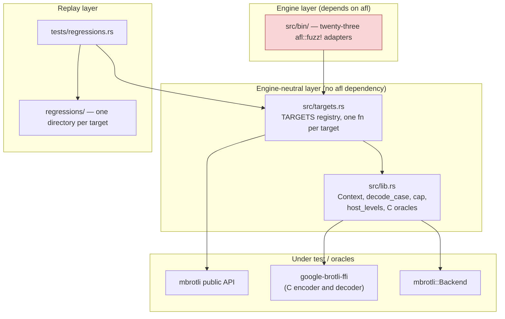
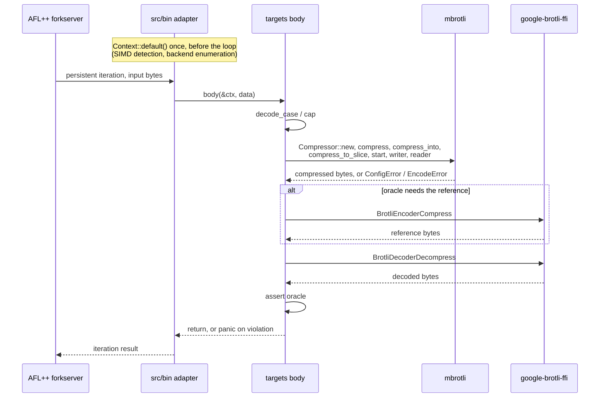
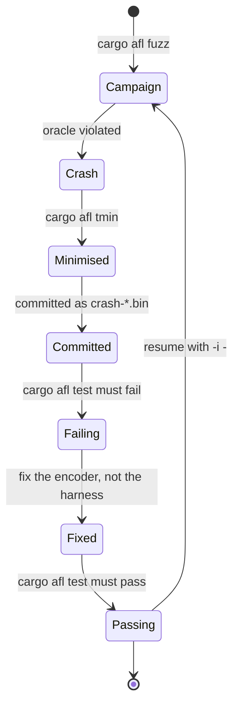

# Fuzzing subsystem

AFL++ coverage-guided fuzzing for every quality the crate implements, the
streaming state machine, the prepared dictionary and the compressor lifecycle.
This document describes the `fuzz/afl` package as it exists today: its module
boundaries, the input model, where each oracle comes from, how a finding travels
back into the test suite, and which boundaries are still unfuzzed.

## Ownership boundaries

`fuzz/afl` is a separate, unpublished package, deliberately excluded from the
root workspace (`Cargo.toml`, `exclude = ["fuzz/afl"]`) so that AFL's
instrumentation and its runtime never reach an ordinary root `cargo test` or
`cargo clippy`. It depends on `mbrotli` and on `google-brotli-ffi` by path.
Backend selection goes through `mbrotli::Backend`, including its scalar baseline;
the fuzz package has no direct dependency on the SIMD implementation crate.

The package is split so that the AFL dependency stops at the binary layer:

Only `src/bin/` names `afl`. Every target body is a plain
`fn(&Context, &[u8])`, so the same code runs under the fuzzer, under
`cargo afl test`, and under a debugger. That is what makes a minimised crash
reproducible without an instrumented binary.

`Context` is built once per process and holds the detected `Backend` and the
deduplicated list of host backends. Each iteration creates its compressors
through `Context::encoder` and drops its owned stream state afterward. Parallel
batches use their own synchronization and cancellation state. No compressor or
batch state is shared between fuzz inputs, and `fuzz_with_reset!` is not used.

## Input model

The common payload and parameter input shapes cap data at `MAX_PAYLOAD`
(128 KiB). Specialized lifecycle, serialized dictionary, framing, and parallel
targets decode their own bounded command or format structures.

```mermaid
flowchart TD
    input["AFL input bytes"] --> shape{"target shape"}

    shape -->|payload only| raw["whole input is the payload<br/>q0 to q11 roundtrip"]
    raw --> capA["cap to MAX_PAYLOAD"]
    capA --> fixed["config = (fixed quality, Window::DEFAULT)"]

    shape -->|settings header| hdr["decode_case: 6 header bytes"]
    hdr --> q["byte 0 — IMPLEMENTED_QUALITIES indexed by b mod 12"]
    hdr --> w["byte 1 — Window 10 + b mod 15<br/>spans the ordinary range, always legal"]
    hdr --> c["byte 2 — chunk = 1 shl (b mod 18), always at least 1"]
    hdr --> f["byte 3 — mode in the low two bits,<br/>literal context modelling in bit 2"]
    hdr --> bl["byte 4 — zero leaves lgblock to the encoder,<br/>otherwise BlockBits 16 + b mod 9"]
    hdr --> dc["byte 5 — postfix bits and direct groups,<br/>falling back to the default pair when unrepresentable"]
    hdr --> capB["remainder capped to MAX_PAYLOAD,<br/>StreamConfig declares InputSize::Exact(len)"]

    shape -->|numeric settings| pp["parameter_parsing: 2 header bytes"]
    pp --> qn["byte 0 — quality value b mod 20<br/>reaches 10 and 12 and above, which are illegal"]
    pp --> wn["byte 1 — window value b, 0 to 255<br/>reaches below 10 and above 24"]

    shape -->|"large window"| lw["large_window: 1 byte, then decode_case"]
    lw --> lwn["byte 0 — declared window b mod 70<br/>reaches below 10 and above 62, both illegal"]
    lw --> lwr["remainder — a whole decode_case input,<br/>so quality and distance layout still vary"]

    shape -->|"dictionary"| sc["dictionary: 2 bytes, then decode_case"]
    sc --> scn["byte 0 — attachments b mod 18<br/>reaches 16 and 17, both past the format's limit"]
    sc --> scs["byte 1 — every fourth value squeezes<br/>DictionaryLimits to an impossible budget"]
    sc --> scr["remainder — a whole decode_case input;<br/>its payload is cut into the attachments<br/>and then matched against them"]

    shape -->|"lifecycle"| cl["compressor_lifecycle: 8 bytes, then decode_case"]
    cl --> cln["each byte mod 8 — one command:<br/>compress, append, short destination, trim,<br/>read retained bytes, reconfigure,<br/>abandon a session, leak one and recover"]
    cl --> clr["remainder — a whole decode_case input"]
```

`decode_case` is closed over the legal domain by construction: its window index
covers exactly the ordinary `10..=24`, so the `unwrap_or(DEFAULT)` fallback is
unreachable, `chunk` is never zero, and an unrepresentable distance layout falls
back to `DistanceParams::Auto`. The declared size is the payload's true length,
which is what the one-shot entry points declare for themselves, so the streaming
and one-shot targets stay comparable with each other and with the C reference.
That keeps the equivalence and differential targets focused on encoder
behaviour. `parameter_parsing` exists because of that closure — it is the only
target that can reach the validating conversions and the large-window refusal.

## Targets and oracles

| Target | Input | Oracle |
| --- | --- | --- |
| `q0_roundtrip` | payload | no panic, `compressed.len() <= Compressor::max_compressed_size`, C decoder round-trip |
| `q1_roundtrip` | payload | same, at quality 1 |
| `q3_roundtrip` | payload | same, at quality 3 |
| `q4_roundtrip` | payload | same, at quality 4 |
| `q5_roundtrip` | payload | same, at quality 5 |
| `q6_roundtrip` | payload | same, at quality 6 |
| `q7_roundtrip` | payload | same, at quality 7 |
| `q8_roundtrip` | payload | same, at quality 8 |
| `q9_roundtrip` | payload | same, at quality 9 |
| `q10_roundtrip` | payload | same, at quality 10 |
| `q11_roundtrip` | payload | same, at quality 11 |
| `params_roundtrip` | header | bound, round-trip, and that a reused compressor, a second call on it and a fresh one all agree, over every legal setting |
| `simd_equivalence` | header | every distinct host backend emits identical bytes |
| `differential_c` | header | byte identity with Google Brotli v1.2.0 streaming FINISH configured with the same quality, window, mode, block size, size hint, distance layout and context setting, including empty input |
| `streaming_equivalence` | header | vector, append, exact slice, writer, reader and low-level session emit identical bytes with declared size at arbitrary chunk sizes, including empty and incompressible inputs; every `process` call that moved nothing reports why; the stream round-trips |
| `output_capacity` | header | exactly sized `dst` accepted, one byte short reported as `OutputTooSmall`, appending preserves the destination's prefix and returns the range it added, and a failed call does not change the next one |
| `parameter_parsing` | numeric | `TryFrom` and `Window` contracts hold; every legal quality compresses and round-trips; `Compressor::new` refuses a large window at qualities 0 to 2 and accepts it above |
| `large_window` | large window | `Window::large` contract holds; qualities 0, 1 and 2 refuse when the compressor is built rather than dropping the request; bound, determinism, backend identity; C decoder round-trip up to 30 declared bits, and above it the stream differs from the 30-bit stream only in the six header bits |
| `dictionary` | dictionary | preparation is a transaction — an empty, count or limit refusal yields no dictionary; the accessors agree with what was attached; the offset-to-distance mapping round-trips and saturates at both ends; below quality 5 every entry point refuses rather than ignoring, and the compressor still works afterwards; at quality 5 and above the three entry points agree, the output fits the bound, and a dictionary call never changes the next ordinary one |
| `serialized_dictionary` | dictionary stream | parser validity versus C, excluding its five-byte varint limit and ignored trailing bytes; canonical reserialization; bounded preparation of prefixes/custom indexes; q5/q11 compression independently decoded by C with the serialized dictionary attached |
| `framing` | settings byte and bounded resource bytes | resource/metadata sequences with bounded chunks, independent metadata compression and selected repeats; identical bytes under one-byte, 37-byte and 2048-byte caller writes; directory completeness including type 8; C decoding of metadata streams; successful finalization or typed validation failure |
| `parallel` | bounded task/source settings | deterministic task schedules, slice/seek-source equivalence, staged assembly and C decoding |
| `compressor_lifecycle` | lifecycle | whatever sequence of reuse, appending, deliberate failure, trimming, reconfiguration, abandoned and leaked sessions the input asks for, the compressor still emits the bytes a fresh one would for the configuration it ended up with |

Byte comparison checks the equivalent C encoding policy. Independent C decoding
checks stream validity and content. Rust API/backend comparisons check
consistency, while bounds and capacity tests check output-buffer contracts.

## Per-iteration flow

A panic is the signal; nothing catches it. Errors that are part of the API
contract — `LargeWindowUnsupportedForQuality`, `OutputTooSmall`,
`DictionaryUnsupportedForQuality`, `AbandonedSession`, the `TryFrom`
rejections — are asserted on rather than treated as crashes.

## SIMD dispatch point

`host_levels` delegates to `Backend::available()`, which returns each supported
backend once, scalar first. `Context::default()` detects and enumerates before
the persistent loop. The fuzz package has no direct dependency on
`fearless_simd`; unsupported implementation tokens cannot cross the public API.

## Finding lifecycle

`tests/regressions.rs` walks the `TARGETS` registry, and for each entry replays
every `.bin` file under `regressions/<name>/` through that target's body. It
also asserts that no target has an empty corpus, so adding a target without
seeding it fails the suite. The corpus holds hand-written `boundary-*.bin`
cases — empty input, truncated and extreme headers, minimum and maximum window
sizes, smallest and largest chunk sizes, incompressible payloads — plus
`crash-*.bin` reproducers as findings arrive.

## Seed corpora

Seeds are generated, not committed: `prepare-seeds.sh` derives them from the
vendored submodule at `brotli-ffi/vendor/brotli/tests/testdata`, and
`minimise-seeds.sh` reduces each corpus with `cargo afl cmin`, keeping the
unminimised original alongside as `seeds/*.raw`. `seeds/generic` is the raw
test data (24 files, minimised to 21); `seeds/params` is the same files behind
a parameter header (114, minimised to 47 — most headers reach the same code);
`seeds/dictionary` is each parameter seed behind two more bytes, at four
attachment counts (0, 1, 15, 16 — the refused-empty path, one dictionary, the
format's limit and one past it) crossed with a generous and an impossible
budget.

`seeds/serialized` is the exception: RFC 9841 dictionary streams have no
counterpart in the upstream test data, so the seeds are copies of the committed
regression corpus — valid streams of every shape the format allows, plus the
malformed ones worth starting a campaign from. The target also prefixes the
magic bytes when an input lacks them, so a mutation spends its effort on the
fields rather than on the two-byte signature.

`seeds/large_window` is each parameter seed behind one more byte, at four
declared windows — the floor, the default, the widest the pinned C decoder
reads, and the widest the format allows.
Minimisation cuts the file count, not the byte count: the large fixtures carry
coverage the small ones miss and survive `cmin`. Per-iteration cost is bounded
by `MAX_PAYLOAD`, not by the corpus. No dictionary is used — the targets
consume arbitrary payload bytes rather than a token grammar.

`minimise-seeds.sh` exports `AFL_NO_FORKSRV=1` for `afl-cmin` folder-mode
coverage collection. This runs the target once per input and avoids persistent
forkserver timeouts during corpus minimization.

## Known gaps

- **No decompression target.** There is no decoder in `mbrotli`; round-trip
  oracles use Google's C decoder.
- **Framing fault injection is deterministic, not fuzz-driven.**
  `tests/framing.rs` injects short writes and retryable failures at each tested
  offset; the fuzz target varies valid resource/metadata sequences and chunking.
- **Payloads are capped at 128 KiB.** Inputs longer than that are truncated, so
  windows of 2^17 and above never span multiple encoder blocks under the
  fuzzer. `tests/vendor_corpus.rs` covers multi-fragment inputs instead,
  including a 12 MiB case.
- **CI smoke campaigns are bounded evidence.** `.github/workflows/ci-fuzz.yml`
  runs manual campaigns including serialized dictionaries and framing; a short
  campaign is not a substitute for longer fuzzing.
- **Most regression corpora are seeded, not found.** Every `boundary-*.bin` is
  hand-written. The two noncanonical-varint serialized fixtures are minimized
  AFL findings documenting the C helper's narrower integer reader.
- **`prepare-seeds.sh` does not emit a `compressor_lifecycle` corpus.** That
  target's committed cases are hand-written command sequences; a campaign starts
  from those rather than from the vendored test data.
## Parallel boundary target

`parallel` uses the public task API, 64 KiB segments and at most 128 KiB of input. It compares one-task and reverse three-task output, scalar and host backends, retained workers, and independent C decoding. The engine-neutral body and per-quality seeds are replayed by the existing regression runner.

The parallel target also compares borrowed slice input with an owned
`SeekSource<Cursor<Vec<u8>>>` through the generic `prepare_source` API, exercising
absolute offsets and length checks under the same decode/determinism oracle.
