# Fuzzing subsystem

AFL++ coverage-guided fuzzing for every quality the crate implements, the
streaming state machine, the prepared dictionary and the compressor lifecycle.
This document describes the `fuzz/afl` package as it exists today: its module
boundaries, the input model, where each oracle comes from, how a finding travels
back into the test suite, and which boundaries are still unfuzzed.

## Ownership boundaries

`fuzz/afl` is a separate, unpublished package, deliberately excluded from the
root workspace (`Cargo.toml`, `exclude = ["fuzz/afl"]`) so that AFL's
instrumentation and its runtime never reach an ordinary root `cargo test` or
`cargo clippy`. It depends on `mbrotli` and on `google-brotli-ffi` by path.
Backend selection goes through `mbrotli::Backend` using production backends;
the fuzz package has no direct dependency on the SIMD implementation crate.

The fuzz package has no default features. Its opt-in `experimental` feature
forwards to both `mbrotli/experimental` and `google-brotli-ffi/experimental`,
enabling the serialized dictionary parser and its C oracle together. Only
`serialized_dictionary`, `framing` and `decode_serialized` require it: their
Cargo binary entries, target bodies, private helpers, C helpers, and `TARGETS`
entries share the gate. The default build contains 27 targets; enabling the
feature contains all 30.

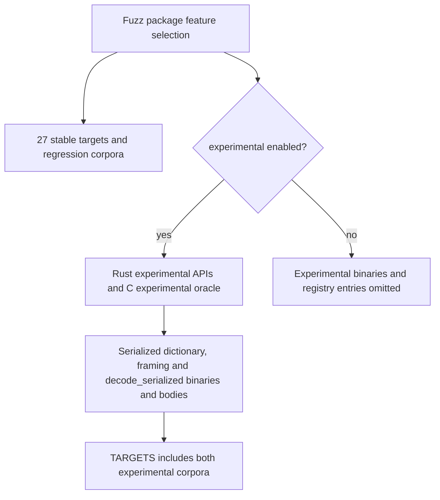

The package is split so that the AFL dependency stops at the binary layer:

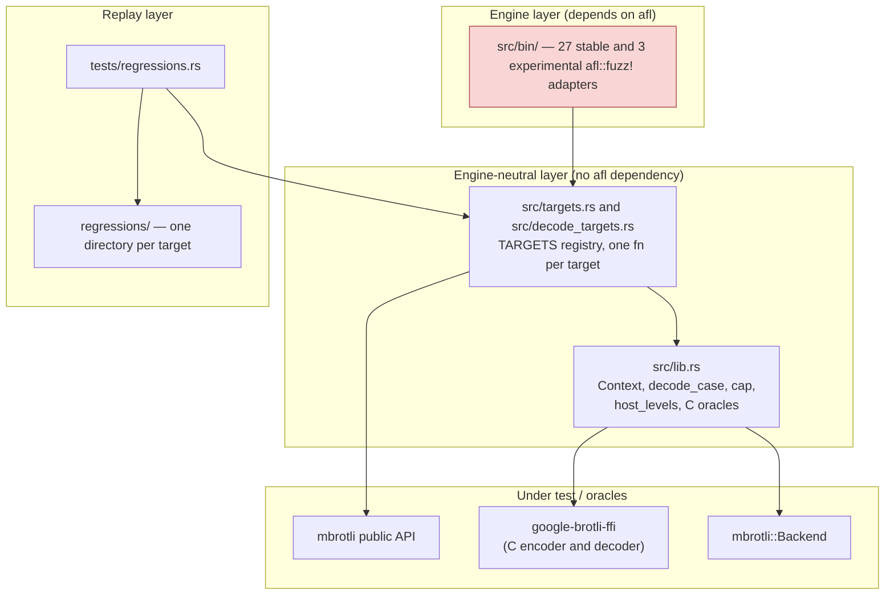

Only `src/bin/` names `afl`. Every target body is a plain
`fn(&Context, &[u8])`, so the same code runs under the fuzzer, under
`cargo afl test`, and under a debugger. That is what makes a minimised crash
reproducible without an instrumented binary.

`Context` is built once per process and holds the detected `Backend` and the
deduplicated list of host backends. Each iteration creates its compressors
through `Context::encoder` and drops its owned stream state afterward. Parallel
batches use their own synchronization and cancellation state. No compressor or
batch state is shared between fuzz inputs, and `fuzz_with_reset!` is not used.

## Input model

The common payload and parameter input shapes cap data at `MAX_PAYLOAD`
(128 KiB). Specialized lifecycle, serialized dictionary, framing, and parallel
targets decode their own bounded command or format structures.

```mermaid
flowchart TD
    input["AFL input bytes"] --> shape{"target shape"}

    shape -->|payload only| raw["whole input is the payload<br/>q0 to q11 roundtrip"]
    raw --> capA["cap to MAX_PAYLOAD"]
    capA --> fixed["config = (fixed quality, Window::DEFAULT)"]

    shape -->|settings header| hdr["decode_case: 6 header bytes"]
    hdr --> q["byte 0 — IMPLEMENTED_QUALITIES indexed by b mod 12"]
    hdr --> w["byte 1 — Window 10 + b mod 15<br/>spans the ordinary range, always legal"]
    hdr --> c["byte 2 — chunk = 1 shl (b mod 18), always at least 1"]
    hdr --> f["byte 3 — mode in the low two bits,<br/>literal context modelling in bit 2"]
    hdr --> bl["byte 4 — zero leaves lgblock to the encoder,<br/>otherwise BlockBits 16 + b mod 9"]
    hdr --> dc["byte 5 — postfix bits and direct groups,<br/>falling back to the default pair when unrepresentable"]
    hdr --> capB["remainder capped to MAX_PAYLOAD,<br/>StreamConfig declares InputSize::Exact(len)"]

    shape -->|numeric settings| pp["parameter_parsing: 2 header bytes"]
    pp --> qn["byte 0 — quality value b mod 20<br/>reaches 10 and 12 and above, which are illegal"]
    pp --> wn["byte 1 — window value b, 0 to 255<br/>reaches below 10 and above 24"]

    shape -->|"large window"| lw["large_window: 1 byte, then decode_case"]
    lw --> lwn["byte 0 — declared window b mod 70<br/>reaches below 10 and above 62, both illegal"]
    lw --> lwr["remainder — a whole decode_case input,<br/>so quality and distance layout still vary"]

    shape -->|"dictionary"| sc["dictionary: 2 bytes, then decode_case"]
    sc --> scn["byte 0 — attachments b mod 18<br/>reaches 16 and 17, both past the format's limit"]
    sc --> scs["byte 1 — every fourth value squeezes<br/>DictionaryLimits to an impossible budget"]
    sc --> scr["remainder — a whole decode_case input;<br/>its payload is cut into the attachments<br/>and then matched against them"]

    shape -->|"lifecycle"| cl["compressor_lifecycle: 8 bytes, then decode_case"]
    cl --> cln["each byte mod 8 — one command:<br/>compress, append, short destination, trim,<br/>read retained bytes, reconfigure,<br/>abandon a session, leak one and recover"]
    cl --> clr["remainder — a whole decode_case input"]
```

`decode_case` is closed over the legal domain by construction: its window index
covers exactly the ordinary `10..=24`, so the `unwrap_or(DEFAULT)` fallback is
unreachable, `chunk` is never zero, and an unrepresentable distance layout falls
back to `DistanceParams::Auto`. The declared size is the payload's true length,
which is what the one-shot entry points declare for themselves, so the streaming
and one-shot targets stay comparable with each other and with the C reference.
That keeps the equivalence and differential targets focused on encoder
behaviour. `parameter_parsing` exists because of that closure — it is the only
target that can reach the validating conversions and the large-window refusal.

## Targets and oracles

| Target | Input | Oracle |
| --- | --- | --- |
| `q0_roundtrip` | payload | no panic, `compressed.len() <= Compressor::max_compressed_size`, C decoder round-trip |
| `q1_roundtrip` | payload | same, at quality 1 |
| `q3_roundtrip` | payload | same, at quality 3 |
| `q4_roundtrip` | payload | same, at quality 4 |
| `q5_roundtrip` | payload | same, at quality 5 |
| `q6_roundtrip` | payload | same, at quality 6 |
| `q7_roundtrip` | payload | same, at quality 7 |
| `q8_roundtrip` | payload | same, at quality 8 |
| `q9_roundtrip` | payload | same, at quality 9 |
| `q10_roundtrip` | payload | same, at quality 10 |
| `q11_roundtrip` | payload | same, at quality 11 |
| `decode_roundtrip` | shared encoder header | independent C compression, exact native decoding and streaming equivalence; plaintext capped at 64 KiB |
| `params_roundtrip` | header | bound, round-trip, and that a reused compressor, a second call on it and a fresh one all agree, over every legal setting |
| `simd_equivalence` | header | every distinct host backend emits identical bytes |
| `differential_c` | header | byte identity with Google Brotli v1.2.0 streaming FINISH configured with the same quality, window, mode, block size, size hint, distance layout and context setting, including empty input |
| `streaming_equivalence` | header | vector, append, exact slice, writer, reader and low-level session emit identical bytes with declared size at arbitrary chunk sizes, including empty and incompressible inputs; every `process` call that moved nothing reports why; the stream round-trips |
| `output_capacity` | header | exactly sized `dst` accepted, one byte short reported as `OutputTooSmall`, appending preserves the destination's prefix and returns the range it added, and a failed call does not change the next one |
| `parameter_parsing` | numeric | `TryFrom` and `Window` contracts hold; every legal quality compresses and round-trips; `Compressor::new` refuses a large window at qualities 0 to 2 and accepts it above |
| `large_window` | large window | `Window::large` contract holds; qualities 0, 1 and 2 refuse when the compressor is built rather than dropping the request; bound, determinism, backend identity; C decoder round-trip up to 30 declared bits, and above it the stream differs from the 30-bit stream only in the six header bits |
| `dictionary` | dictionary | preparation is a transaction — an empty, count or limit refusal yields no dictionary; the accessors agree with what was attached; the offset-to-distance mapping round-trips and saturates at both ends; below quality 5 every entry point refuses rather than ignoring, and the compressor still works afterwards; at quality 5 and above the three entry points agree, the output fits the bound, and a dictionary call never changes the next ordinary one |
| `serialized_dictionary` | dictionary stream | parser validity versus C, excluding its five-byte varint limit and ignored trailing bytes; canonical reserialization; bounded preparation of prefixes/custom indexes; q5/q11 compression independently decoded by C with the serialized dictionary attached |
| `framing` | settings byte and bounded resource bytes | resource/metadata sequences with bounded chunks, independent metadata compression and selected repeats; identical bytes under one-byte, 37-byte and 2048-byte caller writes; directory completeness including type 8; C decoding of metadata streams; successful finalization or typed validation failure |
| `parallel` | bounded task/source settings | deterministic task schedules, slice/seek-source equivalence, staged assembly and C decoding |
| `compressor_lifecycle` | lifecycle | whatever sequence of reuse, appending, deliberate failure, trimming, reconfiguration, abandoned and leaked sessions the input asks for, the compressor still emits the bytes a fresh one would for the configuration it ended up with |

Byte comparison checks the equivalent C encoding policy. Independent C decoding
checks stream validity and content. Rust API/backend comparisons check
consistency, while bounds and capacity tests check output-buffer contracts.

## Per-iteration flow

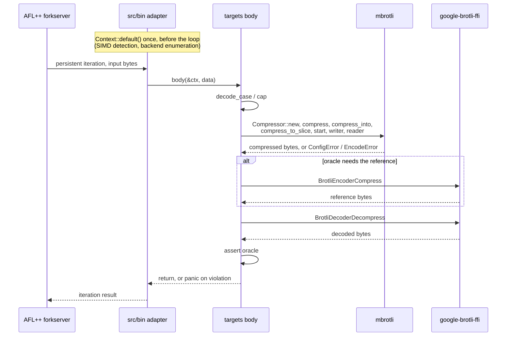

A panic is the signal; nothing catches it. Errors that are part of the API
contract — `LargeWindowUnsupportedForQuality`, `OutputTooSmall`,
`DictionaryUnsupportedForQuality`, `AbandonedSession`, the `TryFrom`
rejections — are asserted on rather than treated as crashes.

## SIMD dispatch point

`host_levels` delegates to `Backend::available()`, which returns each supported
backend once, from lower to higher SIMD levels. Scalar is included only on
targets that require it; forced scalar equivalence is covered by library unit
tests. `Context::default()` detects and enumerates before the persistent loop.
The fuzz package has no direct dependency on `fearless_simd`; unsupported
implementation tokens cannot cross the public API.

## Finding lifecycle

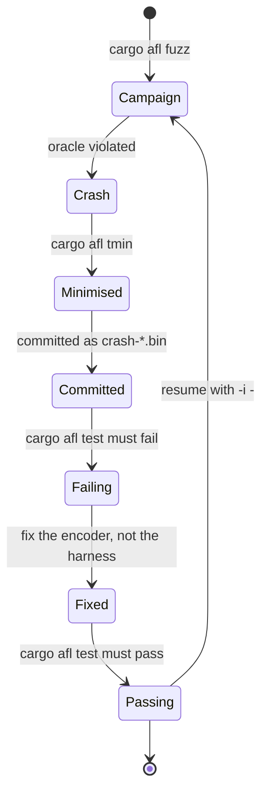

`tests/regressions.rs` walks the `TARGETS` registry, and for each entry replays
every `.bin` file under `regressions/<name>/` through that target's body.
`decode_roundtrip` aliases the encoder's `regressions/params_roundtrip` corpus. It
checks that experimental targets are registered exactly when their feature is
enabled. CI and local completion checks run Clippy and `cargo afl test` both
with `--no-default-features` and with
`--no-default-features --features experimental`. The replay
also asserts that no target has an empty corpus, so adding a target without
seeding it fails the suite. The corpus holds hand-written `boundary-*.bin`
cases — empty input, truncated and extreme headers, minimum and maximum window
sizes, smallest and largest chunk sizes, incompressible payloads — plus
`crash-*.bin` reproducers as findings arrive.

## Seed corpora

Seeds are generated, not committed: `prepare-seeds.sh` derives them from the
vendored submodule at `brotli-ffi/vendor/brotli/tests/testdata`, and
`minimise-seeds.sh` reduces each corpus with `cargo afl cmin`, keeping the
unminimised original alongside as `seeds/*.raw`. `seeds/generic` is the raw
test data (24 files, minimised to 21); `seeds/params` is the same files behind
a parameter header (historically 127, minimised to 85; the generator now also
includes Q5–Q11 headers for small inputs);
`seeds/dictionary` is each parameter seed behind two more bytes, at four
attachment counts (0, 1, 15, 16 — the refused-empty path, one dictionary, the
format's limit and one past it) crossed with a generous and an impossible
budget (historically 1016 files, minimised to 90). `seeds/large_window`
historically reduced to 101 of 508. Those counts predate the Q5–Q11 header
expansion; current counts depend on the generated and minimized corpus.

`seeds/serialized` is the exception: RFC 9841 dictionary streams have no
counterpart in the upstream test data, so the seeds are copies of the committed
regression corpus — valid streams of every shape the format allows, plus the
malformed ones worth starting a campaign from. The target also prefixes the
magic bytes when an input lacks them, so a mutation spends its effort on the
fields rather than on the two-byte signature.

`seeds/large_window` is each parameter seed behind one more byte, at four
declared windows — the floor, the default, the widest the pinned C decoder
reads, and the widest the format allows.
Minimisation cuts the file count, not the byte count: the large fixtures carry
coverage the small ones miss and survive `cmin`. Per-iteration cost is bounded
by `MAX_PAYLOAD`, not by the corpus. No dictionary is used — the targets
consume arbitrary payload bytes rather than a token grammar.

`minimise-seeds.sh` exports `AFL_NO_FORKSRV=1` for `afl-cmin` folder-mode
coverage collection. This runs the target once per input and avoids persistent
forkserver timeouts during corpus minimization. It measures coverage with the
`target/release` build unless `TARGET_DIR` names another one.

## Campaign structure

`campaign.sh` runs encoder targets plus `decode_roundtrip`: one AFL++ worker per
target per
feature configuration, each with its own seed corpus and output directory, all
bounded by the same wall-clock duration and a fixed execution timeout. The
`experimental` feature reaches into the encoder, so its 22 stable targets are
fuzzed twice — once from each build — and the two experimental-only targets
once. The builds occupy separate target directories, because the shared
binaries have the same names.

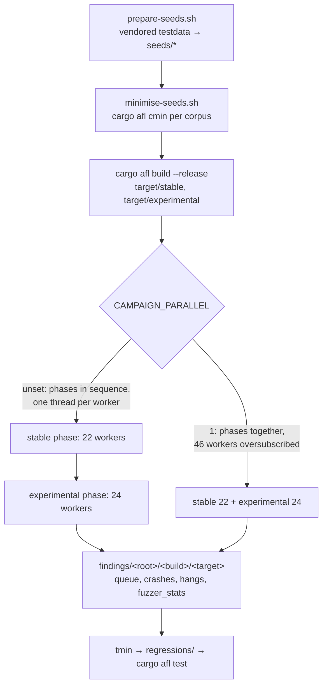

A fixed `-t` matters: with a trailing `+` AFL++ calibrates the timeout from the
seeds and treats the value only as a ceiling, which discards slow quality 10
and 11 mutations as timeouts instead of executing them. The default is 30000
milliseconds, about four times the slowest observed instrumented execution of a
128 KiB payload at quality 11 across three backends.

The two scripts may run at once, as the 2026-09-11 record did: 46 encoder
workers under `CAMPAIGN_PARALLEL=1` alongside 13 decoder workers, 59 on 24
hardware threads. The oversubscription costs executions per second and nothing
else, but it does inflate wall-clock timings, so a saved hang has to be
measured standalone before it is read as one. What the eight-hour run's hangs
turned out to be was the opposite of a fuzzer artefact — a forest the encoder
wrote instead of reserving — which is why the triage step belongs in the loop
even when a timeout looks like contention.

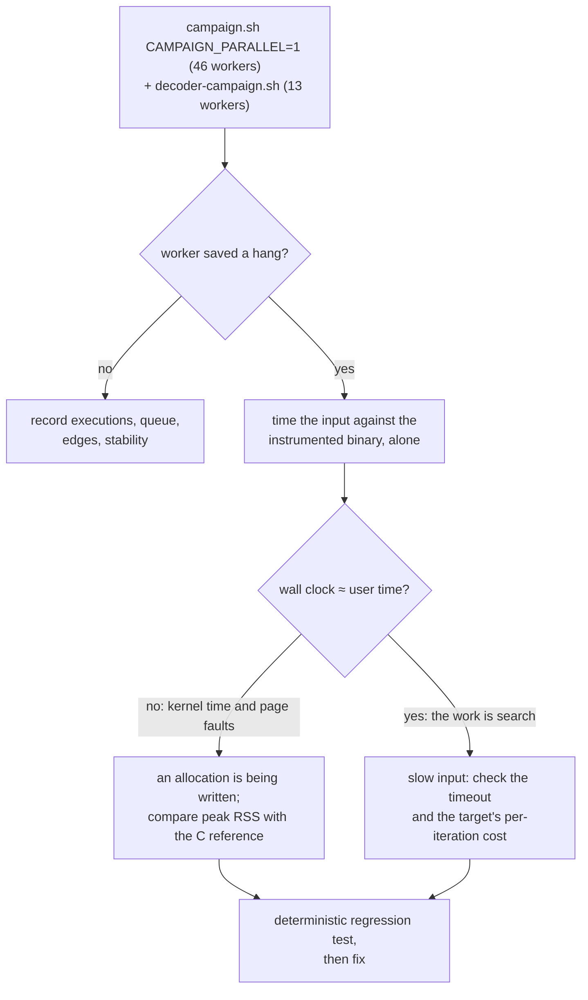

## Known gaps

- Decoder targets and their independent C oracle are described below. Encoder
  round-trip targets continue to use Google's C decoder.
- **The two campaign scripts do not overlap.** `campaign.sh` fuzzes the encoder
  surface and `decode_roundtrip`; `decoder-campaign.sh` fuzzes the decoder
  surface. Running only one leaves the other unfuzzed.
- **Framing fault injection is deterministic, not fuzz-driven.**
  `tests/framing.rs` injects short writes and retryable failures at each tested
  offset; the fuzz target varies valid resource/metadata sequences and chunking.
- **Payloads are capped at 128 KiB.** Inputs longer than that are truncated, so
  no fuzzed stream reaches the multi-fragment sizes `tests/vendor_corpus.rs`
  covers, including its 12 MiB case. A capped payload does still span more than
  one encoder block when the case header pins the block size: sixteen bits
  makes any payload over 64 KiB non-final in its first block, which is the
  branch the 2026-09-11 campaign's `large_window` finding came from.
- **CI smoke campaigns are bounded evidence.** `.github/workflows/ci-fuzz.yml`
  runs manual campaigns including serialized dictionaries and framing; a short
  campaign is not a substitute for longer fuzzing.
- **Most regression corpora are seeded, not found.** Every `boundary-*.bin` is
  hand-written. The two noncanonical-varint serialized fixtures are minimized
  AFL findings documenting the C helper's narrower integer reader.
- **`prepare-seeds.sh` does not emit a `compressor_lifecycle` corpus.** That
  target's committed cases are hand-written command sequences; a campaign starts
  from those rather than from the vendored test data.
## Parallel boundary target

`parallel` uses the public task API, 64 KiB segments and at most 128 KiB of input. It compares one-task and reverse three-task output, all available host backends, retained workers, and independent C decoding. The engine-neutral body and per-quality seeds are replayed by the existing regression runner.

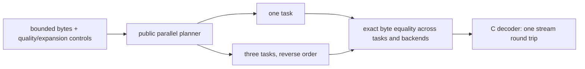

The parallel target checks the full payload-and-descriptor memory bound: an
explicit ceiling at that bound succeeds and one byte less is rejected. It
compares explicit memory staging with `BatchConfig::auto` across task counts
and backends.

The parallel target also compares borrowed slice input with an owned
`SeekSource<Cursor<Vec<u8>>>` through the generic `prepare_source` API, exercising
absolute offsets and length checks under the same decode/determinism oracle.

## Native decoder boundaries

`decode_targets` adds `decompress`, `decode_roundtrip`, `decode_streaming`, `decode_dictionary`,
`decode_lifecycle`, and `decode_io_limits` in the base profile, with
`decode_serialized` gated at binary, body and registry levels by `experimental`.
The first target compares independent C results and exact member consumption;
streaming checks one-shot equivalence and cumulative progress. A successful
bounded arbitrary-input decode is replayed with default limits to exercise
complete stored-member recognition; the first decode proves that this replay
can produce at most 64 KiB. Malformed inputs retain the bounded path. Raw/serialized
attachments feed attached decoding; lifecycle covers forgotten sessions and
recovery; writer faults combine output budgets with cursor-preserving retries.

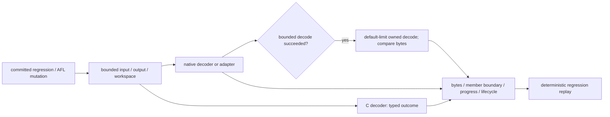

`decode_oracle` distinguishes success with exact consumption, invalid data,
insufficient input, output budget, allocation refusal, rejected attachment and
C-unsupported wide windows. Resource refusal is not treated as a format verdict.
`scripts/fuzz_decoder.sh base|experimental 60` executes reproducible campaigns
against prebuilt binaries and fails on saved crashes/hangs. Build the matching
profile first. Decoder fixtures and upstream seeds are described in
`fuzz/afl/regressions/decoder-provenance.md` and the decoder compatibility report.

### Decoder campaigns

`campaign.sh` covers the encoder surface and `decode_roundtrip`.
`decoder-campaign.sh` covers this one: the six base targets and, in the
experimental build, `decode_serialized`, thirteen workers in all. Both phases
run at once, because thirteen workers fit an ordinary host without
oversubscription, and the two builds again occupy separate target directories.

The three targets that read a compressed member directly — `decompress`,
`decode_streaming` and `decode_io_limits` — take `seeds/decoder`, which
`prepare-decoder-seeds.sh` materialises from the committed regression inputs and
from Google Brotli's own `*.compressed*` fixtures below 50 KiB. Those targets
accept arbitrary bytes and need no seeds to run, but bytes that already decode
reach the grammar sooner than mutations toward a valid header. `decode_roundtrip`
reads the encoder's parameter header and uses `seeds/params`; the rest carry
their own input models and use their committed corpora. `SEED_ROOT` overrides a
worker's corpus with `$SEED_ROOT/<config>-<target>` when that directory exists,
which is how a `cmin`-reduced queue from an earlier campaign is carried forward.

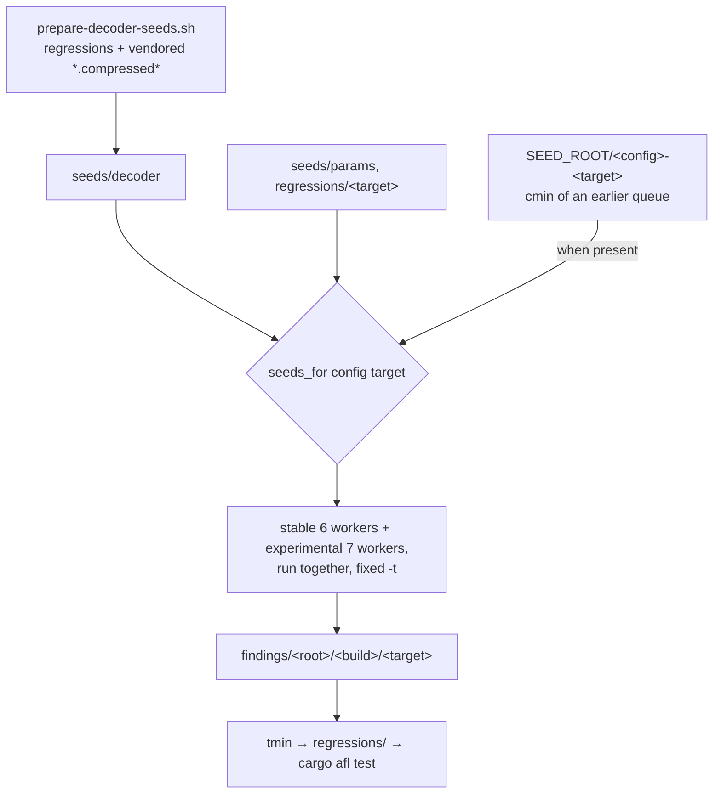

The execution timeout is fixed at five seconds rather than calibrated, for the
reason the encoder campaign uses a fixed thirty: a trailing `+` would let AFL++
derive its own ceiling from the seeds and discard slower decodes as timeouts.
Five seconds is far above any decode of a 128 KiB member, so anything reaching
it is a finding rather than a slow input.

### C encoder to native decoder round-trip

`decode_roundtrip` reuses the encoder's `decode_case` six-byte parameter header
and `seeds/params` corpus. Byte zero selects one quality with `% 12`; the small
parameter seeds include Q0–Q11. Each iteration compresses at one quality, not
all twelve. Windows 10–24, mode, block size, literal context and distance settings
use the same legal configuration mapping as the encoder targets. Plaintext is
capped at 64 KiB before calling `c_compress_with`, whose size hint uses that
actual capped length.

The independent C streaming encoder produces a valid stream; a fresh native
`Decompressor` using the context's already-selected backend must return the
exact plaintext. Every decoding error is a failure here, including resource
refusal: these generated inputs must fit the 64 KiB output and 8 MiB workspace
budgets. The same compressed bytes also reach `decode_streaming`, which checks
chunked equivalence, exact consumption, cumulative progress and termination.
Encoder state and decoder state are owned by the iteration; no state survives
between fuzz inputs, and no production API or SIMD dispatch boundary changes.

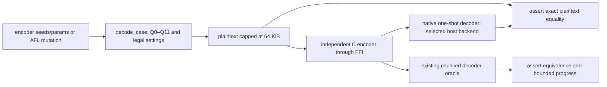

Regression replay aliases this target to `regressions/params_roundtrip`, so it
shares the encoder's committed inputs without duplicating files. Focused tests
exercise every quality, all modes, both standard-window endpoints and every
available host backend, plus empty, short and capped payloads. CI and
`scripts/fuzz_decoder.sh` run this target in base and experimental profiles;
`fuzz/afl/campaign.sh` includes it in both of its phases. Generate `seeds/params`
with `prepare-seeds.sh` before running the decoder campaign script.

Known gaps: generated streams use ordinary standard windows and no attached
dictionaries. Arbitrary-byte and dictionary decoder targets remain responsible
for malformed streams and attachment boundaries. AFL mutation does not guarantee
equal time on each quality, and corpus minimization may drop quality-specific
seeds; deterministic tests retain the full quality matrix.

The arbitrary-byte `decompress` and `decode_streaming` corpora also contain
8/32/256-byte deterministic pseudorandom seeds, consumed directly with no
compression step. Errors from malformed input are expected; panics and oracle
violations fail replay. A focused test feeds arbitrary byte arrays of lengths
0, 1, 2, 3, 7, 31, 256 and 4096 through both targets on every host backend.
