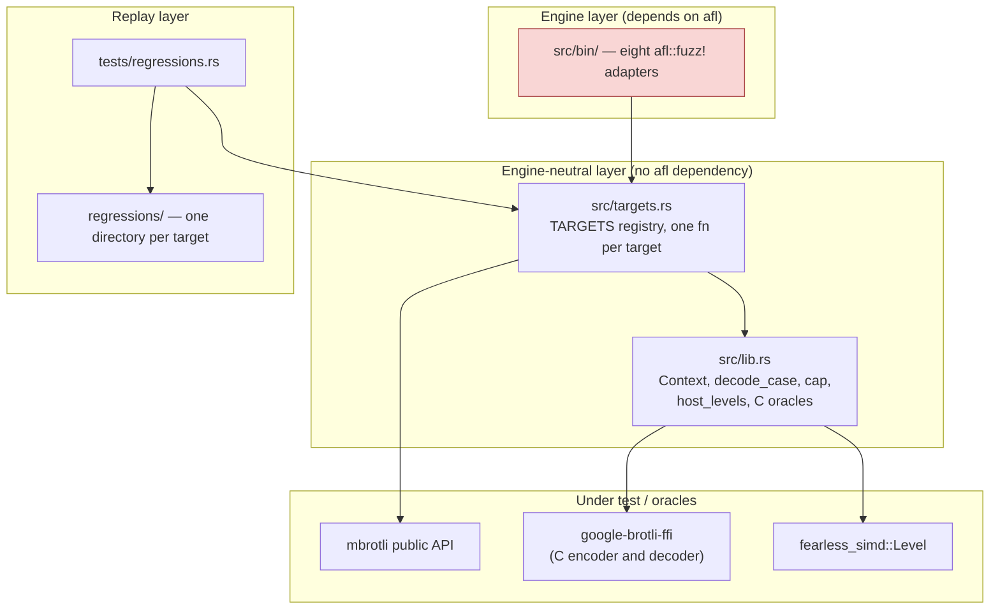
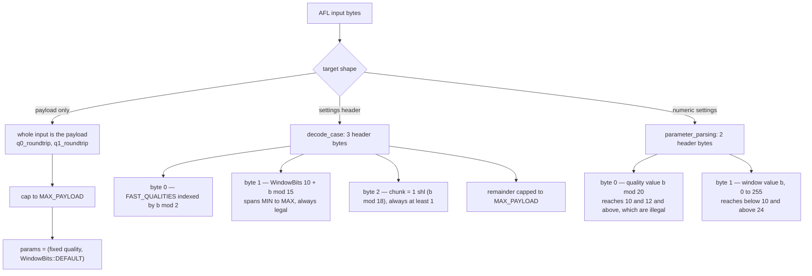
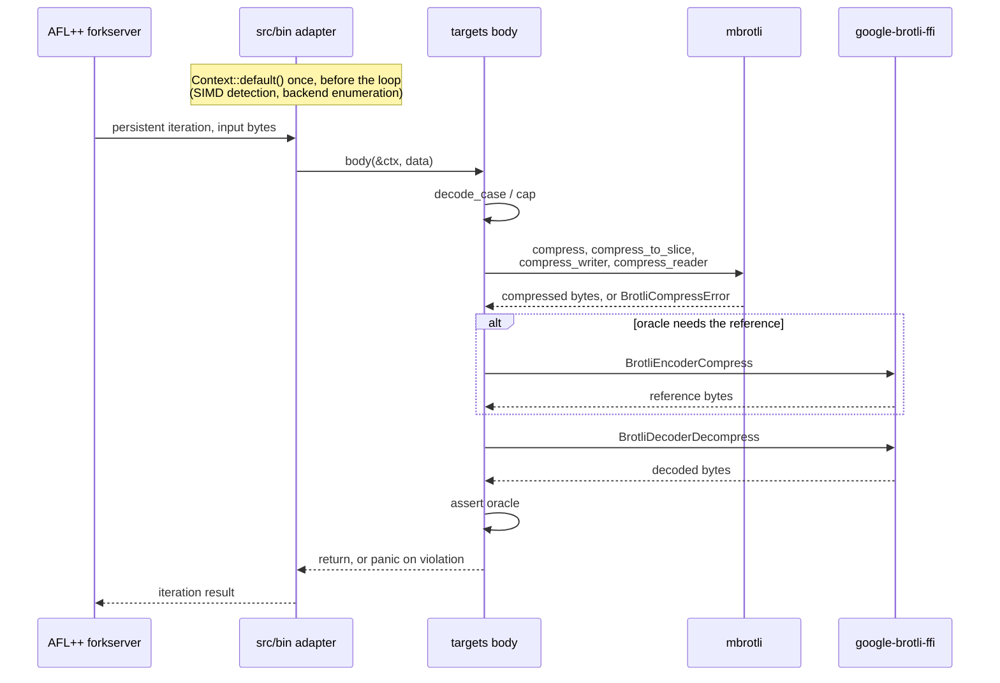
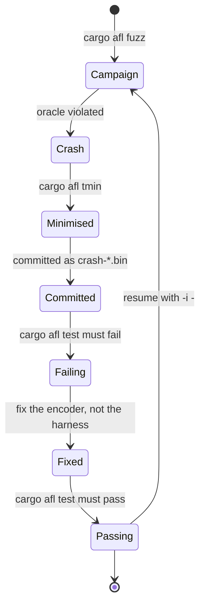

# Fuzzing subsystem

AFL++ coverage-guided fuzzing for the quality 0 and quality 1 encoders. This
document describes the `fuzz/afl` package as it exists today: its module
boundaries, the input model, where each oracle comes from, how a finding
travels back into the test suite, and which boundaries are still unfuzzed.

## Ownership boundaries

`fuzz/afl` is a separate, unpublished package, deliberately excluded from the
root workspace (`Cargo.toml`, `exclude = ["fuzz/afl"]`) so that AFL's
instrumentation and its runtime never reach an ordinary root `cargo test` or
`cargo clippy`. It depends on `mbrotli` and on `google-brotli-ffi` by path, and
pins `fearless_simd` with `force_support_fallback` so the scalar backend is
reachable for the equivalence target.

The package is split so that the AFL dependency stops at the binary layer:

Only `src/bin/` names `afl`. Every target body is a plain
`fn(&Context, &[u8])`, so the same code runs under the fuzzer, under
`cargo afl test`, and under a debugger. That is what makes a minimised crash
reproducible without an instrumented binary.

`Context` is built once per process and carries the prepared state: a
`Compressor` pinned to the detected level, and the deduplicated list of host
backends. Nothing in `mbrotli` holds mutable global state — there is no
`static mut`, `thread_local`, `OnceLock`, `RefCell`, `Mutex` or atomic in
`src/`, and `Compressor` is `Copy` over a resolved `Level` — so AFL's
persistent mode needs no reset hook and `fuzz_with_reset!` is not used.

## Input model

Two input shapes exist. Both cap the payload at `MAX_PAYLOAD` (128 KiB) by
truncation rather than rejection, so an oversized input still contributes the
structure its prefix carries.

`decode_case` is closed over the legal domain by construction: its window index
covers exactly `WindowBits::MIN..=MAX`, so the `unwrap_or(DEFAULT)` fallback is
unreachable, and `chunk` is never zero. That keeps the equivalence and
differential targets focused on encoder behaviour. `parameter_parsing` exists
because of that closure — it is the only target that can reach the validating
conversions and the unimplemented-quality path.

## Targets and oracles

| Target | Input | Oracle |
| --- | --- | --- |
| `q0_roundtrip` | payload | no panic, `compressed.len() <= calculate_bound`, C decoder round-trip |
| `q1_roundtrip` | payload | same, at quality 1 |
| `params_roundtrip` | header | bound, determinism across two runs, round-trip, over every legal setting |
| `simd_equivalence` | header | every distinct host backend emits identical bytes |
| `differential_c` | header | byte identity with Google Brotli v1.2.0 at the same quality and window |
| `streaming_equivalence` | header | writer output equals reader output at an arbitrary chunk size, and round-trips |
| `output_capacity` | header | exactly sized `dst` accepted, one byte short reported as `OutputTooSmall` |
| `parameter_parsing` | numeric | `TryFrom` contracts hold; unimplemented qualities reported by all four entry points |

The oracles are layered rather than independent: `differential_c` is the
strongest (byte identity with the reference), `params_roundtrip` and the
streaming target hold when the reference is unavailable, and the bound and
capacity checks pin the API contract regardless of the bytes produced.

## Per-iteration flow

A panic is the signal; nothing catches it. Errors that are part of the API
contract — `UnsupportedQuality`, `OutputTooSmall`, the `TryFrom` rejections —
are asserted on rather than treated as crashes.

## SIMD dispatch point

`host_levels` enumerates the backends the equivalence target compares. It
gathers `Level::new()`, `Level::baseline()`, `Level::fallback()` and every
architecture token the host exposes, then deduplicates by enum variant: those
routinely resolve to the same backend — on aarch64 the first two and the Neon
token are all Neon — and comparing a backend against itself costs an iteration
without buying coverage. Detection happens once, in `Context::default()`, never
inside the loop.

## Finding lifecycle

`tests/regressions.rs` walks the `TARGETS` registry, and for each entry replays
every `.bin` file under `regressions/<name>/` through that target's body. It
also asserts that no target has an empty corpus, so adding a target without
seeding it fails the suite. The corpus holds hand-written `boundary-*.bin`
cases — empty input, truncated and extreme headers, minimum and maximum window
sizes, smallest and largest chunk sizes, incompressible payloads — plus
`crash-*.bin` reproducers as findings arrive.

## Seed corpora

Seeds are generated, not committed: `prepare-seeds.sh` derives them from the
vendored submodule at `brotli-ffi/vendor/brotli/tests/testdata`, and
`minimise-seeds.sh` reduces each corpus with `cargo afl cmin`, keeping the
unminimised original alongside as `seeds/*.raw`. `seeds/generic` is the raw
test data (24 files, minimised to 21); `seeds/params` is the same files behind
a parameter header (114, minimised to 47 — most headers reach the same code).
Minimisation cuts the file count, not the byte count: the large fixtures carry
coverage the small ones miss and survive `cmin`. Per-iteration cost is bounded
by `MAX_PAYLOAD`, not by the corpus. No dictionary is used — the targets
consume arbitrary payload bytes rather than a token grammar.

`minimise-seeds.sh` must export `AFL_NO_FORKSRV=1`. `afl-cmin` measures
coverage with `afl-showmap -I`, and that folder mode stalls against these
binaries — persistent mode with a deferred forkserver — so every input blocks
until the `-t` timeout expires: roughly six seconds per seed, and an empty
output directory at the end. Without the forkserver, showmap execs the target
once per input the way its single-file mode already does. The captured edge
sets are identical; the corpus takes under two seconds instead of minutes.

## Known gaps

- **No decompression target.** There is no decoder in `mbrotli`; round-trip
  oracles use Google's C decoder. A decoder target has to wait for one.
- **Qualities 2 through 11 are only fuzzed for their refusal.**
  `parameter_parsing` asserts they report `UnsupportedQuality` from all four
  entry points; there is no implementation behind them to fuzz.
- **Payloads are capped at 128 KiB.** Inputs longer than that are truncated, so
  windows of 2^17 and above never span multiple encoder blocks under the
  fuzzer. `tests/vendor_corpus.rs` covers multi-fragment inputs instead,
  including a 12 MiB case.
- **No CI fuzzing.** The repository has no CI configuration at all, so neither
  a bounded smoke campaign nor the regression replay runs automatically.
- **Only smoke campaigns have been run.** Sixty seconds per target on
  `aarch64-apple-darwin`, all eight in parallel over the minimised corpora:
  434k executions, 0 crashes, 0 hangs, stability 99.90% to 99.97%, bitmap
  coverage 9% to 30.5%. That depth finds shallow faults only; no long campaign
  has been run, and no crash has ever been triaged, so the tmin-to-regression
  path in `regressions/` is exercised by boundary cases rather than by a real
  finding.
- **`cargo afl fuzz` and `cargo afl cmin` need `cargo afl system-config`** on
  macOS, which runs `sudo`. Without it both fail at `shmget()`.
