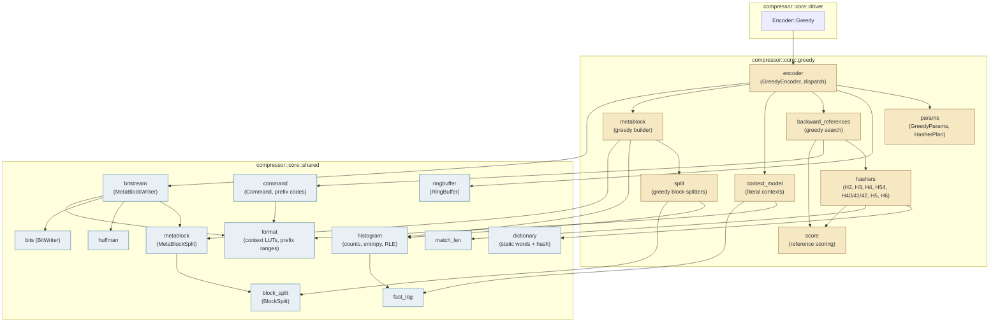
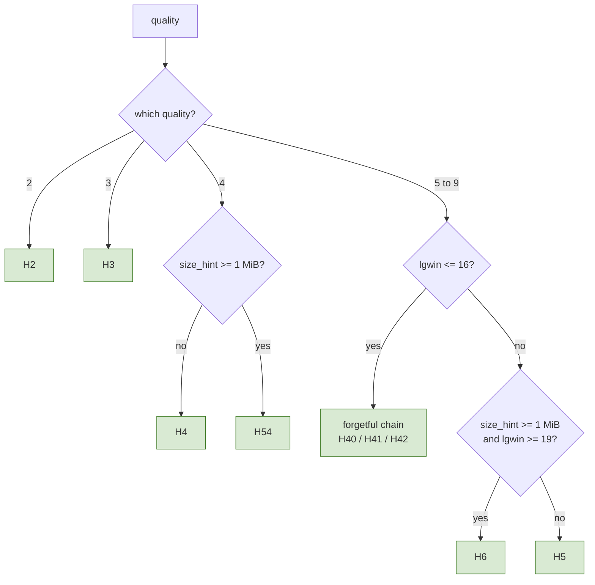
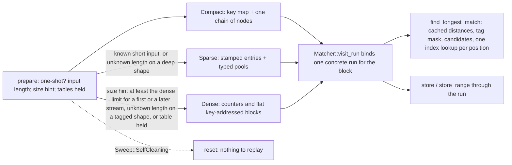
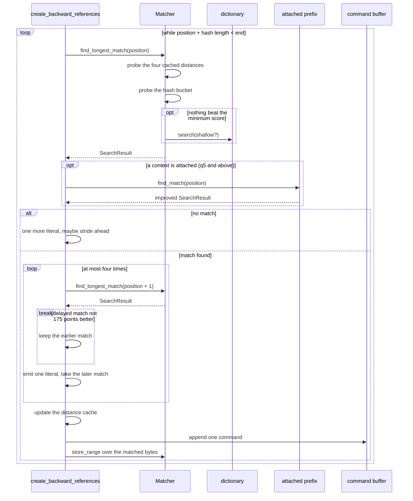
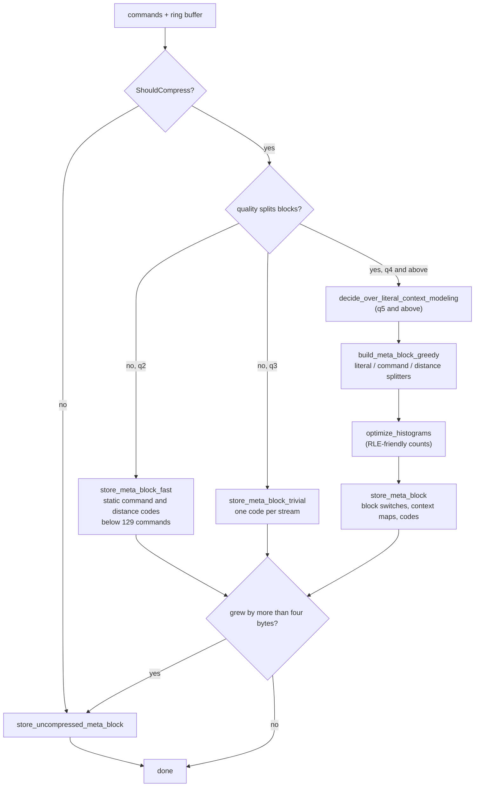
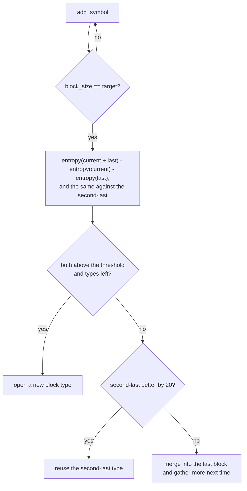
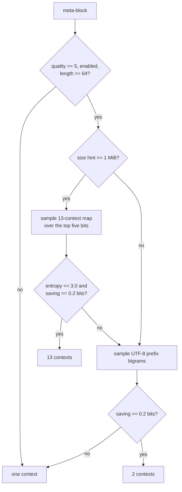
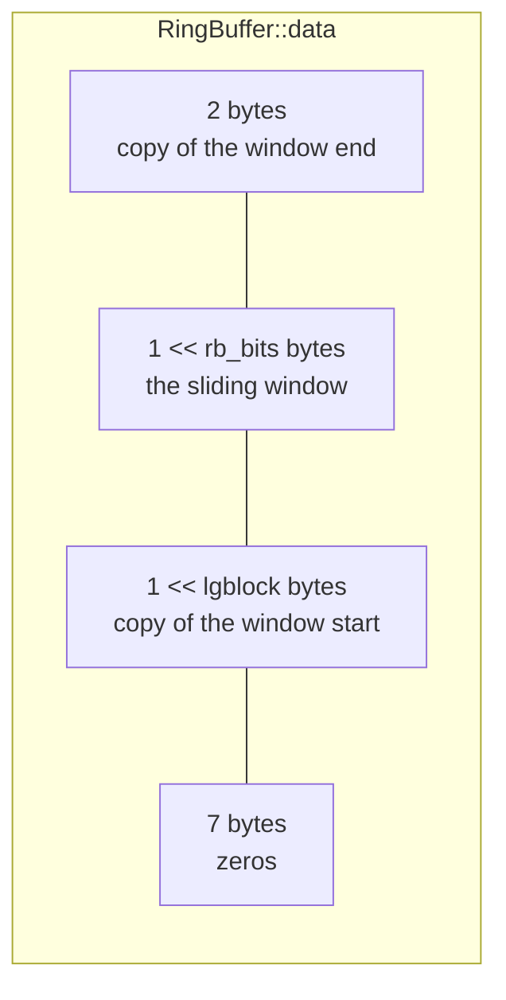
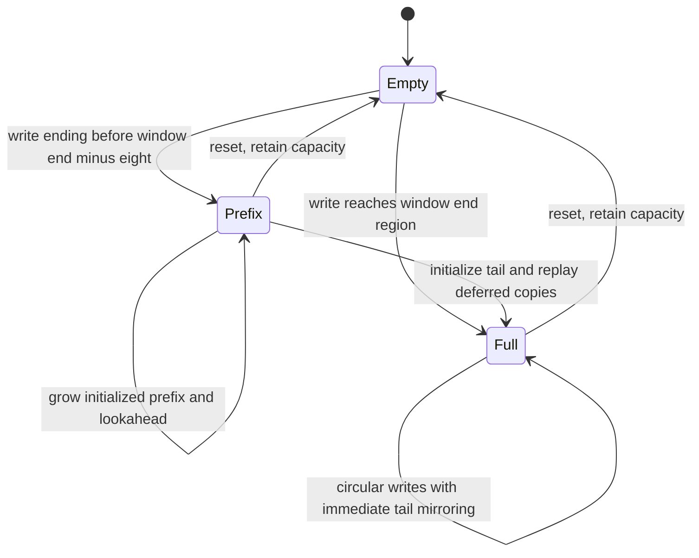
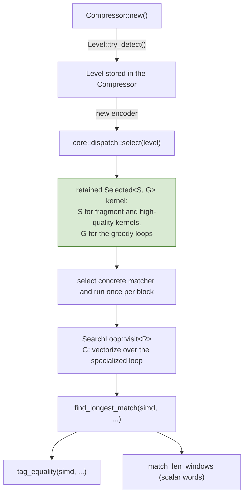

# Greedy Encoder Core (qualities 2 to 9)

Scope: `src/compressor/core/greedy/`. This document describes the code as it
stands; the [Known gaps](#known-gaps) section lists what is not implemented.

The reference this port follows is `google/brotli` v1.2.0, commit `028fb5a`.
On the platforms this crate targets that build defines `BROTLI_MAX_SIMD_QUALITY`
and therefore selects the *tagged* `H58` and `H68` match finders at qualities
five and six. This port keeps `H5`/`H6` logical match order, with tag filtering
on SIMD backends and an unfiltered scalar oracle. These paths are byte-for-byte
equivalent — see [§2.2](#22-the-tagged-matchers) — and differential tests check
that equivalence against the real library.

## 1. Core mechanics

Where the fast encoder compresses one independent fragment at a time, the
greedy encoder is a proper streaming state machine:

1. Input is copied into a **ring buffer** that keeps the whole sliding window,
   so a match may reach back past the current block.
2. A **match finder**, chosen once from the caller's parameters, turns the new
   bytes into **commands**: an insert length, a copy length and a distance.
3. Commands accumulate until a **meta-block** is worth emitting.
4. The meta-block is **split into blocks**, each block type gets its own prefix
   codes, and the whole thing is written to the bit stream — or stored
   uncompressed when that turns out smaller.



The shaded modules on the right are shared with the high-quality encoder; see
[hq-encoder.md](hq-encoder.md).

### 1.1. What each quality adds

| Feature | q2 | q3 | q4 | q5 | q6 | q7 | q8 | q9 |
| --- | :-: | :-: | :-: | :-: | :-: | :-: | :-: | :-: |
| Default `lgblock` | 14 | 14 | 16 | 16 | 16 | 16 | 16 | `min(18, lgwin)` |
| Block splitting | no | no | yes | yes | yes | yes | yes | yes |
| Non-zero distance parameters | no | no | yes | yes | yes | yes | yes | yes |
| Histogram optimisation | no | no | yes | yes | yes | yes | yes | yes |
| Extensive delayed search | no | no | no | yes | yes | yes | yes | yes |
| Literal context modelling | no | no | no | yes | yes | yes | yes | yes |
| Three-context model eligible | no | no | no | no | no | yes | yes | yes |
| Large window allowed | no | yes | yes | yes | yes | yes | yes | yes |
| Attached prefix consulted | no | no | no | yes | yes | yes | yes | yes |
| Sparse-search threshold | 64 | 64 | 64 | 64 | 64 | 64 | 64 | 512 |
| Bucket candidates | — | — | — | 16 | 32 | 64 | 128 | 256 |
| Cached distances probed | 4 | 4 | 4 | 4 | 4 | 10 | 10 | 16 |
| Small-window matcher | — | — | — | `H40` | `H40` | `H41` | `H41` | `H42` |
| Chain hops | — | — | — | 16 | 32 | 56 | 112 | 224 |
| Meta-block storage | fast | trivial | greedy split | greedy split | greedy split | greedy split | greedy split | greedy split |

Qualities two and three use simpler meta-block storage and flush on a symbol
count. Quality two selects `H2` and `store_meta_block_fast`; quality three selects
`H3` and `store_meta_block_trivial`. Their intermediate command generation is
shared. From quality five through nine the search shape is shared, with depth
controlled by quality.

Because the fixed distance code `store_meta_block_fast` may fall back to is
built for the RFC 7932 alphabet, quality two cannot carry a large window;
`GreedyParams::new` refuses one, the same way `FastEncoder::new` does for
qualities zero and one.

## 2. Parameter resolution and the hasher plan

Everything that decides *what* the encoder does is resolved once, before any
loop runs, by `params::GreedyParams::new`. Nothing about the running machine
takes part, which is what makes the output identical across SIMD backends.



The depth of whichever matcher is chosen then follows the quality: the bucket
matchers take `block_bits = quality - 1`, and the chain matchers take
`max_hops = (quality > 6 ? 7 : 8) << (quality - 4)`.

`ChooseHasher` sets the type to the quality itself below five, which is where
`H2`, `H3` and `H4` come from.

| Plan | Hash bytes | Bucket bits | Slots per bucket | Static dictionary |
| --- | --: | --: | --- | --- |
| `H2` | 5 | 16 | 1 sweep slot | yes, shallow |
| `H3` | 5 | 16 | 1 sweep slot | no |
| `H4` | 5 | 17 | 4 sweep slots | yes, shallow |
| `H54` | 7 | 20 | 4 sweep slots | no |
| `H40` / `H41` | 4 | 15 | forgetful chain, one 65,536-slot bank | yes |
| `H42` | 4 | 15 | forgetful chain, 512 banks of 512 | yes |
| `H5` | 4 | 14 (q5, q6) or 15 | `1 << (quality - 1)` | yes |
| `H6` | 8 | 15 | `1 << (quality - 1)` | yes |

Each plan is a distinct Rust type — `QuickMatcher<BUCKETS, SWEEP_BITS,
HASH_LEN, USE_DICTIONARY, COMPACT>`, `BucketMatcher<HASH64, BUCKETS, BLOCK>`
or `ChainMatcher<NUM_BANKS, BANK_BITS>` — so the hash width, the table size
and, for the bucket matchers, the block depth are compile-time constants
inside the probe loop; each bucket quality is its own `MatchFinder` variant
(§2.3). The `MatchFinder` enum that selects between them is matched once per
input block, never per candidate.

The chain depth is an ordinary field used as a loop bound; the bucket
matchers derive their cached-distance count from the block depth.

`H2` and `H3` share a shape but not a path: with one slot per bucket the probe
has no loop to leave, so the reference returns as soon as it has a match and
reaches the static dictionary only by falling out of the bottom. `H3` never
consults the dictionary, so that distinction is invisible there; `H2` does, so
the single-slot branch must fall through rather than return — the two are the
only matchers where the difference is observable.

### 2.2. The tagged matchers

The reference builds `H58` and `H68` in place of `H5` and `H6` whenever
`BROTLI_MAX_SIMD_QUALITY` is defined, which on GCC and Clang covers qualities
five and six. Those variants store a one-byte tag beside every position and
visit only the slots whose tag matches. The bucket matcher keeps tags for the
same two qualities (block depth 16 or 32, a compile-time property of the
shape). `tag_equality` is generic over the block width and compares a whole
bucket's tags with one safe `fearless_simd` vector — sixteen or thirty-two
lanes, the only two widths that survive monomorphisation; `rotate_candidates`
drops unfilled slots and rotates the result right by the newest slot, so bit
`age` of the mask names the slot `age` stores older than the newest one, and
one loop over ascending bits walks the bucket newest to oldest — the
reference rotates its mask the same way. Slots fill downwards from the top of
a block, as the reference's tagged matchers do, which is what makes that walk
a plain rotation. The scalar backend deliberately keeps the unfiltered scan
as an independent oracle, and so do a four-slot starter block, which is too
short for a vector compare, and the compact layout's chain walk. Filtering
preserves the accepted-match sequence:

- They select the same bucket. The tagged `HashBytes` keeps eight more low bits,
  which the key shifts straight back off.
- They walk the bucket newest to oldest, as the untagged loop does.
- H5 tags depend on the first four bytes. H6 hashes five bytes; within an equal
  bucket, equal first-four-byte prefixes force the fifth byte to agree (the odd
  multiplier maps its contribution injectively into the high eight bits).
  Tag rejection therefore cannot discard a candidate accepted at length four.
- Both stop at the first candidate beyond `max_backward`, and positions grow
  monotonically along the ring, so both stop having seen the same prefix.

The accepted-match sets coincide. `tests/differential_c.rs` checks the
consequence directly: qualities six and seven are compared against a C library
that really is using the tagged matchers.

### 2.3. Storage layouts, runs and sweeps

Every bucket shape is its own type: `BucketMatcher<HASH64, BUCKETS, BLOCK>`
takes the bucket count and the block depth as constants, so `MatchFinder`
holds ten bucket variants (`H5Q5`–`H5Q9`, `H6Q5`–`H6Q9`) rather than three.
The depth is the quality less one, and it fixes the rest of the shape: how
many cached distances a search probes (`last_distances_for`: four up to
thirty-two slots, ten up to 128, sixteen beyond) and whether slots carry tags
(depth at most thirty-two). With both constants every slot mask, block index
and hash shift is an immediate, and the dense tables are arrays whose
indexing needs no check; a loop that carries a runtime depth was measured to
spill the values it needs at every candidate.

The reference allocates every bucket's block up front and never initialises
it, reading a slot only below the counter that guards it. Safe Rust has to
initialise what it reads, so the bucket matcher picks a layout per stream from
what `prepare` is told about it:

| Layout | Chosen when | Index | Blocks | Cost of a new stream |
| --- | --- | --- | --- | --- |
| Compact | one-shot input of at most 1024 bytes on a matcher that has no sparse table yet | `KeyMap`, sized two entries per input byte, probed once per position: counter and chain head per bucket | one chain: `Vec<u64>` of `position | next << 32`, one node pushed per store in front of its bucket's previous node; a search walks the newest `BLOCK` nodes, the order a block scan takes | fill a map of at most 16 KiB |
| Sparse | a known input below the dense limit; an input of unknown length on a deep shape; unless the dense table already exists | a boxed `[u64; BUCKETS]`: generation stamp, block index with a starter flag, counter | typed pools: `Vec<[u32; 4]>` starters that grow into `Vec<[u32; BLOCK]>` full blocks on their fifth store, tags alongside for tagged shapes | bump the generation |
| Dense | the matcher's size hint is at least the shape's dense limit — a sixteenth of the table for tagged q5/q6 shapes (64 KiB and 128 KiB of input); for deep q7–q9 shapes an eighth of it on the matcher's first stream (1, 2 and 4 MiB) and a sixty-fourth from its second stream on (256 KiB, 256 KiB and 512 KiB) — or the length is unknown on a tagged shape, or the matcher already holds the dense table and the stream is not compact | `[u16; BUCKETS]` counters | one flat `Vec<u32>` of `BUCKETS * BLOCK` slots, viewed as `[[u32; BLOCK]; BUCKETS]` for a run, zeroed once per matcher | zero the counters |

The dense decision rests on the construction-time size hint rather than on
`prepare`'s `one_shot` flag: an input longer than one block is not one shot
at its first block, and choosing the dense table there made every cold
multi-block call pay for zeroing (and, on WSL2, faulting in) a table of up to
32 MiB. An unknown length is taken for a long stream on the tagged shapes
(`expected_input`), because the reference always uses its dense table and a
stream written in pieces without a size hint — a writer flushing every
64 KiB — stored every position through the sparse index's dependent loads at
several times the cost of a counter and a block; the deep shapes keep the
on-demand layouts there, as only a long stream repays clearing their tables.
The deep shapes' limit depends on whether the matcher has been reused
(`streams`): a cold call on a short compressible input stores few positions,
and clearing an 8 or 16 MiB table for it costs more than compressing it — a
quarter-mebibyte of zeros at quality seven measured 48% of the reference
with the table and 234% without — while a matcher on its second stream pays
the clear once for every stream that follows, and the sparse index's
dependent load per bucket cost more than the whole search on a
quarter-mebibyte input (quality 7 binary 81% against 97% with the table).
That second-stream allocation is deliberate: the crate promises nothing
about when a reused compressor allocates, only that its output is the
reference's. The size hint itself is retargetable: a reused encoder whose
new hint resolves to the same shape and the same match-finder variant takes
the hint over (`GreedyEncoder::retarget`, `MatchFinder::retarget`) instead
of being rebuilt, so a compressor fed inputs of varying lengths keeps its
tables; only a hint that crosses the quick matchers' 2048-byte compact
boundary, or changes the plan, still rebuilds.
The table is kept flat on purpose: a zero-filled vector of integers
comes straight from the allocator's zeroed pages, whereas a vector of arrays
longer than sixteen elements is written out element by element, which for the
two-mebibyte quality-six table cost more than compressing a hundred kibibytes.
A sparse entry from an earlier generation still names its block but counts as
empty, so blocks persist across streams; a compressor that holds the dense
table uses it for every later stream, because clearing its counters is
cheaper than the on-demand layouts' extra dependent load per bucket. Every layout empties itself in time
that does not depend on what the previous stream stored, which is what the
[`Sweep::SelfCleaning`] result of `prepare` tells the encoder.

`Matcher::prepare` reports one of three sweeps, and the encoder records what a
reset then has to do: `Partial` (quick and chain matchers on a short one-shot
input) is replayed at reset, because it clears exactly the slots the stream
could have dirtied; `Full` leaves the table dirty, so the next stream is not
one-shot and pays for a wipe; `SelfCleaning` needs nothing. The quick matchers
are `QuickMatcher<BUCKETS, ...>` with their table as a boxed array; a compact
quick matcher (size hints up to 2048 bytes) indexes a `SmallSlots` map for its
first stream only, sized for the input so it never rehashes mid-stream, and
allocates the table when the replay sweep after that stream asks it to clear,
from which point it is cleared by the partial sweep like any other. A map
entry is one word — the slot above the position plus one, zero when empty —
so clearing it costs half of what a two-word entry did; the packing needs
positions below 32767, so `prepare` allocates the table instead of the map
for a stream that is not one shot or is longer than that. The single-slot
shapes read and overwrite the same slot at every position and do both with
one probe (`QuickSlots::replace`).

The reference hoists its table pointers into `restrict` locals for a whole
block, so a store through one never makes the compiler reload the others. The
`RunVisitor` trait is the same idea: `Matcher::visit_run` binds the tables once
per input block and hands the visitor — the search loop — the concrete view
its layout uses, so the loop is compiled once per view rather than once over a
union of them:

| Matcher | Run types |
| --- | --- |
| `QuickMatcher` | `QuickRun<&mut [u32; BUCKETS]>` over the table, or `QuickRun<&mut SmallSlots>` over the map |
| `BucketMatcher` | `DenseRun` over three array references; `OnDemandRun<COMPACT>` over the matcher itself, the map-or-table choice a constant |
| `ChainMatcher` | the matcher itself |



### 2.4. The distance cache

Qualities seven and above probe more than the four remembered distances. The
extra entries are near misses derived from the two freshest ones — one, two and
three either side — which `prepare_distance_cache` fills whenever the remembered
four change. Only those four survive a meta-block; the rest are rebuilt before
any search reads them, which is why `saved_dist_cache` is four wide.

The distance alphabet is resolved in the same pass: font mode asks for one
postfix bit and twelve direct codes, every other mode uses what the caller
configured, and qualities below four always use neither.

## 3. Streaming lifecycle

```mermaid
stateDiagram-v2
    [*] --> Empty: GreedyEncoder::new
    Empty --> Buffering: encode_block(input, false)
    Buffering --> Buffering: meta-block not due yet
    Buffering --> Emitting: is_last, or a flush condition fires
    Emitting --> Buffering: meta-block written, is_last = false
    Emitting --> Finished: meta-block written, is_last = true
    Empty --> Finished: encode_block(&[], true)
    Finished --> [*]

    note right of Buffering
        commands accumulate,
        encode_block returns no bytes
    end note
    note right of Emitting
        one meta-block, then
        num_literals and commands reset
    end note
```

A meta-block is emitted when any of these holds, mirroring `EncodeData`:

- this is the last block;
- a quality that does not split blocks — two or three — has buffered `0x2FFF`
  literals and commands together;
- the caller asked for a flush, which forces the meta-block out and then
  realigns the stream to a byte boundary; see
  [compressor.md](compressor.md) §3.1;
- another whole input block would not fit inside the largest meta-block;
- buffered literals or commands reached an eighth of the largest meta-block.

Because `encode_block` may return nothing, the driver and both streaming
adapters treat an empty result as normal rather than as end of stream.

## 4. Command generation

`backward_references::create_backward_references` is the port of
`CreateBackwardReferences`, and its decision order *is* the compression format's
semantics: which candidate wins, when a match is delayed by a byte, which
positions are stored and which are skipped are all visible in the output.

`create_backward_references` resolves the loop-invariant `Block`, refreshes
the distance cache, and runs the loop through `Matcher::visit_run` as the
`SearchLoop` visitor, so the loop is monomorphised per concrete run (§2.3).
The loop body is split in two functions. The search at every position stays
in the loop; everything a found match entails — the delayed search, the
distance cache update, the command and the stores — lives in `commit_match`,
which re-enters the SIMD feature context and is left for the compiler to
inline (forcing it out of line measured 8–10% slower on q2/q3 text). Both
feature-context closures `move` their captures: the context is a separate
function, and a capture by reference is a pointer it dereferences at every
use, where a moved value is a local it keeps in a register. The loop's state
(position, insert length, the random-heuristics horizon, the matcher run) is
passed to the commit path by value and back, so nothing in the hot loop has
an address the compiler must keep current in memory. The static-dictionary
probe likewise works on a copy of the search result.

The query a search receives derives its rare-path values on demand rather
than carrying them: `MatchQuery::dictionary_start` computes the capped
distance to the start of the stream only for the dictionary probe and the
attached-prefix search, and the window a candidate is measured against
(`current_window`) is cut only once a candidate has passed the byte compare.
Inside the bucket scan the running result lives in locals (`Found`) and is
written back once at the end, and the two measuring steps —
`accept_cached` for a cached distance, `accept_candidate` for a bucket slot —
are out of line and return by value: the candidate loop is a filter that
rejects most of what it sees, and it stays in registers only while it holds
about a dozen values. The greedy matchers measure a match with
`match_len_windows`, a whole-word scan with one overlapping word at the tail
(§8.1), which is the reference's `FindMatchLengthWithLimit` without its byte
loop. None of this changes a decision: the sequence below is the same as the
reference's.



### 4.1. The attached prefix

An attached RFC 9841 prefix widens the distance space rather than the search.
Every distance that would address the dictionary sits past the window by
`gap` — the total attached bytes — so three things shift together, exactly as
they do in the reference:

- the match finder is told the static dictionary starts at
  `dictionary_start + gap` rather than `dictionary_start`, which pushes the
  built-in dictionary past the attached one;
- `SharedContextInner::find_match` runs after the ordinary search at each
  position and may replace its result, using `dictionary_start` itself as the
  boundary between window and prefix;
- `compute_distance_code` and the distance-cache update both compare against
  `dictionary_start + gap`, so a prefix reference is coded as an ordinary
  distance but never enters the cache.

`extend_last_command` handles prefix copies: a copy whose distance is past
the window continues into the concatenated prefix, and unlike the search it
runs on across attachment seams. See [shared-brotli.md](shared-brotli.md).

`create_backward_references` is generic over a `const ENABLE_PREFIX: bool`, and
`GreedyEncoder::create_references` instantiates both — the reference's
`ENABLE_COMPOUND_DICTIONARY`, which it uses to compile the same function twice
per match finder. The prefix-enabled and ordinary loops are separately
monomorphized. The high-quality path checks for attached chunks at runtime.

Two details separate the qualities:

- **Delayed search.** Below quality five the delayed candidate starts from the
  length already found, which lets the finder reject most candidates without
  measuring them. Quality five gives that shortcut up and searches everything
  again — this is a compression-semantics difference, not a tuning flag.
- **Sparse search.** After sixty-four literals without a match the scan strides
  forward two bytes at a time and stores every second position; after four
  times that, four bytes at a time. The exact thresholds and stores come from
  the reference, because they change which positions are findable later.

`extend_last_command` runs before the search when the previous block ended
exactly on a command boundary: bytes that continue that command's copy are
absorbed into it instead of starting a new one.

## 5. Meta-block construction



`store_meta_block_fast` is quality two's storage — `BrotliStoreMetaBlockFast`.
Below a hundred and twenty-nine commands only the literal code is built from
the data; the command and distance codes are the fixed ones the format defines,
written as the fifty-nine and twenty-eight literal bits their descriptions
encode to. Above that all three codes are built, but by the leaves-ordered-by-
count builder `build_and_store_huffman_tree_fast` rather than the full
package-merge `store_meta_block_trivial` uses.

`ShouldCompress` refuses blocks of at most two bytes outright, and samples
every thirteenth literal of a block that is almost all literals: if the sample's
entropy exceeds 7.92 bits per byte the block is stored verbatim, which is both
smaller and much faster than coding noise.

### 5.1. Block splitting

The greedy splitters consume symbols in order. Every time one has collected its
target number of symbols it compares the entropy of the block it just gathered
against the entropy of merging it into the last, or the second-last, block:



| Stream | Minimum block | Split threshold | Alphabet measured |
| --- | --: | --: | --: |
| literals | 512 | 400 | 256 |
| commands | 1024 | 500 | 704 |
| distances | 512 | 100 | 64 |

Quality five may run the literal splitter per context instead, keeping one
histogram per context of every block type and deciding on the total entropy
change across all of them.

The combined histograms are not materialised for the decision:
`bits_entropy_of_sum` accumulates the summed counts in the same order
`bits_entropy` would, so the result is bit-identical, and a block that merges
is added into its neighbour in place. A splitter creates a block type's
histograms when it first advances into them, so a short input never zeroes
histograms it will not fill, and a retained buffer keeps whatever the last
meta-block left in the rest until they are cleared on use.

### 5.2. Literal context modelling

Only quality five and above reach this, and only when the meta-block is at least
sixty-four bytes long. The decision samples sixty-four byte strides every four
kibibytes:



The reference's three-context map is deliberately priced out of reach below
quality seven, and `ChooseContextMode` only returns `CONTEXT_SIGNED` at quality
ten, so `CONTEXT_UTF8` is the only literal context mode these qualities can
emit. Only that one lookup table is carried.

## 6. The ring buffer

The layout matters for the emitted bytes, not just for correctness: match
finding reads whole words past the current position, and the reference defines
exactly what those bytes are.



- Until the first wrap approaches, storage grows with the written prefix and
  seven lookahead bytes. The configured logical window mask never changes.
- A write ending within eight bytes of the window end materializes the full
  layout before copying input. The last two window bytes are initialized to
  zero, and deferred tail copies are replayed from the existing prefix.
- The reference skips tail copying for a short first write. `tail_start` records
  that skipped range, preserving its first-byte sentinel `241` until a later
  write overwrites it.
- After every write the seven bytes past the data are cleared, so hashing never
  depends on memory the encoder did not write. Reset retains allocation capacity
  and clears the prefix position, allocation state and skipped-tail boundary.



Absolute positions are wrapped into 32 bits by `wrap_position`, which keeps the
first three gibibytes contiguous and then alternates between two gibibyte-wide
halves so the "already lapped" property survives the truncation.

## 7. SIMD dispatch



The backend is selected once when the retained encoder is created. On x86 the
kernel holds two tokens: the detected level `S` for the fragment,
copy-extension and high-quality kernels, and SSE2 (`Level::as_sse2`) for the
greedy loops, whose only vector operation is the byte-equality mask of the tag
filter; the scalar backend keeps the greedy loops scalar, as the unfiltered
oracle, and other architectures keep their own level for both. Compiling the
greedy loops for every x86 level multiplied their code — a quarter of the crate
— without a faster instruction to show for it. A virtual call at the outer
`core::dispatch` boundary enters `G::vectorize`; the `MatchFinder` enum and the
run are matched once per scan, and the concrete token reaches the tag filter
without inner dispatch.

`SearchLoop::visit` enters `G::vectorize` around its specialized loop. Its
closure is always inlined into the feature-enabled entry, letting the generic
`fearless_simd` operations become native instructions. Passing a token to an
out-of-line function alone does not enable its target features: a baseline
compilation instead calls feature-enabled helpers for each vector comparison
and mask operation. Entering the context after matcher and run specialization
also keeps each search body separate, rather than forcing every matcher into
one large outer dispatch function.

The nested feature entry uses the existing token; it performs no detection or
virtual dispatch. Both entries are outside the search loop. `vectorize` owns
the feature proof; no handwritten `target_feature` or unsafe block is needed.
Scalar and SIMD paths keep the same matcher state, candidate order, score
arithmetic, and error propagation.

Everything else — match-length scans in the greedy matchers, bucket stores,
distance-cache transitions, the greedy and lazy decisions, Huffman
construction, bit writing — is scalar, because the reference's decision order
is not reorderable and a vector unit cannot help without changing it.

## 8. The static dictionary

Brotli's built-in dictionary is 122,784 bytes of words plus a 32,768-bucket
hash over their four-byte prefixes, carried as binary blobs beside the module
and embedded with `include_bytes!`.

Only the encoder side is needed. A dictionary match is emitted as an ordinary
distance beyond the end of the window:

```text
distance = max_backward + 1 + word_index + (transform_id << size_bits[len])
```

and the decoder is the side that applies the transform, so the transform table
itself never has to be carried — the encoder only computes which transform id a
given prefix cut corresponds to.

Probing is self-limiting: once a stream has gone a hundred and twenty-eight
lookups per match, the encoder stops paying for it.

### 8.1. Prefix-length scans

Every "how many leading bytes agree" question — static dictionary words, the
HQ dictionary matcher and the attached prefix search — goes through
`shared::match_len`: `common_prefix_len` scans whole eight-byte words and
then bytes with the bounds established once, which is all a dictionary word
of at most twenty-four bytes needs, and `common_prefix_len_simd` adds the
native-vector loop of `find_match_length` for the attached prefix, whose
matches run as long as the window allows. `SharedContextInner::find_match`
takes the SIMD token and enters its feature context itself, so the vector
compare stays inline however it is reached.

## 9. Error propagation

The greedy tree defines no error type of its own. `GreedyParams::new` reports
an unimplemented quality as the private `UnsupportedQuality`, which the public
`EncodeError` reports as an internal invariant because no validated
configuration can reach it, and the
only other failure is `BufferOverflow`, raised when the bit writer runs past
the scratch buffer — which no correct input can reach, because the buffer is
sized by the same `2 * bytes + 503` reservation the reference uses.

## 10. Verification

| Test target | What it pins |
| --- | --- |
| Module tests in `core::greedy::*` | Each ported function against the behaviour its reference documents. |
| `tests/greedy_qualities.rs` | Byte identity with the C encoder across window size, mode, size hint, block size, distance layout, context modelling, block and delayed-symbol boundaries, dictionary matches, ring-buffer wrapping and every short length. |
| `tests/differential_c.rs`, `tests/vendor_corpus.rs`, `tests/randomized.rs` | Byte identity over the shared corpora, including Google's own multi-megabyte test data. |
| `tests/simd_backends.rs` | Byte identity between the scalar fallback and every SIMD backend the host supports. |
| `tests/streaming.rs` | Chunk-size independence and one-shot equivalence. |
| `tests/shared_dictionary.rs` | Byte identity against the C encoder with the same prefixes prepared and attached, and a round trip through the C decoder with them attached too. |
| `fuzz/afl/` | `q3_roundtrip`, `q4_roundtrip`, `q5_roundtrip` and the shared parameter-driven targets; see [fuzzing.md](fuzzing.md). |

## Known gaps

- **The large-window match finders are unreachable.** `Window::large`
  reaches these qualities, so a large window is declared and the widened
  distance alphabet is used, but `ResolvedWindow::encoder_bits` caps retained
  history at 30 bits and every matcher is sized from that. The reference's
  `H35`, `H55` and `H65` composite match finders are selected only above that
  cap, so they are never built. See [shared-brotli.md](shared-brotli.md).
- **An attached prefix reaches only qualities five and above.** The reference
  compiles its compound-dictionary search for `H5`, `H6`, `H40`, `H41`, `H42`,
  `H55` and `H65` only, so `H2`, `H3`, `H4` and `H54` have nowhere to put a
  prefix match; where the reference then ignores the dictionary, this crate
  refuses. Experimental custom static dictionaries use the same quality floor.
- **Custom static and offset mechanics are experimental.** The selected
  UTF-8 context combination replaces the implicit built-in probe; headerless
  continuations poison the distance cache and shift dictionary placement without
  inventing history. See [rfc9841-encoding.md](rfc9841-encoding.md).
- **Histogram accumulation and context sampling remain scalar.** Bucket tag
  filtering and the high-quality match-length scans have SIMD
  implementations; the greedy matchers scan whole words.
- **Cold bucket matchers initialize their tables.** A cold call on a
  quarter-mebibyte input at quality seven or eight zeroes an 8 or 16 MiB
  table the reference leaves uninitialised. This setup work remains part of
  cold-call latency; reused benchmarks measure a different allocation policy.
- **Short one-shot inputs pay for initialised memory.** A cold call on at
  most a kibibyte indexes the compact map and allocates and zeroes its
  scratch per call. See the [benchmark guide](../docs/benchmarking.md) for
  separate cold and reused measurements.

## Independent parallel fragments

The parallel fragment adapter installs `Selected<S, true>` once per worker.
Its command policy emits full distance codes, while `DictionaryStats::DISABLED`
keeps static-dictionary lookup disabled. `begin_fragment` starts headerless and
seeds the ring and literal context with the raw prefix; the common fragment
writer owns those prefix bytes in the output. Serial kernels use `false` and
retain their existing behavior. See [parallel compression](parallel-compression.md)
for reset invariants and assembly.
