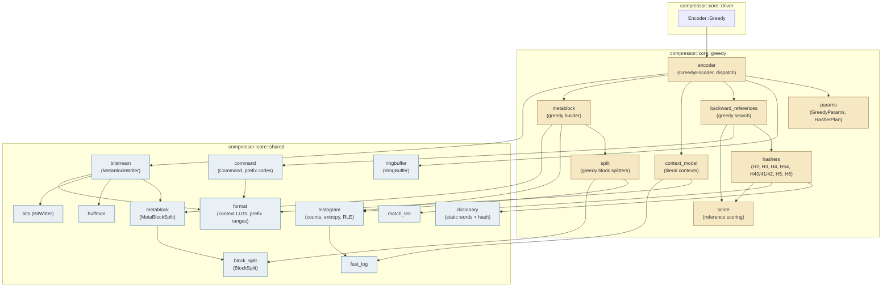
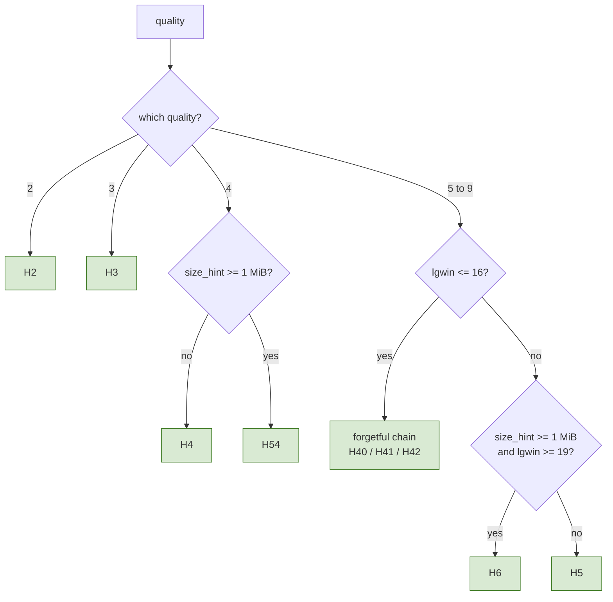
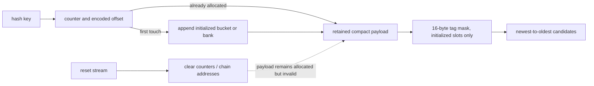
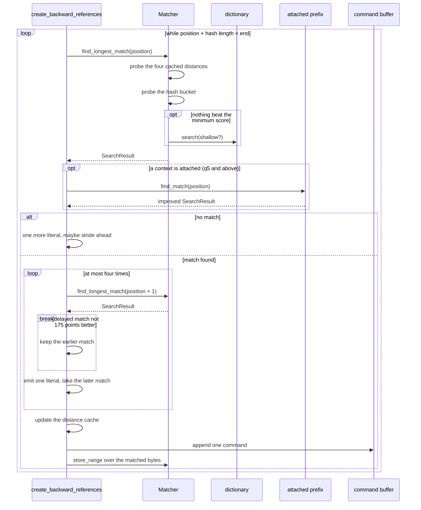
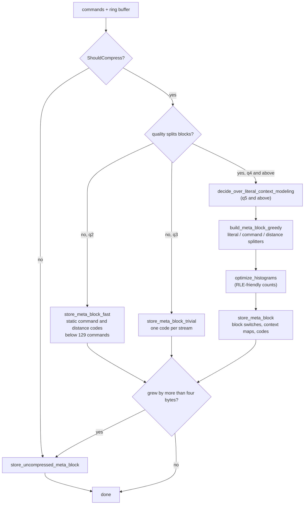
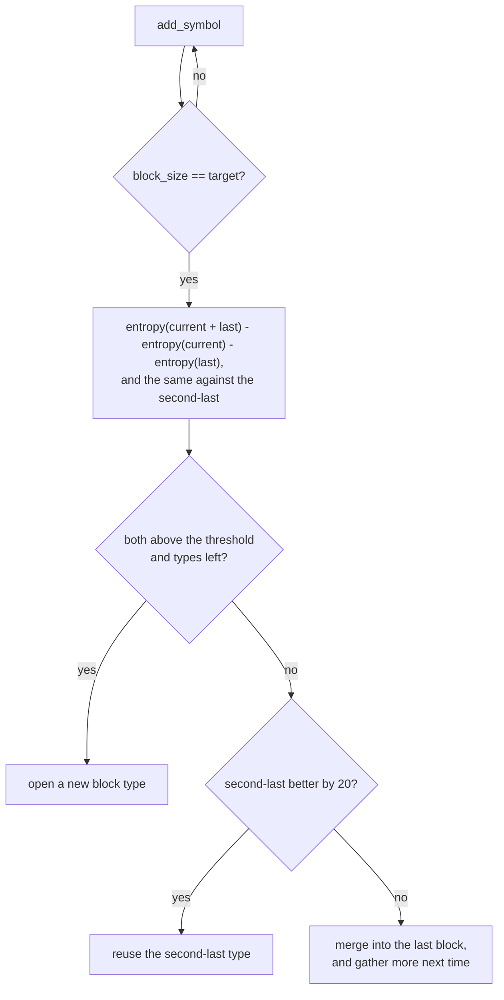
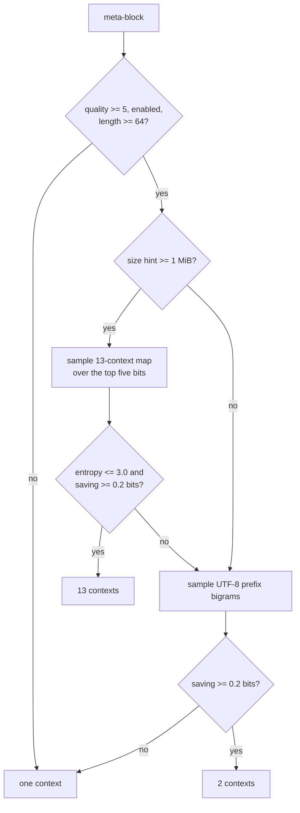
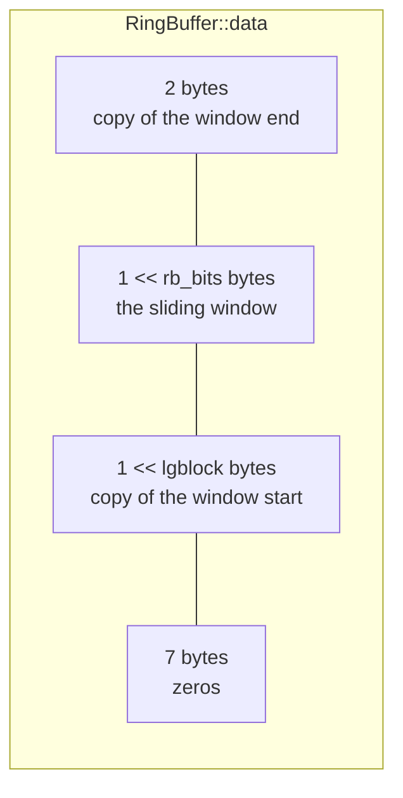
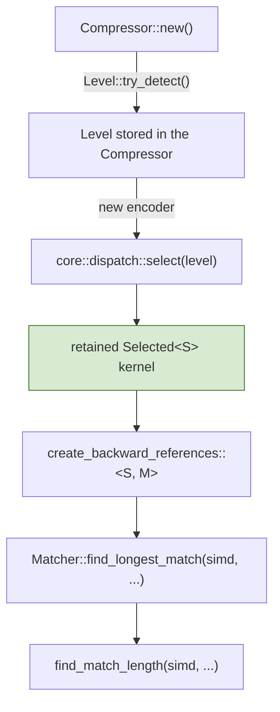

# Greedy Encoder Core (qualities 2 to 9)

Scope: `src/compressor/core/greedy/`. This document describes the code as it
stands; the [Known gaps](#known-gaps) section lists what is not implemented.

The reference this port follows is `google/brotli` v1.2.0, commit `028fb5a`.
On the platforms this crate targets that build defines `BROTLI_MAX_SIMD_QUALITY`
and therefore selects the *tagged* `H58` and `H68` match finders at qualities
five and six. This port builds only the untagged `H5` and `H6`, because the two
pairs are byte-for-byte equivalent — see [§2.2](#22-the-tagged-matchers) — and
the differential tests check that equivalence against the real library.

## 1. Core mechanics

Where the fast encoder compresses one independent fragment at a time, the
greedy encoder is a proper streaming state machine:

1. Input is copied into a **ring buffer** that keeps the whole sliding window,
   so a match may reach back past the current block.
2. A **match finder**, chosen once from the caller's parameters, turns the new
   bytes into **commands**: an insert length, a copy length and a distance.
3. Commands accumulate until a **meta-block** is worth emitting.
4. The meta-block is **split into blocks**, each block type gets its own prefix
   codes, and the whole thing is written to the bit stream — or stored
   uncompressed when that turns out smaller.



The shaded modules on the right are shared with the high-quality encoder; see
[hq-encoder.md](hq-encoder.md).

### 1.1. What each quality adds

| Feature | q2 | q3 | q4 | q5 | q6 | q7 | q8 | q9 |
| --- | :-: | :-: | :-: | :-: | :-: | :-: | :-: | :-: |
| Default `lgblock` | 14 | 14 | 16 | 16 | 16 | 16 | 16 | `min(18, lgwin)` |
| Block splitting | no | no | yes | yes | yes | yes | yes | yes |
| Non-zero distance parameters | no | no | yes | yes | yes | yes | yes | yes |
| Histogram optimisation | no | no | yes | yes | yes | yes | yes | yes |
| Extensive delayed search | no | no | no | yes | yes | yes | yes | yes |
| Literal context modelling | no | no | no | yes | yes | yes | yes | yes |
| Three-context model eligible | no | no | no | no | no | yes | yes | yes |
| Large window allowed | no | yes | yes | yes | yes | yes | yes | yes |
| Attached prefix consulted | no | no | no | yes | yes | yes | yes | yes |
| Sparse-search threshold | 64 | 64 | 64 | 64 | 64 | 64 | 64 | 512 |
| Bucket candidates | — | — | — | 16 | 32 | 64 | 128 | 256 |
| Cached distances probed | 4 | 4 | 4 | 4 | 4 | 10 | 10 | 16 |
| Small-window matcher | — | — | — | `H40` | `H40` | `H41` | `H41` | `H42` |
| Chain hops | — | — | — | 16 | 32 | 56 | 112 | 224 |
| Meta-block storage | fast | trivial | greedy split | greedy split | greedy split | greedy split | greedy split | greedy split |

Qualities two and three use simpler meta-block storage and flush on a symbol
count. Quality two selects `H2` and `store_meta_block_fast`; quality three selects
`H3` and `store_meta_block_trivial`. Their intermediate command generation is
shared. From quality five through nine the search shape is shared, with depth
controlled by quality.

Because the fixed distance code `store_meta_block_fast` may fall back to is
built for the RFC 7932 alphabet, quality two cannot carry a large window;
`GreedyParams::new` refuses one, the same way `FastEncoder::new` does for
qualities zero and one.

## 2. Parameter resolution and the hasher plan

Everything that decides *what* the encoder does is resolved once, before any
loop runs, by `params::GreedyParams::new`. Nothing about the running machine
takes part, which is what makes the output identical across SIMD backends.



The depth of whichever matcher is chosen then follows the quality: the bucket
matchers take `block_bits = quality - 1`, and the chain matchers take
`max_hops = (quality > 6 ? 7 : 8) << (quality - 4)`.

`ChooseHasher` sets the type to the quality itself below five, which is where
`H2`, `H3` and `H4` come from.

| Plan | Hash bytes | Bucket bits | Slots per bucket | Static dictionary |
| --- | --: | --: | --- | --- |
| `H2` | 5 | 16 | 1 sweep slot | yes, shallow |
| `H3` | 5 | 16 | 1 sweep slot | no |
| `H4` | 5 | 17 | 4 sweep slots | yes, shallow |
| `H54` | 7 | 20 | 4 sweep slots | no |
| `H40` / `H41` | 4 | 15 | forgetful chain, one 65,536-slot bank | yes |
| `H42` | 4 | 15 | forgetful chain, 512 banks of 512 | yes |
| `H5` | 4 | 14 (q5, q6) or 15 | `1 << (quality - 1)` | yes |
| `H6` | 8 | 15 | `1 << (quality - 1)` | yes |

Each plan is a distinct Rust type — `QuickMatcher<BUCKET_BITS, SWEEP_BITS,
HASH_LEN, USE_DICTIONARY>`, `BucketMatcher<HASH64, BUCKET_BITS>` or
`ChainMatcher<NUM_BANKS, BANK_BITS>` — so the hash width and the table size are
compile-time constants inside the probe loop. The `MatchFinder` enum that
selects between them is matched once per input block, never per candidate.

The candidate depth, the chain depth and the number of cached distances are
ordinary fields used as loop bounds.

`H2` and `H3` share a shape but not a path: with one slot per bucket the probe
has no loop to leave, so the reference returns as soon as it has a match and
reaches the static dictionary only by falling out of the bottom. `H3` never
consults the dictionary, so that distinction is invisible there; `H2` does, so
the single-slot branch must fall through rather than return — the two are the
only matchers where the difference is observable.

### 2.2. The tagged matchers

The reference builds `H58` and `H68` in place of `H5` and `H6` whenever
`BROTLI_MAX_SIMD_QUALITY` is defined, which on GCC and Clang covers quality six.
Those variants store a one-byte tag beside every position and iterate only the
slots whose tag matches. The bucket matcher keeps these tags in compact
parallel storage for q5/q6, matching the pinned C build's tag quality ceiling.
`tags::Candidates` loads in-bounds groups of sixteen tags with
safe `fearless_simd` vectors and visits matching initialized slots newest first.
The scalar backend deliberately retains the unfiltered scan as an independent
oracle. Filtering preserves the accepted-match sequence:

- They select the same bucket. The tagged `HashBytes` keeps eight more low bits,
  which the key shifts straight back off.
- They walk the bucket newest to oldest, as the untagged loop does.
- H5 tags depend on the first four bytes. H6 hashes five bytes; within an equal
  bucket, equal first-four-byte prefixes force the fifth byte to agree (the odd
  multiplier maps its contribution injectively into the high eight bits).
  Tag rejection therefore cannot discard a candidate accepted at length four.
- Both stop at the first candidate beyond `max_backward`, and positions grow
  monotonically along the ring, so both stop having seen the same prefix.

The accepted-match sets coincide. `tests/differential_c.rs` checks the
consequence directly: qualities six and seven are compared against a C library
that really is using the tagged matchers.

### 2.3. Cold storage and reset

Bucket counters and encoded offsets are allocated first. Position/tag payloads
are materialized one bucket at a time in retained compact vectors. Deep q7–q9
buckets start with four positions; requesting a fifth promotes once to the full
reference depth, preserving slot numbers and recent positions. The old four-slot
starter stays allocated, adding at most four positions per promoted bucket.
H42 similarly
materializes one 512-slot chain bank at a time. Encoded offsets are stable across
reset; counters and chain addresses alone determine which entries can be read.
No stale payload is valid merely because its allocation survived.



### 2.4. The distance cache

Qualities seven and above probe more than the four remembered distances. The
extra entries are near misses derived from the two freshest ones — one, two and
three either side — which `prepare_distance_cache` fills whenever the remembered
four change. Only those four survive a meta-block; the rest are rebuilt before
any search reads them, which is why `saved_dist_cache` is four wide.

The distance alphabet is resolved in the same pass: font mode asks for one
postfix bit and twelve direct codes, every other mode uses what the caller
configured, and qualities below four always use neither.

## 3. Streaming lifecycle

```mermaid
stateDiagram-v2
    [*] --> Empty: GreedyEncoder::new
    Empty --> Buffering: encode_block(input, false)
    Buffering --> Buffering: meta-block not due yet
    Buffering --> Emitting: is_last, or a flush condition fires
    Emitting --> Buffering: meta-block written, is_last = false
    Emitting --> Finished: meta-block written, is_last = true
    Empty --> Finished: encode_block(&[], true)
    Finished --> [*]

    note right of Buffering
        commands accumulate,
        encode_block returns no bytes
    end note
    note right of Emitting
        one meta-block, then
        num_literals and commands reset
    end note
```

A meta-block is emitted when any of these holds, mirroring `EncodeData`:

- this is the last block;
- a quality that does not split blocks — two or three — has buffered `0x2FFF`
  literals and commands together;
- the caller asked for a flush, which forces the meta-block out and then
  realigns the stream to a byte boundary; see
  [compressor.md](compressor.md) §3.1;
- another whole input block would not fit inside the largest meta-block;
- buffered literals or commands reached an eighth of the largest meta-block.

Because `encode_block` may return nothing, the driver and both streaming
adapters treat an empty result as normal rather than as end of stream.

## 4. Command generation

`backward_references::create_backward_references` is the port of
`CreateBackwardReferences`, and its decision order *is* the compression format's
semantics: which candidate wins, when a match is delayed by a byte, which
positions are stored and which are skipped are all visible in the output.



### 4.1. The attached prefix

An attached RFC 9841 prefix widens the distance space rather than the search.
Every distance that would address the dictionary sits past the window by
`gap` — the total attached bytes — so three things shift together, exactly as
they do in the reference:

- the match finder is told the static dictionary starts at
  `dictionary_start + gap` rather than `dictionary_start`, which pushes the
  built-in dictionary past the attached one;
- `SharedContextInner::find_match` runs after the ordinary search at each
  position and may replace its result, using `dictionary_start` itself as the
  boundary between window and prefix;
- `compute_distance_code` and the distance-cache update both compare against
  `dictionary_start + gap`, so a prefix reference is coded as an ordinary
  distance but never enters the cache.

`extend_last_command` handles prefix copies: a copy whose distance is past
the window continues into the concatenated prefix, and unlike the search it
runs on across attachment seams. See [shared-brotli.md](shared-brotli.md).

`create_backward_references` is generic over a `const ENABLE_PREFIX: bool`, and
`GreedyEncoder::create_references` instantiates both — the reference's
`ENABLE_COMPOUND_DICTIONARY`, which it uses to compile the same function twice
per match finder. The prefix-enabled and ordinary loops are separately
monomorphized. The high-quality path checks for attached chunks at runtime.

Two details separate the qualities:

- **Delayed search.** Below quality five the delayed candidate starts from the
  length already found, which lets the finder reject most candidates without
  measuring them. Quality five gives that shortcut up and searches everything
  again — this is a compression-semantics difference, not a tuning flag.
- **Sparse search.** After sixty-four literals without a match the scan strides
  forward two bytes at a time and stores every second position; after four
  times that, four bytes at a time. The exact thresholds and stores come from
  the reference, because they change which positions are findable later.

`extend_last_command` runs before the search when the previous block ended
exactly on a command boundary: bytes that continue that command's copy are
absorbed into it instead of starting a new one.

## 5. Meta-block construction



`store_meta_block_fast` is quality two's storage — `BrotliStoreMetaBlockFast`.
Below a hundred and twenty-nine commands only the literal code is built from
the data; the command and distance codes are the fixed ones the format defines,
written as the fifty-nine and twenty-eight literal bits their descriptions
encode to. Above that all three codes are built, but by the leaves-ordered-by-
count builder `build_and_store_huffman_tree_fast` rather than the full
package-merge `store_meta_block_trivial` uses.

`ShouldCompress` refuses blocks of at most two bytes outright, and samples
every thirteenth literal of a block that is almost all literals: if the sample's
entropy exceeds 7.92 bits per byte the block is stored verbatim, which is both
smaller and much faster than coding noise.

### 5.1. Block splitting

The greedy splitters consume symbols in order. Every time one has collected its
target number of symbols it compares the entropy of the block it just gathered
against the entropy of merging it into the last, or the second-last, block:



| Stream | Minimum block | Split threshold | Alphabet measured |
| --- | --: | --: | --: |
| literals | 512 | 400 | 256 |
| commands | 1024 | 500 | 704 |
| distances | 512 | 100 | 64 |

Quality five may run the literal splitter per context instead, keeping one
histogram per context of every block type and deciding on the total entropy
change across all of them.

### 5.2. Literal context modelling

Only quality five and above reach this, and only when the meta-block is at least
sixty-four bytes long. The decision samples sixty-four byte strides every four
kibibytes:



The reference's three-context map is deliberately priced out of reach below
quality seven, and `ChooseContextMode` only returns `CONTEXT_SIGNED` at quality
ten, so `CONTEXT_UTF8` is the only literal context mode these qualities can
emit. Only that one lookup table is carried.

## 6. The ring buffer

The layout matters for the emitted bytes, not just for correctness: match
finding reads whole words past the current position, and the reference defines
exactly what those bytes are.



- A short first write allocates only the bytes it holds, because neither the
  tail nor the rest of the window can be read yet.
- The first full allocation zeroes the last two window bytes and leaves the
  sentinel `241` at the first tail byte, until a lap writes over it.
- After every write the seven bytes past the data are cleared, so hashing never
  depends on memory the encoder did not write.

Absolute positions are wrapped into 32 bits by `wrap_position`, which keeps the
first three gibibytes contiguous and then alternates between two gibibyte-wide
halves so the "already lapped" property survives the truncation.

## 7. SIMD dispatch



The backend is selected once when the retained encoder is created. A virtual
call at the outer `core::dispatch` boundary enters `S::vectorize`; the
`MatchFinder` enum is matched once per scan, and the concrete token reaches
both tag filtering and exact match-length comparison without inner dispatch.

Everything else — bucket stores, distance-cache transitions, the greedy and
lazy decisions, Huffman construction, bit writing — is scalar, because the
reference's decision order is not reorderable and a vector unit cannot help
without changing it.

## 8. The static dictionary

Brotli's built-in dictionary is 122,784 bytes of words plus a 32,768-bucket
hash over their four-byte prefixes, carried as binary blobs beside the module
and embedded with `include_bytes!`.

Only the encoder side is needed. A dictionary match is emitted as an ordinary
distance beyond the end of the window:

```text
distance = max_backward + 1 + word_index + (transform_id << size_bits[len])
```

and the decoder is the side that applies the transform, so the transform table
itself never has to be carried — the encoder only computes which transform id a
given prefix cut corresponds to.

Probing is self-limiting: once a stream has gone a hundred and twenty-eight
lookups per match, the encoder stops paying for it.

## 9. Error propagation

The greedy tree defines no error type of its own. `GreedyParams::new` reports
an unimplemented quality as the private `UnsupportedQuality`, which the public
`EncodeError` reports as an internal invariant because no validated
configuration can reach it, and the
only other failure is `BufferOverflow`, raised when the bit writer runs past
the scratch buffer — which no correct input can reach, because the buffer is
sized by the same `2 * bytes + 503` reservation the reference uses.

## 10. Verification

| Test target | What it pins |
| --- | --- |
| Module tests in `core::greedy::*` | Each ported function against the behaviour its reference documents. |
| `tests/greedy_qualities.rs` | Byte identity with the C encoder across window size, mode, size hint, block size, distance layout, context modelling, block and delayed-symbol boundaries, dictionary matches, ring-buffer wrapping and every short length. |
| `tests/differential_c.rs`, `tests/vendor_corpus.rs`, `tests/randomized.rs` | Byte identity over the shared corpora, including Google's own multi-megabyte test data. |
| `tests/simd_backends.rs` | Byte identity between the scalar fallback and every SIMD backend the host supports. |
| `tests/streaming.rs` | Chunk-size independence and one-shot equivalence. |
| `tests/shared_dictionary.rs` | Byte identity against the C encoder with the same prefixes prepared and attached, and a round trip through the C decoder with them attached too. |
| `fuzz/afl/` | `q3_roundtrip`, `q4_roundtrip`, `q5_roundtrip` and the shared parameter-driven targets; see [fuzzing.md](fuzzing.md). |

## Known gaps

- **The large-window match finders are unreachable.** `Window::large`
  reaches these qualities, so a large window is declared and the widened
  distance alphabet is used, but `ResolvedWindow::encoder_bits` caps retained
  history at 30 bits and every matcher is sized from that. The reference's
  `H35`, `H55` and `H65` composite match finders are selected only above that
  cap, so they are never built. See [shared-brotli.md](shared-brotli.md).
- **An attached prefix reaches only qualities five and above.** The reference
  compiles its compound-dictionary search for `H5`, `H6`, `H40`, `H41`, `H42`,
  `H55` and `H65` only, so `H2`, `H3`, `H4` and `H54` have nowhere to put a
  prefix match; where the reference then ignores the dictionary, this crate
  refuses. Experimental custom static dictionaries use the same quality floor.
- **Custom static and offset mechanics are experimental.** The selected
  UTF-8 context combination replaces the implicit built-in probe; headerless
  continuations poison the distance cache and shift dictionary placement without
  inventing history. See [rfc9841-encoding.md](rfc9841-encoding.md).
- **Histogram accumulation and context sampling remain scalar.** Match-length
  scans and bucket tag filtering have SIMD implementations.

## Independent parallel fragments

The parallel fragment adapter installs `Selected<S, true>` once per worker.
Its command policy emits full distance codes, while `DictionaryStats::DISABLED`
keeps static-dictionary lookup disabled. `begin_fragment` starts headerless and
seeds the ring and literal context with the raw prefix; the common fragment
writer owns those prefix bytes in the output. Serial kernels use `false` and
retain their existing behavior. See [parallel compression](parallel-compression.md)
for reset invariants and assembly.
