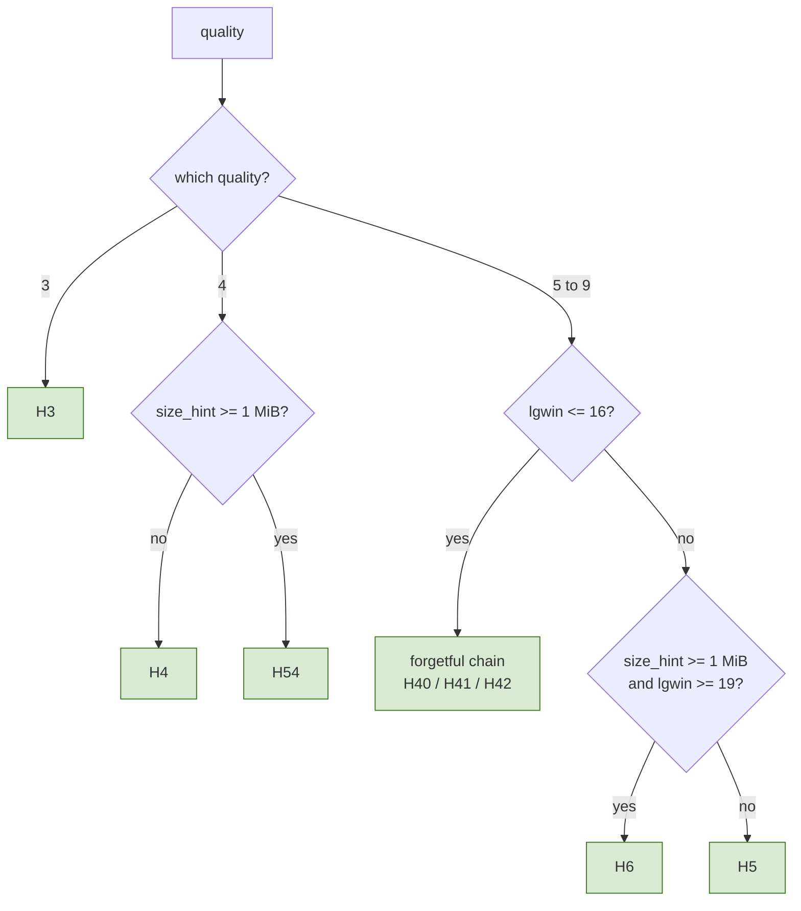
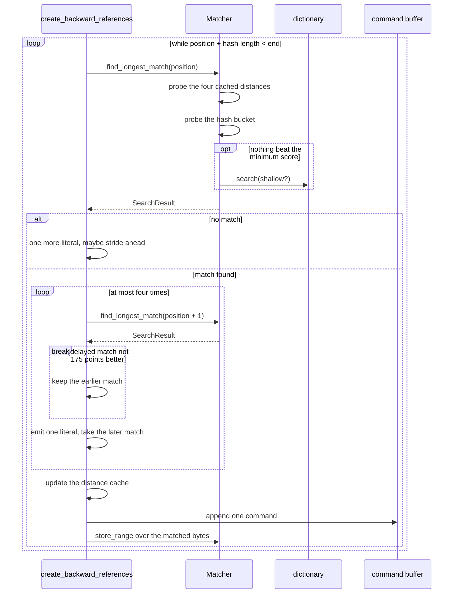
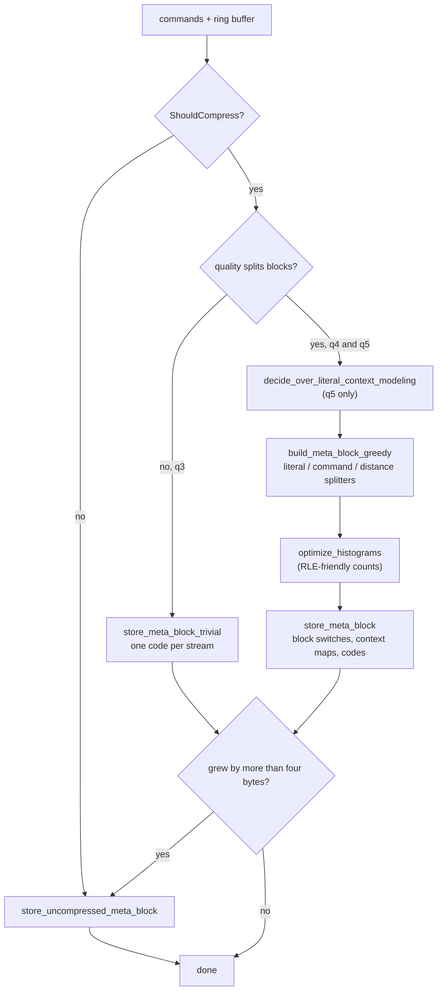
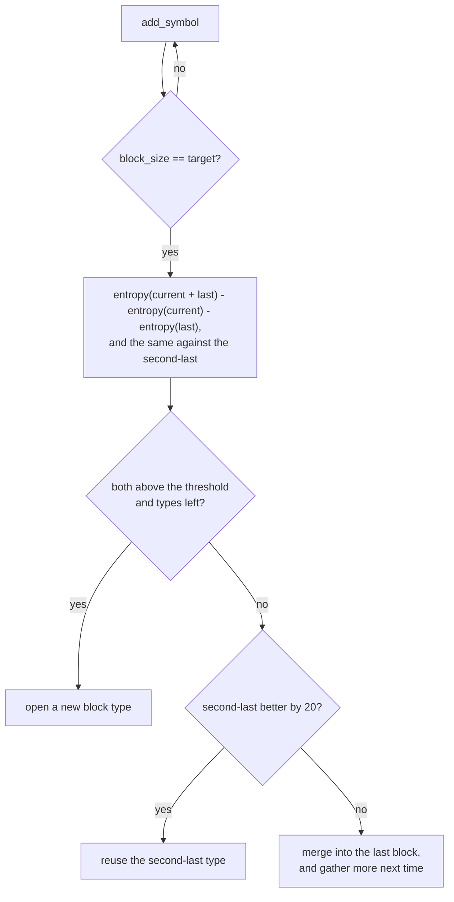
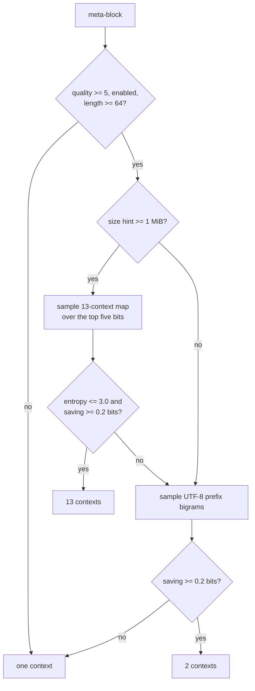
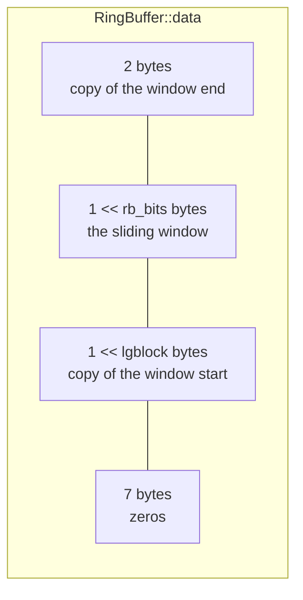
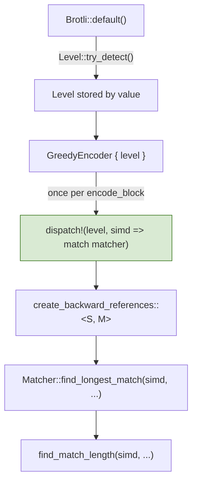

# Greedy Encoder Core (qualities 3 to 9)

Scope: `src/compressor/core/greedy/`. This document describes the code as it
stands; the [Known gaps](#known-gaps) section lists what is not implemented.

The reference this port follows is `google/brotli` v1.2.0, commit `028fb5a`.
On the platforms this crate targets that build defines `BROTLI_MAX_SIMD_QUALITY`
and therefore selects the *tagged* `H58` and `H68` match finders at qualities
five and six. This port builds only the untagged `H5` and `H6`, because the two
pairs are byte-for-byte equivalent — see [§2.2](#22-the-tagged-matchers) — and
the differential tests check that equivalence against the real library.

## 1. Core mechanics

Where the fast encoder compresses one independent fragment at a time, the
greedy encoder is a proper streaming state machine:

1. Input is copied into a **ring buffer** that keeps the whole sliding window,
   so a match may reach back past the current block.
2. A **match finder**, chosen once from the caller's parameters, turns the new
   bytes into **commands**: an insert length, a copy length and a distance.
3. Commands accumulate until a **meta-block** is worth emitting.
4. The meta-block is **split into blocks**, each block type gets its own prefix
   codes, and the whole thing is written to the bit stream — or stored
   uncompressed when that turns out smaller.


The shaded modules on the right are shared with the high-quality encoder; see
[hq-encoder.md](hq-encoder.md).

### 1.1. What each quality adds

| Feature | q3 | q4 | q5 | q6 | q7 | q8 | q9 |
| --- | :-: | :-: | :-: | :-: | :-: | :-: | :-: |
| Default `lgblock` | 14 | 16 | 16 | 16 | 16 | 16 | `min(18, lgwin)` |
| Block splitting | no | yes | yes | yes | yes | yes | yes |
| Non-zero distance parameters | no | yes | yes | yes | yes | yes | yes |
| Histogram optimisation | no | yes | yes | yes | yes | yes | yes |
| Extensive delayed search | no | no | yes | yes | yes | yes | yes |
| Literal context modelling | no | no | yes | yes | yes | yes | yes |
| Three-context model eligible | no | no | no | no | yes | yes | yes |
| Sparse-search threshold | 64 | 64 | 64 | 64 | 64 | 64 | 512 |
| Bucket candidates | — | — | 16 | 32 | 64 | 128 | 256 |
| Cached distances probed | 4 | 4 | 4 | 4 | 10 | 10 | 16 |
| Small-window matcher | — | — | `H40` | `H40` | `H41` | `H41` | `H42` |
| Chain hops | — | — | 16 | 32 | 56 | 112 | 224 |
| Meta-block storage | trivial | greedy split | greedy split | greedy split | greedy split | greedy split | greedy split |

Quality three is not "quality four with fewer candidates": it stores a
meta-block through a different, simpler path, and it flushes on a symbol count
rather than on a block-splitting decision. From quality five upwards the shape
of the search is fixed and only its depth changes — which is why one code path
serves all five.

## 2. Parameter resolution and the hasher plan

Everything that decides *what* the encoder does is resolved once, before any
loop runs, by `params::GreedyParams::new`. Nothing about the running machine
takes part, which is what makes the output identical across SIMD backends.



The depth of whichever matcher is chosen then follows the quality: the bucket
matchers take `block_bits = quality - 1`, and the chain matchers take
`max_hops = (quality > 6 ? 7 : 8) << (quality - 4)`.

| Plan | Hash bytes | Bucket bits | Slots per bucket | Static dictionary |
| --- | --: | --: | --- | --- |
| `H3` | 5 | 16 | 1 sweep slot | no |
| `H4` | 5 | 17 | 4 sweep slots | yes, shallow |
| `H54` | 7 | 20 | 4 sweep slots | no |
| `H40` / `H41` | 4 | 15 | forgetful chain, one 65,536-slot bank | yes |
| `H42` | 4 | 15 | forgetful chain, 512 banks of 512 | yes |
| `H5` | 4 | 14 (q5, q6) or 15 | `1 << (quality - 1)` | yes |
| `H6` | 8 | 15 | `1 << (quality - 1)` | yes |

Each plan is a distinct Rust type — `QuickMatcher<BUCKET_BITS, SWEEP_BITS,
HASH_LEN, USE_DICTIONARY>`, `BucketMatcher<HASH64, BUCKET_BITS>` or
`ChainMatcher<NUM_BANKS, BANK_BITS>` — so the hash width and the table size are
compile-time constants inside the probe loop. The `MatchFinder` enum that
selects between them is matched once per input block, never per candidate.

The candidate depth, the chain depth and the number of cached distances are
ordinary fields rather than const generics. They only bound loops, and turning
five bucket depths into five monomorphisations would cost far more instruction
cache than the bound is worth.

### 2.2. The tagged matchers

The reference builds `H58` and `H68` in place of `H5` and `H6` whenever
`BROTLI_MAX_SIMD_QUALITY` is defined, which on GCC and Clang covers quality six.
Those variants store a one-byte tag beside every position and iterate only the
slots whose tag matches. This port does not build them, because they cannot
produce a different stream:

- They select the same bucket. The tagged `HashBytes` keeps eight more low bits,
  which the key shifts straight back off.
- They walk the bucket newest to oldest, as the untagged loop does.
- A tag is a function of the hashed bytes, so two positions whose first four
  bytes agree always share a tag. A slot the tag mask drops therefore differs in
  those four bytes — and a candidate that differs there can never reach the
  reference's `len >= 4` acceptance test.
- Both stop at the first candidate beyond `max_backward`, and positions grow
  monotonically along the ring, so both stop having seen the same prefix.

The accepted-match sets coincide. `tests/differential_c.rs` checks the
consequence directly: qualities six and seven are compared against a C library
that really is using the tagged matchers.

### 2.3. The distance cache

Qualities seven and above probe more than the four remembered distances. The
extra entries are near misses derived from the two freshest ones — one, two and
three either side — which `prepare_distance_cache` fills whenever the remembered
four change. Only those four survive a meta-block; the rest are rebuilt before
any search reads them, which is why `saved_dist_cache` is four wide.

The distance alphabet is resolved in the same pass: font mode asks for one
postfix bit and twelve direct codes, every other mode uses what the caller
configured, and qualities below four always use neither.

## 3. Streaming lifecycle

```mermaid
stateDiagram-v2
    [*] --> Empty: GreedyEncoder::new
    Empty --> Buffering: encode_block(input, false)
    Buffering --> Buffering: meta-block not due yet
    Buffering --> Emitting: is_last, or a flush condition fires
    Emitting --> Buffering: meta-block written, is_last = false
    Emitting --> Finished: meta-block written, is_last = true
    Empty --> Finished: encode_block(&[], true)
    Finished --> [*]

    note right of Buffering
        commands accumulate,
        encode_block returns no bytes
    end note
    note right of Emitting
        one meta-block, then
        num_literals and commands reset
    end note
```

A meta-block is emitted when any of these holds, mirroring `EncodeData`:

- this is the last block;
- quality three has buffered `0x2FFF` literals and commands together;
- another whole input block would not fit inside the largest meta-block;
- buffered literals or commands reached an eighth of the largest meta-block.

Because `encode_block` may return nothing, the driver and both streaming
adapters treat an empty result as normal rather than as end of stream.

## 4. Command generation

`backward_references::create_backward_references` is the port of
`CreateBackwardReferences`, and its decision order *is* the compression format's
semantics: which candidate wins, when a match is delayed by a byte, which
positions are stored and which are skipped are all visible in the output.



Two details separate the qualities:

- **Delayed search.** Below quality five the delayed candidate starts from the
  length already found, which lets the finder reject most candidates without
  measuring them. Quality five gives that shortcut up and searches everything
  again — this is a compression-semantics difference, not a tuning flag.
- **Sparse search.** After sixty-four literals without a match the scan strides
  forward two bytes at a time and stores every second position; after four
  times that, four bytes at a time. The exact thresholds and stores come from
  the reference, because they change which positions are findable later.

`extend_last_command` runs before the search when the previous block ended
exactly on a command boundary: bytes that continue that command's copy are
absorbed into it instead of starting a new one.

## 5. Meta-block construction



`ShouldCompress` refuses blocks of at most two bytes outright, and samples
every thirteenth literal of a block that is almost all literals: if the sample's
entropy exceeds 7.92 bits per byte the block is stored verbatim, which is both
smaller and much faster than coding noise.

### 5.1. Block splitting

The greedy splitters consume symbols in order. Every time one has collected its
target number of symbols it compares the entropy of the block it just gathered
against the entropy of merging it into the last, or the second-last, block:



| Stream | Minimum block | Split threshold | Alphabet measured |
| --- | --: | --: | --: |
| literals | 512 | 400 | 256 |
| commands | 1024 | 500 | 704 |
| distances | 512 | 100 | 64 |

Quality five may run the literal splitter per context instead, keeping one
histogram per context of every block type and deciding on the total entropy
change across all of them.

### 5.2. Literal context modelling

Only quality five and above reach this, and only when the meta-block is at least
sixty-four bytes long. The decision samples sixty-four byte strides every four
kibibytes:



The reference's three-context map is deliberately priced out of reach below
quality seven, and `ChooseContextMode` only returns `CONTEXT_SIGNED` at quality
ten, so `CONTEXT_UTF8` is the only literal context mode these qualities can
emit. Only that one lookup table is carried.

## 6. The ring buffer

The layout matters for the emitted bytes, not just for correctness: match
finding reads whole words past the current position, and the reference defines
exactly what those bytes are.



- A short first write allocates only the bytes it holds, because neither the
  tail nor the rest of the window can be read yet.
- The first full allocation zeroes the last two window bytes and leaves the
  sentinel `241` at the first tail byte, until a lap writes over it.
- After every write the seven bytes past the data are cleared, so hashing never
  depends on memory the encoder did not write.

Absolute positions are wrapped into 32 bits by `wrap_position`, which keeps the
first three gibibytes contiguous and then alternates between two gibibyte-wide
halves so the "already lapped" property survives the truncation.

## 7. SIMD dispatch



There is exactly one `dispatch!` per public call. Inside it the `MatchFinder`
enum is matched once, which monomorphises the whole search on the concrete
matcher, and the SIMD token is passed by value down to the only kernel that
uses it: the exact match-length scan in `core::shared::match_len`.

Everything else — bucket stores, distance-cache transitions, the greedy and
lazy decisions, Huffman construction, bit writing — is scalar, because the
reference's decision order is not reorderable and a vector unit cannot help
without changing it.

## 8. The static dictionary

Brotli's built-in dictionary is 122,784 bytes of words plus a 32,768-bucket
hash over their four-byte prefixes, carried as binary blobs beside the module
and embedded with `include_bytes!`.

Only the encoder side is needed. A dictionary match is emitted as an ordinary
distance beyond the end of the window:

```text
distance = max_backward + 1 + word_index + (transform_id << size_bits[len])
```

and the decoder is the side that applies the transform, so the transform table
itself never has to be carried — the encoder only computes which transform id a
given prefix cut corresponds to.

Probing is self-limiting: once a stream has gone a hundred and twenty-eight
lookups per match, the encoder stops paying for it.

## 9. Error propagation

The greedy tree defines no error type of its own. `GreedyParams::new` reports
an unimplemented quality as `BrotliCompressError::UnsupportedQuality`, and the
only other failure is `BufferOverflow`, raised when the bit writer runs past
the scratch buffer — which no correct input can reach, because the buffer is
sized by the same `2 * bytes + 503` reservation the reference uses.

## 10. Verification

| Test target | What it pins |
| --- | --- |
| Module tests in `core::greedy::*` | Each ported function against the behaviour its reference documents. |
| `tests/greedy_qualities.rs` | Byte identity with the C encoder across window size, mode, size hint, block size, distance layout, context modelling, block and delayed-symbol boundaries, dictionary matches, ring-buffer wrapping and every short length. |
| `tests/differential_c.rs`, `tests/vendor_corpus.rs`, `tests/randomized.rs` | Byte identity over the shared corpora, including Google's own multi-megabyte test data. |
| `tests/simd_backends.rs` | Byte identity between the scalar fallback and every SIMD backend the host supports. |
| `tests/streaming.rs` | Chunk-size independence and one-shot equivalence. |
| `fuzz/afl/` | `q3_roundtrip`, `q4_roundtrip`, `q5_roundtrip` and the shared parameter-driven targets; see [fuzzing.md](fuzzing.md). |

## Known gaps

- **Large-window brotli is unreachable.** `WindowBits` stops at 24, so the
  reference's `H35`, `H55` and `H65` composite match finders are never built.
- **The tagged `H58` and `H68` match finders are not built.** They are
  byte-for-byte equivalent to `H5` and `H6` — see
  [§2.2](#22-the-tagged-matchers) — so building them would add a second code
  path that cannot produce a different stream. The one thing this gives up is
  the tag mask itself, which is the reference's main SIMD opportunity on this
  path and would be worth revisiting if profiling shows the candidate loop
  dominating.
- **No compound or custom dictionary.** Only the built-in static dictionary is
  used, matching the reference's non-experimental build.
- **No stream offset.** The reference parameter that starts a stream at a
  non-zero position is not exposed, so its poisoned distance cache is
  unreachable.
- **The distance cache is four entries, not sixteen.** Every match finder these
  qualities can select checks exactly four cached distances, so
  `PrepareDistanceCache` has nothing to do; qualities seven and above would
  need the extended cache.
- **No SIMD beyond the match-length scan.** Tag masks, histogram accumulation
  and context sampling are still scalar.
- **The throughput gate is not met.** These qualities run at roughly 0.77× to
  0.80× of the reference on an Apple M5 Pro, and short inputs at about 0.5×,
  while emitting identical bytes. The largest known cause is initialisation the
  reference skips: the block splitters allocate and clear one histogram per
  possible block type per meta-block, where the reference clears only the one it
  is about to use, and the Huffman node pool is initialised on first use.
  Measurements, profiles and the changes already tried are in
  [`docs/q3_q5_benchmarks.md`](../docs/q3_q5_benchmarks.md).
