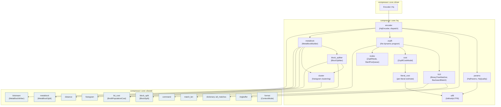
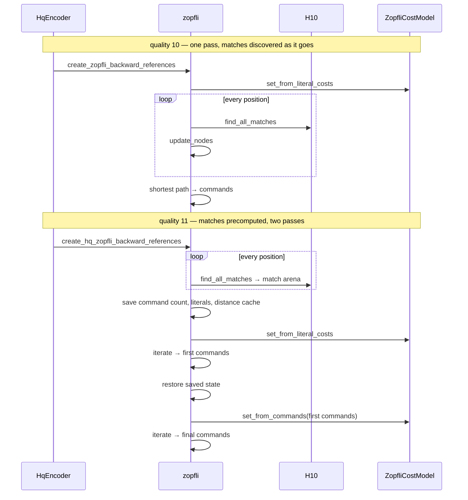
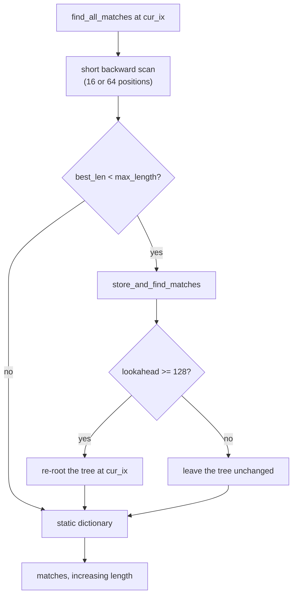
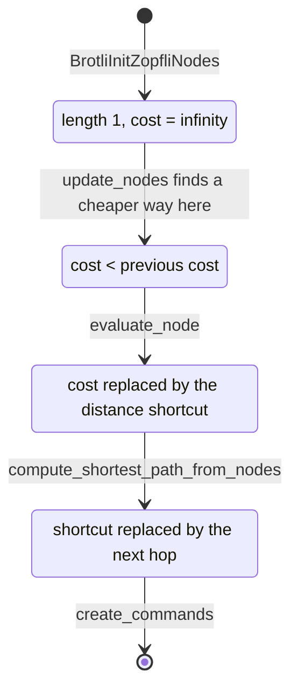
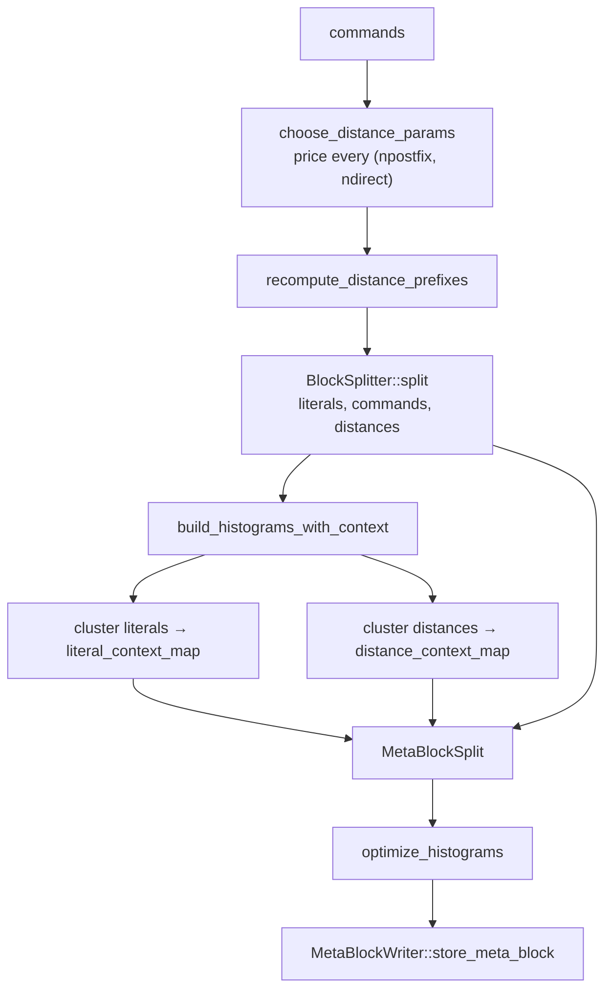
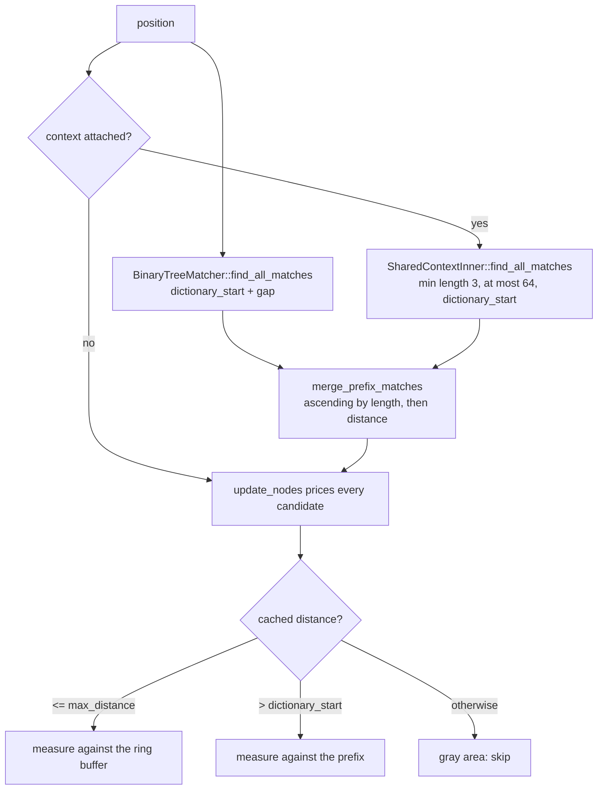

# High-Quality Encoder Core (qualities 10 and 11)

Scope: `src/compressor/core/hq/`. This document describes the code as it
stands; the [Known gaps](#known-gaps) section lists what is not implemented.

The reference this port follows is `google/brotli` v1.2.0, commit `028fb5a`.
`BROTLI_MAX_SIMD_QUALITY` does not reach these qualities — both use the
binary-tree matcher `H10` unconditionally — so there is only one semantic
profile to match, and the differential tests compare against it byte for byte.

## 1. Core mechanics

The greedy encoder decides one command at a time and never reconsiders. This
one prices every command that could start at every position and then solves for
the cheapest path through the whole block:

1. Input is copied into the same **ring buffer** the greedy path uses.
2. A **binary-tree matcher** reports *every* match at a position, ordered by
   increasing length, rather than a single best one.
3. A **cost model** puts an `f32` price on every literal, command symbol and
   distance symbol.
4. A **dynamic program** walks the block, recording at each byte the cheapest
   way of arriving there, and finally traces the shortest path back into
   commands.
5. The **high-quality meta-block builder** re-tunes the distance alphabet,
   splits all three symbol streams, gathers per-context histograms and clusters
   them into the context maps the decoder reads.
6. The result is written through the same bit-stream layer every other quality
   above one uses.

## 2. What separates the two qualities

Both qualities run the same code; every difference is a number resolved once in
`params.rs`, from the caller's parameters alone.

| Decision | q10 | q11 | Reference |
| --- | ---: | ---: | --- |
| Matcher | `H10` | `H10` | `ChooseHasher` |
| Matches held | one position at a time | every position, up front | `BrotliCreate*ZopfliBackwardReferences` |
| Cost-model passes | 1 | 2 | same |
| Start positions expanded | 1 | 5 | `MaxZopfliCandidates` |
| Distinct copy-length cap | 150 | 325 | `MaxZopfliLen` |
| Short backward scan | 16 positions | 64 positions | `FindAllMatches` |
| Splitter refinement passes | 3 | 10 | `SplitByteVector` |
| Default `lgblock` | `min(18, lgwin)` above 16 | same | `ComputeLgBlock` |

Quality eleven's second pass is what earns most of its ratio: the first pass
prices commands from a literal-cost estimate, and the second re-prices them from
the histograms the first pass actually produced.

## 3. The binary-tree matcher

`h10.rs` keeps one binary tree per hash bucket, over `1 << 17` buckets. Each
tree is ordered lexicographically by the bytes at each position and is a
max-heap by position, so one traversal both collects every match worth
considering — in strictly increasing length order — and re-roots the tree at the
current position.

Three bounds shape what it finds, all from the reference:

- **Search depth 64.** A degenerate bucket cannot cost more than that.
- **Comparison length 128.** Two sequences that agree over 128 bytes are
  indistinguishable to the tree, so the older node's children become the new
  root's.
- **Re-rooting needs 128 bytes of lookahead.** Near the tail the traversal still
  reports matches but leaves the tree alone, because the final sort order of a
  shorter sequence is not yet known.

The short backward scan exists because the tree indexes four-byte prefixes and
therefore cannot see a two- or three-byte repeat at all. It stops *above* its
lower bound, so the oldest position in range is never examined — a reference
quirk the port reproduces.

`store_range` sparsifies: positions older than the last sixty-three are stored
every eighth position, and only once the range spans more than 512. A range
between 63 and 575 long has its middle skipped entirely.

## 4. The dynamic program

`nodes.rs` holds one `ZopfliNode` per input byte. The reference packs a union
into it — cost during the forward pass, a distance shortcut once the node has
been evaluated, the next hop while the path is traced back. Rust models that as
a plain `u32` read and written through `f32::to_bits`, which keeps the exact
aliasing without any `unsafe`.

At each position `update_nodes` does two things, in this order:

1. **Cached distances.** For each of the sixteen short distance codes — the four
   remembered distances and the twelve near misses derived from the two
   freshest — it measures the match and prices every copy length it allows.
2. **Tree matches.** From the two cheapest start positions only, because a
   further start with the same distances rarely pays.

Two shortcuts keep it tractable. `compute_minimum_copy_length` refuses to price
a copy shorter than one already known to reach its destination more cheaply.
And a copy longer than `BROTLI_LONG_COPY_QUICK_STEP` lets the search stride past
the positions it covers, evaluating them but not searching them.

`StartPosQueue` keeps the eight cheapest command starts, sorted. It is a ring
whose insertion restores order with adjacent swaps; which candidate is evicted
when it is full depends on where those swaps have moved things, and the
reference makes no promise about it. What it does maintain — the size bound and
the ordering — is what the search reads.

## 5. Numerical determinism

Every comparison in the dynamic program is a strict `<` on an `f32`, so the
arithmetic is part of the output, not an implementation detail:

- `FastLog2` returns a `double` in the reference and is narrowed to `f32` at
  each use, so the intermediate is computed at full width and rounded once.
- The cumulative literal costs are built with an explicit carry that recovers
  the precision a running `f32` sum would throw away. Over a long block a naive
  sum drifts low by orders of magnitude more than the carried one, and the
  search starts preferring literals it should not.
- The literal-cost estimator's constants — window widths 495 and 2000, the
  additive nudges, the halving below one bit, the prologue surcharge — were
  tuned by the reference against its corpora and are reproduced exactly.

## 6. The high-quality meta-block

Three things happen here that the greedy builder does not do.

**The distance alphabet is re-chosen per block.** Every legal combination of
postfix bits and direct codes is priced by building the distance histogram it
would produce; the search walks postfix bits outward and direct-code counts
upward, carrying an awkward index between rows exactly as the reference does.
The commands' distance prefixes are then rewritten in place.

**Literal histograms are gathered per block type *and* per context** — sixty-four
of them per type — rather than through a fixed static map.

**Everything is clustered.** `cluster.rs` repeatedly merges the histogram pair
whose combination saves the most bits, until no merge pays or the format's limit
of 256 is reached. The candidate pairs live in a bounded array with the best one
first, which the reference calls a heap and treats as one only at that first
position; reproducing that — including which pair is displaced when the array is
full — is what keeps the merge order, and therefore the context map, identical.

## 7. The block splitter

`block_splitter.rs` sees a whole symbol stream at once. It seeds a handful of
entropy codes from pseudo-random samples, refines them with more samples, then
solves for the cheapest assignment of codes to symbols by dynamic programming,
repeats that a few times, and finally clusters the resulting blocks down to at
most 256 types.

The sampling generator is seeded at seven and multiplied by 16807. The sequence
decides which stretches of the stream seed the entropy codes, so it is part of
the output: change it and a different partition falls out.

Switching block type is discounted over the first 2000 symbols, which lets the
partition adapt quickly before the statistics settle.

## 8. Context mode

Quality ten is the first quality that considers anything but the UTF-8 literal
context model. `ChooseContextMode` runs `BrotliIsMostlyUTF8` over the whole
pending meta-block; data that does not look like text is modelled as signed
integers instead. The chosen mode reaches both the histogram builder and the bit
writer, which stores its two-bit code once per literal block type.

## 9. SIMD dispatch

There is exactly one `dispatch!` per public call, in `HqEncoder`. The token is
resolved there and passed by value into the match search, which is monomorphised
on it. Nothing below that point branches on the instruction set.

The only SIMD-accelerated primitive on this path is `find_match_length`, shared
with every other quality. Everything that makes a decision — the tree traversal,
the cost comparisons, the clustering — is scalar, because the reference's tie
behaviour depends on evaluation order that a vector reduction would not preserve.
`every_backend_produces_the_same_stream` checks the consequence directly.

## 10. Verification

| Layer | How it is checked |
| --- | --- |
| Static dictionary all-match search | Every word × every transform × every prefix, plus 3000 random inputs and a sliding window over `alice29.txt`, compared against `BrotliFindAllStaticDictionaryMatches` through the workspace shim |
| `H10` | Brute-force oracle over 4000 positions: every reported match is real, lengths strictly increase, and the longest is at least what a full scan finds |
| Zopfli search | Command stream, distance cache, literal count and trailing literals compared against `BrotliCreate{,Hq}ZopfliBackwardReferences` through the shim, over nine fixtures and 343 prefixes |
| Block splitter | All three partitions compared against `BrotliSplitBlock`, six fixtures × both qualities |
| Meta-block builder | Distance alphabet, three splits, histogram counts and both context maps compared against `BrotliBuildMetaBlock`, five fixtures × two qualities × two context modes × modelling on and off |
| Whole encoder | Byte-for-byte against `BrotliEncoderCompress` over the structural, boundary and vendor corpora at every window size |

The shims live in `brotli-ffi/shim/`, outside `vendor/`, and expose four
encoder-internal functions that have no public header. They exist only so the
port can be compared against the reference it was translated from.

### 10.1. Input sizes in the integration sweeps

These qualities are expensive: in the debug build the tests run in, quality
eleven costs about a second per hundred and fifty kilobytes, against a hundredth
of that at quality nine. Left unbounded, the sweeps that run every quality over
every corpus at every window size take tens of minutes.

`support::prefix_for` therefore caps qualities ten and eleven at 64 KiB in the
sweeps that exist to cover *shapes* — `differential_c`, `randomized`,
`roundtrip`, `simd_backends` and the per-corpus vendor tests. The cap is under
their 256 KiB default block, so those runs exercise a single block only.

Large-input coverage moves to the tests built for it, which run these qualities
unbounded:

- `vendor_corpus::multi_fragment_input_matches_the_c_encoder` — a 2 MiB prefix
  of `bb.binast`, eight blocks at their default, at three window sizes.
- `streaming.rs` — chunk-boundary independence and one-shot equivalence.

The tradeoff is deliberate and worth naming: a regression that needs *both* a
large input and one of the capped sweeps' shapes would be missed.

## 11. The attached prefix

An attached RFC 9841 prefix reaches these qualities in three places, all of
them the reference's:

1. **Collection.** After the binary tree has produced a position's matches,
   `SharedContextInner::find_all_matches` collects up to sixty-four more from
   the attachments, from a minimum length of three, and `merge_prefix_matches`
   merges the two ascending-by-length sequences into one — `MergeMatches`. The
   dynamic program then prices them together, indistinguishably.
2. **Cached distances.** `update_nodes` gains the branch that the reference's
   comment calls the way out of the "gray area": a cached distance past
   `max_distance` but at most `dictionary_start` is unusable, while one past
   `dictionary_start` addresses the prefix and is measured against it. Without
   an attachment `gap` is zero, the second branch is unreachable, and the loop
   is exactly what it was.
3. **Coding.** `gap` shifts `dictionary_start` everywhere a distance is
   classified, so `create_commands` marks a prefix reference as a dictionary
   reference and leaves the distance cache alone, and `evaluate_node`'s
   shortcut chain skips it for the same reason.

The match itself stops at the end of the attachment it was found in, which is
the reference's `limit`; only `extend_last_command` runs on across seams.

## Known gaps

- **Large-window history stops at 30 bits.** `Window::large` reaches these
  qualities and `DistanceParams::for_window` computes the widened RFC 9841
  alphabet and its `alphabet_size_limit`, but retained history is capped at 30
  bits by `ResolvedWindow::encoder_bits`, so the binary tree never indexes a
  window wider than that. See [shared-brotli.md](shared-brotli.md) decision D2.
- **Custom static dictionaries and offsets are experimental.** The immutable
  flat index merges per-length transformed candidates into Zopfli matches using
  the current meta-block literal context. Extended packed length modifiers keep
  long transforms' base lengths intact. Headerless continuations shift logical
  dictionary placement but not history availability. See
  [rfc9841-encoding.md](rfc9841-encoding.md) for both flows and their limits.
- **`hotpath` instrumentation.** Only `encode_block`, `encode_block_with` and
  `flush_block` are annotated on this path; the inner stages are not yet
  measured.
- **Throughput is behind the reference, but least of any slow quality.**
  0.863x at quality ten and 0.901x at quality eleven, geometric mean over eleven
  corpora on an Apple M5 Pro, while emitting identical bytes. That is closer
  than qualities two to nine manage; the dynamic program dominates enough that
  the per-call setup these qualities also pay is a smaller share of the whole.
  See [`docs/all_qualities_benchmarks.md`](../docs/all_qualities_benchmarks.md).
