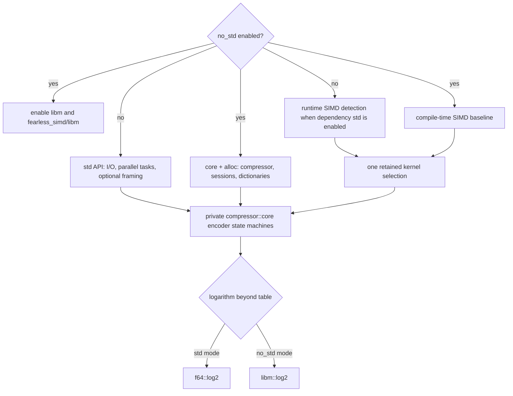

# `no_std` feature boundary

`no_std` is opt-in and disabled by default. The default `std` feature enables
standard-library support in `fearless_simd` and `thiserror`. To build for a target
without `std`, depend on `mbrotli` with `default-features = false` and
`features = ["no_std", "compression", "decompression"]` (or select just one codec). The library uses `#![no_std]` and `extern crate alloc`;
applications supply a global allocator. This is not allocation-free compression.

The `no_std` feature enables the optional `libm` dependency and
`fearless_simd/libm`; ordinary std builds enable neither. Select `std` or
`no_std` when disabling default features so `fearless_simd` has a math provider.

Cargo features are additive. `no_std` overrides the library's std-only API and
instrumentation gates even if `std` or profiling features are also enabled, but
cannot remove dependencies enabled by those features. Bare-metal applications
must omit `std`, `hotpath`, `hotpath-cpu`, and `hotpath-alloc` throughout their
resolved dependency graph. Disabling defaults alone does not select `no_std`.

## API and ownership

When `compression` is enabled, the compressor, configuration, high-level errors, retained workspace, slice and
vector output, incremental sessions, and prepared dictionaries remain available.
Experimental serialized dictionaries and stream offsets also remain available
with `experimental`. Their ownership, state transitions, progress accounting,
reset behavior, and error propagation are unchanged. Owned buffers use `alloc`;
formatting, range operations, and error traits use `core`.

The `io` module, its compressor reader/writer constructors, the conversion from
`EncodeError` to `std::io::Error`, and the private I/O error variant are omitted.
The entire `parallel` module and its private independent-fragment adapter are
omitted because they depend on I/O, files, synchronization, clocks, and unwinding.
Experimental `framing` is omitted because its writer API depends on `std::io`.
Hotpath measurement attributes are inactive under `no_std`.

No new public type or state machine is introduced. Low-level implementation
errors remain private; public errors implement `core::error::Error` through
`thiserror` without requiring std.

## SIMD and numeric invariants

`Backend::default` uses `Level::baseline` in `no_std` mode even when feature
unification enables std in `fearless_simd`. `Backend::available` lists backends
supported by that baseline. Compiler target features select the strongest usable
level; unsupported targets retain the scalar fallback. Kernel selection remains
outside inner loops. Unit tests retain their explicit scalar oracle.

`CompressorBuilder::build` obtains its default token through `Backend::default`,
so direct construction and explicit backend selection share this policy.

The existing logarithm table is unchanged. Beyond the table, `libm::log2` replaces
the unavailable standard-library method. The portable result is tested against
the host logarithm within floating-point rounding tolerance. Differential tests
exercise all qualities against C, including the alloc-only slice/session API.
Different math implementations can round differently; exact byte identity across
all platforms and math libraries is not guaranteed by the logarithm tolerance.

## Verification and known gaps

CI checks the library and experimental dictionaries for `thumbv7em-none-eabi`,
a target with no standard library, and runs host tests with defaults disabled.
Default and explicit std-feature tests continue to cover the omitted APIs;
`--all-features` exercises the `no_std` API because that feature takes
precedence. `benches/alloc.rs` validates and times the alloc-backed one-shot API against C
in either feature mode, recording throughput and output size for text, binary,
repeated, noisy, small, and large inputs.

`tests/no_std.rs` covers empty and non-empty output, all qualities,
small input/output chunks, flush/finish equivalence with C, dictionary
compatibility, errors, and recovery.

Coverage accumulates the full std workspace suite and no_std unit/API tests
before enforcing the repository function-coverage threshold.

No allocator-free mode, embedded I/O adapter, or no-std parallel scheduler is
implemented. Bare-metal builds are compile-checked; execution tests use a host
allocator and the independent C decoder.

## Native decoding

With `decompression`, the alloc-only surface also includes `Decompressor`, `DecoderSession`,
`DecodeDictionary` and RAW dictionary views. Serialized/custom mappings follow
the same experimental gate in std and alloc profiles. See [decoder mechanics](decompressor.md)
and the four-profile [compatibility report](decompressor-compatibility.md).

Codec selection is independent of `no_std`; see [codec features](codec-features.md).
