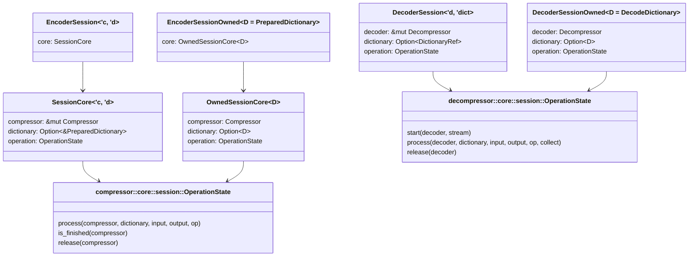
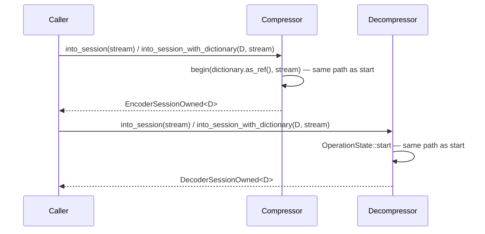
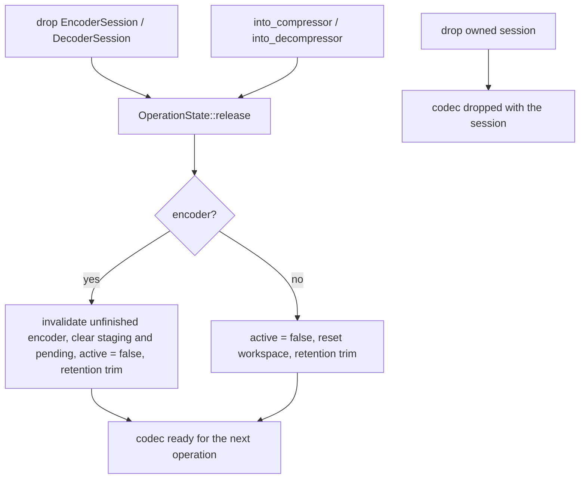
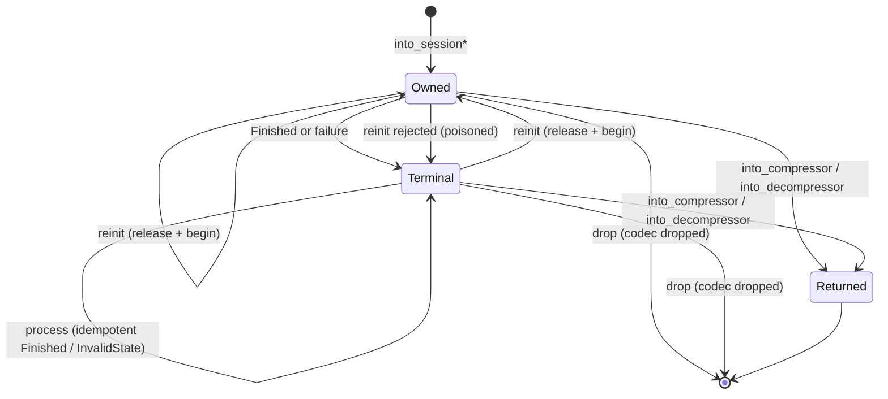
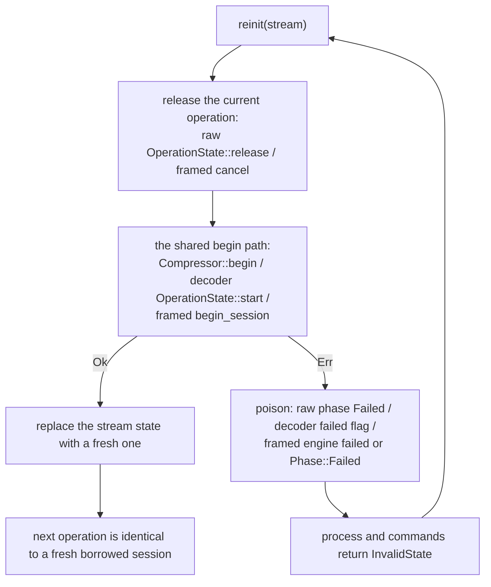
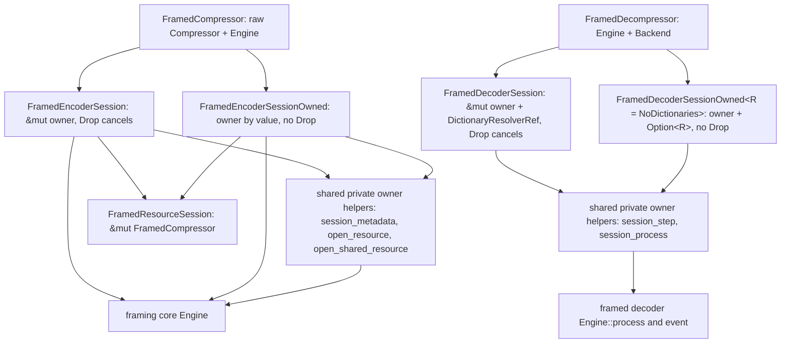
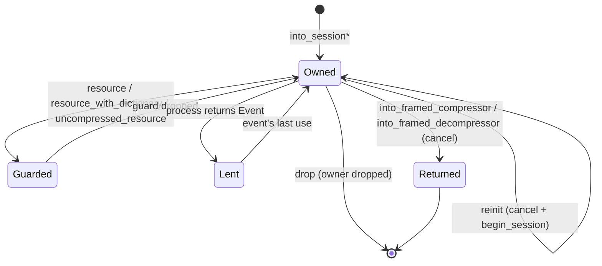

# Owned sessions

`EncoderSessionOwned` and `DecoderSessionOwned` are the owning counterparts of
`EncoderSession` and `DecoderSession`. `FramedEncoderSessionOwned` and
`FramedDecoderSessionOwned` (behind `experimental`) do the same for the framed
sessions; see [Framed sessions](#framed-sessions). A borrowed session holds `&mut` to its
codec and borrows its dictionary; an owned session takes the `Compressor` or
`Decompressor` by value and, when attached, the dictionary too, so it has no
lifetime parameter. Both shapes run one shared state machine per codec. Only
ownership differs: the bytes, progress counts, statuses, errors and cleanup are
the same. Owned sessions are synchronous and available wherever the codec is,
including `no_std` with `alloc`. They let wrappers such as async adapters store
codec state as a plain value. No async API or dependency is involved.

## Types and ownership

- **Neither `OperationState` holds its codec or dictionary.** Every call
  receives both. That is what lets a borrowed wrapper and an owned wrapper
  share one implementation.
- **The decoder refactor.** The decoder's per-operation fields used to sit
  directly in `DecoderSession`: counters, window, final-input latch, boundary,
  finished and failed flags. They moved into
  `decompressor::core::session::OperationState`, and `DecoderSession` became a
  thin wrapper over it. The encoder already had this split.
- **Owned dictionaries.** The encoder takes any
  `D: AsRef<PreparedDictionary> + 'static` and the decoder any
  `D: AsRef<DecodeDictionary> + 'static`. Both dictionary types implement
  `AsRef<Self>`, so a dictionary can be passed by value, as an `Arc`, or as a
  `&'static` reference. The decoder bound names `DecodeDictionary` because
  `PreparedDictionary` does not exist in decode-only builds.
- **The default type parameter.** `D` defaults to the dictionary type itself.
  `into_session` stores `None`, so the default is never constructed.
- **No `Drop` impl on owned sessions.** Dropping one drops its codec with it.
  Without `Drop`, `into_compressor` and `into_decompressor` can destructure
  the session in safe Rust.
- **Auto traits.** Owned sessions are `Send` exactly when `D` is. They add no
  `Sync` bound of their own.

## Construction

Owned constructors run the same validation as the borrowed ones:

- **Encoder.** `Compressor::begin` checks for an abandoned session, the stream
  offset, dictionary support at the configured quality, the stream position,
  and workspace acquisition.
- **Decoder.** `OperationState::start` checks for an abandoned session and an
  exact output size over the output budget. It also releases a workspace that
  is over the workspace budget, then resets it.

On error, the consumed codec is dropped together with the error. Callers that
need to keep the codec after a rejected start should use the borrowed `start`.

## Release

Each codec has exactly one release path. Borrowed sessions run it from `Drop`,
and owned sessions run it when they hand the codec back. It applies to every
exit state: finished, unfinished, flushed, or failed.

## Lifecycle

Inside `process`, the transitions are the ones specified for the borrowed
sessions in [compressor](compressor.md) and
[native decompressor](decompressor.md).

## Invariants

- **One state machine per codec.** Owned `process` is a one-line delegation to
  the same `OperationState::process` the borrowed session calls.
- **Same dictionary on every call.** The decoder state passes the dictionary to
  `Stream::run` per call. Each wrapper always passes the dictionary it started
  with.
- **Safe Rust throughout.** No `unsafe`, raw pointers, `Pin` or
  self-references. The only extra storage is the owned `D` itself.
- **No hot-path changes.** Encoder and decoder algorithms, SIMD dispatch and
  output bytes are unchanged.

## Input-free `flush` and `finish`

Every session, borrowed or owned, plus `FramedResourceSession`, has
`flush(output)` and `finish(output)`. Each is a one-line call to that type's own
`process`, so it inherits every contract of `process` unchanged.

| Session | `flush(output)` | `finish(output)` |
| --- | --- | --- |
| `EncoderSession`, `EncoderSessionOwned` | `process(&[], output, Operation::Flush)` | `process(&[], output, Operation::Finish)` |
| `FramedResourceSession` | `process(&[], output, Operation::Flush)` | `process(&[], output, Operation::Finish)` |
| `FramedEncoderSession`, `FramedEncoderSessionOwned` | `process(output, FramedEncodeOperation::Process)`: drain queued wire bytes | `process(output, FramedEncodeOperation::Finish)` |
| `DecoderSession`, `DecoderSessionOwned` | `process(&[], output, DecodeOperation::Process)`: deliver output for accepted input, no EOF | `process(&[], output, DecodeOperation::Finish)`: EOF with an empty suffix |
| `FramedDecoderSession`, `FramedDecoderSessionOwned` | as the raw decoder; events are still lent | as the raw decoder |

- **Decoders have no `Flush` operation.** Their `flush` only drains output for
  input that has already been accepted. A stored payload is accepted only
  when there is room to deliver it, so after a `NeedsOutput` it may have
  nothing to drain.
- **The final-suffix contract still applies after `Finish`.** Once a decoder
  has seen `Finish`, `flush` reports `InvalidState`, because it would change
  the operation. `finish` is correct only once every input byte has been
  accepted: stopping mid-member reports truncation, and leaving a suffix
  offered to an earlier `Finish` unconsumed reports `InvalidState`.
- **Tests.** Each test file drives the same schedule twice, once through
  `process` with empty input and once through the shorthands, on both the
  borrowed and the owned session, and requires identical traces. It also
  checks the idempotent `Finished` state and the `Finish` contract errors
  above.

## Reinitialization

All four owned sessions have a `reinit(&mut self, stream)` method. It ends the
current operation and starts an independent one in place, keeping the owner,
its backend, its retained storage (subject to retention policy), and the owned
dictionary or resolver.

- **The same paths as drop-then-start.** Release is the path a borrowed
  session's `Drop` runs, and the begin step is the one `start` and
  `into_session` use. So `reinit` behaves exactly like dropping a borrowed
  session and starting a new one, whether the previous operation finished,
  was waiting for input or output, was just past an event, or failed.
- **A rejected start leaves the session failed.** The previous operation has
  already been released, so the only state left to mark is the failure.
  Nothing else runs until a later `reinit` succeeds. The owner can still be
  handed back, since release is idempotent.
- **The dictionary is kept.** `reinit` restarts with the session's own
  dictionary or resolver. Changing it goes through the consuming `into_*`
  methods: hand the owner back, then start a new owned session.

## Framed sessions

Framed sessions keep all operation state in the owner, in its private `Engine`.
So the owned framed sessions hold the owner itself and add no operation state.

- **Start.** `FramedCompressor::start` and `into_session` both go through the
  private `begin_session`: abandoned-session check, buffer-budget recovery,
  `Engine::start`, and `active = true`. `FramedDecompressor::start`,
  `start_with_dictionaries`, `into_session` and
  `into_session_with_dictionaries` all go through the decoder's
  `begin_session`: abandoned-session check, exact output size against the
  budget, `fits_policy` recovery, stream installation, and `active = true`.
- **Commands and processing.** Encoder methods call the same `Engine` methods,
  or the private owner helpers for metadata and resource guards. Decoder
  `process` calls `session_process`, which runs `session_step` (that is,
  `Engine::process`) and then maps the `Tag` to a status and lends the event.
  The borrowed session's `step`, used by the one-shot APIs and the reader, is
  the same `session_step`.
- **Resources.** The owned encoder session opens resources through the
  existing `FramedResourceSession` guard, which borrows the owner inside the
  session. While a guard is live, the borrow checker rejects both container
  commands and `into_framed_compressor`. A rustdoc `compile_fail` example
  covers this.
- **Lending.** Owned `process<'a>(&'a mut self, …, output: &'a mut [u8])`
  returns `FramedDecodeProgress<'a>`, exactly like the borrowed session, so a
  live event blocks the next call. A rustdoc `compile_fail` example covers
  this too.
- **Owned resolvers.** The decoder resolver is owned as
  `R: DictionaryResolver + 'static`. Each call borrows it as a
  `DictionaryResolverRef`, which the engine uses only for that call.
  - `DictionaryResolver` is implemented for `&T`, `Box<T>` and `Arc<T>`. The
    `Arc` impl needs `target_has_atomic = "ptr"`.
  - `into_session` stores `None`, which is exactly what borrowed `start` does,
    so `NoDictionaries` is only a default type and is never asked to resolve
    anything. Used explicitly as a resolver, it resolves nothing. That
    produces a different error than having no resolver at all.
- **Release.** `into_framed_compressor` and `into_framed_decompressor` call
  the owner's existing `cancel`, the same path the borrowed `Drop` runs.
- **Auto traits.** `FramedEncoderSessionOwned` is `Send`.
  `FramedDecoderSessionOwned<R>` is `Send` exactly when `R` is. The borrowed
  framed decoder session is never `Send`, because its resolver reference has
  no `Sync` bound.

## Verification

Each test file drives one set of schedules through both the borrowed and the
owned session and requires identical traces: output bytes, per-call progress,
failures, and totals.

- **`tests/encoder_owned_session.rs`**
  - Inputs: empty, tiny, several KiB and 1 MiB payloads.
  - Qualities 0, 5 and 11. Quality 11 is capped at 64 KiB.
  - Chunked schedules, with and without flushes, with exact and unknown sizes.
  - `Finish` through 0–3 byte buffers.
  - Decoding of flushed prefixes.
  - Reuse after finished, unfinished, flushed and failed sessions
    (`experimental`).
  - Retention, start errors, and dictionaries by value, `Arc` and `&'static`.
  - `Send`.
- **`tests/decoder_owned_session.rs`** — the same parity across:
  - chunk and output sizes, including 0–2 byte buffers;
  - truncated and empty input with exact failure progress, and a changed final
    suffix;
  - reuse after finished, unfinished and failed sessions, and retention;
  - `OutputSize`, input, output and workspace limits, window limits, and both
    member modes;
  - dictionaries by value, `Arc` and `&'static`;
  - `Send`.

- **`tests/framed_encoder_owned_session.rs`** — borrowed and owned facades
  run through the same driver across output widths (including 0–2 bytes),
  payload chunks and flushes. Traces must match byte for byte, including each
  call's result and counters, and must equal `compress` when there are no
  flushes.
  - Containers: empty; one resource; Brotli, uncompressed, Brotli; global,
    resource and footer metadata with padding and repeats; and a dictionary
    resource.
  - A direct resource guard.
  - Reuse after finished, header-pending, unfinished and failed containers.
  - A start after a leaked session.
  - `Send`.
- **`tests/framed_decoder_owned_session.rs`** — per-call results and events
  are recorded as debug text while each borrow is alive, and must be
  identical.
  - Inputs: hand-built containers and the checked-in writer fixtures, across
    input splits (including one-byte splits) and output widths (including 0–2
    bytes).
  - Every truncated prefix, the final suffix contract, and Auto raw input.
  - External dictionaries resolved through `Arc`, by value, `&'static` and
    `Box<dyn>`.
  - Numeric limits and exact output size.
  - Reuse after finished, needs-input, needs-output, post-event and failed
    operations, and a start after a leaked session.
  - `Send`.

- **`reinit` tests** in all four files end a first operation in each
  supported way: finished, needs input, needs output, flushed, after an
  event, failed, or truncated. They then reinitialize and require the next
  operation's trace to equal a fresh borrowed session's, across several
  schedules and stream configurations. They also check that a rejected
  `reinit` leaves `InvalidState` until a later `reinit` succeeds, and that
  the dictionary or resolver is kept.
  - A framed encoder start can only fail on allocation. Its poisoned state is
    therefore covered by a unit test in `compressor::framing::session` that
    poisons the engine directly.

## Known gaps

- **The consumed codec is lost on a rejected start.** A failed
  `into_session*` drops the codec. No variant returns it with the error.
- **No `PreparedDictionary` for owned decoders.** An owned decoder session
  cannot decode with a `PreparedDictionary`. The borrowed session still can,
  through `DictionaryRef::Prepared`.
- **The framed seek reader and the std readers and writers still borrow their
  owners.** No owned variants were added.
- **The fuzz targets don't exercise owned sessions yet.** Parity with the
  borrowed sessions is established by the integration tests.
