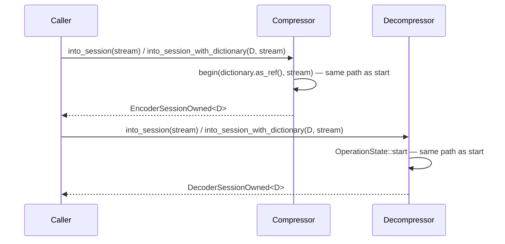
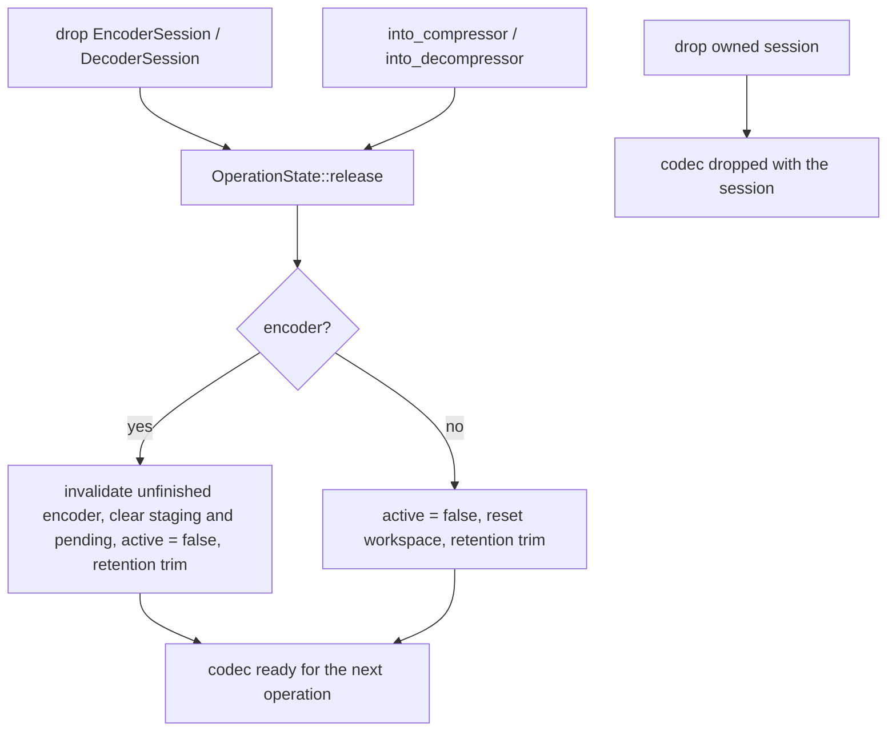
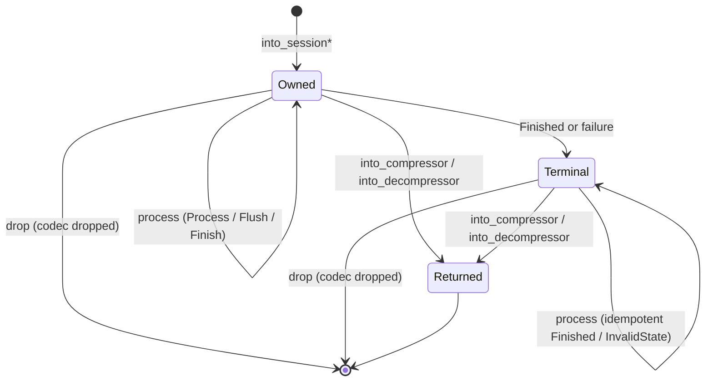

# Owned sessions

`EncoderSessionOwned` and `DecoderSessionOwned` are the owning counterparts of
`EncoderSession` and `DecoderSession`. A borrowed session holds `&mut` to its
codec and borrows its dictionary; an owned session takes the `Compressor` or
`Decompressor` by value and, when attached, the dictionary too, so it has no
lifetime parameter. Both shapes run one shared state machine per codec. Only
ownership differs: the bytes, progress counts, statuses, errors and cleanup are
the same. Owned sessions are synchronous and available wherever the codec is,
including `no_std` with `alloc`. They let wrappers such as async adapters store
codec state as a plain value. No async API or dependency is involved.

## Types and ownership

- **Neither `OperationState` holds its codec or dictionary.** Every call
  receives both. That is what lets a borrowed wrapper and an owned wrapper
  share one implementation.
- **The decoder refactor.** The decoder's per-operation fields used to sit
  directly in `DecoderSession`: counters, window, final-input latch, boundary,
  finished and failed flags. They moved into
  `decompressor::core::session::OperationState`, and `DecoderSession` became a
  thin wrapper over it. The encoder already had this split.
- **Owned dictionaries.** The encoder takes any
  `D: AsRef<PreparedDictionary> + 'static` and the decoder any
  `D: AsRef<DecodeDictionary> + 'static`. Both dictionary types implement
  `AsRef<Self>`, so a dictionary can be passed by value, as an `Arc`, or as a
  `&'static` reference. The decoder bound names `DecodeDictionary` because
  `PreparedDictionary` does not exist in decode-only builds.
- **The default type parameter.** `D` defaults to the dictionary type itself.
  `into_session` stores `None`, so the default is never constructed.
- **No `Drop` impl on owned sessions.** Dropping one drops its codec with it.
  Without `Drop`, `into_compressor` and `into_decompressor` can destructure
  the session in safe Rust.
- **Auto traits.** Owned sessions are `Send` exactly when `D` is. They add no
  `Sync` bound of their own.

## Construction

Owned constructors run the same validation as the borrowed ones:

- **Encoder.** `Compressor::begin` checks for an abandoned session, the stream
  offset, dictionary support at the configured quality, the stream position,
  and workspace acquisition.
- **Decoder.** `OperationState::start` checks for an abandoned session and an
  exact output size over the output budget. It also releases a workspace that
  is over the workspace budget, then resets it.

On error, the consumed codec is dropped together with the error. Callers that
need to keep the codec after a rejected start should use the borrowed `start`.

## Release

Each codec has exactly one release path. Borrowed sessions run it from `Drop`,
and owned sessions run it when they hand the codec back. It applies to every
exit state: finished, unfinished, flushed, or failed.

## Lifecycle

Inside `process`, the transitions are the ones specified for the borrowed
sessions in [compressor](compressor.md) and
[native decompressor](decompressor.md).

## Invariants

- **One state machine per codec.** Owned `process` is a one-line delegation to
  the same `OperationState::process` the borrowed session calls.
- **Same dictionary on every call.** The decoder state passes the dictionary to
  `Stream::run` per call. Each wrapper always passes the dictionary it started
  with.
- **Safe Rust throughout.** No `unsafe`, raw pointers, `Pin` or
  self-references. The only extra storage is the owned `D` itself.
- **No hot-path changes.** Encoder and decoder algorithms, SIMD dispatch and
  output bytes are unchanged.

## Verification

Each test file drives one set of schedules through both the borrowed and the
owned session and requires identical traces: output bytes, per-call progress,
failures, and totals.

- **`tests/encoder_owned_session.rs`**
  - Inputs: empty, tiny, several KiB and 1 MiB payloads.
  - Qualities 0, 5 and 11. Quality 11 is capped at 64 KiB.
  - Chunked schedules, with and without flushes, with exact and unknown sizes.
  - `Finish` through 0–3 byte buffers.
  - Decoding of flushed prefixes.
  - Reuse after finished, unfinished, flushed and failed sessions
    (`experimental`).
  - Retention, start errors, and dictionaries by value, `Arc` and `&'static`.
  - `Send`.
- **`tests/decoder_owned_session.rs`** — the same parity across:
  - chunk and output sizes, including 0–2 byte buffers;
  - truncated and empty input with exact failure progress, and a changed final
    suffix;
  - reuse after finished, unfinished and failed sessions, and retention;
  - `OutputSize`, input, output and workspace limits, window limits, and both
    member modes;
  - dictionaries by value, `Arc` and `&'static`;
  - `Send`.

## Known gaps

- **The consumed codec is lost on a rejected start.** A failed
  `into_session*` drops the codec. No variant returns it with the error.
- **No `PreparedDictionary` for owned decoders.** An owned decoder session
  cannot decode with a `PreparedDictionary`. The borrowed session still can,
  through `DictionaryRef::Prepared`.
- **The fuzz targets don't exercise owned sessions yet.** Parity with the
  borrowed sessions is established by the integration tests.
