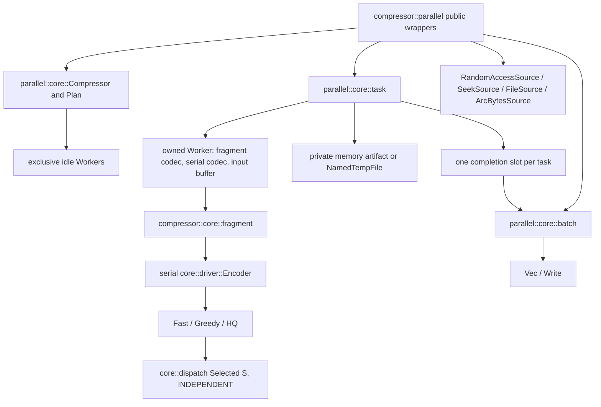
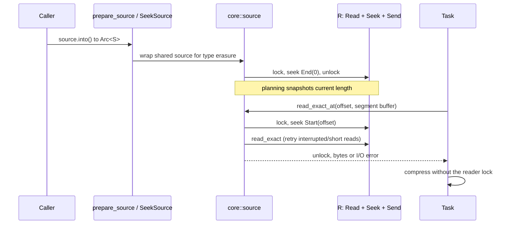
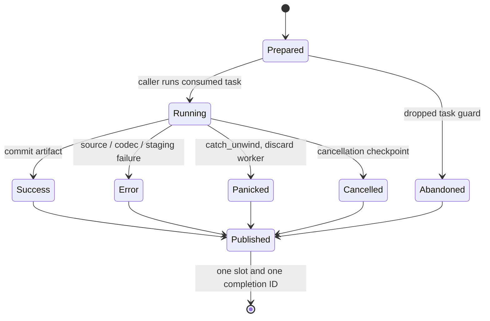
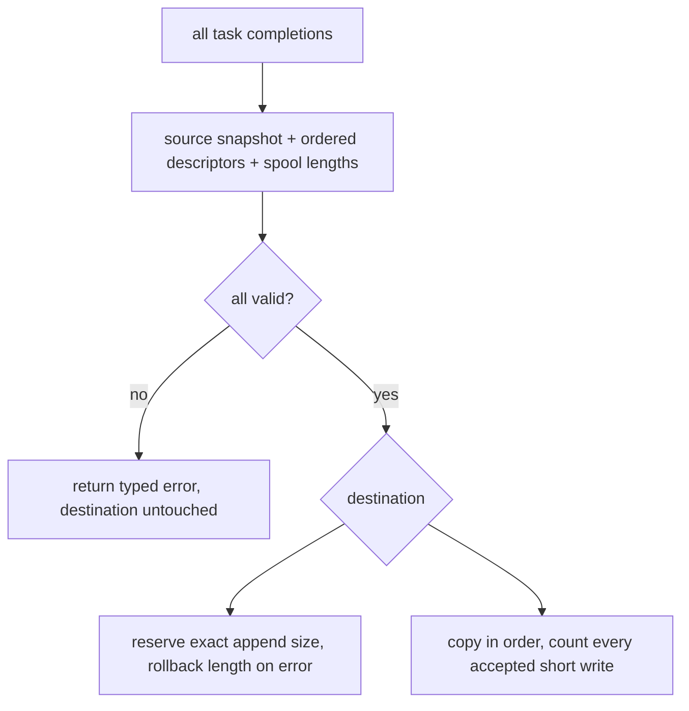

# Parallel compression

This describes the implementation added for source specifications 02 and 03.
Where those drafts conflict, the later extension (03) governs: caller-run task
values, fixed independent segments, aligned non-final fragments, and staged
assembly. The older mandatory spawner trait, overlap scheduler, relocatable
bit tape, and unknown-length reader pipeline are superseded. The optional
RFC 9841 framing/dictionary and global-context extensions are not implemented.

## Public and ownership boundaries

`compressor::parallel` exposes `ParallelCompressor`, `ParallelConfig`,
`BatchConfig`, validated `SegmentSize` and `TaskCount`, memory/directory staging,
source wrappers (including `SeekSource<R>`), task/batch types, polling, statistics,
retention, and errors.
The previously private `compressor` module is now public; its `core` remains
private. Existing crate-root serial exports remain available.

Validated integers use `TryFrom<usize>` and `get()`; standard values use
`SegmentSize::DEFAULT`, `TaskCount::ONE`, and `Default`. Configuration/staging
conversions use `From`. Source wrappers use `From<Arc<[u8]>>` and
`TryFrom<File>`. These trait-based spellings follow repository API conventions.
There is no mandatory executor trait, runtime dependency, or hidden thread pool.
Rayon is a development dependency for examples of scheduling in tests/benchmarks.
`tempfile` supplies exclusive spool creation.



Each `ScopedParallelTask<'input>` owns its worker, artifact, immutable input
handle, cancellation observer and completion capability. It never borrows the
batch or parent compressor. `OwnedParallelTask` is the `'static` specialization;
`OwnedParallelBatch` similarly specializes the shared batch implementation. This
supports both scoped borrowing and detached execution without duplicated engines.
`ParallelCompressor` is `Send`, non-Clone, and owns no global state.

## Planning, source reads, and memory

Fixed segment sizes range from 64 KiB to 16 MiB, with a 4 MiB default. Boundaries
are `i * segment_size .. min((i + 1) * segment_size, source_len)` using `u64` file
coordinates. Effective task count is `min(requested, segments)`. Contiguous
balanced grouping gives the first remainder tasks one additional segment.
Neither grouping nor completion order changes bytes.

Empty input creates no tasks and uses canonical serial encoding. A nonempty input
below `minimum_parallel_size` (default 8 MiB) uses serial encoding only if it also
fits one segment. That fallback still creates one caller-run task. Restricting
fallback to one segment prevents user-selected thresholds from causing a
whole-file allocation. Setting the threshold to zero forces independent parts.

Borrowed slices go directly into codec calls. Detached sources fill one retained
segment buffer per task. `FileSource` retains an open regular file and uses Unix
`read_at` or Windows `seek_read`, retrying interruptions and short reads. Other
platforms return `Unsupported` for positional reads. File handles are never used
with a shared seek cursor. Metadata snapshots include length and modification
time, plus device, inode and change time on Unix. Metadata checks cannot prove
immutability against every in-place write; callers can provide stronger immutable
snapshot sources. Arbitrary blocking source calls cannot be forcibly interrupted.

Planning checks staged-byte bounds, descriptor sizes, active-worker estimates,
completion metadata, assembly scratch and currently retained workspaces before
returning tasks. Staged payload allowance is `2 * input + 1024 * max(segments,1)`.
Memory staging also charges descriptor storage to its explicit limit. Workspace
estimates are deliberately conservative: per task, 4 MiB + 16 times segment size
for q0/q1, 64 MiB + 128 times segment size for q2–q4, and 256 MiB + 256 times
segment size above q4. These ceilings are not measured RSS. File staging keeps
payload RAM proportional to active workers and segment size; descriptor memory
is proportional to segment count and included in the aggregate ceiling.

## Generic source entry point and seekable readers

`prepare_source<S, T>` accepts `S: RandomAccessSource + ?Sized` and
`T: Into<Arc<S>>`. Owned sources, shared concrete sources, custom conversions, and
`Arc<dyn RandomAccessSource>` use this single entry point. `prepare_file` has
been removed; `FileSource` is an ordinary source adapter. `Arc` and custom
conversion arguments may need explicit source types due to `Into` ambiguity:
`prepare_source::<FileSource, _>(shared_file, config)` or
`prepare_source::<dyn RandomAccessSource, _>(erased_source, config)`.

The conversion occurs once before planning. A private sized `SharedSource<S>`
bridge lets both sized and unsized sources enter the existing erased core path.
It forwards length, identity and reads. Tasks clone the outer shared handle;
source bytes are never copied by this bridge. The bridge adds one small shared
allocation per prepared batch, not per task or segment.

`SeekSource<R>` takes ownership through `From<R>`. For `R: Read + Seek + Send +
'static`, it implements `RandomAccessSource` without requiring `R: Sync`.
The public wrapper delegates all locking and I/O to `parallel::core::source`.
Each length query holds the mutex while seeking to the end. Each range read
holds that same mutex for its absolute seek and the entire `read_exact` call.
The reader's original cursor is ignored; all future reads seek explicitly.
A short read or interruption is handled by `Read::read_exact`; seek/read errors
propagate as I/O errors into existing batch metadata/read errors. A reader panic
poisons the mutex and subsequent access returns an I/O error. Worker panic
handling continues to discard the affected codec workspace.



Seekable input reads are serialized; task compression still overlaps. No
metadata identity can be inferred from the generic traits, so this adapter
provides live length checks only and callers must keep bytes immutable.
`FileSource` retains positional reads and file identity verification; it remains
the preferred file adapter when concurrent input reads are desired.

## Fragment format and encoder-state audit

Format plan version 1 uses uniform two-byte raw prefixes and explicit distances
throughout every segment. It follows RFC 7932 sections 11.2 and 11.3. Every part
starts at a byte boundary (except the first part also owns the window header),
contains only non-final data blocks, and ends aligned. Alignment metadata uses
the existing flush writer's when-needed empty metadata blocks. The assembler
only copies validated bytes and appends the final-empty byte `0x03` at the proven
byte boundary. It never parses or edits complete streams.

```mermaid
sequenceDiagram
    participant Task
    participant Fragment as FragmentEncoder
    participant Codec as retained Encoder
    participant Artifact
    Task->>Fragment: encode(segment bytes, first role)
    Fragment->>Codec: reset semantic state, preserve allocations
    Fragment->>Codec: begin_fragment(prefix)
    Note over Codec: greedy/HQ seed local ring and prior bytes via two-byte flush
    Fragment->>Fragment: optional header + raw min(length,2) prefix
    loop complete body input blocks
        Fragment->>Codec: non-final encode; flush final body block
        Codec-->>Fragment: completed bytes
    end
    Fragment->>Codec: verify no pending partial bits
    Fragment-->>Task: sealed AlignedFragment
    Task->>Artifact: append bytes + source/segment descriptor
```

| State | Reset/ownership rule |
| --- | --- |
| Header and pending bits | Common prefix writer owns the sole window header; body codecs start headerless. Every successful fragment proves zero pending bits. |
| Ring and input coordinates | `reset_for` resets local positions and history; no prior segment is present. Greedy/HQ seed only the two current prefix bytes. |
| Greedy matcher | Existing dirty/partial-prepare protocol clears logical candidates while retaining allocations. Dictionary statistics use the permanently disabled sentinel. |
| HQ matcher/DP | Existing tree preparation resets roots; all-match and Zopfli arenas are rebuilt from this segment. Static-dictionary match distance is outside the representable range. |
| Recent distances | All wire distances are explicit. HQ excludes cached-distance DP edges. Greedy still uses local cache values as search candidates but writes full distances. Inherited decoder cache values are never consulted. |
| q0/q1 commands | Insert commands copy two bytes; the remaining copy and its distance are explicit. q0's independent starter/adaptive histograms include symbols 17/18 for three/four-byte copy remainders. q1 preserves compact symbol 40 at wire symbol 128 instead of overwriting it with the unused insert-zero alias, preserving the canonical Huffman order. |
| Literal contexts | Greedy/HQ prefix seeding advances prior-byte state exactly once. Fast codecs use no literal contexts. Prefix data is emitted exactly once by the common writer. |
| Entropy and splits | Rebuilt locally; q0 adaptive trees never cross a segment reset. |
| SIMD | Backend detected by the planner once; `Selected<S, true>` installed when a fragment encoder is allocated, retained across reset. Serial `Selected<S, false>` remains separately monomorphized. |

Encoding every distance explicitly is the correctness baseline allowed by the
extension. It intentionally does not yet resume cache-relative coding after four
pushes; compression ratio and worker performance need further measurement before
that optimization. Dictionary overloads and optional boundary/dictionary enums
are absent, so unsupported inputs cannot be silently ignored. Parallel Large
Window configuration is rejected with a typed configuration error.

## Completion, cancellation, and reuse



A bounded channel holds exactly one small ID per task. Payloads and workers move
through single-assignment slots, protected only during ownership transfer. Codec
execution holds no mutex. Channel capacity equals task count, so tasks do not
need a coordinator to drain their payload or another task to progress.

Each task catches unwinding panics and discards the affected worker. Ordinary
errors return resettable workers. The drop guard reports abandonment once.
`panic=abort` remains unrecoverable. Cancellation uses a batch-local relaxed
atomic flag, carrying no other published state; checks run around reads and
segment encoding and before artifact commit. Successful bytes do not depend on
cancellation timing.

The coordinator collects by task ID and chooses the lowest failing ID after all
completions, preferring originating errors over cancellation fallout. Repeated
poll/wait errors use `BatchFailed(Arc<ParallelEncodeError>)` to preserve the typed
cause and its source chain. Blocking wait requires the caller's executor to remain
runnable. A timeout does not cancel. Dropping a batch cancels, drops untaken tasks,
collects only already-published results, and never waits for detached work. Late
tasks release their own resources. The default retention count is zero; callers
can retain compatible workspaces and trim them by aggregate size.

## Assembly and output failure



Before the first destination write, assembly validates segment order and exact
source ranges, artifact offsets/nonzero lengths, total segment count, and actual
spool length. Directory artifacts use sequential reads and a 128 KiB copy buffer.
`Interrupted`, short reads/writes and `WriteZero` are handled. A generic writer
failure returns its ownership and exact accepted byte count. It does not flush
or sync implicitly and is not retryable through the consumed batch.

Files are ordinary `Write` destinations. Callers own file creation, buffering,
flushing, durability, and any temporary-file publication policy. No path-specific
finish API or file commit policy is exposed.

## Verification and known gaps

`tests/parallel.rs` covers all qualities, standard windows, host backends, modes,
segment edges, fallback, source/staging identity, std/Rayon scoped and detached
execution, reverse task order, worker reuse, source panics/errors/mutation,
abandonment, timeout, cancellation, file output, and every output failure byte
for a representative fast stream. Private fragment tests independently decode
joined parts, and regressions cover q0 short explicit copies omitted by the serial starter
tree and q1 copy-two depth/ordering aliases found by AFL. The full existing serial differential/streaming suite is
also required. `fuzz/afl` adds the `parallel` target and committed seeds.
`benches/parallel.rs` validates before timing and prints sizes alongside scaling
and serial C/Rust measurements; those policies are labeled separately.

### Local verification, 2026-09-05

Host: Apple M5 Pro, aarch64 macOS; Rust 1.98.1. The workspace test profile used
`CARGO_PROFILE_TEST_OPT_LEVEL=1` with assertions and overflow checks enabled.

- `cargo fmt --all -- --check` and workspace all-target/all-feature Clippy with
  `--locked -- -D warnings` pass; rustdoc also passes with warnings denied.
- `cargo test --workspace --all-features --locked`: 981 passing tests, including
  163 doctests and 15 parallel integration tests.
- The initial threaded implementation's clean full-workspace coverage reported
  2,070/2,070 functions (100%): `target/parallel-coverage-clean.json`.
  After the generic-source extension, a clean `--lib --test parallel` coverage
  run reaches every changed function, including 13/13 in `core/source.rs`, 19/19
  in public source adapters, and 34/34 in the public parallel module. Report:
  `target/seek-source-coverage.json`. This is not a claim of 100% branch coverage.
- The separate AFL package passes formatting, Clippy, and `cargo afl test`.
  All 49 saved q1 crash inputs replay successfully after the two minimized
  regressions. A fresh 60-second parallel campaign completed 45,486 executions,
  with zero saved crashes or hangs. Log: `target/parallel-afl-campaign-final.log`.
- `cargo bench --bench parallel --locked -- --test` passes all 120 validation
  cases over tiny/text/binary/random/zero inputs and q0/q1/q5/q9/q11.

The short isolated Criterion run below uses vendored `alice29.txt`, repeated and
truncated to 16 MiB, 4 MiB segments, a precreated four-thread Rayon pool, retained
workers, and an end-to-end memory-staged operation. Both task counts produce
exactly the same compressed bytes. Setup and validation occur before timing.
Serial references use the same input, quality and window, but retain stream-wide
history and dictionary coding, so they are distinct output policies.

```sh
cargo bench --bench parallel --locked -- 'parallel/q(1|5|9)/text-16MiB' --sample-size 10 --warm-up-time 0.2 --measurement-time 0.5
```

| Quality | One task | Four tasks | Scaling | Parallel bytes | Serial bytes | C serial cold | Rust serial cold |
| --- | --- | --- | --- | --- | --- | --- | --- |
| 1 | 12.539 ms | 3.511 ms | 3.57x | 1,667,534 | 1,388,169 | 12.190 ms | 10.843 ms |
| 5 | 18.354 ms | 4.881 ms | 3.76x | 207,239 | 51,286 | 11.630 ms | 12.517 ms |
| 9 | 24.524 ms | 6.670 ms | 3.68x | 204,806 | 50,666 | 12.685 ms | 16.603 ms |

These are Criterion point estimates, not comprehensive release gates. q1's
one-task interval was 11.782–13.567 ms. The repeated corpus particularly rewards
cross-segment serial history: q5/q9 parallel output is about four times larger.
Log: `target/parallel-bench-timings-final.log`. No pre-change serial timing was
collected, so this does not establish absence of a serial performance regression.

The release `parallel` file example was also exercised on that 16 MiB corpus with
`hotpath-cpu`, directory staging and a file writer. Its four q5 fragment calls
account for most instrumented time, with match finding the largest named inner
operation. Sampling was unavailable because `samply` was not installed; the
profile provides instrumented function timings only. Log:
`target/parallel-hotpath-cpu-verified.log`.

### Generic-source verification

The source extension adds concurrent range tests using a `Send` but non-`Sync`
reader, short reads, interruptions, EOF, seek/read errors, panic poisoning, owned
sources, shared handles, custom `Into<Arc<S>>` conversions, and erased sources.
File consistency and greater-than-4-GiB tests now use `prepare_source` too.
The public file example runs successfully through that entry point.

The AFL regression suite passes with a slice-versus-seek-source oracle. Its
fresh 60-second campaign completed 57,847 executions with zero saved crashes or
hangs: `target/seek-source-afl-campaign.log`.

An isolated follow-up run on the same host and 16 MiB text corpus compared source
adapters using four tasks, q5, 4 MiB segments, memory staging and retained workers:

```sh
cargo bench --bench parallel --locked -- 'parallel/q5/text-16MiB' --sample-size 10 --warm-up-time 0.2 --measurement-time 0.5
```

| Source | Time | Output bytes |
| --- | --- | --- |
| `SeekSource<Cursor<Vec<u8>>>` | 5.189 ms | 207,239 |
| `SeekSource<File>` | 5.725 ms | 207,239 |
| `FileSource` (positional) | 5.317 ms | 207,239 |

Files are precreated and cached; this measures end-to-end source/planning,
compression and assembly, not cold-disk throughput. Every source result is
validated against the slice result before timing. Source setup and corpus copies
occur outside the timed region. The benchmark also retains the serial C/Rust
comparisons above. Log: `target/seek-source-bench.log`.

Known gaps / release gates (not claimed complete):

- Cancellation is currently at segment boundaries, not inside q11 optimization
  iterations. A running codec call may therefore delay cancellation.
- Four-push cache resumption, equivalent-policy C fragment worker comparisons,
  the 0.95 worker floor, the serial <=1% regression gate, complete ratio/scaling
  matrices, and measured RSS acceptance are not yet established.
- Local host-backend coverage is not evidence of an executed AVX2 or Windows run.
  A synthetic 4 GiB + 3 byte source is compressed through directory staging
  with four tasks, at most 4 MiB per read, and checked by incremental C decoding.
- Fault tests cover common source/destination and cleanup failures; injected
  disk-full, allocator-failure, and OS I/O faults need dedicated
  infrastructure. No production decompressor was added.
